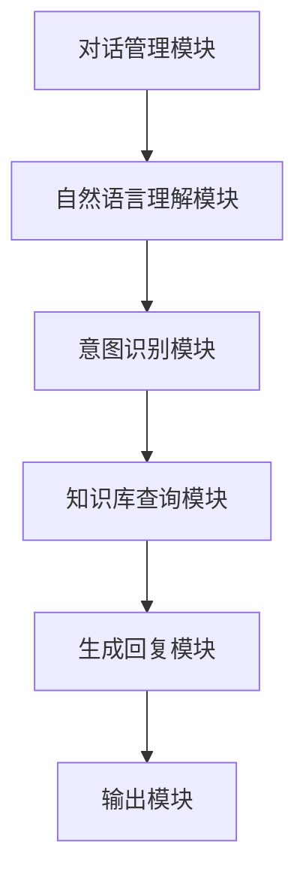
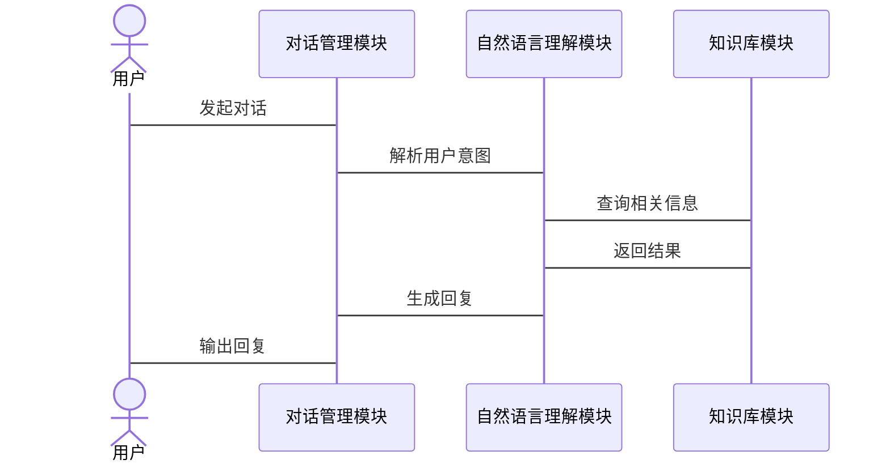

                 


# 对话管理：设计流畅的人机交互体验

## 关键词：
- 对话管理
- 流畅交互
- 人机对话
- 系统架构
- 算法原理
- 项目实战

## 摘要：
对话管理是实现流畅人机交互的核心技术，通过合理设计对话流程、状态管理和策略优化，能够显著提升用户体验。本文从背景、核心概念、算法原理、系统架构、项目实战和最佳实践等多个维度深入探讨对话管理的关键技术，结合实际案例分析，为读者提供系统化的知识和实践指导。

---

## 目录

### 第一部分：对话管理背景与核心概念

#### 第1章：对话管理的背景与问题背景

- **1.1 问题背景**
  - 1.1.1 人机交互的发展历程
  - 1.1.2 对话系统在现代技术中的重要性
  - 1.1.3 当前对话系统的主要挑战

- **1.2 问题描述**
  - 1.2.1 对话系统的核心问题
  - 1.2.2 用户需求与系统响应的矛盾
  - 1.2.3 对话流畅性与准确性的平衡

- **1.3 问题解决**
  - 1.3.1 对话管理的基本目标
  - 1.3.2 对话系统的实现路径
  - 1.3.3 流畅交互体验的衡量标准

- **1.4 边界与外延**
  - 1.4.1 对话管理的适用范围
  - 1.4.2 与其他人机交互方式的对比
  - 1.4.3 对话系统的技术边界

- **1.5 概念结构与核心要素**
  - 1.5.1 对话管理的基本概念
  - 1.5.2 核心要素的构成
  - 1.5.3 概念之间的关系

#### 第2章：对话管理的核心概念与联系

- **2.1 核心概念原理**
  - 2.1.1 对话管理的定义与作用
  - 2.1.2 对话流程的阶段划分
  - 2.1.3 对话系统的核心要素

- **2.2 核心概念属性特征对比**
  - 2.2.1 对比表格（使用Markdown表格展示）

| 对比维度 | 对话管理 | 自然语言处理 | 语音识别 |
|----------|----------|--------------|----------|
| 核心任务 | 管理对话流程 | 理解与生成文本 | 转换语音信号 |
| 关键技术 | 对话策略、状态管理 | 词嵌入、模型训练 | 音频信号处理 |
| 应用场景 | 智能客服、对话机器人 | 文本分类、问答系统 | 智能音箱、语音助手 |

- **2.3 ER实体关系图**
  - 2.3.1 使用Mermaid绘制的对话管理实体关系图

```mermaid
er
actor: 用户
action: 对话行为
message: 对话内容
state: 对话状态
role: 对话角色
```

### 第二部分：对话管理的算法原理与数学模型

#### 第3章：对话管理的算法原理与数学模型

- **3.1 算法原理**
  - 3.1.1 对话管理的算法流程
  - 3.1.2 对话状态的转移机制
  - 3.1.3 对话策略的选择算法

- **3.2 数学模型与公式**
  - 3.2.1 对话评分函数
    $$ \text{评分} = \sum_{i=1}^{n} w_i \cdot x_i $$
    其中，\( w_i \) 是权重，\( x_i \) 是特征向量。

  - 3.2.2 对话状态转移
    $$ P(s_{t+1} | s_t, a_t) = \text{转移概率} $$

- **3.3 举例说明**
  - 3.3.1 示例对话流程
  - 3.3.2 算法实现步骤
  - 3.3.3 公式在实际对话中的应用

### 第三部分：系统分析与架构设计方案

#### 第4章：系统分析与架构设计方案

- **4.1 问题场景介绍**
  - 4.1.1 对话管理的典型应用场景
  - 4.1.2 系统需求分析
  - 4.1.3 项目目标设定

- **4.2 系统功能设计**
  - 4.2.1 领域模型
  - 4.2.2 功能模块划分
  - 4.2.3 功能流程图

- **4.3 系统架构设计**
  - 4.3.1 使用Mermaid绘制的系统架构图



- **4.4 系统接口设计**
  - 4.4.1 接口定义
  - 4.4.2 接口交互流程
  - 4.4.3 接口协议与数据格式

- **4.5 系统交互设计**
  - 4.5.1 使用Mermaid绘制的系统交互序列图



### 第四部分：项目实战与案例分析

#### 第5章：项目实战

- **5.1 环境安装与配置**
  - 5.1.1 开发工具安装
  - 5.1.2 依赖库安装
  - 5.1.3 环境配置注意事项

- **5.2 系统核心实现**
  - 5.2.1 对话管理模块实现
  - 5.2.2 意图识别模块实现
  - 5.2.3 知识库查询模块实现

- **5.3 核心代码实现**
  - 5.3.1 对话管理模块代码
  ```python
  class DialogManager:
      def __init__(self):
          self.states = {}
          self.current_state = None
      def process_input(self, input_text):
          # 解析输入
          pass
      def generate_response(self):
          # 生成回复
          pass
  ```
  - 5.3.2 意图识别模块代码
  ```python
  import nltk
  def intent_classifier(text):
      # 使用nltk进行意图分类
      pass
  ```
  - 5.3.3 知识库查询模块代码
  ```python
  class KnowledgeBase:
      def __init__(self, db_path):
          self.db_path = db_path
      def query(self, intent):
          # 根据意图查询知识库
          pass
  ```

- **5.4 案例分析与详细解读**
  - 5.4.1 典型案例分析
  - 5.4.2 代码实现细节
  - 5.4.3 系统运行结果与优化建议

### 第五部分：最佳实践与小结

#### 第6章：最佳实践

- **6.1 小结**
  - 6.1.1 对话管理的核心要点
  - 6.1.2 项目实施的关键成功因素
  - 6.1.3 总结对话管理的设计原则

- **6.2 注意事项**
  - 6.2.1 开发中的常见问题
  - 6.2.2 系统维护与优化建议
  - 6.2.3 部署与上线注意事项

- **6.3 拓展阅读**
  - 6.3.1 推荐的技术资料
  - 6.3.2 相关领域的最新研究
  - 6.3.3 进一步学习的建议

---

## 作者：AI天才研究院/AI Genius Institute & 禅与计算机程序设计艺术 /Zen And The Art of Computer Programming

