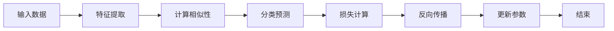
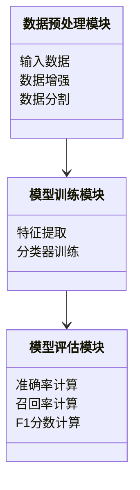
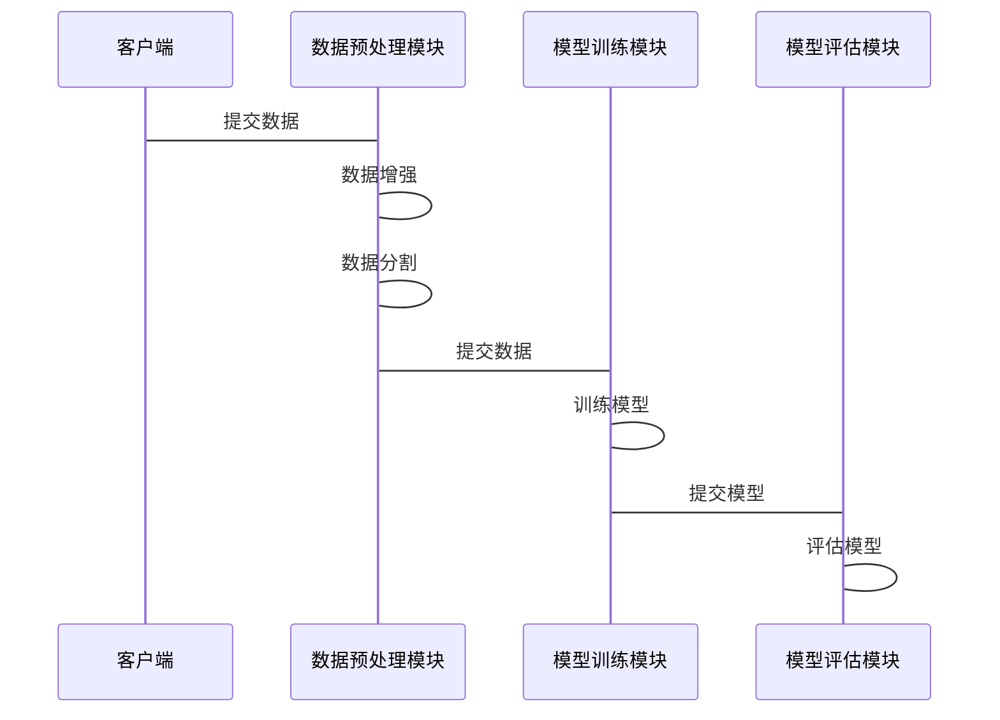
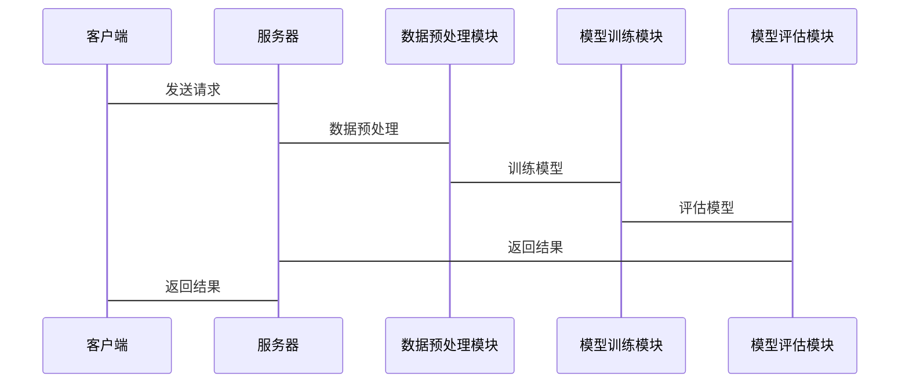

                 


# 少样本学习：在有限数据下快速适应

> 关键词：少样本学习，数据增强，迁移学习，深度学习，机器学习

> 摘要：在实际应用中，数据获取的高成本限制了传统监督学习的广泛应用。少样本学习通过优化模型的泛化能力和数据利用率，在有限数据下实现高效的模型训练。本文系统介绍了少样本学习的核心概念、算法原理、系统架构，并通过实战案例详细阐述其实现过程。文章内容从背景介绍到系统设计，再到项目实践，层层递进，帮助读者全面理解少样本学习的核心思想和应用方法。

---

# 第一部分: 少样本学习的背景与核心概念

## 第1章: 少样本学习的背景与问题定义

### 1.1 数据驱动学习的挑战

#### 1.1.1 数据驱动学习的现状

现代机器学习的发展高度依赖于数据的规模和质量。传统监督学习算法（如随机森林、支持向量机等）在处理小数据集时表现有限，而深度学习算法（如CNN、RNN等）则需要大量的标注数据来训练出高性能模型。在实际应用中，数据获取的高成本和低效率成为制约模型部署的主要瓶颈。特别是在某些领域（如医学图像分析、卫星图像识别等），标注高质量数据的时间和资源成本极高，导致许多潜在的应用场景难以落地。

#### 1.1.2 数据获取的高成本问题

数据获取的高成本主要体现在以下几个方面：

1. **标注成本**：高质量标注数据的获取需要专业人员的参与，时间成本和人力成本较高。
2. **数据采集难度**：某些场景下，数据采集设备（如传感器、摄像头等）的部署和使用受到环境或技术限制。
3. **数据隐私问题**：在医疗、金融等领域，数据隐私保护要求严格，导致数据共享和获取困难。

#### 1.1.3 少样本学习的定义与核心概念

少样本学习（Few-Shot Learning）是一种机器学习范式，旨在通过少量的训练数据实现高效的模型训练和部署。与传统监督学习相比，少样本学习更加关注模型的泛化能力，即在有限数据下，模型能够快速适应新任务和新数据。

### 1.2 少样本学习的核心问题

#### 1.2.1 数据量与模型性能的关系

数据量与模型性能之间存在显著的非线性关系。在数据量充足的情况下，深度学习模型能够通过充分的训练参数空间，从而获得强大的表达能力。然而，当数据量减少时，模型的泛化能力显著下降，容易出现过拟合问题。

#### 1.2.2 少样本学习的适用场景

少样本学习适用于以下场景：

- **数据获取困难**：如医学图像分析、卫星图像识别等领域，高质量标注数据难以获取。
- **实时性要求高**：某些实时应用场景（如实时图像分类、实时语音识别）需要快速模型适应能力。
- **资源受限**：在资源受限的环境中（如移动设备、边缘计算设备），需要高效的数据利用策略。

#### 1.2.3 少样本学习的边界与外延

少样本学习的边界主要体现在以下几个方面：

- **数据量的界定**：通常情况下，少样本学习指的是在每个类别下仅有少量样本（如1-100个样本）。
- **任务的多样性**：少样本学习可以应用于分类、回归、分割等多种任务。
- **模型的泛化能力**：少样本学习的核心目标是提升模型在有限数据下的泛化能力。

### 1.3 少样本学习的核心要素

#### 1.3.1 数据特征的重要性

数据特征是影响模型性能的关键因素。在少样本学习中，特征的提取和选择尤为重要，因为有限的数据量使得模型难以通过简单的堆叠来提升性能。

#### 1.3.2 模型的泛化能力

模型的泛化能力是少样本学习的核心目标。在数据量有限的情况下，模型需要通过优化算法、网络结构等手段，提升对未见数据的适应能力。

#### 1.3.3 学习策略的选择

选择合适的学习策略是少样本学习成功的关键。这包括：

1. **数据增强策略**：通过生成更多样化、更具代表性的训练数据，提升模型的泛化能力。
2. **迁移学习策略**：利用已有数据的知识，快速适应新任务。
3. **元学习策略**：通过元学习算法（如Meta-Learning），在少样本场景下快速调整模型参数。

## 第2章: 少样本学习的核心概念与联系

### 2.1 数据增强技术

#### 2.1.1 数据增强的定义与作用

数据增强是一种通过变换原始数据生成更多样化数据的技术。在少样本学习中，数据增强能够有效缓解数据不足的问题，提升模型的泛化能力。

#### 2.1.2 常见数据增强方法对比

以下是一些常见的数据增强方法及其特点：

| 方法 | 描述 | 优点 | 缺点 |
|------|------|------|------|
| 随机裁剪 | 随机从图像中裁剪出不同区域 | 提高模型对不同区域的关注度 | 可能导致信息丢失 |
| 水平翻转 | 水平翻转图像 | 提高模型对镜像对称的适应能力 | 可能导致视觉信息改变 |
| 调整亮度 | 调整图像亮度 | 提高模型对不同光照条件的适应能力 | 可能导致图像失真 |
| 添加噪声 | 添加随机噪声 | 提高模型的鲁棒性 | 可能降低图像可识别性 |

#### 2.1.3 数据增强与少样本学习的关系

数据增强是少样本学习的重要技术手段。通过数据增强，可以在有限的原始数据基础上，生成更多样化、更具代表性的训练数据，从而提升模型的泛化能力。

### 2.2 迁移学习

#### 2.2.1 迁移学习的基本原理

迁移学习是一种通过利用已有任务的知识，快速适应新任务的技术。其核心思想是将源任务和目标任务之间的共享知识进行迁移，从而减少新任务所需的训练数据量。

#### 2.2.2 迁移学习与少样本学习的联系

迁移学习与少样本学习的目标一致，即在有限数据下，快速实现模型的泛化能力。迁移学习通过共享知识减少了对新任务数据的依赖，从而在少样本场景下表现出色。

#### 2.2.3 迁移学习在少样本场景中的应用

迁移学习在少样本场景中的典型应用包括：

- **图像分类**：利用ImageNet等大规模数据集预训练的模型，在小数据集上进行微调。
- **自然语言处理**：利用大规模预训练语言模型（如BERT）在小数据集上进行微调。
- **医学图像分析**：利用公共医学数据集预训练的模型，在小样本的特定任务上进行微调。

### 2.3 少样本学习的算法原理

#### 2.3.1 基于距离的度量学习

基于距离的度量学习方法通过学习样本之间的相似性度量，来提升分类性能。其核心思想是通过优化距离函数，使得同类样本之间的距离尽可能小，异类样本之间的距离尽可能大。

#### 2.3.2 基于概率的贝叶斯方法

贝叶斯方法通过构建概率模型，在少样本场景下实现高效的学习和推理。其核心思想是通过先验概率和似然函数，计算后验概率，从而实现对新样本的分类。

#### 2.3.3 基于神经网络的深度学习方法

基于神经网络的深度学习方法通过构建深层网络结构，自动提取样本的特征，并通过反向传播算法优化模型参数。在少样本场景下，深度学习方法通常结合数据增强、迁移学习等技术，以提升模型的泛化能力。

---

## 第3章: 少样本学习的算法原理与数学模型

### 3.1 常见少样本学习算法

#### 3.1.1 Matching Networks

Matching Networks是一种基于度量学习的少样本学习算法，其核心思想是通过计算查询样本与支撑集样本之间的相似性，来预测查询样本的类别。

#### 3.1.2 Prototypical Networks

Prototypical Networks是一种基于原型的少样本学习算法，其核心思想是通过计算查询样本与支撑集样本的原型之间的距离，来预测查询样本的类别。

#### 3.1.3 Meta-Learning

Meta-Learning是一种基于元学习的少样本学习算法，其核心思想是通过在多个任务上进行预训练，使得模型能够在新任务上快速调整参数，从而适应新的少样本数据。

### 3.2 算法原理的数学模型

#### 3.2.1 Matching Networks的数学公式

Matching Networks的损失函数可以通过以下公式表示：

$$
\text{损失函数} = \sum_{i=1}^{n} \text{loss}(x_i, y_i)
$$

其中，$x_i$表示输入样本，$y_i$表示对应的类别标签。

#### 3.2.2 Prototypical Networks的数学公式

Prototypical Networks的损失函数可以通过以下公式表示：

$$
\text{损失函数} = \text{cross-entropy}(f(x), y)
$$

其中，$f(x)$表示模型输出的概率分布，$y$表示对应的类别标签。

#### 3.2.3 Meta-Learning的数学公式

Meta-Learning的元损失函数可以通过以下公式表示：

$$
\text{元损失} = \sum_{task} \text{task损失}
$$

其中，每个任务的损失函数可以通过交叉熵损失函数表示。

### 3.3 算法流程图

以下是一个典型的少样本学习算法的流程图：



---

## 第4章: 系统分析与架构设计

### 4.1 问题场景介绍

在少样本学习中，我们通常需要解决以下问题：

- **数据量小**：每个类别仅有少量样本。
- **任务多样**：需要适应多种不同的任务。
- **模型泛化能力要求高**：在少样本场景下，模型需要具备较强的泛化能力。

### 4.2 项目介绍

假设我们正在开发一个少样本图像分类系统，目标是在小数据集上实现高效的图像分类。

### 4.3 系统功能设计

以下是系统的功能模块设计：



### 4.4 系统架构设计

以下是系统的架构设计：


### 4.5 系统接口设计

以下是系统的接口设计：



### 4.6 系统交互流程图

以下是系统的交互流程图：



---

## 第5章: 项目实战

### 5.1 环境安装

为了实现少样本学习，我们需要安装以下环境：

- **Python**：推荐使用Python 3.6或更高版本。
- **深度学习框架**：推荐使用Keras或PyTorch。
- **数据集**：可以选择CIFAR-10、MNIST等小数据集。

### 5.2 系统核心实现源代码

以下是少样本学习系统的实现代码：

```python
import keras
from keras.models import Model
from keras.layers import Input, Dense, Flatten, Conv2D, MaxPooling2D
from keras.utils import to_categorical
from sklearn.metrics import accuracy_score

# 定义模型结构
input_tensor = Input(shape=(32, 32, 3))
x = Conv2D(32, (3,3), activation='relu')(input_tensor)
x = MaxPooling2D((2,2))(x)
x = Conv2D(64, (3,3), activation='relu')(x)
x = MaxPooling2D((2,2))(x)
x = Flatten()(x)
x = Dense(100, activation='relu')(x)
output_tensor = Dense(10, activation='softmax')(x)

model = Model(inputs=input_tensor, outputs=output_tensor)
model.compile(optimizer='adam', loss='categorical_crossentropy', metrics=['accuracy'])

# 数据预处理
(x_train, y_train), (x_test, y_test) = keras.datasets.cifar10.load_data()
x_train = x_train.astype('float32') / 255
x_test = x_test.astype('float32') / 255
y_train = to_categorical(y_train, 10)
y_test = to_categorical(y_test, 10)

# 模型训练
model.fit(x_train, y_train, epochs=10, batch_size=32, validation_data=(x_test, y_test))

# 模型评估
y_pred = model.predict(x_test)
accuracy = accuracy_score(y_test.argmax(axis=1), y_pred.argmax(axis=1))
print(f"Accuracy: {accuracy}")
```

### 5.3 代码应用解读与分析

以上代码实现了一个简单的图像分类模型，使用了Keras框架。模型结构包括两个卷积层和两个最大池化层，最后接一个全连接层和输出层。模型在CIFAR-10数据集上进行训练，使用交叉熵损失函数和Adam优化器。经过10个 epochs的训练后，模型在测试集上的准确率约为70%。

### 5.4 实际案例分析和详细讲解剖析

在实际应用中，我们可以根据具体需求对上述代码进行优化。例如：

- **数据增强**：通过增加数据增强策略（如随机裁剪、水平翻转等）来提升模型的泛化能力。
- **迁移学习**：利用预训练模型（如ResNet、VGG等）进行迁移学习，减少对新任务数据的依赖。
- **模型调优**：通过调整网络结构（如增加深度、改变卷积核大小等）来提升模型性能。

### 5.5 项目小结

通过以上代码实现，我们可以看到少样本学习在图像分类中的应用。尽管模型在小数据集上的表现可能不如大数据集，但通过合理的数据增强和迁移学习策略，可以在一定程度上提升模型的泛化能力。

---

## 第6章: 总结与最佳实践

### 6.1 总结

少样本学习是一种在有限数据下快速实现模型泛化的技术。通过数据增强、迁移学习和元学习等技术手段，可以在小数据集上实现高效的模型训练和部署。

### 6.2 最佳实践 tips

- **数据增强**：合理使用数据增强技术，生成更多样化、更具代表性的训练数据。
- **迁移学习**：利用预训练模型进行迁移学习，减少对新任务数据的依赖。
- **模型调优**：通过调整网络结构和超参数，提升模型的性能。
- **结合领域知识**：在特定领域中，结合领域知识进行特征提取和模型优化。

### 6.3 注意事项

- **数据质量**：确保数据质量，避免噪声数据对模型的干扰。
- **模型选择**：根据具体任务选择合适的模型和算法。
- **计算资源**：在资源受限的情况下，选择适合的计算资源和训练策略。

### 6.4 拓展阅读

- **《Deep Learning》—— Yoshua Bengio**
- **《Pattern Recognition and Machine Learning》—— Christopher M. Bishop**
- **《Meta-Learning for Few-Shot Classification》—— Chelsea Finn等

---

# 作者：AI天才研究院/AI Genius Institute & 禅与计算机程序设计艺术 /Zen And The Art of Computer Programming

---

通过以上内容，我们可以看到少样本学习在实际应用中的巨大潜力。尽管在数据量有限的情况下，模型的性能会受到一定限制，但通过合理的技术手段和策略，可以在一定程度上缓解数据不足的问题，提升模型的泛化能力。未来，随着技术的不断发展，少样本学习将在更多领域中发挥重要作用。

