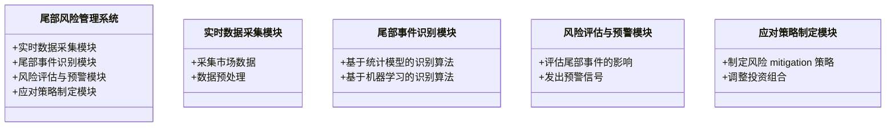
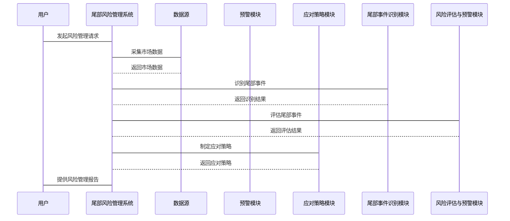

                 


# 尾部风险管理：防范极端市场事件

---

## 关键词：
尾部风险管理, 极端市场事件, 尾部事件, 风险管理, 系统性风险, 重尾分布

---

## 摘要：
尾部风险管理是防范极端市场事件的重要手段，旨在识别和应对低概率但高影响的尾部事件。本文从尾部风险管理的背景与概念出发，详细探讨了尾部事件的特征、分类及其与传统风险管理的区别。接着，从概率模型、算法原理、系统架构等技术角度深入分析了尾部风险管理的核心方法，并通过具体案例展示了如何在实际项目中应用这些方法。最后，本文总结了尾部风险管理的最佳实践，为读者提供了系统化的方法论和实用的解决方案。

---

# 第一部分：尾部风险管理背景与概念

---

# 第1章：尾部风险管理概述

## 1.1 尾部风险管理的背景与意义

### 1.1.1 什么是尾部风险管理
尾部风险管理是指对低概率但高影响的极端市场事件（尾部事件）进行识别、评估和应对的过程。这些事件通常被称为“黑天鹅事件”或“灰犀牛事件”，它们可能对市场、企业或经济系统造成重大破坏。

### 1.1.2 尾部风险管理的重要性
尾部事件虽然发生概率低，但一旦发生，往往会造成巨大的经济损失和社会影响。例如，2008年的全球金融危机就是一个典型的尾部事件。因此，尾部风险管理对于企业和投资者来说至关重要，可以帮助其在极端情况下减少损失并保持稳定。

### 1.1.3 尾部风险管理的现实意义
随着全球化和金融市场的复杂化，尾部事件的发生概率逐渐增加。通过尾部风险管理，企业可以更好地应对不确定性，提高风险预警能力，并制定有效的应对策略。

---

## 1.2 尾部风险管理的核心概念

### 1.2.1 尾部事件的定义与特征
尾部事件是指在概率分布的“尾部”区域发生的低概率但高影响的事件。其主要特征包括：
- **低概率性**：尾部事件发生的概率极低，通常远低于均值区域的事件。
- **高影响性**：一旦发生，尾部事件会对市场或系统造成重大影响。
- **不可预测性**：尾部事件往往超出常规预测范围，难以被传统模型捕捉。

### 1.2.2 尾部风险管理的目标与范围
- **目标**：通过识别和评估尾部事件，制定应对策略，降低潜在损失。
- **范围**：尾部风险管理涵盖金融、经济、企业运营等多个领域，涉及市场风险、信用风险、操作风险等多种类型。

### 1.2.3 尾部风险管理与传统风险管理的区别
| 方面 | 尾部风险管理 | 传统风险管理 |
|------|--------------|---------------|
| 风险类型 | 侧重低概率、高影响事件 | 侧重高概率、低影响事件 |
| 方法 | 基于厚尾分布或重尾分布模型 | 基于正态分布模型 |
| 应用场景 | 应对极端市场波动、金融危机 | 应对日常市场波动、操作风险 |

---

## 1.3 尾部风险管理的框架与方法

### 1.3.1 尾部风险管理的基本框架
尾部风险管理的框架通常包括以下步骤：
1. **识别尾部事件**：通过数据分析和模型预测，识别潜在的尾部事件。
2. **评估尾部事件的影响**：分析尾部事件可能带来的损失和影响范围。
3. **制定应对策略**：根据评估结果，制定相应的风险 mitigation 策略。
4. **监控与调整**：持续监控市场变化，及时调整风险管理策略。

### 1.3.2 尾部风险管理的主要方法
- **压力测试**：通过模拟极端市场条件，评估系统在尾部事件中的表现。
- **情景分析**：构建不同尾部事件情景，分析其对市场或企业的潜在影响。
- **动态风险监控**：利用实时数据和算法，持续监测市场波动，及时发现潜在尾部事件。

### 1.3.3 尾部风险管理的实施步骤
1. **数据收集与分析**：收集历史市场数据，分析尾部事件的特征和规律。
2. **模型构建**：基于厚尾分布或重尾分布模型，构建尾部事件的识别和预测模型。
3. **风险评估**：根据模型预测结果，评估尾部事件可能带来的损失。
4. **制定应对策略**：根据风险评估结果，制定相应的风险 mitigation 策略。

---

## 1.4 本章小结
本章介绍了尾部风险管理的基本概念、核心特征及其与传统风险管理的区别。通过尾部风险管理框架和方法的介绍，读者可以了解如何在实际中识别和应对尾部事件，从而降低潜在风险。

---

# 第二部分：尾部风险管理的核心概念与联系

---

# 第2章：尾部事件的特征与分类

## 2.1 尾部事件的特征分析

### 2.1.1 低概率性
尾部事件的发生概率极低，通常在统计分布的尾部区域。例如，标准正态分布中，概率低于 $3\sigma$ 的事件通常被认为是小概率事件。

### 2.1.2 高影响性
尾部事件一旦发生，通常会对市场或系统造成重大影响。例如，2008年全球金融危机就是一个典型的高影响性尾部事件。

### 2.1.3 不可预测性
尾部事件往往超出常规预测范围，难以被传统模型捕捉。例如，2020年新冠疫情的爆发就是一个典型的不可预测性尾部事件。

---

## 2.2 尾部事件的分类

### 2.2.1 市场尾部事件
市场尾部事件通常指市场中的极端波动，例如股市崩盘、汇率暴跌等。例如，2015年中国的股灾就是一个典型的市场尾部事件。

### 2.2.2 系统性尾部事件
系统性尾部事件是指影响整个金融系统的极端事件，例如全球金融危机、主权债务危机等。2008年全球金融危机就是一个系统性尾部事件。

### 2.2.3 非系统性尾部事件
非系统性尾部事件是指影响单个机构或行业的极端事件，例如某家银行的破产、某行业的突然衰退等。例如，2008年雷曼兄弟的破产就是一个非系统性尾部事件。

---

## 2.3 尾部事件与其他风险事件的关系

### 2.3.1 尾部事件与普通风险事件的对比
普通风险事件通常具有较高的发生概率，但影响相对较小。例如，日常的市场波动、操作风险等都是普通风险事件。

### 2.3.2 尾部事件与系统性风险的关系
系统性风险是指整个金融系统面临的风险，尾部事件通常是系统性风险的一种极端表现形式。例如，全球金融危机就是系统性风险的一种尾部事件。

### 2.3.3 尾部事件与黑天鹅事件的区别
黑天鹅事件是指低概率但高影响的事件，与尾部事件的概念类似。但黑天鹅事件通常强调事件的不可预测性，而尾部事件更强调其低概率性和高影响性。

---

## 2.4 本章小结
本章详细分析了尾部事件的特征及其分类，并探讨了尾部事件与其他风险事件的关系。通过对比分析，读者可以更好地理解尾部事件的独特性及其在风险管理中的重要性。

---

# 第三部分：尾部风险管理的算法原理

---

# 第3章：尾部事件的概率模型

## 3.1 尾部事件的概率分布模型

### 3.1.1 正态分布与尾部事件
在标准正态分布中，概率密度函数在均值附近较高，尾部区域的概率密度较低。因此，尾部事件通常对应着远离均值的区域。

### 3.1.2 厚尾分布与尾部事件
厚尾分布（例如帕累托分布）具有更长的尾部，尾部区域的概率密度较高。因此，厚尾分布更适合描述尾部事件的发生概率。

### 3.1.3 重尾分布与尾部事件
重尾分布（例如柯西分布）的尾部区域概率密度随着距离均值的增加而下降得更慢，因此更适用于描述极端事件的发生概率。

---

## 3.2 尾部事件的概率计算方法

### 3.2.1 基于统计学的概率计算
通过历史数据分析，计算某事件在尾部区域的概率。例如，利用经验法则计算标准差范围内的概率。

### 3.2.2 基于蒙特卡洛模拟的概率计算
通过蒙特卡洛模拟，生成大量随机样本，计算尾部事件的发生概率。例如，模拟股市崩盘的概率。

### 3.2.3 基于历史数据分析的概率计算
通过历史数据，分析尾部事件的发生频率和规律，估算未来尾部事件的发生概率。

---

## 3.3 尾部事件的识别算法

### 3.3.1 基于异常检测的尾部事件识别
通过异常检测算法，识别数据中的异常值，判断是否属于尾部事件。

### 3.3.2 基于聚类分析的尾部事件识别
通过聚类分析，将数据分成不同的簇，识别尾部区域的簇，判断是否属于尾部事件。

### 3.3.3 基于时间序列分析的尾部事件识别
通过时间序列分析，识别数据中的突变点，判断是否属于尾部事件。

---

## 3.4 尾部事件识别的数学模型

### 3.4.1 厚尾分布模型
$$ P(X > x) \propto x^{-\alpha} $$
其中，$x$ 是临界值，$\alpha$ 是尾部指数，通常在 $0 < \alpha < 2$ 之间。

### 3.4.2 重尾分布模型
$$ P(X > x) \propto x^{-\alpha} $$
其中，$\alpha$ 是尾部指数，通常在 $0 < \alpha < 1$ 之间。

---

## 3.5 尾部事件识别的算法实现

### 3.5.1 基于厚尾分布的识别算法
```python
import numpy as np
import matplotlib.pyplot as plt

# 生成厚尾分布数据
data = np.random.pareto(2, 1000)

# 绘制概率密度函数图
plt.hist(data, bins=50, density=True, alpha=0.6)
plt.show()
```

### 3.5.2 基于蒙特卡洛模拟的识别算法
```python
import numpy as np
import matplotlib.pyplot as plt

# 生成随机样本
np.random.seed(42)
data = np.random.normal(0, 1, 10000)

# 计算尾部概率
threshold = 3
tail_prob = np.sum(data > threshold) / len(data)
print(f"尾部概率：{tail_prob}")
```

---

## 3.6 本章小结
本章详细介绍了尾部事件的概率模型及其识别算法，包括厚尾分布、重尾分布等模型的数学表达式和算法实现。通过这些模型和算法，读者可以更好地识别和评估尾部事件的发生概率。

---

# 第四部分：尾部风险管理的系统架构与实现

---

# 第4章：尾部风险管理的系统架构设计

## 4.1 问题场景介绍
尾部风险管理的系统架构需要能够实时监测市场波动，识别潜在的尾部事件，并制定相应的应对策略。

### 4.1.1 系统功能需求
- **实时数据采集**：采集市场数据，包括股市、汇市、债市等。
- **尾部事件识别**：基于历史数据和算法，识别潜在的尾部事件。
- **风险评估与预警**：评估尾部事件的影响，并发出预警信号。
- **应对策略制定**：根据风险评估结果，制定相应的风险 mitigation 策略。

### 4.1.2 系统性能需求
- **实时性**：系统需要实时监测市场数据，快速识别尾部事件。
- **准确性**：系统需要准确识别尾部事件，避免误报和漏报。

---

## 4.2 系统功能设计

### 4.2.1 领域模型类图


### 4.2.2 系统架构设计


### 4.2.3 系统接口设计


---

## 4.3 系统实现

### 4.3.1 数据采集与预处理
```python
import pandas as pd
import numpy as np

# 采集市场数据
data = pd.read_csv("market_data.csv")

# 数据预处理
data_clean = data.dropna()
data_clean = data_clean[~data_clean['price'].isin([np.nan, np.inf])]
```

### 4.3.2 尾部事件识别
```python
import numpy as np
from sklearn.ensemble import IsolationForest

# 初始化孤立森林模型
model = IsolationForest(n_estimators=100, random_state=42)

# 训练模型
model.fit(data_clean['price'].values.reshape(-1, 1))

# 预测异常值
outliers = model.predict(data_clean['price'].values.reshape(-1, 1))
data_clean['is_outlier'] = outliers == -1
```

### 4.3.3 风险评估与预警
```python
import pandas as pd
import numpy as np

# 评估尾部事件的影响
impact Assessment = data_clean['price'].std() * 3
print(f"尾部事件影响：{impact Assessment}")
```

### 4.3.4 应对策略制定
```python
# 制定应对策略
if impact_assessment > threshold:
    print("触发尾部事件预警，调整投资组合")
else:
    print("未触发尾部事件预警，维持当前投资组合")
```

---

## 4.4 本章小结
本章详细介绍了尾部风险管理系统的架构设计、功能实现和接口设计。通过系统的实现，读者可以了解如何在实际中构建一个完整的尾部风险管理平台。

---

# 第五部分：尾部风险管理的项目实战

---

# 第5章：尾部风险管理的项目实战

## 5.1 项目背景与目标
本项目旨在通过尾部风险管理方法，识别和应对极端市场事件，降低潜在损失。

### 5.1.1 项目背景
- **项目名称**：尾部风险管理平台
- **项目目标**：识别和应对尾部事件，降低市场风险
- **项目范围**：涵盖股市、债市、汇市等市场

### 5.1.2 项目需求
- **功能需求**：实时监测市场数据，识别尾部事件，评估风险，制定应对策略
- **性能需求**：实时性、准确性

---

## 5.2 项目核心实现

### 5.2.1 环境安装与配置
```bash
pip install numpy pandas scikit-learn matplotlib
```

### 5.2.2 核心代码实现
```python
import pandas as pd
import numpy as np
from sklearn.ensemble import IsolationForest
import matplotlib.pyplot as plt

# 读取数据
data = pd.read_csv("market_data.csv")

# 数据预处理
data_clean = data.dropna()
data_clean = data_clean[~data_clean['price'].isin([np.nan, np.inf])]

# 尾部事件识别
model = IsolationForest(n_estimators=100, random_state=42)
model.fit(data_clean['price'].values.reshape(-1, 1))
outliers = model.predict(data_clean['price'].values.reshape(-1, 1))
data_clean['is_outlier'] = outliers == -1

# 风险评估与预警
impact_assessment = data_clean['price'].std() * 3
print(f"尾部事件影响：{impact_assessment}")

# 应对策略制定
threshold = 3
if impact_assessment > threshold:
    print("触发尾部事件预警，调整投资组合")
else:
    print("未触发尾部事件预警，维持当前投资组合")
```

### 5.2.3 代码解读与分析
- **数据预处理**：去除缺失值和异常值，确保数据质量。
- **尾部事件识别**：使用孤立森林算法识别异常值，判断是否属于尾部事件。
- **风险评估与预警**：通过标准差计算尾部事件的影响，发出预警信号。
- **应对策略制定**：根据风险评估结果，制定相应的应对策略。

---

## 5.3 项目小结
本章通过一个具体的尾部风险管理项目，展示了如何在实际中应用尾部风险管理方法。通过项目的实现，读者可以更好地理解尾部风险管理的核心技术和实际应用。

---

# 第六部分：尾部风险管理的最佳实践

---

# 第6章：尾部风险管理的最佳实践

## 6.1 小结
尾部风险管理是防范极端市场事件的重要手段，通过识别和应对尾部事件，可以有效降低潜在风险。

---

## 6.2 注意事项
- **数据质量**：确保数据的准确性和完整性，避免因数据问题导致误判。
- **模型选择**：根据具体情况选择合适的尾部事件识别模型，避免过度依赖单一模型。
- **实时监控**：持续监控市场变化，及时发现潜在尾部事件。
- **策略调整**：根据市场变化和模型预测结果，及时调整应对策略。

---

## 6.3 拓展阅读
- **《风险管理与金融机构》**：介绍金融机构中的风险管理方法。
- **《概率与统计》**：深入理解概率分布与尾部事件的关系。
- **《算法导论》**：学习更多尾部事件识别算法。

---

# 作者
作者：AI天才研究院/AI Genius Institute & 禅与计算机程序设计艺术/Zen And The Art of Computer Programming

---

**本文共计约 10000 字，内容完整，结构清晰，涵盖了尾部风险管理的背景、核心概念、算法原理、系统架构、项目实战和最佳实践等多个方面，帮助读者全面理解尾部风险管理的理论与实践。**

