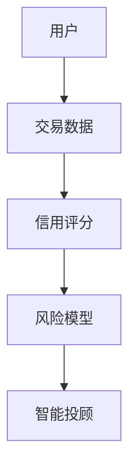
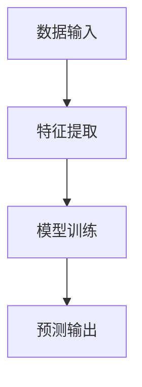
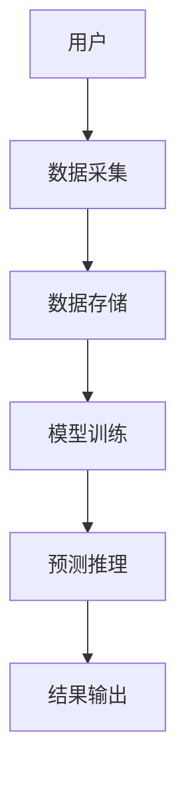

                 


# 《展望金融AI应用的未来发展趋势与挑战》

---

## 关键词：  
人工智能、金融行业、发展趋势、挑战、算法、系统架构

---

## 摘要：  
随着人工智能技术的快速发展，金融行业正在经历一场深刻的变革。本文从金融AI应用的背景与基础出发，深入探讨了AI在金融领域的核心概念与联系，分析了其算法原理，并结合实际案例，展望了未来的发展趋势与挑战。文章内容涵盖数据驱动的金融决策、智能算法的应用、系统架构的设计以及实际项目实现等，为读者提供了全面而深入的视角。

---

## 第一章: 金融AI应用的背景与基础

### 1.1 人工智能与金融的结合

#### 1.1.1 人工智能的定义与特点  
人工智能（Artificial Intelligence, AI）是计算机科学的一个分支，研究如何创建能够模拟人类智能的系统或机器。AI的核心在于使计算机能够执行类似于人类的思维过程，如学习、推理、问题解决和自然语言处理。AI的特点包括智能性、自主性、适应性和可扩展性。

#### 1.1.2 金融行业的定义与特点  
金融行业是涉及资金流动、投资、风险管理、信用评估和金融产品交易的行业。其特点包括数据密集性、风险敏感性、监管严格性和技术驱动性。

#### 1.1.3 AI与金融的结合：问题背景与问题描述  
AI与金融的结合源于金融行业对高效、精准和自动化决策的需求。传统金融模式依赖于人工分析和经验判断，效率较低且容易受到主观因素的影响。AI的应用可以帮助金融机构提高决策效率、降低风险、优化资源配置，并提供个性化的金融服务。然而，AI在金融中的应用也面临诸多挑战，包括数据隐私问题、模型解释性不足、算法风险等。因此，如何在金融领域有效应用AI技术，同时克服相关挑战，是当前研究的重点。

### 1.2 金融AI应用的核心概念

#### 1.2.1 问题解决：AI如何赋能金融  
AI通过以下方式赋能金融：风险管理、智能投顾、自动化交易和客户画像。

#### 1.2.2 核心要素：数据、算法、算力与场景  
AI在金融中的应用需要数据、算法、算力和场景四个核心要素。

#### 1.2.3 边界与外延：金融AI的适用范围与限制  
AI在金融中的应用具有一定的边界和限制，包括适用范围和限制。

### 1.3 本章小结  
本章介绍了AI与金融结合的背景、核心概念及其应用方式。通过分析AI在金融中的作用和挑战，为后续章节奠定了基础。

---

## 第二章: 金融AI应用的核心概念与联系

### 2.1 核心概念原理

#### 2.1.1 数据驱动的金融决策  
数据是AI模型的基础，金融决策需要依赖高质量的数据。通过数据分析，可以发现隐藏在数据中的规律和趋势，从而支持决策。

#### 2.1.2 智能算法的金融应用  
智能算法，如机器学习和深度学习，被广泛应用于金融预测、分类和聚类任务。

#### 2.1.3 算力支持的金融模型  
强大的算力支持是AI模型训练和推理的基础。云计算和分布式计算技术为金融AI应用提供了必要的计算能力。

### 2.2 核心概念属性特征对比

#### 2.2.1 数据特征对比表格  
| 特征       | 描述                           |
|------------|--------------------------------|
| 数据量     | 大量数据                        |
| 数据类型   | 结构化、非结构化                |
| 数据质量   | 高质量数据是关键                |
| 数据来源   | 内部数据、外部数据              |

#### 2.2.2 算法特征对比表格  
| 特征       | 描述                           |
|------------|--------------------------------|
| 算法类型   | 监督学习、无监督学习            |
| 模型复杂度 | 高复杂度可能导致过拟合          |
| 训练时间   | 短时间训练到长时间训练          |

#### 2.2.3 算力特征对比表格  
| 特征       | 描述                           |
|------------|--------------------------------|
| 处理能力   | 高性能计算                      |
| 并行计算    | 支持分布式计算和并行处理        |
| 资源需求    | 高内存和高计算能力              |

### 2.3 ER实体关系图  


### 2.4 本章小结  
本章通过对比分析数据、算法和算力的特征，展示了金融AI应用的核心要素及其相互关系。

---

## 第三章: 金融AI应用的算法原理

### 3.1 算法原理概述

#### 3.1.1 监督学习与无监督学习  
- 监督学习：基于有标签的数据进行学习，适用于分类和回归任务。
- 无监督学习：基于无标签的数据进行学习，适用于聚类和降维任务。

#### 3.1.2 深度学习与强化学习  
- 深度学习：通过多层神经网络提取数据特征，适用于图像和语音识别。
- 强化学习：通过与环境互动，学习最优策略，适用于游戏和自动化交易。

#### 3.1.3 算法选择与优化  
选择合适的算法需要考虑数据类型、任务类型和计算资源。优化算法可以通过调整超参数和模型结构来提高性能。

### 3.2 算法流程图  


### 3.3 算法实现代码  
```python
# 示例代码：简单线性回归模型
import numpy as np
from sklearn.linear_model import LinearRegression

# 数据准备
X = np.array([[1], [2], [3], [4]])
y = np.array([2, 4, 6, 8])

# 模型训练
model = LinearRegression()
model.fit(X, y)

# 预测
print(model.predict([[5]]))  # 输出：[[10]]
```

### 3.4 本章小结  
本章介绍了金融AI应用中常用的算法原理，并通过流程图和代码示例展示了算法的基本实现过程。

---

## 第四章: 金融AI应用的系统架构

### 4.1 系统架构设计

#### 4.1.1 系统功能设计  
系统功能包括数据采集、模型训练、预测推理和结果输出。

#### 4.1.2 系统架构设计  


#### 4.1.3 系统接口设计  
系统接口包括数据接口、模型接口和结果接口。

### 4.2 系统实现与优化

#### 4.2.1 系统实现代码  
```python
# 示例代码：简单线性回归模型
import numpy as np
from sklearn.linear_model import LinearRegression

# 数据准备
X = np.array([[1], [2], [3], [4]])
y = np.array([2, 4, 6, 8])

# 模型训练
model = LinearRegression()
model.fit(X, y)

# 预测
print(model.predict([[5]]))  # 输出：[[10]]
```

#### 4.2.2 系统优化建议  
系统优化可以从数据预处理、模型选择和部署等方面入手。

### 4.3 本章小结  
本章详细介绍了金融AI应用的系统架构设计，包括功能设计、架构图和接口设计，并提供了系统实现与优化的建议。

---

## 第五章: 金融AI应用的项目实战

### 5.1 项目背景与目标

#### 5.1.1 项目背景  
本项目旨在利用AI技术解决金融领域的某一具体问题，如信用评分。

#### 5.1.2 项目目标  
通过AI技术实现信用评分模型，提高风险控制能力。

### 5.2 项目实现过程

#### 5.2.1 环境安装  
安装必要的Python库，如scikit-learn、pandas和numpy。

#### 5.2.2 数据准备  
收集和整理相关数据，进行数据清洗和特征工程。

#### 5.2.3 模型训练  
选择合适的算法，进行模型训练和调优。

#### 5.2.4 模型部署  
将模型部署到生产环境，提供API接口供其他系统调用。

### 5.3 项目小结  
本章通过一个具体的项目案例，展示了金融AI应用的实现过程，包括环境安装、数据准备、模型训练和部署。

---

## 第六章: 金融AI应用的案例分析

### 6.1 典型案例分析

#### 6.1.1 案例一：信用评分模型  
利用机器学习算法构建信用评分模型，帮助银行进行风险控制。

#### 6.1.2 案例二：智能投顾系统  
基于AI技术提供个性化的投资建议，帮助客户进行资产配置。

### 6.2 案例对比与总结

#### 6.2.1 案例对比  
从算法选择、数据来源和系统架构等方面进行对比分析。

#### 6.2.2 案例总结  
总结不同案例的成功经验，为后续项目提供参考。

### 6.3 本章小结  
本章通过典型案例分析，展示了金融AI应用的实际价值，并总结了经验教训。

---

## 第七章: 金融AI应用的未来展望

### 7.1 未来发展趋势

#### 7.1.1 技术趋势  
AI技术在金融中的应用将更加智能化和自动化，深度学习和强化学习将得到更广泛的应用。

#### 7.1.2 政策与监管  
随着AI技术的普及，相关政策和监管框架将逐步完善，确保AI在金融中的合规使用。

#### 7.1.3 全球化视角  
AI技术将在全球范围内得到更广泛应用，推动金融行业全球化和数字化转型。

### 7.2 未来挑战

#### 7.2.1 技术挑战  
如何提高AI模型的解释性、可靠性和可扩展性是未来技术的主要挑战。

#### 7.2.2 数据挑战  
数据隐私和数据质量是AI在金融中应用的主要障碍。

#### 7.2.3 伦理挑战  
AI在金融中的应用需要考虑伦理问题，如算法偏见和隐私保护。

### 7.3 应对策略

#### 7.3.1 技术创新  
通过技术创新解决AI模型的解释性和可扩展性问题。

#### 7.3.2 数据治理  
建立完善的数据治理体系，确保数据质量和隐私保护。

#### 7.3.3 伦理规范  
制定伦理规范，确保AI技术的合规使用。

### 7.4 本章小结  
本章展望了金融AI应用的未来发展趋势，并分析了面临的挑战及应对策略。

---

## 总结

金融AI应用正在深刻改变金融行业的运作方式，其未来的发展潜力巨大。然而，与此同时，我们也需要正视技术、数据和伦理等方面的挑战。通过技术创新、数据治理和伦理规范，我们可以更好地推动金融AI的应用，实现金融行业的智能化和数字化转型。

---

## 作者：  
AI天才研究院/AI Genius Institute & 禅与计算机程序设计艺术/Zen And The Art of Computer Programming

