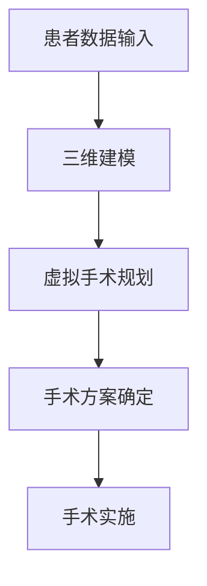

                 

# 巴菲特-芒格的增强现实手术投资：医疗精准化的未来

> **关键词**：巴菲特，芒格，增强现实，手术投资，医疗精准化，技术博客，投资策略，医疗科技，数据分析，决策支持

> **摘要**：本文探讨了巴菲特和芒格的投资理念如何与增强现实技术相结合，推动医疗领域的精准化投资。通过分析增强现实技术在手术模拟、风险评估和决策支持中的应用，本文揭示了这一技术如何提升医疗投资的效率和准确性，为未来的医疗精准化投资提供了新的视角。

---

## 第一部分：巴菲特与芒格的投资理念

### 第1章：巴菲特与芒格的投资哲学

#### 1.1 巴菲特的价值投资理念

##### 1.1.1 巴菲特的投资原则
沃伦·巴菲特是价值投资的代表人物，他的投资原则主要包括以下几点：
- **长期投资**：巴菲特强调长期持有优质资产，避免频繁交易。
- **安全边际**：投资时要留有安全边际，即以低于内在价值的价格买入资产。
- **企业基本面**：关注企业的财务状况、盈利能力和发展前景。

##### 1.1.2 巴菲特的长期投资策略
巴菲特的长期投资策略注重企业的内在价值，而非市场的短期波动。他倾向于投资那些具有强大护城河、稳定现金流和良好管理团队的企业。

##### 1.1.3 巴菲特的选股标准
巴菲特选股时注重企业的ROE（净资产收益率）、ROA（资产回报率）和ROIC（投资资本回报率），同时关注企业的管理层素质和行业前景。

##### **案例分析**：
巴菲特投资可口可乐的过程就是一个典型例子。他看重可口可乐的品牌价值、稳定的现金流和全球市场的潜力，长期持有并获得了丰厚的回报。

---

#### 1.2 芒格的多元思维模型

##### 1.2.1 芒格的思维框架
查理·芒格的多元思维模型强调将多个学科的知识结合起来，形成一个立体的思维方式。他认为，只有通过多维度的思考，才能更好地理解问题的本质。

##### 1.2.2 芒格的决策方法
芒格的决策方法注重逻辑推理和事实分析，避免情绪化和直觉化决策。他强调在决策前充分收集信息，并进行多角度的分析。

##### 1.2.3 芒格的逆向思维
芒格的逆向思维是指从反面思考问题，寻找市场的非共识观点。这种方法可以帮助投资者发现潜在的机会和风险。

##### **案例分析**：
芒格在投资苹果公司时，通过逆向思维，看到了苹果在个人计算机领域的巨大潜力，从而在早期阶段进行了投资。

---

### 第2章：医疗投资的现状与挑战

#### 2.1 医疗行业的投资机会

##### 2.1.1 医疗行业的增长趋势
医疗行业是一个持续增长的领域，尤其是在人口老龄化和医疗技术进步的推动下，医疗投资的潜力巨大。

##### 2.1.2 医疗科技的创新与发展
医疗科技的创新，如人工智能、增强现实和基因编辑，正在改变医疗行业的面貌，为投资者提供了新的机会。

##### 2.1.3 医疗投资的热点领域
当前医疗投资的热点领域包括医疗设备、生物医药、医疗信息化和医疗服务等领域。

##### **数据可视化**：
以下是一个简单的医疗投资热点领域的饼图：

---

#### 2.2 医疗投资中的常见问题

##### 2.2.1 医疗投资的风险与不确定性
医疗投资的风险包括政策风险、技术风险和市场风险等。此外，医疗行业的不确定性较高，投资回报周期较长。

##### 2.2.2 医疗投资中的信息不对称
医疗行业的信息不对称问题较为严重，投资者往往难以获取准确的行业信息和企业数据。

##### 2.2.3 医疗投资的伦理与法律问题
医疗投资需要遵守相关的法律法规，并关注伦理问题，如患者隐私保护和医疗公平性。

---

## 第二部分：增强现实技术在手术投资中的应用

### 第3章：增强现实技术的基本原理

#### 3.1 增强现实技术的定义与特点

##### 3.1.1 增强现实的定义
增强现实（Augmented Reality，AR）是指通过计算机生成的虚拟信息叠加在真实世界中，以提升用户体验的技术。

##### 3.1.2 增强现实的核心技术
增强现实的核心技术包括计算机视觉、三维建模、传感器融合和实时渲染等。

##### 3.1.3 增强现实与虚拟现实的区别
增强现实与虚拟现实（VR）的区别在于，AR是在真实环境中叠加虚拟信息，而VR则是完全沉浸在一个虚拟环境中。

##### **技术对比表**：
| 技术特点 | 增强现实（AR） | 虚拟现实（VR） |
|----------|----------------|---------------|
| 环境叠加 | 真实环境叠加虚拟信息 | 完全虚拟环境 |
| 应用场景 | 医疗、教育、娱乐等 | 游戏、虚拟培训等 |
| 交互方式 | 实时交互 | 完全沉浸式交互 |

---

#### 3.2 增强现实技术在医疗领域的应用

##### 3.2.1 增强现实在手术规划中的应用
通过增强现实技术，医生可以在手术前进行虚拟的手术规划，帮助确定手术方案和潜在风险。

##### 3.2.2 增强现实在手术导航中的应用
在手术过程中，增强现实技术可以提供实时的导航信息，帮助医生更精准地进行手术操作。

##### 3.2.3 增强现实在术后康复中的应用
术后康复阶段，增强现实技术可以用于患者的康复训练和效果评估。

##### **流程图**：
以下是一个增强现实技术在手术规划中的流程图：

---

### 第4章：增强现实技术在手术投资中的具体应用

#### 4.1 增强现实技术在手术模拟中的应用

##### 4.1.1 手术模拟的定义与作用
手术模拟是指通过虚拟技术模拟手术过程，帮助医生进行术前准备和风险评估。

##### 4.1.2 增强现实技术在手术模拟中的实现
通过增强现实技术，医生可以在真实环境中进行虚拟手术模拟，提升手术的精确性和安全性。

##### 4.1.3 手术模拟对投资决策的影响
手术模拟可以帮助投资者更准确地评估手术的风险和收益，从而做出更明智的投资决策。

##### **案例分析**：
某医疗科技公司利用增强现实技术开发了一款手术模拟系统，帮助投资者评估手术的风险和收益，提升了投资决策的准确性。

---

#### 4.2 增强现实技术在手术风险评估中的应用

##### 4.2.1 手术风险评估的定义
手术风险评估是指通过分析手术的相关因素，预测手术过程中可能发生的并发症和风险。

##### 4.2.2 增强现实技术在手术风险评估中的实现
通过增强现实技术，医生可以在手术前进行虚拟手术模拟，识别潜在的风险因素，并制定相应的应对策略。

##### 4.2.3 手术风险评估对投资决策的影响
手术风险评估可以帮助投资者更好地理解手术的风险，从而做出更合理的投资决策。

---

## 第三部分：医疗精准化的未来

### 第5章：医疗精准化的未来展望

#### 5.1 增强现实技术在医疗精准化中的作用
增强现实技术可以通过提供实时的手术导航和虚拟手术模拟，帮助医生进行更精准的手术操作，提升医疗质量。

#### 5.2 医疗精准化面临的挑战
医疗精准化面临的主要挑战包括技术成本高、数据隐私问题和医生的接受度等。

#### 5.3 医疗精准化的投资机会
随着技术的进步和市场的认可，医疗精准化将为投资者带来更多的投资机会。

---

## 第四部分：案例分析与结论

### 第6章：案例分析

#### 6.1 案例背景
某医疗科技公司开发了一款基于增强现实技术的手术模拟系统，帮助投资者评估手术的风险和收益。

#### 6.2 技术实现
该系统利用增强现实技术，结合患者的三维建模和虚拟手术模拟，提供实时的手术导航和风险评估。

#### 6.3 投资分析
通过使用该系统，投资者能够更准确地评估手术的风险和收益，从而做出更明智的投资决策。

---

### 第7章：结论

#### 7.1 总结
巴菲特和芒格的投资理念与增强现实技术的结合，为医疗精准化投资提供了新的思路。通过增强现实技术，投资者可以更准确地评估手术的风险和收益，从而做出更明智的投资决策。

#### 7.2 展望
未来，随着增强现实技术的进一步发展，医疗精准化投资将在更多领域得到应用，为投资者带来更多的机会和挑战。

---

## 作者

作者：AI天才研究院/AI Genius Institute & 禅与计算机程序设计艺术 /Zen And The Art of Computer Programming

---

**注**：以上内容仅为文章的框架和部分章节内容，实际撰写时需要根据具体需求补充更多细节和案例分析。

