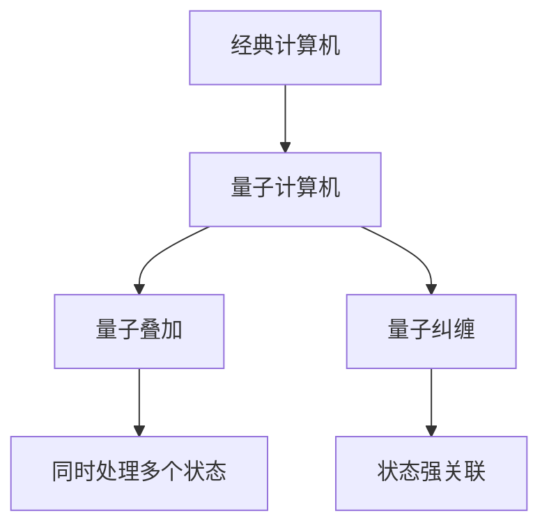
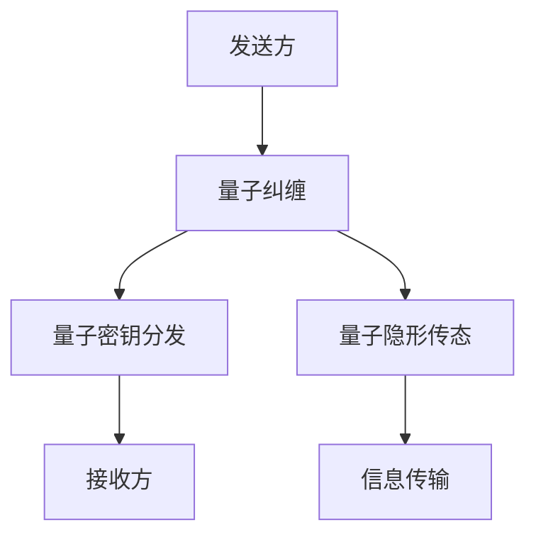
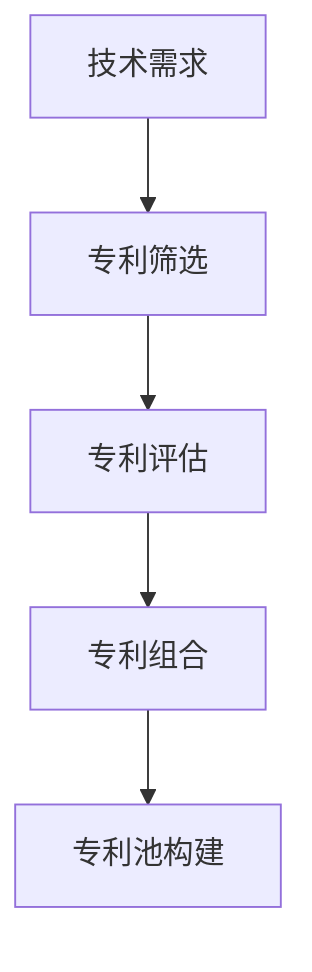

                 

# 巴菲特的经济护城河理论：量子技术专利池的竞争优势

---

## 关键词：经济护城河、量子技术、专利池、商业策略、竞争优势、技术专利、量子计算

---

## 摘要：

本文将巴菲特的经济护城河理论与量子技术专利池相结合，深入探讨量子技术如何通过专利池构建企业的经济护城河。文章从经济护城河的基本概念出发，分析量子技术的特性及其在专利池中的应用，详细阐述专利池的构建与管理策略，并结合实际案例，探讨量子技术专利池如何成为企业竞争优势的核心驱动力。文章最后展望了未来量子技术专利池的发展趋势，并提出了构建经济护城河的最佳实践建议。

---

## 第1章：经济护城河的基本概念

### 1.1 经济护城河的定义与核心要素

经济护城河是指企业在市场竞争中形成的独特优势，使得竞争对手难以复制或超越。这种优势可以是技术、品牌、成本、网络效应等。以下是经济护城河的核心要素：

#### 1.1.1 经济护城河的定义

经济护城河是企业在市场竞争中形成的一种竞争优势，通过这种优势，企业能够保护自己的市场份额和利润，防止竞争对手的侵蚀。巴菲特曾说：“护城河是企业长期竞争优势的核心。”

#### 1.1.2 经济护城河的核心要素

1. **成本优势**：企业通过技术创新或规模效应降低成本，使竞争对手难以匹配。
2. **差异化优势**：企业通过独特的技术、产品或服务形成差异化，吸引特定客户群体。
3. **网络效应**：用户数量的增加会增强产品的价值，形成正反馈循环，例如社交媒体和平台型商业模式。
4. **规模经济**：企业通过扩大生产规模降低成本，进一步巩固市场地位。

#### 1.1.3 经济护城河的分类与特点

1. **宽护城河**：竞争对手难以复制，具有长期竞争优势。
2. **窄护城河**：竞争对手可以通过模仿或创新逐步侵蚀。
3. **动态护城河**：通过持续创新和适应市场变化形成的护城河。

---

### 1.2 经济护城河的构建与维护

#### 1.2.1 构建经济护城河的关键因素

1. **技术创新**：通过技术研发形成技术壁垒。
2. **市场垄断**：通过专利、许可等手段形成市场垄断。
3. **品牌影响力**：强大的品牌可以帮助企业吸引客户并抵御竞争。

#### 1.2.2 如何通过创新构建护城河

1. **技术研发投入**：企业需要持续投入研发，保持技术领先。
2. **知识产权保护**：通过专利、商标等知识产权手段保护创新成果。
3. **快速迭代**：通过快速的产品迭代和技术更新，保持竞争优势。

#### 1.2.3 维护护城河的策略与挑战

1. **持续创新**：技术护城河需要不断更新和升级。
2. **应对竞争**：密切关注竞争对手的动态，及时调整策略。
3. **客户黏性**：通过客户忠诚度和网络效应增强护城河的稳定性。

---

### 1.3 经济护城河在现代商业中的应用

#### 1.3.1 传统行业中的经济护城河

1. **制造业**：通过成本控制和技术创新形成护城河。
2. **零售业**：通过规模效应和品牌优势巩固市场地位。
3. **金融服务业**：通过牌照和客户信任形成护城河。

#### 1.3.2 新兴技术领域中的护城河构建

1. **互联网行业**：通过网络效应和数据积累形成护城河。
2. **人工智能**：通过技术积累和数据垄断形成竞争优势。
3. **量子技术**：通过专利和技术壁垒形成护城河。

#### 1.3.3 技术驱动型企业的护城河策略

1. **技术领先型企业**：通过技术研发和专利保护形成护城河。
2. **平台型企业**：通过网络效应和生态系统形成护城河。
3. **数据驱动型企业**：通过数据积累和分析形成竞争优势。

---

## 第2章：量子技术的基本原理与优势

### 2.1 量子计算的核心原理

#### 2.1.1 量子计算的定义

量子计算是一种基于量子力学原理的计算方式，利用量子叠加和量子纠缠等特性，可以在某些特定问题上远超经典计算机的计算能力。

#### 2.1.2 量子计算的核心原理

1. **量子叠加**：量子位可以同时处于多个状态的叠加态。
2. **量子纠缠**：两个或多个量子位之间形成强关联，一个量子位的状态会直接影响另一个量子位的状态。
3. **量子并行**：量子计算机可以通过并行计算大幅提高计算速度。

#### 2.1.3 量子计算的优势

1. **计算速度**：在某些特定问题上，量子计算机可以大幅提高计算速度，例如因式分解、优化问题等。
2. **算法突破**：量子算法（如Shor算法）可以在某些领域实现指数级的计算速度提升。

---

#### 图2-1：量子计算的基本原理

---

#### 2.1.4 量子计算的潜在应用领域

1. **密码学**：量子计算机可以破解现有的加密算法，威胁网络安全。
2. **药物研发**：通过量子模拟加速药物分子的筛选和优化。
3. **金融计算**：通过量子优化提高投资组合优化和风险管理能力。

---

### 2.2 量子通信的技术特点

#### 2.2.1 量子通信的定义

量子通信是一种利用量子力学原理进行信息传输的技术，主要包括量子密钥分发（QKD）和量子隐形传态（QST）。

#### 2.2.2 量子通信的核心技术

1. **量子密钥分发（QKD）**：通过量子态传输密钥，确保密钥的绝对安全性。
2. **量子隐形传态（QST）**：通过量子纠缠实现信息的远距离传输。

#### 2.2.3 量子通信的优势

1. **绝对安全性**：量子密钥分发基于量子力学原理，无法被窃听或破解。
2. **高速传输**：量子通信可以通过量子纠缠实现超光速信息传输（理论上）。

---

#### 图2-2：量子通信的实现原理

---

### 2.3 量子技术的专利现状与趋势

#### 2.3.1 量子技术的专利布局

1. **专利数量**：全球量子技术专利数量快速增长，主要集中在美国、中国和欧洲。
2. **专利领域**：主要集中在量子计算、量子通信和量子传感等领域。

#### 2.3.2 量子技术专利池的构建

1. **专利池的定义**：量子技术专利池是指一组围绕量子技术的专利组合，用于形成技术壁垒和竞争优势。
2. **专利池的构建策略**：通过技术布局和专利筛选，构建一个覆盖量子技术核心领域的专利组合。

---

## 第3章：专利池的构建与管理

### 3.1 专利池的基本概念

#### 3.1.1 专利池的定义与特点

专利池是指一组围绕同一技术领域或产品的专利组合，通常由多家企业或个人共同持有和管理。

---

#### 图3-1：专利池的构建过程

---

### 3.2 专利池的构建策略

#### 3.2.1 技术布局与专利筛选

1. **技术布局**：根据市场需求和技术趋势，确定专利池的技术方向。
2. **专利筛选**：通过技术评估和市场分析，筛选出具有战略意义的专利。

#### 3.2.2 专利组合的优化策略

1. **核心专利选择**：选择具有技术壁垒和市场价值的核心专利。
2. **专利覆盖范围**：确保专利池覆盖主要的技术领域和市场区域。

---

### 3.3 专利池的管理与运营

#### 3.3.1 专利池的管理架构

1. **管理主体**：通常由企业或专利池管理机构负责专利池的日常管理。
2. **管理流程**：包括专利评估、维护、许可和侵权分析等。

#### 3.3.2 专利池的价值评估

1. **专利价值评估**：通过技术评估和市场分析，确定专利的经济价值。
2. **专利池的整体价值**：综合考虑专利池的技术覆盖和市场潜力，评估专利池的整体价值。

---

## 第4章：量子技术专利池作为经济护城河的应用

### 4.1 量子技术专利池的优势

#### 4.1.1 技术领先性带来的市场壁垒

1. **技术壁垒**：通过专利池形成技术壁垒，防止竞争对手复制技术。
2. **市场准入门槛**：通过专利池提高市场准入门槛，限制竞争对手进入。

#### 4.1.2 专利池的规模效应与协同效应

1. **规模效应**：通过专利池的规模效应，降低单位专利的管理成本。
2. **协同效应**：通过专利池的协同效应，增强技术的综合应用能力。

---

### 4.2 专利池如何巩固经济护城河

#### 4.2.1 通过专利池阻止竞争对手

1. **专利侵权诉讼**：通过专利池中的核心专利，发起专利侵权诉讼，阻止竞争对手的市场拓展。
2. **专利许可策略**：通过专利许可，限制竞争对手的技术应用。

#### 4.2.2 利用专利池进行市场扩张

1. **技术输出**：通过专利池的技术输出，扩大市场份额。
2. **合作伙伴关系**：通过专利池与合作伙伴建立战略联盟，共同开拓市场。

---

### 4.3 量子技术专利池的未来发展趋势

#### 4.3.1 技术融合与创新

1. **技术融合**：量子技术与人工智能、大数据等技术的融合，形成新的竞争优势。
2. **持续创新**：通过持续的技术创新，保持专利池的技术领先性。

#### 4.3.2 市场竞争与合作

1. **市场竞争**：量子技术专利池将成为企业市场竞争的核心武器。
2. **国际合作**：通过国际合作，推动量子技术专利池的全球化布局。

---

## 第5章：量子技术专利池的实际案例分析

### 5.1 量子计算领域的专利池构建

#### 5.1.1 IBM的量子计算专利池

1. **技术布局**：IBM在量子计算领域拥有大量专利，覆盖量子比特、量子电路和量子算法等多个技术领域。
2. **专利池的优势**：通过专利池，IBM在量子计算领域形成了强大的技术壁垒。

#### 5.1.2 Google的量子计算专利池

1. **技术优势**：Google在量子计算领域拥有多个核心专利，尤其是在量子算法和量子计算架构方面。
2. **市场影响**：Google的量子计算专利池为其在人工智能和大数据领域提供了强大的技术支持。

---

### 5.2 量子通信领域的专利池构建

#### 5.2.1 中国在量子通信领域的专利池

1. **技术突破**：中国在量子通信领域取得了显著的技术突破，特别是在量子密钥分发和量子隐形传态方面。
2. **市场应用**：中国的量子通信技术已经在金融、能源和国防等领域得到广泛应用。

#### 5.2.2 美国在量子通信领域的专利池

1. **技术领先**：美国在量子通信领域拥有大量专利，特别是在量子加密和量子网络方面。
2. **国际合作**：美国通过国际合作推动量子通信技术的商业化应用。

---

## 第6章：量子技术专利池的未来展望

### 6.1 量子技术专利池的发展趋势

#### 6.1.1 技术融合与创新

1. **量子技术与人工智能的融合**：通过量子计算和人工智能的结合，推动技术的进一步创新。
2. **量子技术与大数据的结合**：通过量子技术提升大数据处理和分析能力。

#### 6.1.2 市场竞争与合作

1. **市场竞争加剧**：随着量子技术的快速发展，市场竞争将更加激烈。
2. **国际合作加强**：通过国际合作，推动量子技术的全球化发展。

---

### 6.2 构建量子技术专利池的最佳实践

#### 6.2.1 技术布局与专利筛选

1. **技术布局**：根据市场需求和技术趋势，确定专利池的技术方向。
2. **专利筛选**：通过技术评估和市场分析，筛选出具有战略意义的专利。

#### 6.2.2 专利池的动态调整

1. **技术更新**：根据技术发展和市场需求，动态调整专利池的技术方向。
2. **市场变化**：根据市场变化和竞争态势，及时调整专利池的管理策略。

---

## 作者：AI天才研究院/AI Genius Institute & 禅与计算机程序设计艺术 /Zen And The Art of Computer Programming

---

本文通过结合巴菲特的经济护城河理论和量子技术专利池，深入分析了量子技术如何通过专利池构建企业的经济护城河。希望本文能够为读者提供关于经济护城河和量子技术的深刻见解，并为企业在量子技术领域的竞争中提供有价值的策略建议。

