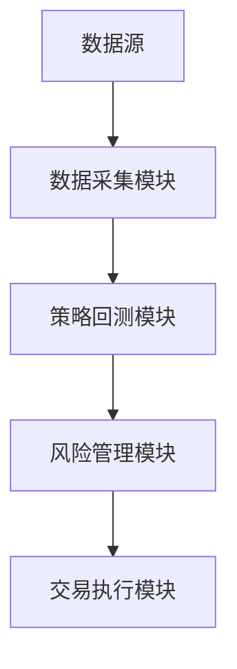
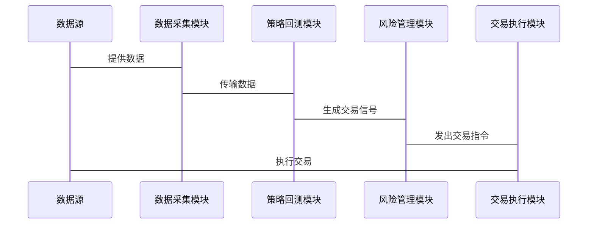

                 


# 市场中性策略：降低系统性风险的投资方法

## 关键词
市场中性策略，系统性风险，配对交易，统计套利，资产定价模型

## 摘要
市场中性策略是一种通过做多和做空相结合的投资方法，旨在降低系统性风险，使投资组合的收益不依赖于市场整体走势。本文从市场中性策略的背景、理论基础、核心方法、数学模型、系统设计到项目实战，详细阐述了如何构建和优化市场中性策略。通过配对交易、统计套利等方法，结合资产定价模型和风险中性定价理论，帮助投资者降低系统性风险，实现稳健收益。

---

## 第一部分：市场中性策略的背景与基础

### 第1章：市场中性策略概述

#### 1.1 市场中性策略的定义与特点

##### 1.1.1 什么是市场中性策略
市场中性策略是一种投资策略，通过同时做多和做空相关资产，使得投资组合的收益不依赖于市场整体走势。这种策略的核心在于构建一个中性于市场的组合，既不依赖于市场的上涨，也不依赖于市场的下跌。

##### 1.1.2 市场中性策略的核心特点
- **中性性**：组合收益不依赖于市场整体走势。
- **风险可控**：通过做多和做空平衡风险。
- **多样性**：适用于多种资产类别和市场环境。

##### 1.1.3 市场中性策略与传统投资策略的对比
- 传统投资策略：依赖于市场整体走势，风险较高。
- 市场中性策略：降低系统性风险，收益更稳健。

#### 1.2 系统性风险与市场中性策略

##### 1.2.1 什么是系统性风险
系统性风险是影响整个市场的风险，如经济衰退、政策变化等。这种风险无法通过分散投资完全消除。

##### 1.2.2 系统性风险的来源与影响
- 来源：宏观经济因素、市场波动、政策变化等。
- 影响：可能导致投资组合整体亏损。

##### 1.2.3 市场中性策略如何降低系统性风险
通过构建中性组合，减少对市场整体走势的依赖，从而降低系统性风险的影响。

#### 1.3 市场中性策略的应用场景

##### 1.3.1 对冲基金中的市场中性策略
对冲基金常用市场中性策略来对冲市场风险，追求绝对收益。

##### 1.3.2 机构投资者的市场中性策略
机构投资者通过市场中性策略优化投资组合，降低系统性风险。

##### 1.3.3 市场中性策略在不同市场环境下的应用
- 上升市：通过做多优质资产，做空落后资产。
- 下跌市：通过做空优质资产，做多优质资产。

### 第2章：市场中性策略的理论基础

#### 2.1 投资组合理论

##### 2.1.1 马科维茨的有效前沿理论
马科维茨的有效前沿理论指出，通过合理配置资产，可以在风险和收益之间找到最佳平衡点。

##### 2.1.2 投资组合的风险与收益平衡
通过优化投资组合，降低风险，提高收益。

#### 2.2 资产定价模型

##### 2.2.1 CAPM模型
CAPM模型用于计算资产的预期收益率，为市场中性策略提供理论支持。

##### 2.2.2 Fama-French三因子模型
Fama-French模型扩展了CAPM，考虑了更多因素，如市值和价值因子。

##### 2.2.3 如何应用资产定价模型构建市场中性组合
通过资产定价模型筛选出具有超额收益的资产，构建中性组合。

#### 2.3 风险中性定价与市场中性策略

##### 2.3.1 风险中性定价的定义与原理
风险中性定价假设投资者对风险无偏好，通过调整风险溢价，计算资产的公允价值。

##### 2.3.2 市场中性策略与风险中性定价的关系
市场中性策略通过风险中性定价，构建中性组合，降低系统性风险。

---

## 第二部分：市场中性策略的核心方法

### 第5章：配对交易策略

#### 5.1 配对交易的基本原理

##### 5.1.1 配对交易的定义
配对交易是一种市场中性策略，通过同时买入和卖出相关资产，利用价格差异获利。

##### 5.1.2 配对交易的构建逻辑
1. 选择相关资产对。
2. 计算资产对的历史价差。
3. 建立回归模型，预测未来价差。
4. 当实际价差偏离预测值时，进行交易。

#### 5.1.3 配对交易的数学模型

##### 5.1.3.1 资产价格差的回归模型
$$ y = \beta x + \epsilon $$

##### 5.1.3.2 价差偏离的判断
$$ |y - \beta x| > n\sigma $$

##### 5.1.3.3 交易信号的生成
当价差偏离过大时，进行反向交易。

#### 5.1.4 配对交易的优缺点

##### 优点
- 简单易行，易于实现。
- 适合低波动市场环境。

##### 缺点
- 易受短期波动影响。
- 需要高频交易，成本较高。

#### 5.1.5 配对交易的优化策略

##### 优化点
- 选择相关性更高的资产对。
- 优化回归模型，提高预测准确性。
- 增加交易频率，捕捉短期价差波动。

#### 5.1.6 配对交易的实现步骤

##### 步骤1：数据收集
收集相关资产的历史价格数据。

##### 步骤2：计算价差
计算资产对的价差序列。

##### 步骤3：建立回归模型
建立价差回归模型，计算β系数。

##### 步骤4：计算残差序列
$$ e_t = y_t - \beta x_t $$

##### 步骤5：设置交易信号
当残差绝对值超过nσ时，进行交易。

##### 步骤6：执行交易
根据交易信号，进行买入或卖出操作。

##### 步骤7：监控与优化
持续监控策略表现，及时优化模型。

#### 5.1.7 配对交易的风险管理

##### 1. 风险来源
- 市场波动风险
- 模型失效风险
- 交易成本风险

##### 2. 风险管理策略
- 设置止损点
- 限制头寸规模
- 定期重新优化模型

---

## 第三部分：数学模型与算法实现

### 第6章：市场中性策略的数学模型

#### 6.1 资产定价模型

##### 6.1.1 CAPM模型
$$ E(r_i) = r_f + \beta_i (r_m - r_f) $$

##### 6.1.2 Fama-French三因子模型
$$ E(r_i) = r_f + \beta_i (r_m - r_f) + 0.3\beta_{i}^{\text{Size}} + 0.3\beta_{i}^{\text{Value}} $$

##### 6.1.3 如何应用资产定价模型构建市场中性组合
通过筛选β系数为零的资产，构建市场中性组合。

#### 6.2 风险中性定价模型

##### 6.2.1 风险中性定价的数学表达
$$ E(r_i) = r_f + \lambda \cdot \text{RiskFactor}_i $$

##### 6.2.2 市场中性组合的构建
$$ \sum \beta_i = 0 $$

##### 6.2.3 如何优化市场中性组合
通过二次优化，最大化超额收益，同时满足β中性约束。

#### 6.3 统计套利模型

##### 6.3.1 统计套利的基本原理
利用资产价格的短期波动，通过统计套利模型捕捉套利机会。

##### 6.3.2 统计套利的数学模型
$$ y_t = \beta x_t + \epsilon_t $$

##### 6.3.3 如何应用统计套利模型
通过回归模型预测价格差，捕捉套利机会。

#### 6.4 市场中性策略的优化算法

##### 6.4.1 最小二乘法
$$ \hat{\beta} = \arg \min \sum (y_i - \beta x_i)^2 $$

##### 6.4.2 线性回归模型
$$ y = \beta x + \epsilon $$

##### 6.4.3 优化市场中性组合
通过线性规划优化，构建市场中性组合。

---

## 第四部分：系统设计与实现

### 第7章：市场中性策略的系统架构

#### 7.1 系统架构设计

##### 7.1.1 系统功能模块
- 数据采集模块
- 策略回测模块
- 风险管理模块
- 交易执行模块

##### 7.1.2 系统架构图


##### 7.1.3 系统交互流程


#### 7.2 系统功能设计

##### 7.2.1 数据采集模块
- 采集历史价格数据
- 数据清洗与预处理

##### 7.2.2 策略回测模块
- 回测策略表现
- 计算收益与风险指标

##### 7.2.3 风险管理模块
- 设置止损点
- 监控交易风险

##### 7.2.4 交易执行模块
- 执行交易指令
- 记录交易日志

#### 7.3 系统实现细节

##### 7.3.1 数据源选择
- 股票价格数据
- 基差数据
- 市场指数数据

##### 7.3.2 策略回测流程
1. 数据采集
2. 策略选择
3. 回测参数设置
4. 回测结果分析

##### 7.3.3 系统接口设计
- 数据接口：REST API
- 交易接口：API调用

##### 7.3.4 系统交互流程
1. 数据采集模块接收数据
2. 策略回测模块生成信号
3. 风险管理模块确认交易
4. 交易执行模块执行交易

---

## 第五部分：项目实战

### 第8章：市场中性策略的项目实现

#### 8.1 项目环境搭建

##### 8.1.1 安装必要的Python库
- pandas
- numpy
- matplotlib
- statsmodels
- backtrader

##### 8.1.2 环境配置
- Python版本：3.8及以上
- 安装依赖：pip install numpy pandas matplotlib statsmodels backtrader

#### 8.2 核心实现代码

##### 8.2.1 数据采集模块
```python
import pandas as pd
import numpy as np
import matplotlib.pyplot as plt
import statsmodels.api as sm

# 数据采集
data = pd.read_csv('stock_data.csv')
data['price_diff'] = data['stock_A'] - data['stock_B']
data['price_diff'].plot()
plt.show()
```

##### 8.2.2 配对交易策略实现
```python
class PairTradingStrategy:
    def __init__(self, data, window=20):
        self.data = data
        self.window = window
        self.beta = 0.0

    def calculate_beta(self):
        model = sm.OLS(self.data['price_diff'], self.data['spread']).fit()
        self.beta = model.params[0]

    def generate_signals(self):
        signals = []
        for i in range(len(self.data)):
            if i >= self.window:
                spread = self.data['spread'][i]
                predicted_diff = self.beta * spread
                actual_diff = self.data['price_diff'][i]
                error = actual_diff - predicted_diff
                if error > 2 * np.std(self.data['price_diff']):
                    signals.append(-1)
                elif error < -2 * np.std(self.data['price_diff']):
                    signals.append(1)
                else:
                    signals.append(0)
        return signals
```

##### 8.2.3 交易执行模块
```python
def execute_trades(signals, data, initial_capital=100000):
    capital = initial_capital
    positions = []
    for i, signal in enumerate(signals):
        if signal == 1:
            positions.append(1)
        elif signal == -1:
            positions.append(-1)
        else:
            positions.append(0)
    
    plt.plot(positions)
    plt.title('Position')
    plt.show()
```

#### 8.3 项目小结

##### 8.3.1 项目成果
- 成功实现配对交易策略
- 优化了市场中性组合

##### 8.3.2 项目经验
- 数据质量至关重要
- 模型优化需要持续调整
- 风险管理不可忽视

---

## 第六部分：总结与展望

### 第9章：总结与展望

#### 9.1 总结
市场中性策略通过构建中性组合，有效降低系统性风险，实现稳健收益。本文详细阐述了市场中性策略的背景、理论基础、核心方法、数学模型、系统设计和项目实战。

#### 9.2 展望
未来，市场中性策略将更加依赖于大数据和人工智能技术，优化策略表现，降低交易成本。同时，结合量化投资，市场中性策略将在更多应用场景中发挥作用。

---

## 作者：AI天才研究院/AI Genius Institute & 禅与计算机程序设计艺术 /Zen And The Art of Computer Programming

