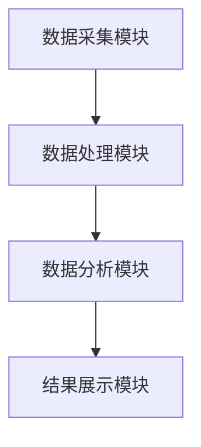
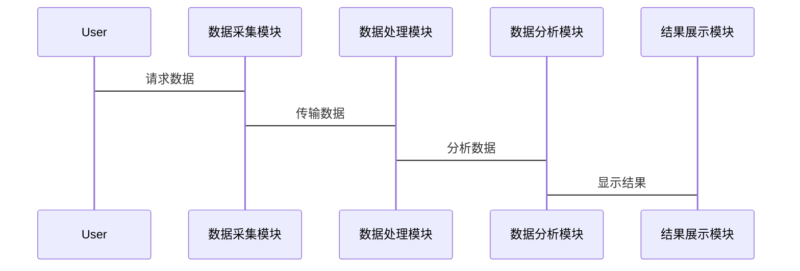

                 

# 市场周期理论：如何识别并利用经济周期变化

> 关键词：市场周期，经济周期，技术分析，基本面分析，系统架构设计

> 摘要：本文深入探讨了市场周期理论的核心概念、分析方法及其在实际应用中的重要意义。通过系统化的理论分析与实际案例，帮助读者识别并利用经济周期变化，为商业决策提供科学依据。文章从市场周期的基本概念入手，分析其核心驱动因素，结合技术分析与基本面分析方法，构建完整的市场周期分析系统，并通过实际案例展示如何在实践中应用这些理论。

---

## 第一章：市场周期理论概述

### 1.1 市场周期的定义与背景

#### 1.1.1 市场周期的基本定义

市场周期是指市场中价格、需求、供给等经济指标随时间变化而呈现出的周期性波动。它反映了市场在不同经济环境下的动态变化，是经济学和金融学中的重要概念。市场周期通常分为四个阶段：衰退、萧条、复苏和膨胀。

#### 1.1.2 市场周期的历史演变

市场周期并非一个新概念，它源于对经济波动的长期观察。从工业革命到现代经济，市场周期的形态和影响因素逐渐多样化。历史上著名的经济危机，如1929年的大萧条和2008年的金融危机，都展示了市场周期的剧烈波动及其对经济的深远影响。

#### 1.1.3 市场周期与经济发展的关系

市场周期与经济发展密切相关。经济周期的波动影响着企业的生存、发展和转型。通过理解市场周期的变化规律，企业和投资者可以更好地制定战略，抓住机遇，规避风险。

### 1.2 市场周期的核心概念

#### 1.2.1 经济周期的四个阶段

市场周期通常分为四个阶段：
1. **衰退期**：市场需求下降，企业利润减少，失业率上升。
2. **萧条期**：经济活动低靡，市场需求极度疲软。
3. **复苏期**：经济开始逐步恢复，市场需求回升。
4. **膨胀期**：市场需求旺盛，企业利润增长，经济 overheating。

#### 1.2.2 市场周期的驱动力分析

市场周期的波动由多种因素驱动，主要包括：
1. **经济政策**：货币政策和财政政策的变化直接影响市场周期。
2. **技术进步**：技术创新推动生产力提升，影响市场需求和供给。
3. **市场心理**：投资者情绪波动也是市场周期的重要驱动因素。

#### 1.2.3 市场周期与企业战略的关系

企业战略应根据市场周期的不同阶段进行调整。例如，在衰退期，企业应注重成本控制和现金流管理；在膨胀期，企业应积极扩张，抓住市场机会。

---

## 第二章：市场周期的核心概念与联系

### 2.1 市场周期的核心要素

#### 2.1.1 需求与供给的动态平衡

市场需求和供给的动态平衡是市场周期的核心。当需求超过供给时，价格上升，市场进入膨胀期；当供给超过需求时，价格下降，市场进入衰退期。

#### 2.1.2 价格波动的内在规律

价格波动是市场周期的重要表现。通过分析价格波动的规律，可以预测市场的未来走势。

#### 2.1.3 市场参与者的博弈关系

市场参与者（如企业和消费者）的博弈关系影响着市场周期的变化。企业间的竞争和消费者的选择共同塑造了市场的动态。

### 2.2 市场周期的驱动力分析

#### 2.2.1 经济政策的影响

货币政策和财政政策是影响市场周期的重要因素。例如，央行降低利率可以刺激市场需求，推动市场进入复苏期。

#### 2.2.2 技术进步的作用

技术创新提高了生产力，降低了成本，推动了市场需求的增长。例如，互联网技术的普及推动了信息产业的快速发展。

#### 2.2.3 市场心理的波动

投资者情绪的波动也是市场周期的重要驱动因素。例如，市场的乐观情绪可能导致股市上涨，推动市场进入膨胀期。

### 2.3 市场周期的阶段划分

#### 2.3.1 衰退期的特征与应对策略

衰退期的特征是市场需求下降，企业利润减少。应对策略包括成本控制和现金流管理。

#### 2.3.2 萧条期的特征与应对策略

萧条期的特征是经济活动低靡，市场需求极度疲软。应对策略包括寻找新的市场机会和调整产品策略。

#### 2.3.3 复苏期的特征与应对策略

复苏期的特征是经济开始恢复，市场需求回升。应对策略包括积极投资和扩张。

#### 2.3.4 膨胀期的特征与应对策略

膨胀期的特征是市场需求旺盛，价格上升。应对策略包括提高价格和扩大生产。

---

## 第三章：市场周期的分析方法

### 3.1 市场周期的技术分析方法

#### 3.1.1 K线图的解读

K线图是技术分析的重要工具，通过分析价格走势预测未来市场的变化。例如，通过分析K线图的形态，可以判断市场的趋势。

#### 3.1.2 移动平均线的应用

移动平均线（MA）是技术分析中常用的一种指标，用于平滑价格走势，识别市场的趋势。例如，短期移动平均线用于判断短期趋势，长期移动平均线用于判断长期趋势。

#### 3.1.3 市场周期的技术指标分析

技术指标如RSI（相对强弱指数）和MACD（移动平均收敛散度）用于衡量市场的强弱和趋势。例如，RSI用于判断市场的超买或超卖状态，MACD用于判断市场的趋势和力量。

### 3.2 市场周期的基本面分析方法

#### 3.2.1 宏观经济指标的解读

宏观经济指标如GDP、失业率和通货膨胀率是基本面分析的重要依据。例如，GDP增长表明经济处于复苏期，失业率下降表明劳动力市场活跃。

#### 3.2.2 行业分析与市场周期的关系

行业分析可以帮助识别市场周期中的优势行业。例如，在衰退期，防御性行业如公用事业和医疗保健可能表现较好。

#### 3.2.3 企业财务数据的分析

企业财务数据如利润表和资产负债表是基本面分析的重要内容。例如，企业利润增长表明市场处于膨胀期。

### 3.3 市场周期的宏观经济分析

#### 3.3.1 货币政策对市场周期的影响

货币政策如利率调整和货币供应量变化直接影响市场周期。例如，降低利率可以刺激市场需求，推动市场进入复苏期。

#### 3.3.2 财政政策对市场周期的影响

财政政策如税收调整和政府支出直接影响市场周期。例如，增加政府支出可以刺激经济增长，推动市场进入复苏期。

#### 3.3.3 国际经济环境对市场周期的影响

国际经济环境如国际贸易和汇率变化也影响市场周期。例如，汇率变化影响出口企业的竞争力，进而影响市场需求。

---

## 第四章：市场周期的系统分析与架构设计

### 4.1 市场周期分析系统的功能模块

#### 4.1.1 数据采集模块

数据采集模块负责收集市场数据，如价格、成交量和宏观经济指标。例如，使用API接口从金融数据库获取数据。

#### 4.1.2 数据处理模块

数据处理模块对采集到的数据进行清洗和预处理，确保数据的准确性和完整性。例如，处理缺失值和异常值。

#### 4.1.3 数据分析模块

数据分析模块使用技术分析和基本面分析方法对数据进行分析，生成市场周期的预测结果。例如，使用机器学习算法预测市场的未来走势。

#### 4.1.4 结果展示模块

结果展示模块将分析结果以可视化的方式展示给用户。例如，使用图表展示市场的趋势和预测结果。

### 4.2 市场周期分析系统的架构设计

#### 4.2.1 系统架构图

#### 4.2.2 数据流图

#### 4.2.3 系统交互流程图

### 4.3 项目实战

#### 4.3.1 项目背景与目标

项目背景：分析2008年金融危机后的市场周期变化，为企业制定战略提供参考。

项目目标：构建一个市场周期分析系统，能够预测市场的未来走势，并提供相应的投资建议。

#### 4.3.2 数据采集与处理

使用Python编写数据采集脚本，从金融数据库获取历史价格数据。数据处理包括清洗和预处理，确保数据的准确性。

#### 4.3.3 数据分析与建模

使用机器学习算法对数据进行分析，预测市场的未来走势。例如，使用ARIMA模型预测价格走势。

#### 4.3.4 结果展示与应用

将分析结果以图表形式展示，为企业提供投资建议。例如，在市场处于衰退期时，建议企业进行成本控制。

---

## 第五章：总结与展望

### 5.1 市场周期理论的核心要点

市场周期是经济学和金融学中的重要概念，理解其变化规律对于企业制定战略具有重要意义。通过技术分析和基本面分析，可以有效识别市场周期的变化，并制定相应的应对策略。

### 5.2 未来的研究方向

未来的研究可以进一步探讨市场周期的复杂性，如多变量分析和非线性模型的应用。此外，人工智能技术的引入也可以提高市场周期分析的准确性和效率。

---

## 作者信息

作者：AI天才研究院/AI Genius Institute & 禅与计算机程序设计艺术 /Zen And The Art of Computer Programming

---

以上是本文的完整内容，涵盖了市场周期理论的各个方面，从基本概念到系统设计，再到实际应用，为读者提供了全面的指导。

