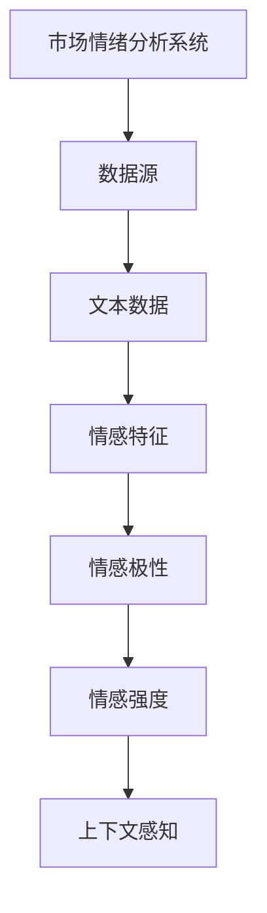
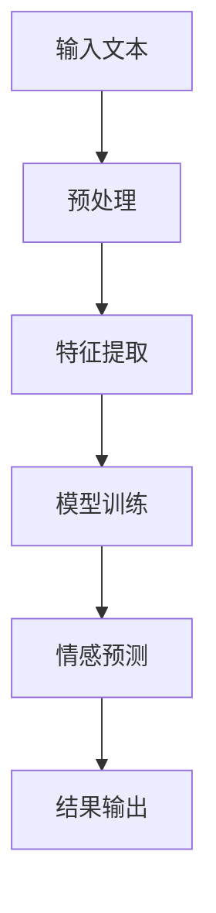
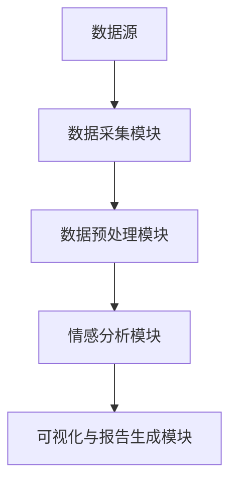

                 


# 市场情绪分析

> 关键词：市场情绪分析，自然语言处理，情感计算，大数据分析，文本挖掘

> 摘要：市场情绪分析是一种利用自然语言处理和大数据分析技术，通过对文本数据的情感倾向进行量化分析，从而帮助企业做出更精准的市场决策的方法。本文将从市场情绪分析的背景与概念、核心概念与联系、算法原理、系统分析与架构设计、项目实战以及最佳实践等方面进行详细阐述，帮助读者全面理解市场情绪分析的理论与实践。

---

# 第一部分: 市场情绪分析概述

## 第1章: 市场情绪分析的背景与概念

### 1.1 市场情绪分析的定义与重要性

#### 1.1.1 市场情绪分析的定义
市场情绪分析是一种通过对文本数据（如社交媒体评论、新闻文章、产品评论等）进行分析，识别出文本中的情感倾向（正面、负面或中性）的技术。它能够帮助企业了解市场对某一产品、品牌或事件的舆论倾向，从而做出更精准的市场决策。

#### 1.1.2 市场情绪分析的重要性
在当今数据驱动的商业环境中，市场情绪分析的重要性日益凸显：
- **提升决策效率**：通过分析大量文本数据，企业可以快速了解市场对产品或服务的反馈，从而优化产品设计和营销策略。
- **实时监控市场动态**：社交媒体和其他在线平台上的评论可以实时反映市场对某一事件或产品的看法，帮助企业及时调整应对策略。
- **精准预测市场趋势**：通过对历史数据的分析，企业可以预测未来的市场趋势，提前做好准备。

#### 1.1.3 市场情绪分析的应用领域
市场情绪分析的应用领域非常广泛，主要包括：
- **金融领域**：分析股票市场的投资者情绪，预测市场波动。
- **零售与电商**：分析消费者对产品的评论，优化产品和服务。
- **社交媒体监控**：实时监控品牌声誉，及时应对负面评论。
- **政治与媒体**：分析公众对政策或新闻的反应，辅助决策。

### 1.2 市场情绪分析的核心概念

#### 1.2.1 情感极性分析
情感极性分析是市场情绪分析中最常见的任务，它通过分类模型将文本分为正面、负面或中性三类。情感极性分析可以帮助企业了解市场对某一产品或服务的整体评价。

#### 1.2.2 情感强度分析
情感强度分析是对情感极性分析的补充，它不仅判断文本的情感倾向，还评估情感的强度。例如，一条评论可能是“非常喜欢”（强度高）或“有点喜欢”（强度低）。

#### 1.2.3 上下文感知
上下文感知是指在分析文本情感时，需要考虑文本的上下文信息。例如，在分析一条社交媒体评论时，需要考虑评论的背景、用户的历史行为等信息，以更准确地理解情感。

### 1.3 市场情绪分析的边界与外延

#### 1.3.1 数据来源的边界
市场情绪分析的数据来源主要包括社交媒体评论、新闻文章、产品评论等。需要注意的是，数据来源的质量直接影响分析结果的准确性。

#### 1.3.2 分析范围的外延
市场情绪分析不仅局限于对文本数据的分析，还可以结合其他数据（如用户行为数据）进行综合分析，从而更全面地了解市场情绪。

#### 1.3.3 应用场景的限制
虽然市场情绪分析的应用领域广泛，但在某些场景下可能效果有限，例如，当文本数据量不足或数据质量较差时，分析结果可能不够准确。

## 第2章: 市场情绪分析的核心概念与联系

### 2.1 核心概念原理

#### 2.1.1 情感计算的原理
情感计算是一种通过分析人的语言、文字、声音、面部表情等信息，来识别和理解人的情感状态的技术。在市场情绪分析中，情感计算主要通过文本数据来实现。

#### 2.1.2 自然语言处理在市场情绪分析中的作用
自然语言处理（NLP）是市场情绪分析的核心技术之一。它包括文本分词、句法分析、情感分析等任务，帮助计算机理解文本内容并提取情感信息。

#### 2.1.3 大数据分析与市场情绪的关系
大数据分析技术（如Hadoop、Spark）在市场情绪分析中发挥着重要作用，尤其是在处理海量文本数据时。通过大数据分析，可以快速提取有价值的信息，为市场决策提供支持。

### 2.2 核心概念属性特征对比表

| 概念       | 属性       | 特征描述                           |
|------------|------------|------------------------------------|
| 情感极性   | 分类方式   | 二分类（正面/负面）或三分类（正面/中性/负面） |
| 情感强度   | 度量方式   | 强度值（0-1）或百分比（0%-100%）   |
| 上下文感知 | 理解方式   | 基于语境的情感分析                 |

### 2.3 ER实体关系图



---

# 第二部分: 市场情绪分析的算法原理

## 第3章: 市场情绪分析的算法原理

### 3.1 常见算法概述

#### 3.1.1 基于词典的方法
基于词典的方法是一种简单且常用的情感分析方法。通过预先定义一组具有特定情感倾向的词汇（如“喜欢”表示正面，“讨厌”表示负面），对文本进行情感打分。

#### 3.1.2 统计模型（如朴素贝叶斯）
统计模型是一种基于概率论的方法，通过计算文本中情感词汇的概率分布，来判断文本的情感倾向。

#### 3.1.3 深度学习模型（如LSTM、BERT）
深度学习模型通过训练大量的文本数据，学习到更复杂的语言特征，能够更好地捕捉文本的情感信息。

### 3.2 算法流程图



### 3.3 算法实现代码示例

```python
import numpy as np
from sklearn.feature_extraction.text import TfidfVectorizer
from sklearn.naive_bayes import MultinomialNB

# 示例数据
corpus = [
    "I love this product!",
    "This is terrible.",
    "It's okay.",
    "The best product ever!",
    "Not so bad."
]

labels = ['positive', 'negative', 'neutral', 'positive', 'neutral']

# 特征提取
vectorizer = TfidfVectorizer()
X = vectorizer.fit_transform(corpus)

# 模型训练
model = MultinomialNB()
model.fit(X, labels)

# 预测
new_sentence = "I really like it!"
new_X = vectorizer.transform([new_sentence])
predicted = model.predict(new_X)
print(predicted[0])  # 输出：'positive'
```

---

## 第4章: 市场情绪分析的系统分析与架构设计

### 4.1 系统功能设计

#### 4.1.1 数据采集模块
数据采集模块负责从社交媒体、新闻网站等数据源获取文本数据。

#### 4.1.2 数据预处理模块
数据预处理模块对采集到的文本数据进行清洗、分词等预处理操作，提取有用的信息。

#### 4.1.3 情感分析模块
情感分析模块使用预训练的模型对文本进行情感分析，输出情感极性和情感强度。

#### 4.1.4 可视化与报告生成模块
可视化与报告生成模块将分析结果以图表或报告的形式展示，帮助企业更好地理解市场情绪。

### 4.2 系统架构设计



### 4.3 系统接口设计

- 数据采集模块接口：
  - 输入：数据源配置
  - 输出：文本数据

- 数据预处理模块接口：
  - 输入：原始文本数据
  - 输出：处理后的文本数据

- 情感分析模块接口：
  - 输入：处理后的文本数据
  - 输出：情感极性和情感强度

---

## 第5章: 项目实战——社交媒体评论分析

### 5.1 环境安装

```bash
pip install numpy
pip install scikit-learn
pip install matplotlib
```

### 5.2 核心代码实现

```python
import numpy as np
from sklearn.feature_extraction.text import TfidfVectorizer
from sklearn.naive_bayes import MultinomialNB
import matplotlib.pyplot as plt

# 示例数据
corpus = [
    "I love this product!",
    "This is terrible.",
    "It's okay.",
    "The best product ever!",
    "Not so bad.",
    "This product is great.",
    "I hate it.",
    "So-so."
]

labels = ['positive', 'negative', 'neutral', 'positive', 'neutral', 'positive', 'negative', 'neutral']

# 特征提取
vectorizer = TfidfVectorizer()
X = vectorizer.fit_transform(corpus)

# 模型训练
model = MultinomialNB()
model.fit(X, labels)

# 预测
new_sentences = [
    "I really like it!",
    "Terrible product.",
    "It's average."
]
new_X = vectorizer.transform(new_sentences)
predicted = model.predict(new_X)

# 可视化结果
plt.bar(range(len(new_sentences)), predicted)
plt.xticks(range(len(new_sentences)), new_sentences, rotation=45)
plt.title('Predicted Sentiment')
plt.show()
```

### 5.3 案例分析

通过上述代码，我们可以对新的评论进行情感分析，并将结果以图表形式展示。例如：

- 输入评论：“I really like it!”，预测结果为：positive。
- 输入评论：“Terrible product.”，预测结果为：negative。
- 输入评论：“It's average.”，预测结果为：neutral。

---

## 第6章: 最佳实践与小结

### 6.1 最佳实践

- **数据质量**：确保数据来源可靠，数据清洗充分。
- **模型调优**：根据实际需求调整模型参数，优化性能。
- **实时处理**：对于需要实时监控的场景，建议采用流处理技术。
- **模型更新**：定期更新模型，确保其适应数据分布的变化。

### 6.2 小结

市场情绪分析是一种重要的数据分析技术，能够帮助企业更好地理解市场动态，优化产品和服务。通过本文的介绍，读者可以全面了解市场情绪分析的理论与实践，掌握其实现方法，并在实际应用中灵活运用。

### 6.3 注意事项

- 情感分析模型的准确性依赖于数据质量和模型训练，需要根据具体场景进行调整。
- 在处理敏感信息时，需要注意数据隐私和安全问题。

### 6.4 拓展阅读

- 《自然语言处理实战：基于Python的机器学习和深度学习》
- 《情感计算与人机交互》

---

# 作者：AI天才研究院/AI Genius Institute & 禅与计算机程序设计艺术 /Zen And The Art of Computer Programming

---

通过本文的详细介绍，相信读者已经对市场情绪分析有了全面的了解，并能够将其应用到实际项目中。

