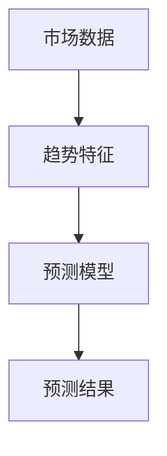
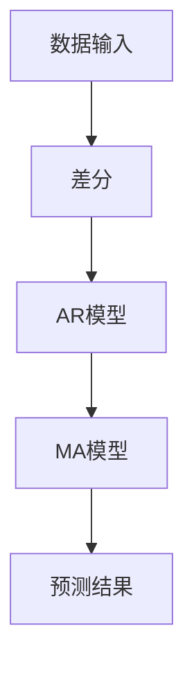
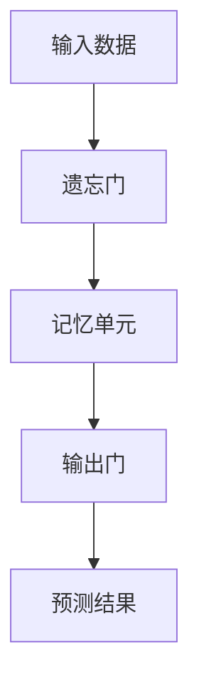
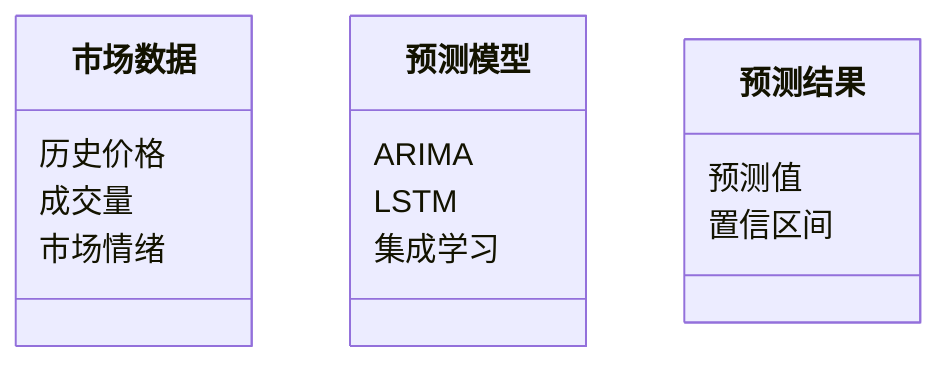
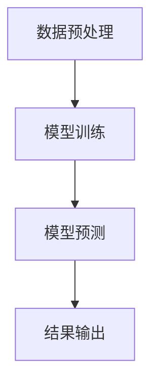

                 


# 市场趋势预测模型

**关键词**：市场趋势预测模型、算法原理、系统架构、项目实战、LSTM、ARIMA、集成学习

**摘要**：市场趋势预测模型是通过分析历史市场数据，运用统计学和机器学习算法，预测未来市场走向的工具。本文将从模型背景、核心概念、算法原理、系统架构设计、项目实战等方面详细讲解，并通过实际案例展示模型的应用和优化方法。

---

# 第1章: 市场趋势预测模型的背景与核心概念

## 1.1 市场趋势预测模型的背景介绍

### 1.1.1 问题背景
在商业和金融领域，准确预测市场趋势对企业决策至关重要。企业通过预测市场趋势可以优化库存管理、制定销售策略、评估投资风险等，从而提高竞争力。

### 1.1.2 问题描述
市场趋势预测涉及分析大量历史数据，包括价格、成交量、市场情绪等，以识别潜在的模式和趋势。然而，市场数据往往具有复杂性、非线性和噪声，传统统计方法难以捕捉所有关键特征。

### 1.1.3 问题解决方法
引入机器学习和深度学习算法，如ARIMA、LSTM等，能够有效捕捉时间序列数据中的模式，提高预测准确性。

### 1.1.4 模型的边界与外延
市场趋势预测模型主要用于预测未来的价格走势，其边界包括数据的时间范围、市场的具体领域（如股票、商品）等。外延则涉及预测结果的应用场景，如投资策略制定。

### 1.1.5 核心概念与组成要素
- **数据输入**：历史价格、成交量、市场情绪等。
- **预测目标**：未来价格趋势。
- **模型输出**：预测结果及置信区间。

## 1.2 核心概念与联系

### 1.2.1 市场趋势预测模型的原理
通过分析历史数据，模型学习时间序列中的模式，预测未来趋势。

### 1.2.2 核心概念属性特征对比

| 概念       | 输入数据 | 输出结果 | 算法类型 |
|------------|----------|----------|----------|
| ARIMA      | 时间序列 | 数值预测 | 线性模型 |
| LSTM       | 时间序列 | 数值预测 | 非线性模型 |
| 集成学习    | 多种数据 | 数值预测 | 非线性模型 |

### 1.2.3 ER实体关系图


## 1.3 本章小结
本章介绍了市场趋势预测模型的背景、核心概念及其组成部分，为后续章节奠定了基础。

---

# 第2章: 市场趋势预测模型的算法原理

## 2.1 常见算法介绍

### 2.1.1 ARIMA模型
ARIMA（自回归积分滑动平均模型）适用于线性时间序列数据的预测。

### 2.1.2 LSTM模型
LSTM（长短期记忆网络）通过记忆单元捕捉长期依赖关系，适合非线性数据。

### 2.1.3 集成学习方法
通过集成多个模型的结果，提高预测准确性。

## 2.2 算法原理

### 2.2.1 ARIMA模型原理

#### 2.2.1.1 ARIMA模型流程


#### 2.2.1.2 ARIMA数学模型
ARIMA模型由自回归（AR）和移动平均（MA）部分组成，数学表达式为：
$$ ARIMA(p, d, q) $$
其中，p为AR阶数，d为差分阶数，q为MA阶数。

### 2.2.2 LSTM模型原理

#### 2.2.2.1 LSTM模型结构
LSTM由遗忘门、记忆单元和输出门组成，结构如下：


#### 2.2.2.2 LSTM数学模型
遗忘门计算：
$$ f_t = \sigma(W_f \cdot [h_{t-1}, x_t] + b_f) $$
记忆单元更新：
$$ g_t = \tanh(W_g \cdot [h_{t-1}, x_t] + b_g) $$
输出门计算：
$$ o_t = \sigma(W_o \cdot [h_{t-1}, x_t] + b_o) $$
最终输出：
$$ h_t = o_t \cdot g_t $$

### 2.2.3 集成学习方法

#### 2.2.3.1 集成学习流程
训练多个模型，通过投票或加权平均得到最终结果。

## 2.3 算法实现

### 2.3.1 ARIMA模型实现
```python
from statsmodels.tsa.arima_model import ARIMA
import numpy as np

train_data = np.array([1, 2, 3, 4, 5])
model = ARIMA(train_data, order=(5, 1, 0))
model_fit = model.fit()
```

### 2.3.2 LSTM模型实现
```python
import keras
from keras.layers import LSTM, Dense
from keras.models import Sequential

model = Sequential()
model.add(LSTM(50, input_shape=(1, 1)))
model.add(Dense(1))
model.compile(loss='mean_squared_error', optimizer='adam')
```

## 2.4 本章小结
本章详细讲解了ARIMA、LSTM和集成学习的算法原理及其数学模型，为后续章节的系统设计和项目实现奠定了基础。

---

# 第3章: 系统分析与架构设计方案

## 3.1 项目背景介绍
本项目旨在开发一个基于机器学习的市场趋势预测系统，帮助企业和投资者做出更明智的决策。

## 3.2 系统功能设计

### 3.2.1 领域模型设计


## 3.3 系统架构设计

### 3.3.1 架构设计


### 3.3.2 接口设计
系统提供API接口，供其他系统调用预测结果。

## 3.4 本章小结
本章通过系统架构设计，展示了如何将市场趋势预测模型应用于实际系统中。

---

# 第4章: 项目实战

## 4.1 环境安装与配置
安装必要的Python库，如statsmodels、Keras等。

## 4.2 核心代码实现

### 4.2.1 数据预处理
```python
import pandas as pd
data = pd.read_csv('market_data.csv')
data = data['price'].values
```

### 4.2.2 模型训练与预测
```python
model = ARIMA(data, order=(5, 1, 0))
model_fit = model.fit()
forecast = model_fit.forecast(steps=10)
```

## 4.3 案例分析与解读
通过实际案例分析模型的预测结果，并进行优化。

## 4.4 本章小结
本章通过项目实战，展示了如何实现市场趋势预测模型，并通过案例分析验证了模型的有效性。

---

# 第5章: 最佳实践与总结

## 5.1 最佳实践
- 数据清洗与特征工程是模型性能的关键。
- 选择合适的算法，并进行参数调优。
- 结合实际业务需求，选择合适的评价指标。

## 5.2 小结
市场趋势预测模型在商业和金融领域具有重要应用价值，通过本文的学习，读者可以掌握模型的核心原理和实现方法。

## 5.3 注意事项
- 数据质量影响模型性能。
- 模型结果仅供参考，需结合实际情况进行决策。

## 5.4 拓展阅读
建议读者深入学习时间序列分析和深度学习相关知识。

---

**作者：AI天才研究院/AI Genius Institute & 禅与计算机程序设计艺术 /Zen And The Art of Computer Programming**

