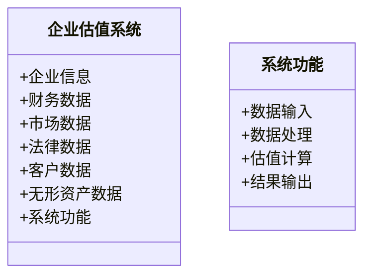
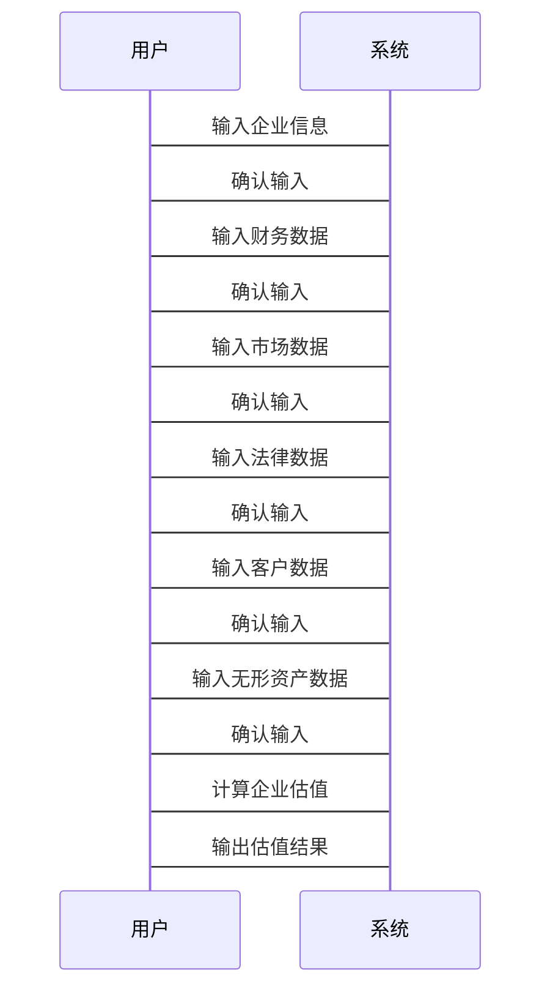

                 


# 并购中的企业估值特殊考虑因素

> 关键词：并购、企业估值、无形资产、客户关系、法律风险、DCF模型、系统架构

> 摘要：本文深入探讨了并购中的企业估值特殊考虑因素，从无形资产、客户关系、法律风险、行业与市场因素等多个维度进行分析。通过数学模型、系统架构设计、项目实战等方法，详细阐述了这些特殊因素对估值的影响，并提供了具体的案例分析和最佳实践建议。文章结合理论与实践，为并购中的企业估值提供了全面的分析和指导。

---

## 第1章: 并购与企业估值概述

### 1.1 并购的基本概念

#### 1.1.1 并购的定义与分类

- **并购（Mergers and Acquisitions, M&A）**是指一家企业与其他企业（被并购方）合并或收购其资产或股权的行为。

- 分类：
  - **横向并购**：同一行业内的企业并购。
  - **纵向并购**：产业链上下游的企业并购。
  - **混合并购**：无直接关联的企业并购。

#### 1.1.2 并购的基本流程

1. **战略规划**：明确并购目标和动机。
2. **目标筛选**：寻找符合战略需求的企业。
3. **尽职调查**：对目标企业进行财务、法律、运营等多方面的调查。
4. **估值与定价**：评估目标企业价值，确定并购价格。
5. **交易结构设计**：设计并购的具体方案，包括支付方式、股权结构等。
6. **整合与实施**：完成并购后的资源整合和业务整合。

#### 1.1.3 并购的驱动因素

- **市场扩张**：通过并购扩大市场份额。
- **成本协同**：利用规模效应降低成本。
- **技术获取**：获取关键技术或专利。
- **管理优化**：引入先进的管理经验和人才。

### 1.2 企业估值的基本概念

#### 1.2.1 企业估值的定义

- 企业估值是通过对企业的财务状况、市场地位、盈利能力等多方面进行分析，确定其市场价值的过程。

#### 1.2.2 企业估值的主要方法

- **市场法**：基于可比公司的交易价格或市值进行估值。
- **收益法**：基于企业的未来现金流折现进行估值。
- **资产法**：基于企业资产的账面价值进行估值。

#### 1.2.3 企业估值的核心要素

- **财务数据**：收入、利润、现金流等。
- **市场环境**：行业竞争状况、宏观经济环境。
- **管理团队**：管理能力、战略规划。
- **风险因素**：法律风险、市场风险、运营风险。

### 1.3 并购与企业估值的关系

#### 1.3.1 并购中的估值作用

- 估值是并购决策的核心依据，直接影响并购价格和交易结构。

#### 1.3.2 估值对并购决策的影响

- 高估可能导致并购成本过高，低估可能导致并购失败。

#### 1.3.3 估值风险与并购失败的关联

- 估值偏差可能导致并购后的整合困难和财务损失。

### 1.4 本章小结

本章介绍了并购的基本概念、流程和驱动因素，并详细阐述了企业估值的核心要素和方法。强调了估值在并购中的重要性，并指出了估值偏差可能带来的风险。

---

## 第2章: 无形资产的特殊考虑

### 2.1 无形资产的定义与分类

#### 2.1.1 无形资产的定义

- 无形资产是指企业拥有或控制的没有实物形态的资产，包括专利、商标、版权、客户关系等。

#### 2.1.2 无形资产的主要分类

- **知识产权**：专利、商标、版权。
- **客户关系**：客户数据库、客户合同。
- **品牌价值**：企业品牌知名度和美誉度。
- **商誉**：企业整体价值减去可识别净资产公允价值后的部分。

### 2.2 无形资产在并购中的估值挑战

#### 2.2.1 无形资产的识别与确认

- 需要区分可识别无形资产和不可识别无形资产（如商誉）。
- 需要评估无形资产的经济寿命和法律保护期限。

#### 2.2.2 无形资产的量化与评估

- 需要结合市场数据、收益法和成本法进行评估。
- 需要考虑无形资产的协同效应和替代效应。

### 2.3 无形资产对并购估值的影响

#### 2.3.1 无形资产对整体估值的提升作用

- 无形资产可以显著提升企业的市场价值，尤其是在高技术行业。

#### 2.3.2 无形资产贬值对估值的影响

- 无形资产贬值可能导致企业价值被高估，增加并购风险。

### 2.4 案例分析：无形资产估值对并购的影响

#### 2.4.1 案例背景

- 某科技公司并购一家拥有核心专利的技术企业。

#### 2.4.2 估值过程

- 使用收益法评估专利的未来现金流。
- 结合市场法评估被并购企业的整体价值。

#### 2.4.3 并购结果与反思

- 由于专利估值过高，导致并购后整合困难，最终产生财务损失。

### 2.5 本章小结

本章分析了无形资产在并购中的估值挑战，强调了无形资产对整体估值的影响，并通过案例分析指出了估值偏差可能带来的风险。

---

## 第3章: 客户关系的特殊考虑

### 3.1 客户关系的定义与分类

#### 3.1.1 客户关系的定义

- 客户关系是指企业在与客户互动过程中建立的长期合作关系。

#### 3.1.2 客户关系的主要分类

- **直接客户关系**：与最终客户的关系。
- **间接客户关系**：与经销商、代理商的关系。
- **长期客户关系**：稳定合作多年的客户。

### 3.2 客户关系在并购中的估值挑战

#### 3.2.1 客户关系的识别与确认

- 需要区分客户关系的可识别性和经济价值。
- 需要评估客户关系的持续性和稳定性。

#### 3.2.2 客户关系的量化与评估

- 需要结合客户生命周期模型和客户价值模型进行评估。
- 需要考虑客户流失率和客户获取成本。

### 3.3 客户关系对并购估值的影响

#### 3.3.1 客户关系对整体估值的提升作用

- 稳定的客户关系可以显著提升企业的市场价值，尤其是在服务行业。

#### 3.3.2 客户关系贬值对估值的影响

- 客户关系贬值可能导致企业价值被高估，增加并购风险。

### 3.4 案例分析：客户关系估值对并购的影响

#### 3.4.1 案例背景

- 某服务公司并购一家拥有稳定客户的咨询公司。

#### 3.4.2 估值过程

- 使用客户价值模型评估客户的未来价值。
- 结合市场法评估被并购企业的整体价值。

#### 3.4.3 并购结果与反思

- 由于客户关系估值过高，导致并购后整合困难，最终产生财务损失。

### 3.5 本章小结

本章分析了客户关系在并购中的估值挑战，强调了客户关系对整体估值的影响，并通过案例分析指出了估值偏差可能带来的风险。

---

## 第4章: 法律与合规风险的特殊考虑

### 4.1 法律与合规风险的定义与分类

#### 4.1.1 法律与合规风险的定义

- 法律与合规风险是指企业在经营过程中可能面临的法律诉讼、合规处罚等风险。

#### 4.1.2 法律与合规风险的主要分类

- **合同风险**：因合同履行问题产生的风险。
- **知识产权风险**：因专利、商标等知识产权纠纷产生的风险。
- **反垄断风险**：因市场垄断行为产生的风险。

### 4.2 法律与合规风险在并购中的估值挑战

#### 4.2.1 法律与合规风险的识别与确认

- 需要全面审查目标企业的法律纠纷和合规问题。
- 需要评估法律风险的潜在影响和解决成本。

#### 4.2.2 法律与合规风险的量化与评估

- 需要结合法律风险的潜在损失和解决成本进行评估。
- 需要考虑法律风险对并购后整合的影响。

### 4.3 法律与合规风险对并购估值的影响

#### 4.3.1 法律与合规风险对整体估值的影响

- 重大法律风险可能导致企业价值被低估，影响并购价格。

#### 4.3.2 法律与合规风险对并购后整合的影响

- 未解决的法律问题可能导致并购后整合困难，影响企业价值。

### 4.4 案例分析：法律与合规风险估值对并购的影响

#### 4.4.1 案例背景

- 某企业并购一家因知识产权纠纷陷入诉讼的企业。

#### 4.4.2 估值过程

- 全面审查目标企业的法律纠纷和合规问题。
- 评估法律风险的潜在影响和解决成本。

#### 4.4.3 并购结果与反思

- 由于未充分评估法律风险，导致并购后诉讼成本增加，影响企业价值。

### 4.5 本章小结

本章分析了法律与合规风险在并购中的估值挑战，强调了法律风险对整体估值的影响，并通过案例分析指出了估值偏差可能带来的风险。

---

## 第5章: 行业与市场因素的特殊考虑

### 5.1 行业与市场因素的定义

- 行业与市场因素是指企业在所处行业和市场环境中面临的各种外部因素，包括行业竞争、市场周期、政策法规等。

### 5.2 行业与市场因素在并购中的估值挑战

#### 5.2.1 行业竞争状况的分析

- 需要评估目标企业的行业竞争地位和市场前景。

#### 5.2.2 市场周期性的影响

- 需要考虑市场周期对目标企业价值的影响。

#### 5.2.3 政策法规的影响

- 需要评估政策法规对目标企业未来经营的影响。

### 5.3 行业与市场因素对并购估值的影响

#### 5.3.1 行业竞争对整体估值的影响

- 行业竞争激烈可能导致企业价值被低估。

#### 5.3.2 市场周期对估值的影响

- 市场周期波动可能导致企业价值评估的不确定性。

#### 5.3.3 政策法规对估值的影响

- 严苛的政策可能导致企业价值被低估，增加并购风险。

### 5.4 案例分析：行业与市场因素估值对并购的影响

#### 5.4.1 案例背景

- 某企业并购一家在行业竞争中处于劣势的企业。

#### 5.4.2 估值过程

- 分析行业竞争状况和市场周期对目标企业价值的影响。
- 考虑政策法规对目标企业未来经营的影响。

#### 5.4.3 并购结果与反思

- 由于行业竞争激烈，导致并购后整合困难，影响企业价值。

### 5.5 本章小结

本章分析了行业与市场因素在并购中的估值挑战，强调了行业竞争、市场周期和政策法规对企业价值的影响，并通过案例分析指出了估值偏差可能带来的风险。

---

## 第6章: 数学模型与算法原理

### 6.1 DCF模型的原理与应用

#### 6.1.1 DCF模型的定义

- DCF（Discounted Cash Flow）模型是一种基于未来现金流折现的估值方法。

#### 6.1.2 DCF模型的公式

$$
\text{企业价值} = \sum_{t=1}^{n} \frac{\text{自由现金流}_t}{(1 + r)^t} + \frac{\text{终值}}{(1 + r)^n}
$$

其中，$r$为折现率，$n$为预测期数，$\text{自由现金流}_t$为第$t$年的自由现金流，$\text{终值}$为第$n$年后的终值。

#### 6.1.3 DCF模型的步骤

1. **预测未来现金流**：根据企业的历史数据和行业趋势，预测未来几年的现金流。
2. **选择合适的折现率**：通常使用加权平均资本成本（WACC）作为折现率。
3. **计算终值**：假设在预测期结束后，现金流以稳定的增长率继续增长。
4. **折现现金流**：将未来现金流和终值按折现率折现，得到现值。
5. **计算企业价值**：将现值加总，得到企业的整体价值。

### 6.2 算法原理的数学模型

#### 6.2.1 算法原理

- DCF模型通过将未来现金流折现，计算出企业价值。其核心在于准确预测未来现金流和选择合适的折现率。

#### 6.2.2 算法实现

```python
def dcf_model(fcf_t, wacc, n, tv):
    # 计算现值
    present_value = 0
    for t in range(1, n+1):
        present_value += fcf_t[t] / (1 + wacc)**t
    # 计算终值
    terminal_value = tv / (1 + wacc)**n
    # 计算企业价值
    enterprise_value = present_value + terminal_value
    return enterprise_value
```

其中，`fcf_t`为未来现金流，`wacc`为加权平均资本成本，`n`为预测期数，`tv`为终值。

### 6.3 DCF模型的优缺点

#### 6.3.1 优点

- 能够准确反映企业未来现金流的现值。
- 考虑了时间价值和风险因素。

#### 6.3.2 缺点

- 需要依赖未来现金流的预测，存在较高的主观性和不确定性。
- 对折现率的选择敏感，可能影响估值结果。

### 6.4 本章小结

本章详细介绍了DCF模型的原理与应用，并通过数学公式和代码示例，展示了如何利用DCF模型进行企业估值。同时，分析了该模型的优缺点，为并购中的企业估值提供了理论支持。

---

## 第7章: 系统分析与架构设计

### 7.1 系统功能设计

#### 7.1.1 领域模型



### 7.2 系统架构设计


### 7.3 系统接口设计

- **输入接口**：接收企业信息、财务数据、市场数据、法律数据、客户数据和无形资产数据。
- **输出接口**：输出企业估值结果、估值报告和建议。

### 7.4 系统交互设计



### 7.5 本章小结

本章通过系统功能设计、架构设计和交互设计，展示了如何利用系统化的方法进行企业估值。结合领域模型和系统架构图，明确了系统的功能模块和数据流，为实际应用提供了指导。

---

## 第8章: 项目实战

### 8.1 环境安装

- **工具安装**：安装Python、Jupyter Notebook、Mermaid等工具。
- **数据准备**：收集企业信息、财务数据、市场数据、法律数据、客户数据和无形资产数据。

### 8.2 系统核心实现源代码

```python
class EnterpriseValuationSystem:
    def __init__(self):
        self.enterprise_info = {}
        self.financial_data = {}
        self.market_data = {}
        self.legal_data = {}
        self.customer_data = {}
        self.intangible_assets = {}

    def input_data(self, data_type, data):
        if data_type == 'enterprise_info':
            self.enterprise_info = data
        elif data_type == 'financial_data':
            self.financial_data = data
        elif data_type == 'market_data':
            self.market_data = data
        elif data_type == 'legal_data':
            self.legal_data = data
        elif data_type == 'customer_data':
            self.customer_data = data
        elif data_type == 'intangible_assets':
            self.intangible_assets = data

    def calculate_valuation(self):
        # 简单实现DCF模型
        wacc = 0.1  # 假设加权平均资本成本为10%
        n = 5  # 预测期数
        fcf_t = [100, 120, 130, 140, 150]  # 每年的自由现金流
        tv = 200  # 终值
        present_value = sum([fcf_t[t] / (1 + wacc)**t for t in range(len(fcf_t))])
        terminal_value = tv / (1 + wacc)**n
        enterprise_value = present_value + terminal_value
        return enterprise_value

    def output_results(self, ev):
        print(f"企业价值：{ev}")
```

### 8.3 代码应用解读与分析

- **代码功能**：该代码实现了企业估值系统的核心功能，包括数据输入、估值计算和结果输出。
- **代码实现细节**：使用了简单的DCF模型进行估值计算，实际应用中需要根据具体情况调整参数和模型。

### 8.4 案例分析

#### 8.4.1 案例背景

- 某企业并购一家科技公司，需要对其估值进行评估。

#### 8.4.2 数据输入

```python
# 输入企业信息
enterprise_info = {
    "企业名称": "科技公司",
    "行业": "科技",
    "成立时间": 2010
}
system = EnterpriseValuationSystem()
system.input_data('enterprise_info', enterprise_info)

# 输入财务数据
financial_data = {
    "收入": 500,
    "利润": 80,
    "现金流": 100
}
system.input_data('financial_data', financial_data)

# 输入市场数据
market_data = {
    "行业竞争状况": "中等",
    "市场周期": "上升期",
    "政策环境": "稳定"
}
system.input_data('market_data', market_data)

# 输入法律数据
legal_data = {
    "法律纠纷": "无",
    "知识产权": "有",
    "合规风险": "低"
}
system.input_data('legal_data', legal_data)

# 输入客户数据
customer_data = {
    "客户数量": 100,
    "客户流失率": 5,
    "客户价值": 20
}
system.input_data('customer_data', customer_data)

# 输入无形资产数据
intangible_assets = {
    "专利数量": 5,
    "商标价值": 30,
    "品牌价值": 50
}
system.input_data('intangible_assets', intangible_assets)
```

#### 8.4.3 估值计算与结果输出

```python
# 计算企业价值
ev = system.calculate_valuation()
print(f"计算得到的企业价值为：{ev}")
```

### 8.5 本章小结

本章通过实际案例，展示了如何利用系统进行企业估值。通过代码实现和案例分析，帮助读者理解如何将理论应用于实际。

---

## 第9章: 最佳实践与小结

### 9.1 最佳实践

- **全面尽职调查**：在并购前进行全面的财务、法律和运营调查。
- **合理选择估值方法**：根据企业特点选择合适的估值方法。
- **考虑特殊因素**：充分考虑无形资产、客户关系、法律风险等因素。
- **动态调整估值**：根据市场变化和企业经营状况动态调整估值。

### 9.2 小结

本文从并购与企业估值的基本概念出发，深入分析了无形资产、客户关系、法律风险、行业与市场因素等特殊考虑因素，并通过数学模型、系统架构设计和项目实战，展示了如何在实际中应用这些理论。最后，本文提出了并购中的最佳实践建议，为读者提供了全面的指导。

---

## 作者：AI天才研究院/AI Genius Institute & 禅与计算机程序设计艺术/Zen And The Art of Computer Programming

