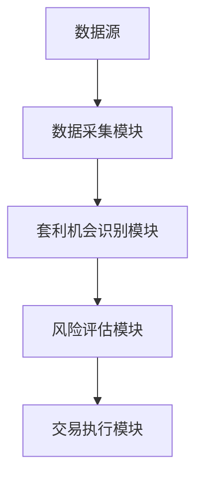

                 

# 并购套利策略：从企业重组中获取收益

> 关键词：并购套利、企业重组、财务收益、投资策略、风险控制  
> 摘要：并购套利是一种通过企业重组获取收益的投资策略。本文将详细分析并购套利的背景、核心概念、数学模型、系统架构设计、项目实战以及最佳实践。通过理论与实践相结合，帮助读者理解如何在企业重组中识别套利机会，并通过合理的策略实现收益最大化。

---

## 正文

### 第一部分：背景介绍

#### 第1章：走进并购套利的世界

##### 1.1 并购套利的基本概念
###### 1.1.1 并购套利的定义
并购套利是指通过并购活动中的价格差异或重组机会，利用市场信息不对称或短期价格波动，从中获取超额收益的投资策略。简单来说，并购套利是通过买入低估资产并将其重组为高价值资产，从而在出售时获得收益。

###### 1.1.2 并购套利的起源与发展
并购套利起源于20世纪中期，随着企业并购活动的频繁化，套利者开始关注并购过程中的价格差异。随着金融市场的成熟和信息技术的发展，套利者能够更高效地识别和利用并购中的机会。

###### 1.1.3 并购套利的现状与趋势
目前，并购套利在金融市场中占据重要地位，尤其是在企业重组频繁的行业（如科技、金融、能源等）。随着全球化的推进，跨国并购套利也成为趋势，套利者需要考虑更多复杂的因素，如汇率、税收政策和法律差异。

##### 1.2 并购套利的核心概念
###### 1.2.1 什么是套利机会
套利机会是指在市场中存在价格差异或价值低估的情况，套利者通过买入低估资产并将其转化为高估资产，从而在出售时获得收益。

###### 1.2.2 并购套利的驱动因素
1. 价格差异：并购过程中，目标公司股价可能低于其内在价值。
2. 市场信息不对称：部分投资者能够获取非公开信息，从而提前布局。
3. 资本运作：企业通过并购实现资产增值或优化资本结构。

###### 1.2.3 套利的边界与外延
套利的边界在于市场效率和信息获取能力。如果市场高度有效，套利机会将减少。套利的外延包括杠杆套利、夹层套利等高级策略。

#### 第2章：并购套利的背景分析

##### 2.1 并购市场的现状与特点
###### 2.1.1 全球并购市场的现状
近年来，全球并购市场活跃，尤其是科技和医疗行业。2022年，全球并购交易额超过5万亿美元，创历史新高。

###### 2.1.2 并购市场的特点与趋势
1. 并购活动集中于高增长行业。
2. 跨国并购增多，涉及更多复杂因素。
3. 科技驱动的并购成为主流。

##### 2.2 并购套利的法规与风险
###### 2.2.1 并购套利的法律框架
套利者需遵守反垄断法、证券法等相关法规，避免操纵市场和内幕交易。

###### 2.2.2 并购套利的主要风险
1. 市场风险：并购失败或股价波动可能导致损失。
2. 法律风险：合规性问题可能导致罚款或诉讼。
3. 操作风险：信息获取和交易执行的难度。

---

### 第二部分：核心概念与联系

#### 第3章：并购套利的核心要素

##### 3.1 并购套利的三要素
###### 3.1.1 套利机会的来源
1. 协议收购：目标公司股价低于收购价。
2. 股权收购：目标公司股价低于其内在价值。
3. 资产重组：目标公司资产重组后价值提升。

###### 3.1.2 套利的可行性分析
套利的可行性取决于市场流动性、信息获取能力以及套利者的资金实力。

###### 3.1.3 套利的收益与风险
套利收益=并购后价值-并购前成本  
套利风险=市场波动+交易成本+法律风险

##### 3.2 并购套利的类型对比
###### 3.2.1 协议收购与杠杆收购的区别
- 协议收购：由买方直接与卖方协商，价格较低。
- 杠杆收购：通过举债融资，风险较高，收益也高。

###### 3.2.2 友好并购与敌意并购的对比
- 友好并购：双方协商一致，风险较低。
- 敌意并购：买方强行收购，风险较高。

---

### 第三部分：并购套利的数学模型与算法

#### 第5章：并购套利的数学模型

##### 5.1 并购套利的基本公式
###### 5.1.1 并购套利的收益计算公式
$$\text{套利收益} = \text{并购后价值} - \text{并购前成本}$$

###### 5.1.2 并购套利的风险评估公式
$$\text{风险系数} = \frac{\text{历史波动率}}{\text{市场平均波动率}}$$

##### 5.2 并购套利的套利指数
套利指数用于衡量并购交易的吸引力：
$$\text{套利指数} = \frac{（目标公司股价 - 收购价格）}{收购价格}$$

---

### 第四部分：系统分析与架构设计

#### 第6章：并购套利的系统架构

##### 6.1 并购套利的系统功能设计
1. 数据采集模块：收集并购相关信息。
2. 套利机会识别模块：通过算法识别套利机会。
3. 风险评估模块：评估套利风险。
4. 交易执行模块：执行并购交易。

##### 6.2 并购套利的系统架构图

---

### 第五部分：项目实战

#### 第7章：并购套利的项目实战

##### 7.1 并购套利的实际案例分析
以某公司为例，分析其并购套利的机会和策略。

##### 7.2 套利方案的设计与实现
1. 确定目标公司：分析其股价和内在价值。
2. 设计套利方案：计算套利收益和风险。
3. 执行交易：买入低估资产，完成并购。

---

### 第六部分：最佳实践

#### 第8章：并购套利的最佳实践

##### 8.1 套利的注意事项
1. 严格遵守法律法规。
2. 重视风险控制。
3. 确保信息来源可靠。

##### 8.2 套利的退出机制
套利成功后，可通过公开市场出售或协议转让实现退出。

##### 8.3 套利的伦理问题
套利者应避免操纵市场和内幕交易，维护市场公平。

---

### 结语

并购套利是一种高风险、高回报的投资策略，需要套利者具备丰富的市场经验和专业的知识。通过理论与实践相结合，套利者可以更好地识别机会、控制风险，并在企业重组中实现收益最大化。

---

### 作者：AI天才研究院/AI Genius Institute & 禅与计算机程序设计艺术 /Zen And The Art of Computer Programming

---

**注**：由于篇幅限制，上述内容为文章的框架和部分内容展示，实际文章将更加详细，并包含更多案例、图表和代码示例。

