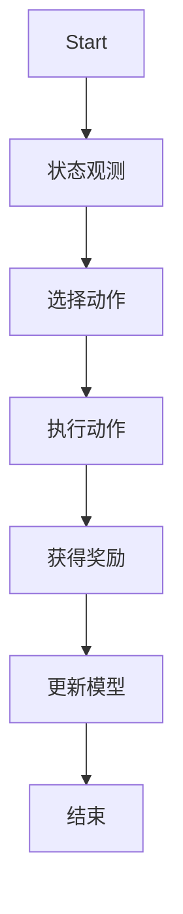
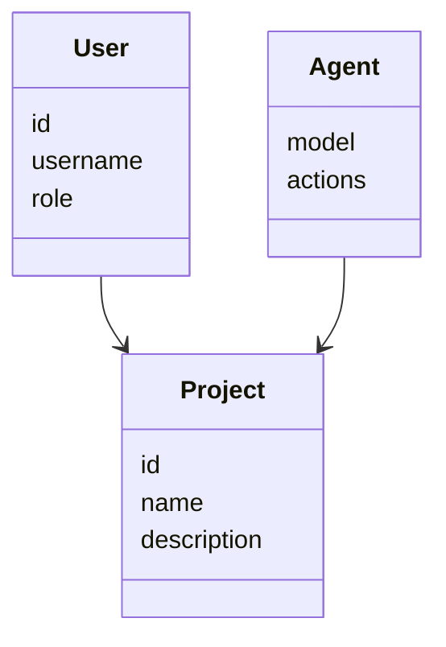
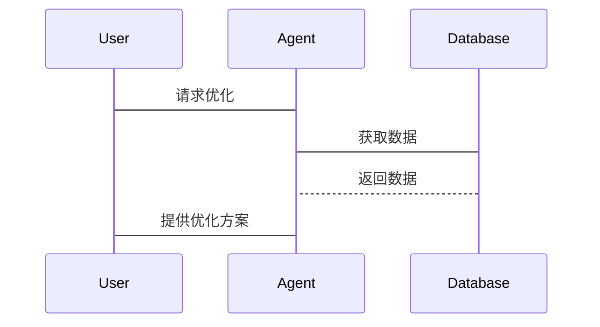

                 


```markdown
# 建筑设计中的AI Agent优化工具

> **关键词**：AI Agent, 建筑设计优化, 强化学习算法, 系统架构设计, 项目实战分析

> **摘要**：本文探讨了AI Agent在建筑设计优化中的应用，详细分析了其核心概念、算法原理、系统架构，并通过实际项目案例展示了优化工具的优势和实现过程。

---

## 第1章：背景介绍

### 1.1 问题背景
传统建筑设计流程复杂，涉及多领域协作，优化效率低下，资源浪费严重。AI Agent通过智能化优化，有效提升设计效率和质量。

### 1.2 问题描述
设计过程中常面临空间布局不合理、能耗高等问题。AI Agent通过自动化优化，解决这些痛点。

### 1.3 问题解决
AI Agent作为辅助工具，通过强化学习优化建筑设计，提升效率和可持续性。

---

## 第2章：AI Agent的核心概念

### 2.1 定义与特点
AI Agent通过强化学习优化建筑设计，具有智能化和自适应性特点。

### 2.2 应用场景与协作模式
AI Agent在方案设计、施工图优化等阶段发挥作用，与建筑师协同工作。

### 2.3 概念对比与ER图
通过表格对比AI Agent与传统工具，并绘制Mermaid ER图展示实体关系。

```mermaid
erd
    c_user
    c_user -[1..n]-> c_project
    c_project -[1]-> c_agent
    c_agent -[1..n]-> c_optimization_result
```

---

## 第3章：算法原理讲解

### 3.1 算法选择与优化目标
选择强化学习算法，建立数学模型，定义状态、动作和奖励函数。

### 3.2 强化学习算法实现
使用DQN算法，详细解释网络结构和训练过程。

### 3.3 算法流程图
展示算法流程，清晰展示各个步骤。



---

## 第4章：系统架构设计

### 4.1 问题场景与项目介绍
以绿色建筑项目为例，展示优化工具的应用场景。

### 4.2 系统功能设计
通过Mermaid类图展示系统模块及其交互。



### 4.3 系统架构设计
使用Mermaid架构图展示整体架构。


### 4.4 接口与交互设计
通过Mermaid序列图展示系统接口和用户交互流程。



---

## 第5章：项目实战分析

### 5.1 项目环境与工具安装
列出所需工具如Python、TensorFlow的安装步骤。

### 5.2 核心代码实现
提供AI Agent优化工具的关键代码，包括数据预处理、模型训练和结果分析。

### 5.3 实际案例分析
以绿色建筑项目为例，展示优化结果和对比分析。

### 5.4 项目小结
总结项目成果，讨论AI Agent的优势和局限性。

---

## 第6章：总结与展望

### 6.1 核心观点总结
回顾AI Agent在建筑设计优化中的关键作用。

### 6.2 拓展与未来展望
探讨AI Agent的未来发展方向，如结合物联网技术。

---

**作者**：AI天才研究院
```

