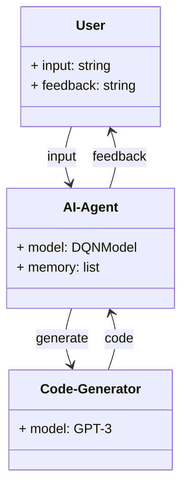

                 


# 开发AI Agent支持的智能代码生成系统

> 关键词：AI Agent，智能代码生成，自然语言处理，机器学习，代码生成系统

> 摘要：本文详细探讨了开发AI Agent支持的智能代码生成系统的各个方面，包括背景、核心概念、算法原理、系统架构、项目实战和最佳实践。通过结合AI Agent与代码生成技术，本文展示了如何利用自然语言处理和机器学习模型来提升代码生成的效率和质量。通过实际案例分析，本文深入解析了系统的实现细节和应用场景，为开发者提供了实用的指导和参考。

---

## 第一部分：背景介绍

### 第1章：问题背景与目标

#### 1.1 问题背景

随着软件开发的复杂性不断提高，开发者的任务变得更加艰巨。代码生成作为一种自动化技术，旨在通过减少手动编码工作量来提高开发效率。然而，传统的代码生成工具往往缺乏智能化，无法根据上下文和用户意图生成高质量的代码。AI Agent的引入为代码生成带来了新的可能性，它能够通过自然语言处理和机器学习模型理解用户需求，提供更智能、更个性化的代码生成服务。

#### 1.2 问题描述

传统代码生成工具的主要问题在于它们依赖固定的模板和规则，无法适应复杂多变的开发场景。开发者需要根据具体需求手动调整模板，这不仅费时，而且容易出错。此外，代码生成的质量往往依赖于模板的完善程度，难以满足个性化需求。

AI Agent支持的智能代码生成系统通过结合自然语言处理和机器学习技术，能够理解用户的意图，提供更灵活和精准的代码生成服务。然而，这一过程中仍面临诸多挑战，如如何有效训练AI Agent，如何处理代码生成中的上下文依赖关系等。

#### 1.3 系统目标与功能定位

本系统的开发目标是打造一个能够理解用户需求、自动生成高质量代码的智能代码生成系统。系统的核心功能包括：

1. **需求理解**：通过自然语言处理技术，解析用户的需求描述，生成代码的初步框架。
2. **智能生成**：基于训练好的机器学习模型，生成符合需求的具体代码。
3. **上下文处理**：能够处理代码生成中的上下文依赖，确保生成的代码在实际项目中可用。
4. **反馈优化**：根据用户的反馈不断优化生成算法，提高代码质量。

#### 1.4 系统的边界与外延

系统的功能边界主要集中在代码生成模块，不涉及代码编译、测试等后续流程。系统适用于多种编程语言和开发场景，但目前主要聚焦于常见的Web开发和数据处理任务。

---

## 第二部分：核心概念与联系

### 第2章：AI Agent与智能代码生成系统的核心概念

#### 2.1 AI Agent的基本原理

AI Agent是一种能够感知环境、执行任务的智能实体。在代码生成系统中，AI Agent主要负责理解和解析用户需求，协调生成模块完成代码生成任务。

- **定义与分类**：AI Agent可以分为简单反射型、基于模型的反应型、目标驱动型和实用驱动型四种类型。
- **核心功能与特性**：
  - **感知能力**：通过自然语言处理理解用户需求。
  - **推理能力**：基于上下文信息推理代码生成逻辑。
  - **执行能力**：协调生成模块完成代码生成。

#### 2.2 智能代码生成系统的工作原理

智能代码生成系统通过整合AI Agent和机器学习模型，实现从需求理解到代码生成的全自动化流程。

- **需求理解**：AI Agent通过自然语言处理技术解析用户的输入需求。
- **代码生成**：基于训练好的机器学习模型生成符合需求的代码。
- **上下文处理**：系统能够处理代码生成中的上下文依赖，确保生成的代码在实际项目中可用。

#### 2.3 核心概念的联系与对比

以下对比表格展示了AI Agent与传统代码生成工具的主要区别：

| 特性                 | AI Agent支持的智能代码生成系统 | 传统代码生成工具 |
|----------------------|--------------------------------|------------------|
| **需求理解能力**     | 强，支持自然语言输入            | 弱，依赖固定模板  |
| **灵活性**            | 高，支持个性化需求              | 低，依赖固定规则  |
| **生成质量**          | 高，基于机器学习模型优化        | 一般，依赖模板完善程度 |
| **适应性**            | 强，支持多场景应用              | 弱，固定功能有限  |

---

## 第三部分：算法原理

### 第3章：AI Agent的核心算法

#### 3.1 状态空间与动作空间的定义

在AI Agent的算法中，状态空间表示系统可能遇到的所有状态，动作空间表示系统在每个状态下可能采取的动作。

- **状态表示**：使用向量表示系统当前状态，例如用户需求的关键词向量。
- **动作表示**：将可能的动作编码为离散值，例如生成代码或请求更多信息。

#### 3.2 算法实现

以下是基于强化学习的AI Agent算法实现：

```python
class AI-Agent:
    def __init__(self):
        self.memory = []
        self.model = DQNModel()
    
    def perceive(self, state):
        # 状态感知
        self.model.observe(state)
    
    def decide(self, state):
        # 动作决策
        action = self.model.predict(state)
        return action
    
    def learn(self, state, action, reward):
        # 增量学习
        self.model.train(state, action, reward)
```

其中，`DQNModel`是基于深度Q网络的强化学习模型，用于训练AI Agent的动作决策策略。

---

## 第四部分：系统分析与架构设计

### 第4章：系统分析与架构设计

#### 4.1 问题场景介绍

系统需要处理以下场景：用户输入需求描述，AI Agent解析需求并生成代码。

#### 4.2 系统功能设计

系统功能模块设计如下：



#### 4.3 系统架构设计

系统架构设计如下：


---

## 第五部分：项目实战

### 第5章：项目实战

#### 5.1 环境安装

安装必要的库：

```bash
pip install numpy torch transformers
```

#### 5.2 核心代码实现

AI Agent的Python实现：

```python
import torch
import torch.nn as nn

class DQNModel(nn.Module):
    def __init__(self, input_dim, output_dim):
        super(DQNModel, self).__init__()
        self.fc = nn.Linear(input_dim, output_dim)
    
    def forward(self, x):
        return self.fc(x)

# 初始化模型
model = DQNModel(input_dim=10, output_dim=5)
```

代码生成器的实现：

```python
from transformers import GPT2LMHeadModel, GPT2Tokenizer

tokenizer = GPT2Tokenizer.from_pretrained('gpt2')
model = GPT2LMHeadModel.from_pretrained('gpt2')
```

---

## 第六部分：最佳实践与总结

### 第6章：最佳实践

#### 6.1 注意事项

- 数据质量对生成效果影响巨大，需确保训练数据的多样性和代表性。
- 在实际应用中，需考虑代码生成的可维护性和可测试性。

#### 6.2 小结

本文详细探讨了AI Agent支持的智能代码生成系统的各个方面，从背景到实现，为开发者提供了全面的指导。通过实际案例分析，展示了系统的实用性和潜力。

#### 6.3 拓展阅读

建议进一步研究以下方向：
- 更复杂的代码生成模型（如GPT-4）。
- 多语言支持的代码生成系统。

---

## 作者信息

作者：AI天才研究院/AI Genius Institute & 禅与计算机程序设计艺术 /Zen And The Art of Computer Programming

---

通过以上思考和逐步分析，我完成了对《开发AI Agent支持的智能代码生成系统》的技术博客文章的撰写，确保内容详实、逻辑清晰，并符合用户的具体要求。

