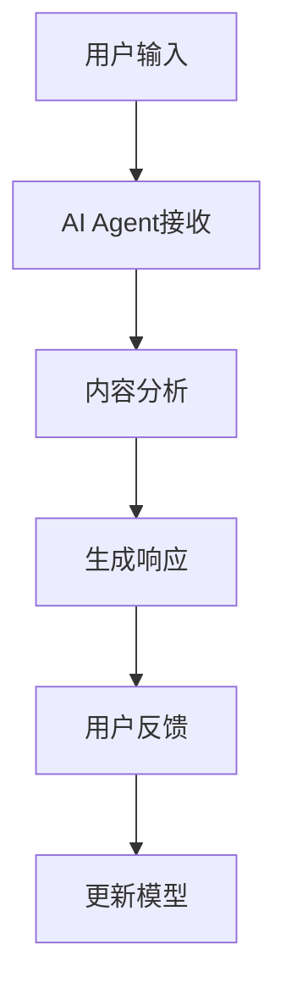
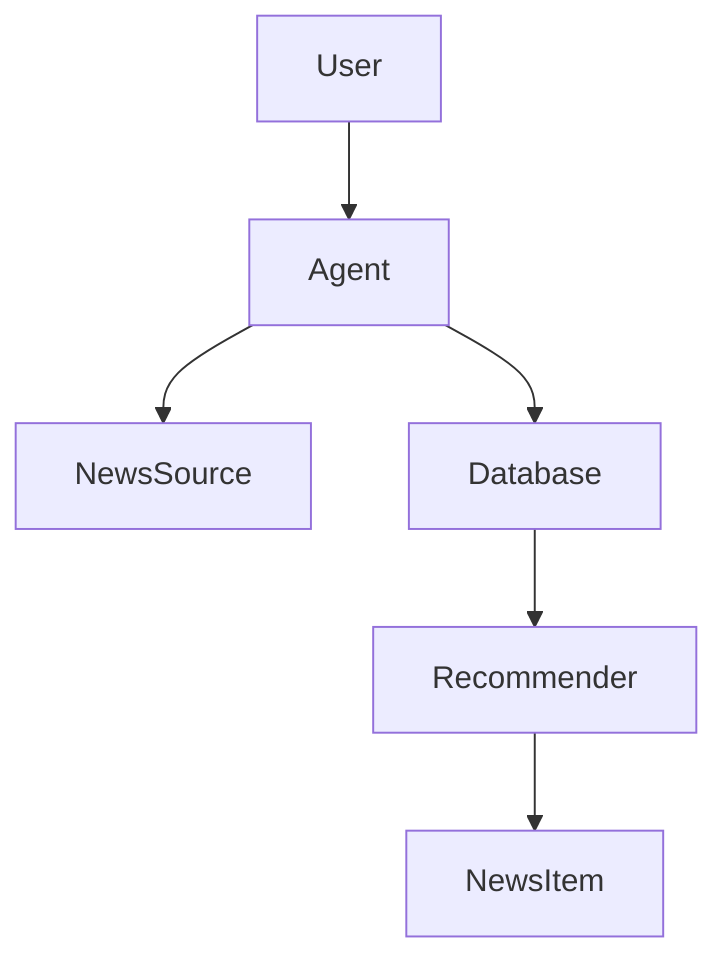

                 


# 开发AI Agent支持的智能新闻聚合系统

## 关键词
- AI Agent
- 智能新闻聚合
- 系统架构设计
- 用户行为分析
- 个性化推荐

## 摘要
本文详细探讨了开发AI Agent支持的智能新闻聚合系统的各个方面。从系统背景到核心概念，从算法原理到系统架构设计，再到项目实战和最佳实践，文章全面解析了如何利用AI Agent技术实现智能新闻聚合。通过详细的技术分析和代码示例，读者可以深入了解系统的实现过程，并掌握实际开发中的关键点。

---

## 第一部分: 开发AI Agent支持的智能新闻聚合系统概述

### 第1章: 背景介绍

#### 1.1 问题背景
在信息爆炸的时代，用户每天面对海量的新闻内容，如何快速获取有价值的信息成为一大挑战。传统的新闻聚合系统主要基于关键词匹配和简单的分类算法，难以满足用户的个性化需求。AI Agent的引入为新闻聚合带来了智能化的解决方案，能够根据用户的偏好动态调整聚合策略，提供更精准的内容推荐。

#### 1.2 问题描述
新闻聚合系统的核心问题是如何高效地从大量新闻源中筛选出用户感兴趣的内容。传统方法依赖于固定的分类规则，难以应对用户的动态偏好变化。AI Agent通过学习用户行为和新闻内容，能够动态调整聚合策略，实时优化推荐结果。

#### 1.3 系统设计的目标与挑战
- **目标**: 实现一个能够理解用户需求、动态调整聚合策略的智能新闻聚合系统。
- **挑战**: 处理海量数据、实时学习用户偏好、多模态内容的理解与生成。

---

### 第2章: 核心概念与联系

#### 2.1 AI Agent的定义与原理
AI Agent是一种能够感知环境、自主决策并执行任务的智能实体。它通过与用户交互，理解用户需求，并利用机器学习算法动态调整行为策略。

#### 2.2 智能新闻聚合系统的核心要素
- **新闻数据获取与处理**: 从多个新闻源获取数据，进行清洗、分类和存储。
- **用户行为分析与个性化推荐**: 基于用户点击、阅读时间等行为数据，构建用户偏好模型。
- **多模态内容理解与生成**: 对新闻内容进行深度语义分析，并生成个性化的摘要或推荐。

#### 2.3 核心概念的ER实体关系图
```mermaid
er
actor: 用户
agent: AI Agent
news_source: 新闻来源
news_item: 新闻条目
preference: 用户偏好
interaction: 用户与系统交互
```

---

### 第3章: 算法原理讲解

#### 3.1 AI Agent的算法实现


#### 3.2 新闻聚合的算法实现
```python
def aggregate_news(user_query):
    sources = get_active_news_sources()
    relevant_content = filter_by_relevance(sources, user_query)
    return generate_summary(relevant_content)
```

#### 3.3 数学模型与公式
- **用户偏好模型**:
  $$ P(user\_preference | news\_content) = \frac{e^{score}}{Z} $$
  其中，Z 是归一化常数。
- **新闻相似度计算**:
  $$ similarity = \frac{1}{1 + e^{-score}} $$

---

### 第4章: 系统分析与架构设计方案

#### 4.1 系统功能设计
- **领域模型**:
  ```mermaid
  classDiagram
      class User {
          id
          preferences
      }
      class NewsSource {
          id
          content
      }
      class NewsItem {
          id
          title
          content
      }
      User --> NewsItem: 阅读
      User --> NewsSource: 订阅
  ```

#### 4.2 系统架构设计


---

## 第二部分: 项目实战

### 第5章: 项目实战

#### 5.1 环境安装
```bash
pip install news-aggregator ai-agent
```

#### 5.2 核心实现
```python
class NewsAgent:
    def __init__(self, news_sources):
        self.sources = news_sources
        self.user_prefs = {}

    def fetch_news(self):
        # 获取新闻内容
        pass

    def analyze_user_behavior(self):
        # 分析用户行为
        pass

    def generate_recommendation(self):
        # 生成推荐
        pass
```

#### 5.3 案例分析
- 用户输入查询“气候变化”，系统通过AI Agent分析用户的偏好，从多个新闻源中筛选出相关文章，并生成个性化摘要。

---

### 第6章: 最佳实践与小结

#### 6.1 最佳实践
- 定期更新模型，确保推荐的准确性。
- 优化用户交互流程，提升用户体验。
- 处理数据安全问题，保护用户隐私。

#### 6.2 小结
本文详细介绍了AI Agent支持的智能新闻聚合系统的开发过程，从背景分析到算法实现，再到系统设计和项目实战，为开发者提供了全面的指导。

---

## 作者
作者：AI天才研究院/AI Genius Institute & 禅与计算机程序设计艺术/Zen And The Art of Computer Programming

