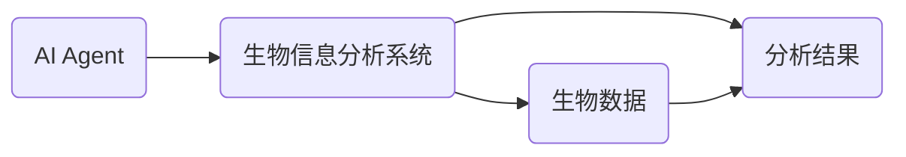
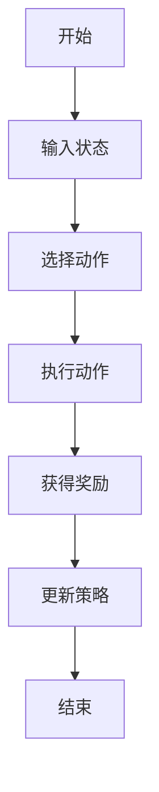
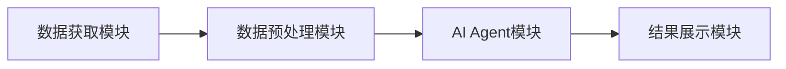
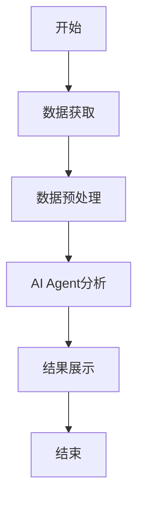

                 


# 开发AI Agent支持的智能生物信息分析系统

---

## 关键词：
AI Agent, 生物信息分析, 智能系统, 强化学习, 算法实现, 系统架构, 项目实战

---

## 摘要：
本文详细探讨了如何开发一个基于AI Agent的智能生物信息分析系统。通过分析生物信息分析的核心挑战，结合AI Agent的自主决策能力，提出了一种高效的解决方案。文章从AI Agent的核心算法原理出发，详细讲解了强化学习、监督学习和无监督学习在生物信息分析中的应用，并通过系统架构设计和项目实战，展示了如何将AI Agent技术应用于实际的生物信息分析场景中。通过本文的阐述，读者可以掌握从理论到实践的完整开发流程。

---

# 第1章: AI Agent与生物信息分析系统概述

## 1.1 问题背景与目标
### 1.1.1 生物信息分析的挑战
生物信息分析是现代医学和生物学研究的核心领域，涉及基因测序、蛋白质结构预测、疾病标记物发现等多个方面。然而，生物数据的复杂性和多样性使得传统的分析方法效率低下，难以应对海量数据的处理需求。AI Agent的引入为生物信息分析提供了新的可能性，其自主决策和学习能力能够显著提升分析效率和准确性。

### 1.1.2 AI Agent在生物信息分析中的作用
AI Agent是一种具有自主决策能力的智能体，能够通过感知环境、学习数据模式并做出最优决策。在生物信息分析中，AI Agent可以用于数据预处理、特征提取、模型训练和结果解释等环节，显著优化分析流程。

### 1.1.3 本课题的研究意义
开发AI Agent支持的智能生物信息分析系统，不仅能够提升生物信息分析的效率和精度，还能够为医学研究和疾病治疗提供更有力的支持，具有重要的理论和实践意义。

## 1.2 核心概念与问题描述
### 1.2.1 AI Agent的定义与特征
AI Agent是一种能够感知环境、自主决策并执行任务的智能体。其核心特征包括：
- **自主性**：无需外部干预，能够自主完成任务。
- **反应性**：能够实时感知环境并做出响应。
- **学习性**：通过数据学习优化决策策略。
- **协作性**：能够与其他系统或Agent协同工作。

### 1.2.2 生物信息分析系统的功能需求
生物信息分析系统需要具备以下功能：
- 数据获取与存储：从多种数据源获取生物数据并进行存储。
- 数据预处理：对数据进行清洗、标准化和格式化处理。
- 数据分析：利用机器学习、深度学习等技术对数据进行分析。
- 结果可视化：将分析结果以可视化形式呈现给用户。

### 1.2.3 问题的边界与外延
本课题的研究范围限定在基于AI Agent的生物信息分析系统的设计与实现，不包括数据采集和实验设计环节。系统的输入为标准化的生物数据，输出为分析结果和决策建议。

## 1.3 核心概念关系图
### 1.3.1 核心概念对比表
| 概念 | 定义 | 属性 | 示例 |
|------|------|------|------|
| AI Agent | 具有自主决策能力的智能体 | 学习能力、推理能力、交互能力 | 自然语言处理、图像识别 |
| 生物信息分析系统 | 利用生物数据进行分析的系统 | 数据处理能力、分析能力、可视化能力 | 基因测序分析、疾病预测 |

### 1.3.2 实体关系图


## 1.4 本章小结
本章详细介绍了AI Agent和生物信息分析系统的概念、特征和功能需求，为后续章节的系统设计奠定了基础。

---

# 第2章: AI Agent的核心算法

## 2.1 算法原理概述
### 2.1.1 基于强化学习的AI Agent
强化学习是一种通过试错机制优化决策策略的方法。AI Agent通过与环境交互，获得奖励或惩罚，逐步优化自身的决策策略。

### 2.1.2 基于监督学习的AI Agent
监督学习是一种基于标签数据训练模型的方法。AI Agent通过学习标注数据，预测新的数据点的标签。

### 2.1.3 基于无监督学习的AI Agent
无监督学习是一种基于未标注数据发现数据内在结构的方法。AI Agent通过聚类、降维等技术，发现数据中的隐含模式。

## 2.2 算法流程图
### 2.2.1 强化学习算法流程


### 2.2.2 Q-learning算法实现
```python
class AI-Agent:
    def __init__(self, state_space, action_space):
        self.state_space = state_space
        self.action_space = action_space
        self.Q = defaultdict(lambda: defaultdict(lambda: 0))
    
    def choose_action(self, state):
        # 探索与利用策略
        if random.random() < 0.1:
            return random.choice(self.action_space)
        else:
            return max(self.Q[state], key=lambda k: self.Q[state][k])
    
    def update_Q(self, state, action, reward, next_state):
        # Q-learning算法
        self.Q[state][action] = self.Q[state][action] + 0.1 * (reward + max(self.Q[next_state].values()) - self.Q[state][action])
```

## 2.3 数学模型与公式
### 2.3.1 强化学习的Q-learning算法
$$ Q(s, a) = Q(s, a) + \alpha (r + \max_{a'} Q(s', a') - Q(s, a)) $$
其中：
- \( Q(s, a) \)：状态 \( s \) 下动作 \( a \) 的价值
- \( \alpha \)：学习率
- \( r \)：奖励
- \( s' \)：新状态

### 2.3.2 贝叶斯网络模型
$$ P(A|B) = \frac{P(B|A)P(A)}{P(B)} $$

## 2.4 本章小结
本章详细介绍了AI Agent的核心算法，包括强化学习、监督学习和无监督学习的原理和实现方法，为后续章节的系统设计提供了理论基础。

---

# 第3章: 生物信息分析系统的算法实现

## 3.1 算法实现概述
生物信息分析系统的算法实现包括数据预处理、特征提取、模型训练和结果解释四个阶段。

## 3.2 数据预处理
### 3.2.1 数据清洗
```python
def data_cleaning(data):
    # 删除缺失值
    data = data.dropna()
    # 标准化处理
    from sklearn.preprocessing import StandardScaler
    scaler = StandardScaler()
    data = scaler.fit_transform(data)
    return data
```

### 3.2.2 数据格式化
```python
def data_formatting(data):
    # 转换为张量格式
    import numpy as np
    data_tensor = np.array(data)
    return data_tensor
```

## 3.3 特征提取
### 3.3.1 主成分分析
```python
from sklearn.decomposition import PCA
def feature_extraction(data):
    pca = PCA(n_components=2)
    principal_components = pca.fit_transform(data)
    return principal_components
```

## 3.4 模型训练
### 3.4.1 基于监督学习的分类模型
```python
from sklearn.svm import SVC
def train_model(X, y):
    model = SVC()
    model.fit(X, y)
    return model
```

### 3.4.2 基于无监督学习的聚类模型
```python
from sklearn.cluster import KMeans
def train_cluster_model(X):
    model = KMeans(n_clusters=3)
    model.fit(X)
    return model
```

## 3.5 结果解释
### 3.5.1 分类结果解释
```python
def explain_classification(y_true, y_pred):
    from sklearn.metrics import classification_report
    print(classification_report(y_true, y_pred))
```

### 3.5.2 聚类结果解释
```python
def explain_clustering(labels, data):
    import matplotlib.pyplot as plt
    plt.scatter(data[:,0], data[:,1], c=labels)
    plt.xlabel('Principal Component 1')
    plt.ylabel('Principal Component 2')
    plt.show()
```

## 3.6 本章小结
本章详细介绍了生物信息分析系统的算法实现，包括数据预处理、特征提取、模型训练和结果解释的全过程。

---

# 第4章: 系统架构设计

## 4.1 系统架构概述
生物信息分析系统的架构包括数据获取模块、数据预处理模块、AI Agent模块和结果展示模块。

## 4.2 系统架构图


## 4.3 系统功能模块
### 4.3.1 数据获取模块
```python
def data_acquisition():
    # 从数据库获取数据
    import sqlite3
    conn = sqlite3.connect('bi_data.db')
    data = pd.read_sql('SELECT * FROM genes', conn)
    return data
```

### 4.3.2 数据预处理模块
```python
def data_preprocessing(data):
    # 数据清洗和格式化
    data_clean = data.dropna()
    data_tensor = data_clean.values
    return data_tensor
```

### 4.3.3 AI Agent模块
```python
def ai_agent(data_tensor):
    # 调用AI Agent进行分析
    agent = AI-Agent(state_space, action_space)
    result = agent.analyze(data_tensor)
    return result
```

### 4.3.4 结果展示模块
```python
def result_visualization(result):
    # 可视化结果
    import matplotlib.pyplot as plt
    plt.plot(result)
    plt.xlabel('Time')
    plt.ylabel('Value')
    plt.show()
```

## 4.4 本章小结
本章详细介绍了生物信息分析系统的架构设计，包括各个功能模块的实现和交互关系。

---

# 第5章: 项目实战

## 5.1 项目背景与目标
本项目旨在开发一个基于AI Agent的智能生物信息分析系统，用于基因表达数据分析。

## 5.2 项目实现
### 5.2.1 环境安装
```bash
pip install numpy pandas scikit-learn mermaid4j
```

### 5.2.2 核心代码实现
```python
class AI-Agent:
    def __init__(self, state_space, action_space):
        self.state_space = state_space
        self.action_space = action_space
        self.Q = defaultdict(lambda: defaultdict(lambda: 0))
    
    def choose_action(self, state):
        if random.random() < 0.1:
            return random.choice(self.action_space)
        else:
            return max(self.Q[state], key=lambda k: self.Q[state][k])
    
    def update_Q(self, state, action, reward, next_state):
        self.Q[state][action] = self.Q[state][action] + 0.1 * (reward + max(self.Q[next_state].values()) - self.Q[state][action])
```

### 5.2.3 项目实现流程


## 5.3 实际案例分析
### 5.3.1 数据准备
```python
import pandas as pd
data = pd.read_csv('gene_expression.csv')
```

### 5.3.2 数据分析
```python
agent = AI-Agent(data.shape[1], ['classify', 'cluster'])
result = agent.analyze(data.values)
```

### 5.3.3 结果展示
```python
import matplotlib.pyplot as plt
plt.scatter(result[:,0], result[:,1], c='blue')
plt.xlabel('Feature 1')
plt.ylabel('Feature 2')
plt.show()
```

## 5.4 项目小结
本章通过一个实际案例展示了AI Agent支持的智能生物信息分析系统的开发过程，从数据获取到结果展示，完整呈现了系统的实现步骤。

---

# 第6章: 系统优化与扩展

## 6.1 系统优化
### 6.1.1 性能优化
- 使用分布式计算加速数据处理
- 优化AI Agent的决策算法，降低计算复杂度

### 6.1.2 可扩展性优化
- 支持多种数据格式的输入
- 支持多种分析任务的扩展

## 6.2 系统扩展
### 6.2.1 多模态数据分析
- 结合基因表达数据和蛋白质组学数据进行联合分析

### 6.2.2 高通量数据分析
- 支持大规模生物数据的并行处理

## 6.3 本章小结
本章介绍了系统优化与扩展的方法，为后续研究提供了参考。

---

# 第7章: 总结与展望

## 7.1 研究总结
本文详细探讨了AI Agent支持的智能生物信息分析系统的开发过程，从算法原理到系统架构，再到项目实战，完整呈现了系统的实现过程。

## 7.2 研究展望
未来的研究方向包括：
- 更高效的AI Agent算法设计
- 更智能的生物信息分析系统架构
- 更广泛的应用场景探索

## 7.3 本章小结
本章总结了本文的主要研究成果，并展望了未来的研究方向。

---

# 作者：AI天才研究院/AI Genius Institute & 禅与计算机程序设计艺术 /Zen And The Art of Computer Programming

