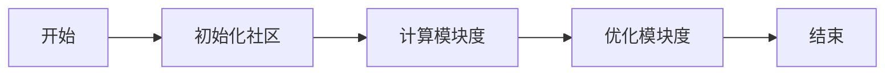
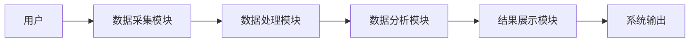

                 


# 开发AI Agent支持的智能社交网络分析系统

> 关键词：AI Agent, 智能社交网络, 社交网络分析, 系统架构, 项目实战

> 摘要：本文详细探讨了开发AI Agent支持的智能社交网络分析系统的背景、核心概念、算法原理、系统架构、项目实战及最佳实践。文章通过逐步分析，结合实际案例和代码示例，帮助读者理解并掌握如何利用AI Agent技术构建高效的智能社交网络分析系统。

---

## 第1章 AI Agent与智能社交网络分析系统背景介绍

### 1.1 AI Agent的核心概念

#### 1.1.1 AI Agent的定义与特点
AI Agent（人工智能代理）是指能够感知环境并采取行动以实现目标的智能实体。其特点包括：
- **自主性**：能够在没有外部干预的情况下运行。
- **反应性**：能够实时感知环境并做出反应。
- **目标导向**：所有行为都以实现特定目标为导向。
- **学习能力**：能够通过数据和经验不断优化自身行为。

#### 1.1.2 智能社交网络分析系统的定义
智能社交网络分析系统是一种结合AI Agent技术，能够对社交网络中的数据进行实时分析、理解和预测的系统。其核心目标是帮助用户从海量社交数据中提取有价值的信息。

#### 1.1.3 系统的背景与意义
随着社交网络的快速发展，用户产生的数据呈爆炸式增长。传统的数据分析方法难以应对实时性、复杂性和高并发性的挑战。AI Agent技术的引入，为社交网络分析提供了智能化、自动化的解决方案，能够显著提升数据分析的效率和准确性。

### 1.2 问题背景与描述

#### 1.2.1 社交网络分析的现状与挑战
- **数据量大**：社交网络每天产生海量数据，传统方法难以高效处理。
- **实时性要求高**：用户行为分析需要实时反馈。
- **复杂性高**：社交网络数据涉及文本、图像、用户行为等多种类型。

#### 1.2.2 AI Agent在社交网络分析中的作用
AI Agent能够实时监控社交网络数据，识别用户行为模式，预测趋势，并提供智能化的决策支持。

#### 1.2.3 系统的目标与边界
- **目标**：构建一个能够实时分析社交网络数据，提供智能化洞察的系统。
- **边界**：系统仅关注社交网络数据的分析，不涉及数据的生成和存储。

### 1.3 核心概念与联系

#### 1.3.1 AI Agent与智能社交网络的关系
AI Agent作为智能社交网络的核心组件，负责数据的采集、分析和决策。智能社交网络为AI Agent提供数据和环境，AI Agent则通过分析数据提升网络的智能性。

#### 1.3.2 系统的核心要素与组成
- **数据采集模块**：负责从社交网络中获取数据。
- **AI Agent模块**：对数据进行分析和处理。
- **用户交互模块**：提供友好的用户界面，展示分析结果。

#### 1.3.3 问题解决的逻辑框架
1. 数据采集：从社交网络中获取用户行为数据。
2. 数据分析：AI Agent对数据进行处理和分析。
3. 结果展示：将分析结果反馈给用户。

---

## 第2章 AI Agent与智能社交网络的核心概念与联系

### 2.1 核心概念原理

#### 2.1.1 AI Agent的原理与机制
AI Agent通过感知环境、分析数据、制定策略并执行行动来实现目标。其核心机制包括：
- **感知**：通过传感器或API获取环境数据。
- **分析**：利用机器学习算法对数据进行处理。
- **决策**：基于分析结果制定行动策略。
- **执行**：通过API或用户界面执行行动。

#### 2.1.2 智能社交网络的分析模型
智能社交网络分析模型包括：
- **用户行为分析**：分析用户的互动模式。
- **情感分析**：识别用户情绪倾向。
- **网络结构分析**：研究社交网络的拓扑结构。

### 2.2 核心概念属性特征对比

| 属性 | AI Agent | 智能社交网络 |
|------|----------|--------------|
| **目标** | 实现特定目标 | 提供社交网络服务 |
| **自主性** | 高 | 依赖用户行为 |
| **反应性** | 高 | 低 |
| **学习能力** | 高 | 低 |

### 2.3 ER实体关系图架构

```mermaid
er
  actor: 用户
  post: 帖子
  comment: 评论
  like: 点赞
  follows: 关注关系
  system: 系统
  actor --> post: 发布
  actor --> comment: 发表
  actor --> like: 点赞
  actor --> follows: 关注
  post --> system: 存储
  comment --> system: 存储
  like --> system: 记录
  follows --> system: 记录
```

---

## 第3章 AI Agent支持的智能社交网络分析算法原理

### 3.1 算法原理概述

#### 3.1.1 社交网络分析的核心算法
- **社区发现算法**：用于识别社交网络中的社区结构。
- **情感分析算法**：用于分析用户情绪倾向。

#### 3.1.2 AI Agent的算法实现
AI Agent通过机器学习算法对数据进行处理和分析，例如使用Louvain算法进行社区发现，使用BERT模型进行情感分析。

### 3.2 算法实现细节

#### 3.2.1 社区发现算法（Louvain算法）



#### 3.2.2 情感分析算法（BERT模型）

```python
import torch
from transformers import BertTokenizer, BertModel

tokenizer = BertTokenizer.from_pretrained('bert-base-uncased')
model = BertModel.from_pretrained('bert-base-uncased')

text = "This is a positive comment."
encoded_input = tokenizer(text, return_tensors='pt')
output = model(encoded_input.input_ids)

print(output.last_hidden_state)
```

---

## 第4章 系统分析与架构设计

### 4.1 问题场景介绍

#### 4.1.1 问题场景描述
系统需要实时分析用户在社交网络中的行为，识别用户情绪倾向，并提供智能化的反馈。

### 4.2 系统功能设计

#### 4.2.1 功能模块划分
- **数据采集模块**：负责从社交网络中获取数据。
- **数据处理模块**：对数据进行清洗和预处理。
- **数据分析模块**：利用AI Agent对数据进行分析。
- **结果展示模块**：将分析结果反馈给用户。

#### 4.2.2 系统架构设计



---

## 第5章 项目实战

### 5.1 环境安装

#### 5.1.1 安装Python环境
```bash
python --version
pip install --upgrade pip
```

#### 5.1.2 安装依赖库
```bash
pip install numpy pandas scikit-learn transformers
```

### 5.2 系统核心实现

#### 5.2.1 数据采集模块

```python
import requests

url = "https://api.example.com/posts"
response = requests.get(url)
posts = response.json()
print(posts)
```

#### 5.2.2 数据分析模块

```python
from sklearn.cluster import KMeans

X = [[1, 2], [3, 4], [5, 6]]
kmeans = KMeans(n_clusters=2)
kmeans.fit(X)
print(kmeans.labels_)
```

### 5.3 案例分析与解读

#### 5.3.1 案例背景
分析一个社交网络中的用户互动数据，识别用户社区结构。

#### 5.3.2 实施步骤
1. 数据采集：获取用户互动数据。
2. 数据处理：清洗和预处理数据。
3. 数据分析：使用Louvain算法识别社区结构。
4. 结果展示：可视化社区结构。

---

## 第6章 最佳实践

### 6.1 小结
本文详细介绍了开发AI Agent支持的智能社交网络分析系统的背景、核心概念、算法原理、系统架构和项目实战。通过实际案例和代码示例，帮助读者理解并掌握系统的开发过程。

### 6.2 注意事项
- 确保数据的安全性和隐私性。
- 定期更新模型以保持分析的准确性。
- 优化系统的性能以应对高并发请求。

### 6.3 拓展阅读
- 探索更多的AI Agent算法，如强化学习。
- 研究社交网络分析的其他算法，如图嵌入方法。

---

## 作者

作者：AI天才研究院/AI Genius Institute & 禅与计算机程序设计艺术 /Zen And The Art of Computer Programming

---

希望这篇文章能够为读者提供关于开发AI Agent支持的智能社交网络分析系统的全面指导和深入理解。

