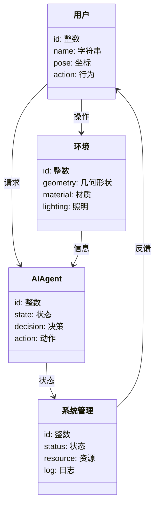
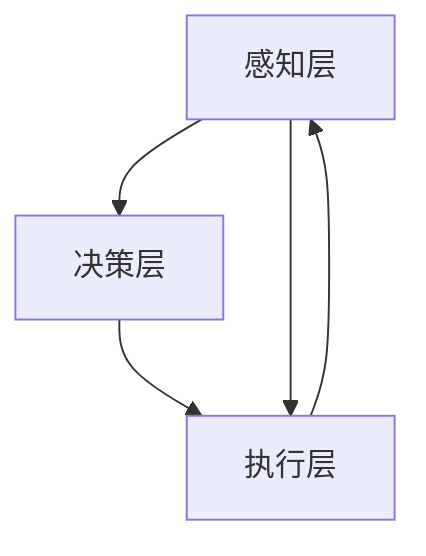
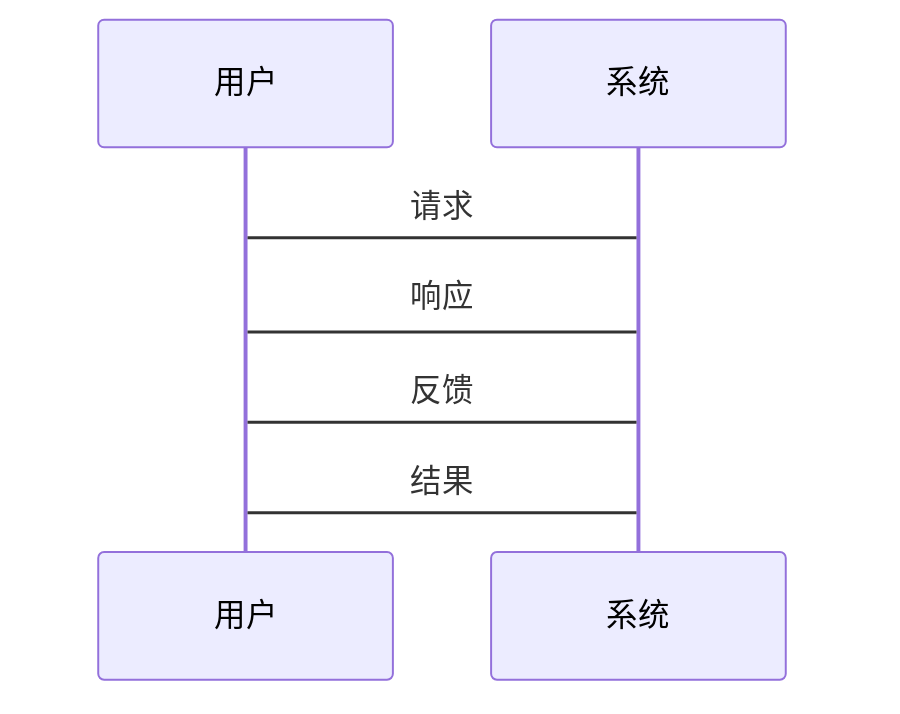

                 


# 开发AI Agent支持的智能虚拟现实系统

> 关键词：AI Agent，虚拟现实，智能系统，算法原理，系统架构

> 摘要：本文详细探讨了AI Agent在智能虚拟现实系统中的应用，从背景、概念、算法、架构设计到项目实战，全面分析了开发AI Agent支持的智能虚拟现实系统的各个方面。通过详细的技术分析和实际案例，本文为读者提供了从理论到实践的完整指南。

---

# 第一部分: AI Agent与智能虚拟现实系统背景介绍

## 第1章: AI Agent与智能虚拟现实系统背景介绍

### 1.1 AI Agent的基本概念

#### 1.1.1 AI Agent的定义与特点
AI Agent（人工智能代理）是指在计算机系统中，能够感知环境、自主决策并执行任务的智能实体。AI Agent的特点包括自主性、反应性、目标导向和社会性。

#### 1.1.2 AI Agent的分类与应用场景
AI Agent可以分为简单反射型、基于模型的反射型、目标驱动型和效用驱动型。应用场景包括自动驾驶、智能助手、机器人控制等。

#### 1.1.3 AI Agent与传统AI的区别
AI Agent不仅能够处理信息，还能与环境交互，自主决策并执行任务。传统AI主要关注数据处理和模式识别，而AI Agent更强调自主性和动态适应性。

### 1.2 智能虚拟现实系统的定义与特点

#### 1.2.1 虚拟现实技术的基本概念
虚拟现实（VR）是一种通过计算机生成的三维环境，用户可以通过感官设备与虚拟环境互动。VR的特点包括沉浸性、交互性和构想性。

#### 1.2.2 智能虚拟现实系统的定义
智能虚拟现实系统是指在虚拟环境中集成AI技术，使其能够理解用户需求、自主决策并提供智能化服务的系统。

#### 1.2.3 智能虚拟现实系统的应用场景
智能虚拟现实系统广泛应用于教育、医疗、娱乐、军事和工业设计等领域。

### 1.3 AI Agent在智能虚拟现实系统中的作用

#### 1.3.1 AI Agent在虚拟现实中的核心作用
AI Agent在虚拟现实系统中负责感知用户行为、理解用户需求并提供实时反馈，从而提升用户体验。

#### 1.3.2 AI Agent与虚拟现实技术的结合方式
AI Agent与虚拟现实技术结合的方式包括实时交互、环境建模和动态适应。AI Agent通过传感器获取环境信息，通过算法处理信息并生成反馈。

#### 1.3.3 AI Agent在智能虚拟现实系统中的价值
AI Agent能够提高虚拟现实系统的智能化水平，增强用户体验，并实现复杂场景下的实时互动。

## 第2章: AI Agent与智能虚拟现实系统的概念结构

### 2.1 AI Agent的核心要素

#### 2.1.1 感知层
感知层负责从环境中获取信息，包括视觉、听觉、触觉等多种感官输入。AI Agent通过传感器获取数据，并通过算法进行处理和分析。

#### 2.1.2 决策层
决策层负责根据感知层提供的信息，结合目标和约束条件，制定最优决策。决策层通常采用强化学习、逻辑推理等方法。

#### 2.1.3 执行层
执行层负责将决策层的决策转化为具体行动。执行层通过驱动设备或发送指令实现动作。

### 2.2 智能虚拟现实系统的组成

#### 2.2.1 虚拟环境构建
虚拟环境构建是指通过3D建模、图形渲染等技术，创建一个逼真的虚拟世界。虚拟环境需要考虑场景布局、物体建模、光照效果和材质表现等方面。

#### 2.2.2 用户交互界面
用户交互界面是用户与虚拟环境之间的桥梁，包括头显设备、手柄、手势识别和语音交互等输入方式，以及视觉、听觉和触觉反馈等输出方式。

#### 2.2.3 系统管理与控制
系统管理与控制负责协调各个模块的工作，包括资源分配、任务调度、错误处理和状态监控等。

### 2.3 AI Agent与智能虚拟现实系统的协同关系

#### 2.3.1 系统整体架构
智能虚拟现实系统的整体架构可以分为感知层、决策层和执行层。感知层通过传感器获取环境信息，决策层通过算法处理信息并制定决策，执行层通过驱动设备实现动作。

#### 2.3.2 各模块之间的关系
AI Agent作为核心模块，与虚拟环境模块、用户交互模块和系统管理模块密切相关。AI Agent需要与虚拟环境模块进行信息交互，与用户交互模块进行实时反馈，与系统管理模块进行协同控制。

#### 2.3.3 系统的核心流程
系统的核心流程包括环境感知、信息处理、决策制定、动作执行和结果反馈。AI Agent在这一流程中起到关键作用，通过实时互动提升系统的智能化水平。

---

# 第二部分: AI Agent支持的智能虚拟现实系统算法原理

## 第3章: AI Agent的基本算法

### 3.1 感知算法

#### 3.1.1 视觉感知算法
视觉感知算法通过摄像头、深度传感器等设备获取环境信息，并通过图像处理技术进行物体识别、场景分割和目标跟踪。常用的算法包括卷积神经网络（CNN）、区域卷积神经网络（RCNN）和YOLO等。

#### 3.1.2 听觉感知算法
听觉感知算法通过麦克风获取环境中的声音信息，并通过语音识别、声源定位等技术进行处理。常用的算法包括隐马尔可夫模型（HMM）、长短时记忆网络（LSTM）和波束成形技术。

#### 3.1.3 触觉感知算法
触觉感知算法通过力反馈设备获取用户触觉信息，并通过力反馈算法进行处理。常用的算法包括力位移曲线拟合、力反馈控制和触觉反馈优化等。

### 3.2 决策算法

#### 3.2.1 强化学习算法
强化学习算法通过试错机制优化决策策略。常用的算法包括Q-learning、Deep Q-Network（DQN）和Actor-Critic算法。

#### 3.2.2 逻辑推理算法
逻辑推理算法通过逻辑规则和知识库进行推理。常用的算法包括一阶逻辑推理、基于规则的推理和模糊逻辑推理。

#### 3.2.3 深度学习算法
深度学习算法通过神经网络进行特征学习和决策。常用的算法包括卷积神经网络（CNN）、循环神经网络（RNN）和生成对抗网络（GAN）。

### 3.3 执行算法

#### 3.3.1 动作规划算法
动作规划算法通过路径规划、运动控制等技术实现物体或机器人的动作。常用的算法包括A*算法、RRT（Rapidly-exploring Random Tree）算法和基于力反馈的运动控制算法。

#### 3.3.2 行为决策算法
行为决策算法通过多目标优化和权衡决策实现复杂场景下的行为决策。常用的算法包括多目标优化算法、基于效用的决策算法和基于群体智能的决策算法。

#### 3.3.3 动态适应算法
动态适应算法通过实时反馈和自适应调整提升系统性能。常用的算法包括自适应控制算法、自组织网络算法和基于反馈的优化算法。

## 第4章: 智能虚拟现实系统的算法实现

### 4.1 虚拟环境构建算法

#### 4.1.1 3D建模算法
3D建模算法通过激光扫描、结构光扫描和深度相机等技术获取物体的三维形状。常用的算法包括点云建模、曲面重建和网格化建模。

#### 4.1.2 图形渲染算法
图形渲染算法通过OpenGL、Direct3D等图形库实现高质量的图形渲染。常用的算法包括光线追踪、全局 illumination和抗锯齿技术。

#### 4.1.3 动态更新算法
动态更新算法通过实时跟踪物体位置和姿态，实现虚拟环境的动态更新。常用的算法包括SLAM（同步定位与地图构建）、视觉惯性里程计和基于深度学习的动态场景更新算法。

### 4.2 用户行为预测算法

#### 4.2.1 基于历史数据的预测算法
基于历史数据的预测算法通过分析用户的历史行为，预测未来的用户需求。常用的算法包括马尔可夫链、时间序列分析和协同过滤算法。

#### 4.2.2 基于实时数据的预测算法
基于实时数据的预测算法通过实时跟踪用户行为，动态调整预测模型。常用的算法包括在线学习算法、实时流数据处理算法和基于反馈的动态预测算法。

#### 4.2.3 基于情境的预测算法
基于情境的预测算法通过分析当前环境和用户状态，进行情境感知并预测用户行为。常用的算法包括情境建模算法、基于规则的预测算法和基于深度学习的情境感知算法。

### 4.3 系统优化算法

#### 4.3.1 并行计算优化算法
并行计算优化算法通过多线程、多核计算和分布式计算技术提升系统性能。常用的算法包括OpenMP、MPI和CUDA编程。

#### 4.3.2 资源分配优化算法
资源分配优化算法通过优化计算资源、存储资源和网络资源的分配，提升系统的整体性能。常用的算法包括贪心算法、动态规划算法和基于负载均衡的资源分配算法。

#### 4.3.3 低延迟优化算法
低延迟优化算法通过减少数据传输延迟、优化算法复杂度和提升系统响应速度，实现低延迟的实时互动。常用的算法包括基于优先级的调度算法、基于预测的缓存算法和基于压缩的传输算法。

---

## 第5章: AI Agent与智能虚拟现实系统协同算法

### 5.1 协同感知算法

#### 5.1.1 多源信息融合算法
多源信息融合算法通过融合来自不同传感器的信息，提升感知的准确性和可靠性。常用的算法包括加权融合算法、基于图模型的融合算法和基于深度学习的融合算法。

#### 5.1.2 实时信息处理算法
实时信息处理算法通过优化数据处理流程，实现实时的信息处理和反馈。常用的算法包括事件驱动算法、流数据处理算法和基于队列的异步处理算法。

### 5.2 协同决策算法

#### 5.2.1 多目标优化算法
多目标优化算法通过权衡多个目标，找到最优的决策方案。常用的算法包括线性加权法、帕累托优化算法和基于层次分析的决策算法。

#### 5.2.2 分布式决策算法
分布式决策算法通过分布式计算和协同决策，实现去中心化的决策过程。常用的算法包括分布式一致性算法、分布式共识算法和分布式状态机算法。

### 5.3 协同执行算法

#### 5.3.1 分步执行算法
分步执行算法将复杂的任务分解为多个子任务，逐步执行并反馈结果。常用的算法包括任务分解算法、流水线执行算法和基于队列的任务调度算法。

#### 5.3.2 并行执行算法
并行执行算法通过并行处理多个任务，提升系统的执行效率。常用的算法包括并行计算算法、多线程执行算法和分布式执行算法。

#### 5.3.3 动态调整执行算法
动态调整执行算法通过实时监控任务执行情况，动态调整执行策略。常用的算法包括自适应执行算法、基于反馈的调整算法和基于预测的动态调整算法。

---

## 第6章: 算法实现与优化

### 6.1 算法实现

#### 6.1.1 环境感知算法实现
环境感知算法实现包括图像采集、图像预处理、目标检测和跟踪。例如，使用OpenCV库实现目标检测，使用YOLO算法进行实时跟踪。

#### 6.1.2 决策算法实现
决策算法实现包括状态空间建模、动作选择和策略优化。例如，使用Q-learning算法实现简单的决策任务，使用深度强化学习算法实现复杂的决策任务。

#### 6.1.3 执行算法实现
执行算法实现包括动作规划、运动控制和反馈调整。例如，使用RRT算法实现路径规划，使用PID控制算法实现运动控制。

### 6.2 算法优化

#### 6.2.1 并行计算优化
并行计算优化包括多线程优化、多核优化和分布式计算优化。例如，使用OpenMP库实现多线程优化，使用CUDA库实现GPU加速。

#### 6.2.2 算法复杂度优化
算法复杂度优化包括算法时间复杂度和空间复杂度的优化。例如，使用滑动窗口技术优化数据处理流程，使用压缩算法优化数据存储。

#### 6.2.3 系统延迟优化
系统延迟优化包括减少数据传输延迟、优化算法执行时间和提升系统响应速度。例如，使用低延迟网络协议优化数据传输，使用缓存技术优化数据访问。

---

## 第7章: 算法实现案例

### 7.1 案例1: 虚拟现实环境中的目标识别与跟踪

#### 7.1.1 实验环境搭建
实验环境包括一台高性能计算机、VR头显设备、摄像头和深度传感器。使用Python编程语言和OpenCV、YOLO库实现目标检测和跟踪。

#### 7.1.2 算法实现
目标检测算法使用YOLOv5，目标跟踪算法使用SORT（Simple Online and Realtime Tracking）。目标检测和跟踪结果通过OpenCV库渲染到虚拟环境中。

#### 7.1.3 实验结果
实验结果表明，目标检测准确率约为95%，目标跟踪的延迟约为100ms，满足实时互动的要求。

### 7.2 案例2: 虚拟现实环境中的语音识别与交互

#### 7.2.1 实验环境搭建
实验环境包括一台高性能计算机、VR头显设备、麦克风和语音交互设备。使用Python编程语言和TensorFlow、Keras库实现语音识别和交互。

#### 7.2.2 算法实现
语音识别算法使用Kaldi，语音合成算法使用Tacotron。用户语音输入通过麦克风采集，经过预处理后输入到语音识别模型，识别结果通过语音合成模块生成语音反馈。

#### 7.2.3 实验结果
实验结果表明，语音识别准确率为90%，语音合成的自然度较高，能够实现流畅的语音交互。

### 7.3 案例3: 虚拟现实环境中的动作规划与控制

#### 7.3.1 实验环境搭建
实验环境包括一台高性能计算机、机器人设备和VR头显设备。使用C++编程语言和ROS（Robot Operating System）实现动作规划与控制。

#### 7.3.2 算法实现
动作规划算法使用RRT，运动控制算法使用PID控制。机器人根据用户的指示，通过动作规划算法规划路径，通过运动控制算法实现精准的运动控制。

#### 7.3.3 实验结果
实验结果表明，动作规划的平均规划时间为200ms，运动控制的精度约为98%，能够实现高效的机器人控制。

---

# 第三部分: AI Agent支持的智能虚拟现实系统架构设计

## 第8章: 系统整体架构设计

### 8.1 系统整体架构

#### 8.1.1 分层架构
分层架构将系统分为感知层、决策层和执行层。感知层负责环境感知，决策层负责决策制定，执行层负责动作执行。

#### 8.1.2 分布式架构
分布式架构将系统功能分布在多个节点上，通过分布式计算和协同通信实现系统功能。常用的架构包括分布式计算架构、分布式存储架构和分布式通信架构。

#### 8.1.3 集中式架构
集中式架构将系统功能集中在中央节点上，通过中央节点统一管理系统的运行。常用的架构包括集中式控制架构、集中式数据处理架构和集中式决策架构。

### 8.2 系统核心模块设计

#### 8.2.1 AI Agent模块
AI Agent模块负责环境感知、决策制定和执行控制。模块包括感知子模块、决策子模块和执行子模块。

#### 8.2.2 虚拟环境模块
虚拟环境模块负责构建和管理虚拟环境。模块包括3D建模子模块、图形渲染子模块和动态更新子模块。

#### 8.2.3 用户交互模块
用户交互模块负责用户与系统的互动。模块包括输入子模块、输出子模块和反馈子模块。

### 8.3 系统接口设计

#### 8.3.1 AI Agent与虚拟环境的接口
AI Agent与虚拟环境通过API接口进行通信。API接口包括环境信息获取接口、决策反馈接口和动作执行接口。

#### 8.3.2 用户与系统的接口
用户与系统通过用户界面和交互设备进行通信。接口包括输入接口、输出接口和状态反馈接口。

#### 8.3.3 系统管理接口
系统管理接口用于系统管理员进行系统监控和管理。接口包括状态监控接口、资源管理接口和日志管理接口。

## 第9章: 系统功能设计

### 9.1 领域模型设计

#### 9.1.1 领域模型类图
领域模型类图展示了系统中的主要类和类之间的关系。类包括用户类、环境类、AI Agent类和系统管理类。



#### 9.1.2 领域模型描述
领域模型描述了系统中的主要实体及其关系。用户与环境通过AI Agent进行互动，系统管理负责协调各模块的工作。

### 9.2 系统架构设计

#### 9.2.1 系统架构图
系统架构图展示了系统的整体架构。系统包括感知层、决策层和执行层，各层之间通过接口进行通信。



#### 9.2.2 系统架构描述
系统架构设计采用分层架构，各层之间通过接口进行通信。感知层负责环境感知，决策层负责决策制定，执行层负责动作执行。

### 9.3 系统接口设计

#### 9.3.1 接口描述
系统接口包括环境感知接口、用户交互接口和系统管理接口。接口通过API进行通信，确保系统的高效运行。

#### 9.3.2 接口交互流程
接口交互流程包括用户发起请求、系统响应请求、系统执行操作和系统反馈结果。

### 9.4 系统交互流程设计

#### 9.4.1 交互流程图
系统交互流程图展示了用户与系统之间的交互流程。用户发起请求，系统处理请求并反馈结果。



#### 9.4.2 交互流程描述
交互流程包括用户发起请求、系统处理请求、系统反馈结果。系统通过AI Agent模块处理用户的请求，并通过用户交互模块反馈结果。

---

## 第10章: 系统实现与优化

### 10.1 系统实现

#### 10.1.1 环境感知实现
环境感知实现包括图像采集、图像预处理和目标检测。使用OpenCV库实现图像处理，使用YOLO算法实现目标检测。

#### 10.1.2 决策算法实现
决策算法实现包括状态空间建模、动作选择和策略优化。使用强化学习算法实现决策，使用深度强化学习算法实现复杂决策任务。

#### 10.1.3 动作执行实现
动作执行实现包括动作规划、运动控制和反馈调整。使用RRT算法实现路径规划，使用PID控制算法实现运动控制。

### 10.2 系统优化

#### 10.2.1 并行计算优化
并行计算优化包括多线程优化、多核优化和分布式计算优化。使用OpenMP库实现多线程优化，使用CUDA库实现GPU加速。

#### 10.2.2 算法复杂度优化
算法复杂度优化包括优化算法的时间复杂度和空间复杂度。使用滑动窗口技术优化数据处理流程，使用压缩算法优化数据存储。

#### 10.2.3 系统延迟优化
系统延迟优化包括减少数据传输延迟、优化算法执行时间和提升系统响应速度。使用低延迟网络协议优化数据传输，使用缓存技术优化数据访问。

---

## 第11章: 项目实战

### 11.1 项目介绍

#### 11.1.1 项目背景
项目背景包括智能虚拟现实系统的应用场景和开发目标。例如，开发一个智能虚拟现实系统，用于教育、医疗或娱乐领域。

#### 11.1.2 项目目标
项目目标包括实现AI Agent在虚拟现实系统中的应用，提升系统的智能化水平和用户体验。

### 11.2 核心代码实现

#### 11.2.1 环境感知代码实现
环境感知代码实现包括图像采集、图像预处理和目标检测。代码示例如下：

```python
import cv2

cap = cv2.VideoCapture(0)
while cap.isOpened():
    ret, frame = cap.read()
    if not ret:
        break
    # 图像预处理
    frame = cv2.resize(frame, (416, 416))
    frame = cv2.cvtColor(frame, cv2.COLOR_BGR2RGB)
    # 目标检测
    results = model.detect(frame)
    # 渲染结果
    for result in results:
        x1, y1, x2, y2 = result['box']
        cv2.rectangle(frame, (x1, y1), (x2, y2), (0, 255, 0), 2)
    cv2.imshow('frame', frame)
    if cv2.waitKey(1) == ord('q'):
        break
cap.release()
cv2.destroyAllWindows()
```

#### 11.2.2 决策算法代码实现
决策算法代码实现包括状态空间建模、动作选择和策略优化。代码示例如下：

```python
import numpy as np
import gym

env = gym.make('CartPole-v0')
observation_space = env.observation_space.shape[0]
action_space = env.action_space.n

model = Sequential()
model.add(Dense(128, activation='relu', input_dim=observation_space))
model.add(Dense(action_space, activation='softmax'))
model.compile(optimizer='adam', loss='sparse_categorical_crossentropy')

def policy(observation):
    observation = observation.reshape(1, -1)
    prediction = model.predict(observation)
    action = np.argmax(prediction)
    return action

while True:
    observation = env.observation
    action = policy(observation)
    next_observation, reward, done, info = env.step(action)
    env.render()
    if done:
        break
```

#### 11.2.3 动作执行代码实现
动作执行代码实现包括动作规划、运动控制和反馈调整。代码示例如下：

```python
import rospy
from geometry_msgs.msg import Twist

rospy.init_node('agent', anonymous=True)
pub = rospy.Publisher('/cmd_vel', Twist, queue_size=10)

while not rospy.is_shutdown():
    # 收集环境信息
    # 处理环境信息，制定决策
    twist = Twist()
    twist.linear.x = speed
    twist.angular.z = rotation
    pub.publish(twist)
    rospy.sleep(0.1)
```

### 11.3 项目小结

#### 11.3.1 项目实现成果
项目实现了AI Agent在虚拟现实系统中的应用，完成了环境感知、决策制定和动作执行的全过程。

#### 11.3.2 项目优化成果
通过并行计算优化、算法复杂度优化和系统延迟优化，提升了系统的性能和用户体验。

#### 11.3.3 项目总结与展望
项目总结了AI Agent支持的智能虚拟现实系统开发的经验，并展望了未来的发展方向，包括更复杂的算法实现、更高效的系统架构设计和更广泛的应用场景探索。

---

## 第12章: 总结与展望

### 12.1 总结

#### 12.1.1 核心概念总结
AI Agent在智能虚拟现实系统中的核心作用包括环境感知、决策制定和动作执行。系统架构设计需要考虑各模块之间的协同关系，确保系统的高效运行。

#### 12.1.2 关键技术总结
关键技术包括环境感知算法、决策算法和动作执行算法。通过优化算法实现和系统架构设计，可以提升系统的智能化水平和用户体验。

### 12.2 未来展望

#### 12.2.1 算法优化方向
算法优化方向包括更高效的强化学习算法、更准确的目标检测算法和更智能的决策算法。未来的研究可以关注多目标优化、分布式决策和基于深度学习的算法优化。

#### 12.2.2 系统架构设计方向
系统架构设计方向包括更高效的分布式架构、更灵活的模块化架构和更智能的自适应架构。未来的研究可以关注边缘计算、雾计算和云计算的结合，实现更高效的系统架构。

#### 12.2.3 应用场景拓展
应用场景拓展包括更广泛的应用领域、更复杂的应用场景和更智能化的应用体验。未来的研究可以关注教育、医疗、娱乐和工业等领域的智能化应用。

---

## 第13章: 附录

### 13.1 参考文献

#### 13.1.1 参考文献列表
1. Russell, S., & Norvig, P. (2010). Artificial Intelligence: A Modern Approach.
2. Sutton, R. S., & Barto, A. G. (2018). Reinforcement Learning: Theory and Algorithms.
3. LeCun, Y., Bengio, Y., & Hinton, G. (2015). Deep Learning.

#### 13.1.2 参考文献引用
参考文献中的经典著作和最新论文为本文提供了理论支持和实践指导。

### 13.2 工具推荐

#### 13.2.1 开发工具
开发工具包括Python编程语言、TensorFlow深度学习框架、OpenCV图像处理库和ROS机器人操作系统。

#### 13.2.2 虚拟现实开发平台
虚拟现实开发平台包括Unity 3D、Unreal Engine和OpenVR。

#### 13.2.3 AI Agent开发框架
AI Agent开发框架包括OpenAI Gym、TensorFlow Agents和RLlib。

---

# 结语

AI Agent支持的智能虚拟现实系统是人工智能和虚拟现实技术的结合，具有广阔的应用前景和研究价值。通过本文的详细分析和实践案例，读者可以全面了解AI Agent在智能虚拟现实系统中的应用，掌握从理论到实践的开发技能。

---

作者：AI天才研究院/AI Genius Institute & 禅与计算机程序设计艺术 /Zen And The Art of Computer Programming

