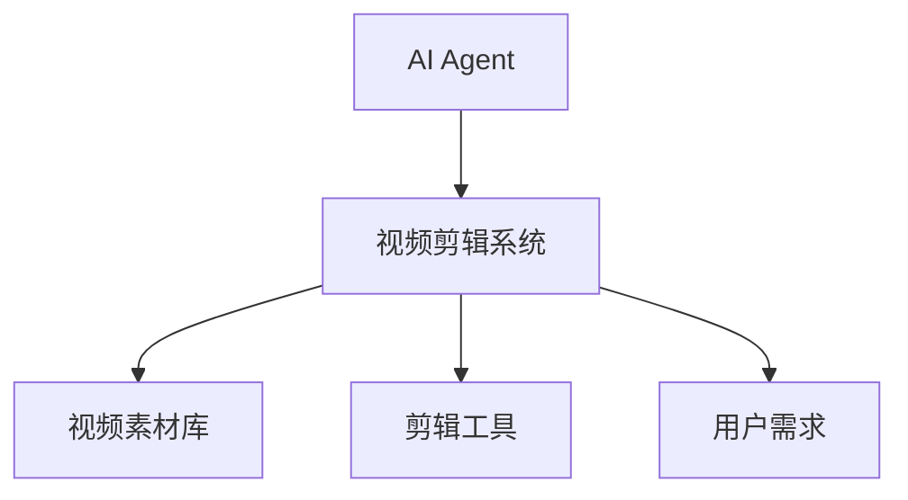
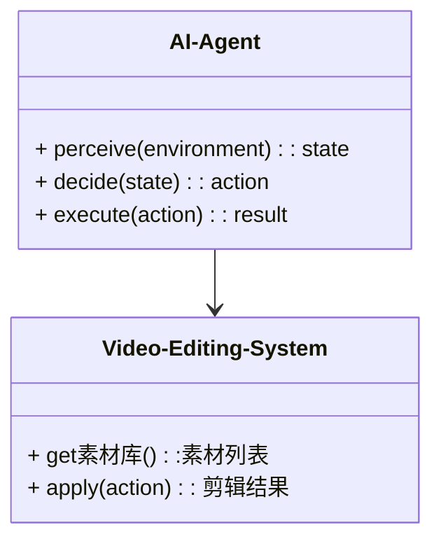
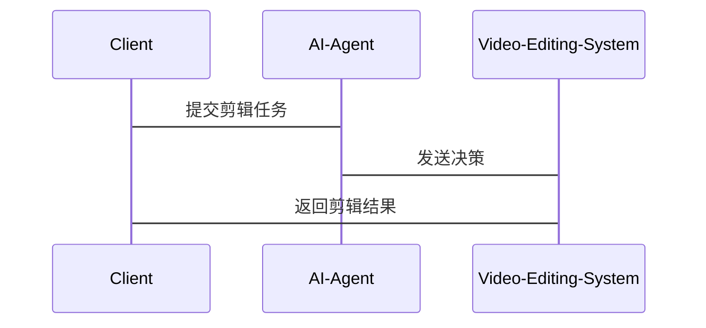

                 


# 开发AI Agent支持的智能视频剪辑系统

---

## 关键词：AI Agent，智能视频剪辑，算法原理，系统架构，项目实战

---

## 摘要：本文详细探讨了开发AI Agent支持的智能视频剪辑系统的背景、核心概念、算法原理、系统架构及项目实战。通过结合AI Agent与视频剪辑技术，提出了创新的解决方案，并通过实际案例分析展示了系统的实现与应用。

---

# 第一部分: AI Agent与智能视频剪辑系统背景介绍

## 第1章: AI Agent与智能视频剪辑系统概述

### 1.1 AI Agent的基本概念与特点

#### 1.1.1 AI Agent的定义与核心要素
AI Agent（人工智能代理）是指能够感知环境并采取行动以实现目标的智能实体。其核心要素包括：
1. **感知能力**：通过传感器或数据接口获取环境信息。
2. **决策能力**：基于感知信息做出决策。
3. **行动能力**：通过执行器或接口影响环境。
4. **学习能力**：通过经验改进性能。

#### 1.1.2 AI Agent的分类与应用场景
AI Agent可以分为**反应式代理**（实时响应环境变化）和**基于模型的代理**（基于内部模型进行决策）。应用场景包括：
1. **自动驾驶**：实时感知和决策。
2. **智能助手**：如Siri、Alexa，提供个性化服务。
3. **游戏AI**：在游戏环境中做出策略性决策。

#### 1.1.3 AI Agent与传统自动化的区别
传统自动化依赖预设规则，而AI Agent具备学习和适应能力，能够处理复杂和动态的环境。

---

### 1.2 智能视频剪辑系统的背景与需求

#### 1.2.1 视频剪辑的基本概念与流程
视频剪辑是将多个视频片段、图像和音频素材组合成一个完整视频的过程，通常包括**素材采集**、**剪辑处理**和**输出生成**三个阶段。

#### 1.2.2 智能视频剪辑的需求与痛点
传统视频剪辑依赖人工操作，效率低且成本高。智能视频剪辑的需求包括：
1. **自动化剪辑**：减少人工干预。
2. **个性化推荐**：基于用户偏好推荐素材。
3. **实时反馈**：快速调整剪辑方案。

痛点在于如何高效处理大量素材和满足多样化的用户需求。

#### 1.2.3 AI Agent在视频剪辑中的应用价值
AI Agent能够自动化处理剪辑任务，提供个性化推荐，并实时优化剪辑方案，显著提升效率和质量。

---

### 1.3 AI Agent支持的智能视频剪辑系统的核心问题

#### 1.3.1 问题背景与问题描述
AI Agent需要解决以下问题：
1. 如何高效识别和分类视频素材？
2. 如何优化剪辑流程以提高效率？
3. 如何实现个性化推荐和实时反馈？

#### 1.3.2 问题解决的关键技术
- **目标检测**：识别视频中的关键物体和人物。
- **图像分割**：分割视频画面中的不同区域。
- **自然语言处理**：理解用户的剪辑需求。

#### 1.3.3 问题的边界与外延
系统仅处理视频剪辑任务，不涉及视频生成和特效添加。

---

### 1.4 系统的核心概念与联系

#### 1.4.1 核心概念原理
AI Agent通过感知剪辑环境（如用户需求和素材库状态）做出决策，驱动剪辑系统执行具体操作。

#### 1.4.2 核心概念属性特征对比表格
| 概念       | 属性       | 特征                                   |
|------------|------------|--------------------------------------|
| AI Agent   | 智能性      | 自主决策、学习能力                   |
| 视频剪辑系统 | 多模态      | 视觉、听觉信息处理                   |

#### 1.4.3 ER实体关系图（Mermaid流程图）


---

## 第2章: AI Agent与智能视频剪辑系统的算法原理

### 2.1 AI Agent的核心算法

#### 2.1.1 基于强化学习的AI Agent算法
强化学习通过奖励机制训练AI Agent做出最优决策。数学模型：
$$ V(s) = \max_{a} [ r + V(s') ] $$
其中，$s$是当前状态，$s'$是动作$a$后的状态，$r$是奖励。

#### 2.1.2 基于监督学习的AI Agent算法
监督学习通过标注数据训练AI Agent，使其能够预测目标输出。例如，使用卷积神经网络（CNN）进行目标检测。

#### 2.1.3 算法原理的数学模型与公式
强化学习中的Q-learning算法：
$$ Q(s, a) = Q(s, a) + \alpha [ r + \max Q(s', a') - Q(s, a) ] $$
其中，$\alpha$是学习率。

---

### 2.2 视频剪辑系统的核心算法

#### 2.2.1 基于目标检测的视频分析
使用YOLO（You Only Look Once）算法进行目标检测，识别视频中的物体。

#### 2.2.2 基于图像分割的场景理解
使用U-Net模型进行图像分割，分割视频画面中的不同区域。

#### 2.2.3 算法原理的数学模型与公式
目标检测中的损失函数：
$$ \text{Loss} = \lambda_1 \text{Classification Loss} + \lambda_2 \text{Localization Loss} $$
其中，$\lambda_1$和$\lambda_2$是平衡系数。

---

## 第3章: AI Agent与智能视频剪辑系统的系统架构设计

### 3.1 系统功能设计

#### 3.1.1 领域模型设计（Mermaid类图）


---

### 3.2 系统架构设计（Mermaid架构图）


---

### 3.3 接口设计与交互流程

#### 3.3.1 系统接口设计（Mermaid序列图）


---

# 第4章: 项目实战

## 4.1 环境安装与配置

#### 4.1.1 开发环境
- **操作系统**：Linux或macOS
- **编程语言**：Python 3.8+
- **依赖库**：TensorFlow、OpenCV、Keras

#### 4.1.2 安装依赖
```bash
pip install tensorflow opencv-python keras
```

---

## 4.2 系统核心功能实现

### 4.2.1 AI Agent的实现

#### 4.2.1.1 使用强化学习实现决策逻辑
```python
import numpy as np

class AI-Agent:
    def __init__(self):
        self.state = None
        self.action = None

    def perceive(self, environment):
        self.state = environment感知结果
        return self.state

    def decide(self):
        action = np.random.choice(可选动作)
        return action

    def execute(self, action):
        return 执行结果
```

---

### 4.2.2 视频剪辑系统的实现

#### 4.2.2.1 使用OpenCV进行视频分析
```python
import cv2

def video_analyze(video_path):
    cap = cv2.VideoCapture(video_path)
    while cap.isOpened():
        ret, frame = cap.read()
        if not ret:
            break
        # 处理每一帧
        cv2.imshow('Video', frame)
        if cv2.waitKey(1) & 0xFF == ord('q'):
            break
    cap.release()
    cv2.destroyAllWindows()
```

---

## 4.3 案例分析与结果展示

### 4.3.1 案例分析
假设用户希望剪辑一段旅游视频，系统通过AI Agent识别视频中的景点，并推荐合适的剪辑方案。

### 4.3.2 结果展示
剪辑后的视频片段展示，系统输出结果包括剪辑后的视频文件和优化建议。

---

## 4.4 项目小结

---

# 第5章: 总结与展望

## 5.1 本章总结
本文详细介绍了AI Agent支持的智能视频剪辑系统的开发过程，包括背景、算法、架构和实战。

## 5.2 当前技术的局限性与挑战
1. **计算资源限制**：复杂任务需要高性能计算。
2. **数据隐私问题**：用户数据的安全性。
3. **算法优化**：如何提升AI Agent的决策效率。

## 5.3 未来的发展方向
- **多模态AI Agent**：结合视觉、听觉等多种感知方式。
- **自适应学习**：增强AI Agent的学习能力，使其能够自适应变化的环境。

## 5.4 最佳实践 tips
- **选择合适的算法**：根据具体需求选择适合的AI Agent算法。
- **优化系统架构**：确保系统的扩展性和维护性。

---

## 作者：AI天才研究院/AI Genius Institute & 禅与计算机程序设计艺术 /Zen And The Art of Computer Programming

