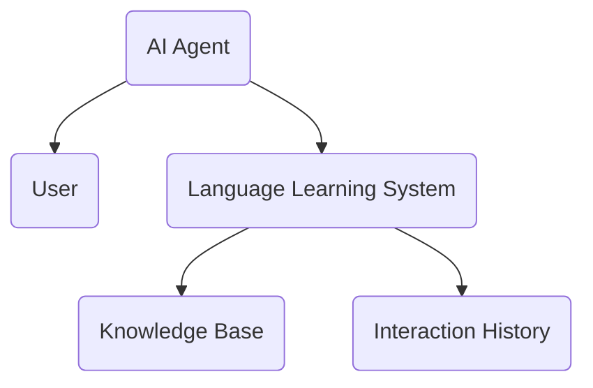
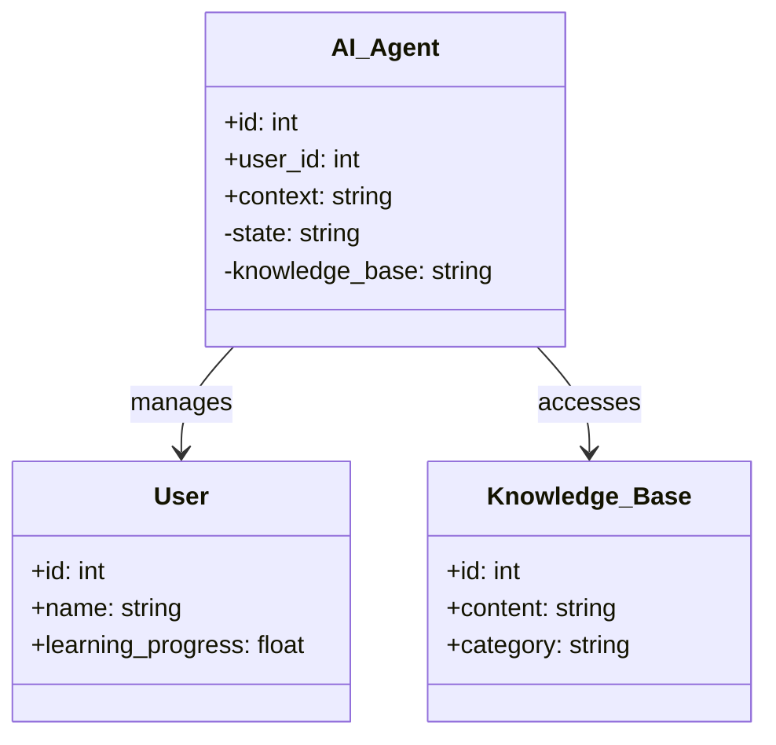
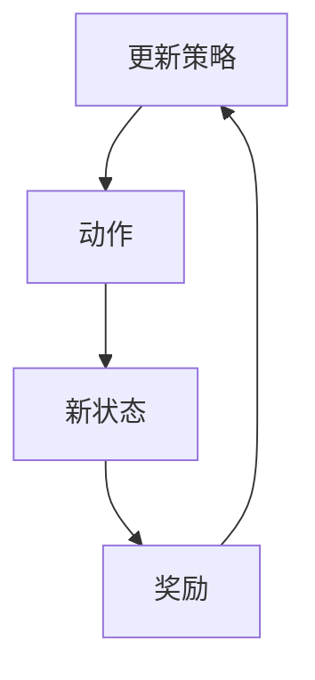
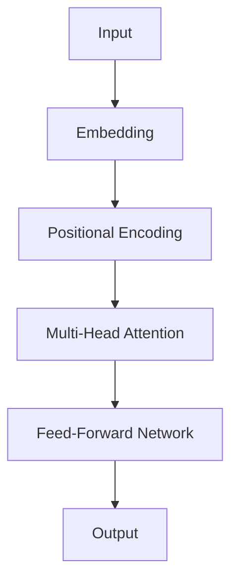
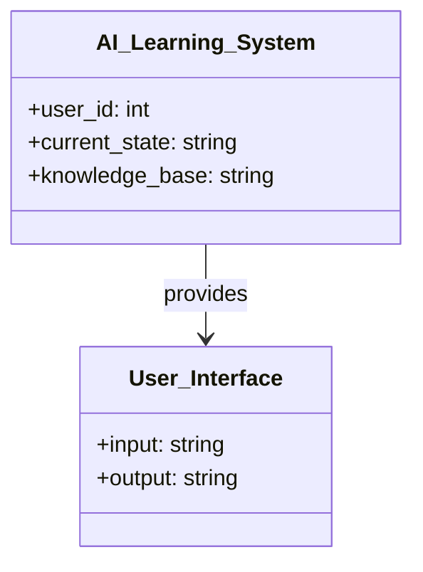
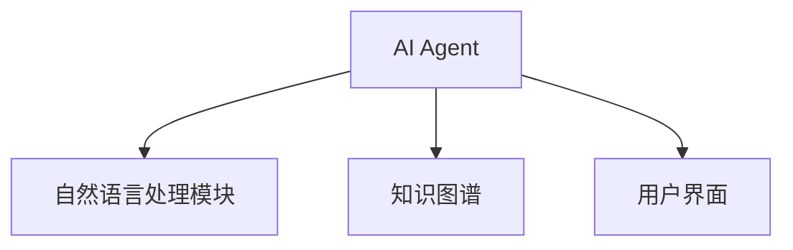
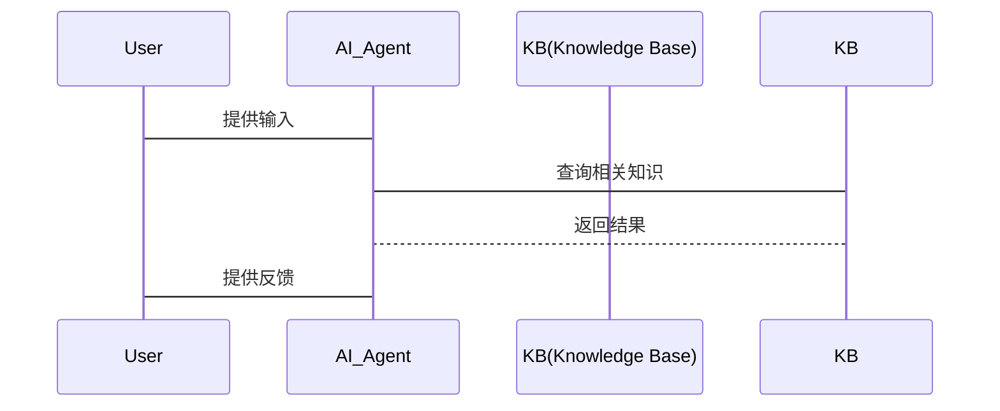

                 


# 开发AI Agent支持的智能语言学习系统

> 关键词：AI Agent, 自然语言处理, 深度学习, 知识图谱, 个性化学习, 实时反馈

> 摘要：本文详细探讨了如何利用AI Agent技术构建智能语言学习系统，通过自然语言处理、深度学习等技术手段，实现个性化的学习体验和实时反馈机制，从而提升学习效果。

---

# 第1章: 问题背景与描述

## 1.1 问题背景

语言学习是一个复杂的过程，传统教学方法难以满足现代学习者多样化的需求。当前语言学习系统存在以下问题：

- **个性化学习不足**：学习者的学习进度和能力差异大，传统系统难以提供个性化的学习路径。
- **实时反馈缺失**：学习者在学习过程中缺乏即时的反馈，影响学习效果。
- **知识点推荐不精准**：传统系统难以根据学习者的需求和能力推荐合适的学习内容。

AI Agent的引入为解决这些问题提供了新的思路。AI Agent可以实时分析学习者的行为和需求，提供个性化的学习建议和实时反馈。

## 1.2 问题描述

为了实现智能化的语言学习系统，我们需要解决以下问题：

- 如何设计AI Agent的核心算法，使其能够理解学习者的需求并提供个性化的学习建议？
- 如何实现AI Agent与自然语言处理技术的结合，提升系统的交互能力？
- 如何构建高效的知识图谱，为AI Agent提供丰富的学习资源和知识点推荐？

## 1.3 问题解决思路

AI Agent在语言学习中的角色定位：

- **知识管理**：AI Agent需要管理学习者的学习进度、知识点掌握情况等信息。
- **交互设计**：AI Agent需要与学习者进行自然语言交互，理解其需求并提供反馈。
- **个性化推荐**：基于学习者的行为和数据，推荐合适的学习内容和练习任务。

## 1.4 边界与外延

- **系统功能的边界**：AI Agent仅负责学习过程中的个性化推荐和反馈，不涉及具体的教学内容生成。
- **与其他系统的区别**：与传统语言学习系统相比，AI Agent支持实时交互和个性化推荐。
- **系统的可扩展性**：AI Agent可以通过不断学习和优化，扩展其知识库和推荐算法。

## 1.5 核心要素组成

- **AI Agent**：负责接收输入、处理数据、生成输出。
- **自然语言处理**：实现文本的理解和生成，支持自然语言交互。
- **知识图谱**：存储和管理学习相关知识，支持知识点推荐。

---

# 第2章: AI Agent与自然语言处理核心概念

## 2.1 AI Agent的基本原理

AI Agent的核心算法包括：

- **强化学习**：通过奖励机制优化AI Agent的决策能力。
- **监督学习**：基于标注数据训练AI Agent的分类能力。
- **无监督学习**：通过聚类等技术发现数据中的隐藏模式。

## 2.2 自然语言处理的核心原理

自然语言处理（NLP）技术是AI Agent实现语言交互的基础。主要包括：

- **分词**：将输入文本分割成有意义的词汇。
- **句法分析**：分析句子的语法结构。
- **语义理解**：理解文本的含义和意图。

## 2.3 核心概念的属性特征对比

| 特性       | AI Agent                  | NLP                     |
|------------|----------------------------|-------------------------|
| 输入        | 用户输入、系统状态        | 文本数据                |
| 输出        | 动作、反馈                | 理解结果、生成文本      |
| 核心算法    | 强化学习、监督学习        | 词嵌入、Transformer模型   |

## 2.4 ER实体关系图架构



## 2.5 领域模型类图



---

# 第3章: 算法原理

## 3.1 强化学习算法

### 3.1.1 强化学习流程



### 3.1.2 算法实现

```python
class AI_Agent:
    def __init__(self):
        self.state = 'initial'
        self.reward = 0

    def take_action(self, action):
        # 执行动作并更新状态
        self.state = self.next_state(self.state, action)
        return self.state

    def next_state(self, current_state, action):
        # 根据当前状态和动作返回新状态
        pass

    def update_reward(self, reward):
        self.reward = reward
```

### 3.1.3 数学模型

策略函数：
$$ \pi(a|s) = P(\text{选择动作 } a \text{ 在状态 } s) $$

奖励函数：
$$ r(s, a, s') = \text{在状态 } s \text{ 采取动作 } a \text{ 后到达状态 } s' \text{ 的奖励} $$

## 3.2 Transformer模型

### 3.2.1 模型结构



### 3.2.2 Python实现

```python
import torch
import torch.nn as nn

class TransformerLayer(nn.Module):
    def __init__(self, d_model, nhead, dim_feedforward):
        super(TransformerLayer, self).__init__()
        self.self_attn = nn.MultiheadAttention(embed_dim=d_model, num_heads=nhead)
        self.feed_forward = nn.Sequential(
            nn.Linear(d_model, dim_feedforward),
            nn.ReLU(),
            nn.Linear(dim_feedforward, d_model)
        )

    def forward(self, x):
        attn_output = self.self_attn(x, x, x)[0]
        feed_output = self.feed_forward(attn_output)
        return feed_output + attn_output
```

---

# 第4章: 系统分析与架构设计

## 4.1 系统功能设计

### 4.1.1 功能模块



## 4.2 系统架构设计

### 4.2.1 系统架构



## 4.3 接口设计

### 4.3.1 API接口

- `/api/input`：接收用户输入
- `/api/output`：返回系统输出
- `/api/recommend`：推荐学习内容

## 4.4 交互设计

### 4.4.1 交互流程



---

# 第5章: 项目实战

## 5.1 环境安装

- Python 3.8+
- PyTorch
- Transformers库
- Mermaid CLI

## 5.2 核心代码实现

### 5.2.1 AI Agent实现

```python
class AI_Agent:
    def __init__(self, knowledge_base):
        self.knowledge_base = knowledge_base
        self.current_state = 'idle'

    def process_input(self, input_text):
        # 分析输入并生成响应
        response = self.analyze_input(input_text)
        return response

    def analyze_input(self, input_text):
        # 简单实现：基于关键词生成响应
        if 'hello' in input_text.lower():
            return 'Hello! How can I help you?'
        else:
            return 'I am sorry, I don't understand.'
```

### 5.2.2 知识图谱构建

```python
from transformers import pipeline

nlp = pipeline("question-generation")
questions = nlp("How to learn English?")
```

## 5.3 代码解读与分析

- **AI Agent**：负责接收输入并生成响应。
- **知识图谱**：用于存储和查询学习相关内容。

## 5.4 案例分析

- **输入**：用户输入“如何提高英语口语？”
- **处理**：AI Agent调用知识图谱生成相关问题和建议。

---

# 第6章: 最佳实践与总结

## 6.1 最佳实践

- **持续优化**：定期更新知识图谱和训练模型。
- **用户反馈**：收集用户反馈以改进系统。
- **安全性**：确保用户数据和隐私安全。

## 6.2 小结

本文详细介绍了AI Agent在智能语言学习系统中的应用，从理论到实践，展示了如何通过技术手段实现个性化的学习体验。

## 6.3 注意事项

- 确保系统的可扩展性和可维护性。
- 在实际应用中注意算法的计算效率。

## 6.4 拓展阅读

- 《Deep Learning》
- 《自然语言处理入门》
- 《强化学习实战》

---

# 作者

作者：AI天才研究院/AI Genius Institute  
& 禅与计算机程序设计艺术 /Zen And The Art of Computer Programming

