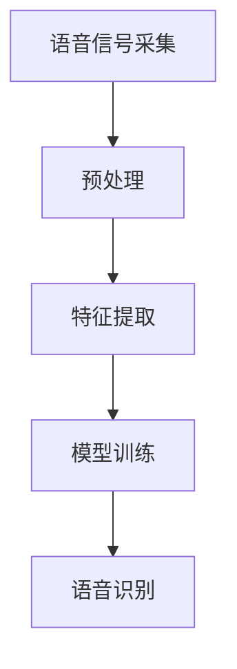
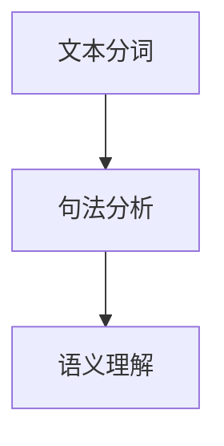
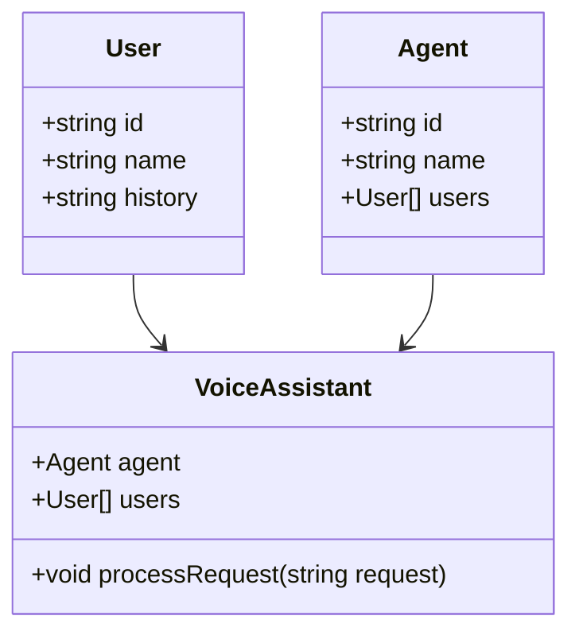
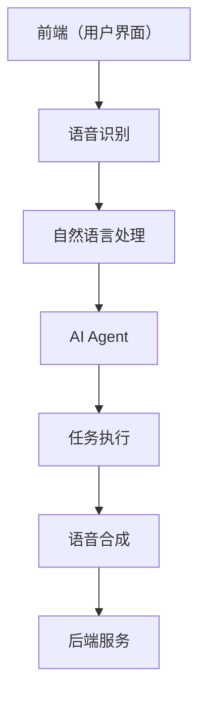
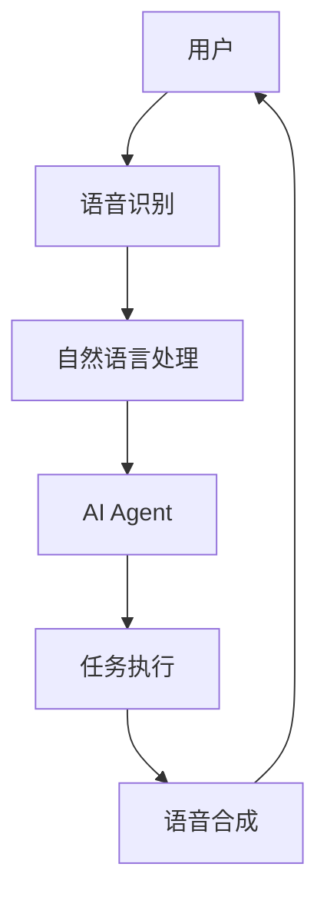

                 


# 开发AI Agent支持的智能语音助手

## 关键词：AI Agent, 智能语音助手, 语音识别, 自然语言处理, 系统架构设计

## 摘要：本文详细探讨了开发AI Agent支持的智能语音助手的全过程，从核心概念到算法实现，从系统设计到项目实战，全面解析了该技术的实现原理和应用实践。文章旨在为开发者提供一份从理论到实践的完整指南，帮助他们理解并掌握如何构建一个基于AI Agent的智能语音助手系统。

---

# 第一部分: AI Agent与智能语音助手的背景介绍

## 第1章: 智能语音助手的发展与现状

### 1.1 智能语音助手的定义与特点

#### 1.1.1 智能语音助手的定义  
智能语音助手是一种基于语音交互的AI系统，能够通过语音识别、自然语言处理（NLP）和语音合成等技术，与用户进行自然对话，完成信息查询、任务执行、娱乐互动等多种功能。

#### 1.1.2 智能语音助手的核心特点  
- **语音交互**：支持语音输入和输出，提供自然的对话体验。  
- **智能理解**：通过NLP技术理解用户的意图并生成相应的回应。  
- **多任务处理**：能够执行多种任务，如播放音乐、设置提醒、查询天气等。  
- **学习能力**：通过机器学习不断优化交互体验和任务执行能力。

#### 1.1.3 智能语音助手的分类与应用场景  
智能语音助手可以分为基于规则和基于大模型两类：  
- **基于规则的智能语音助手**：通过预定义的规则和关键词匹配实现简单的交互，适用于特定场景，如智能家居控制。  
- **基于大模型的智能语音助手**：利用大语言模型（如GPT系列）实现更复杂的语义理解和生成，支持更广泛的应用场景，如客服、教育、医疗等。

---

### 1.2 AI Agent的基本概念

#### 1.2.1 AI Agent的定义与特点  
AI Agent（人工智能代理）是一种智能实体，能够感知环境、自主决策并执行任务。它具有以下特点：  
- **自主性**：能够在没有外部干预的情况下独立运行。  
- **反应性**：能够实时感知环境变化并做出反应。  
- **目标导向**：通过设定目标来驱动行为和决策。  
- **学习能力**：能够通过数据和经验不断优化自身的性能。

#### 1.2.2 AI Agent的核心能力  
- **感知能力**：通过传感器或API获取环境信息。  
- **决策能力**：基于感知信息和内部知识库进行推理和决策。  
- **执行能力**：通过调用外部服务或控制物理设备执行任务。  

#### 1.2.3 AI Agent与智能语音助手的结合  
AI Agent为智能语音助手提供了更强大的后台支持，使其能够处理复杂的任务和多轮对话。例如，AI Agent可以通过分析用户的历史交互记录，理解用户的偏好，并根据上下文提供更精准的服务。

---

### 1.3 智能语音助手的发展历程

#### 1.3.1 从传统语音识别到智能语音助手  
早期的语音识别技术主要用于特定场景的命令识别，如电话语音菜单。随着深度学习的兴起，语音识别的准确性和鲁棒性得到了显著提升，为智能语音助手的发展奠定了基础。

#### 1.3.2 大模型技术对智能语音助手的推动  
大模型技术（如GPT系列）的出现，使得智能语音助手能够理解更复杂的语义，并生成更自然的回复。这种技术的突破推动了智能语音助手从简单的命令执行向智能对话助手的转变。

#### 1.3.3 当前智能语音助手的技术瓶颈与未来趋势  
当前，智能语音助手在多语言支持、复杂场景下的准确性和实时性方面仍存在挑战。未来，随着AI Agent技术的进一步发展，智能语音助手将更加智能化，能够处理更复杂的任务和更自然的交互。

---

## 1.4 本章小结  
本章从智能语音助手的定义、特点和发展历程入手，详细介绍了AI Agent的基本概念及其与智能语音助手的结合方式。通过分析技术瓶颈和未来趋势，为后续章节的深入探讨奠定了基础。

---

# 第二部分: AI Agent与智能语音助手的核心概念与联系

## 第2章: AI Agent与智能语音助手的核心原理

### 2.1 AI Agent的核心原理

#### 2.1.1 AI Agent的基本工作原理  
AI Agent通过感知环境、分析信息、制定计划并执行任务来实现目标。其核心流程如下：  
1. **感知环境**：通过传感器或API获取环境信息。  
2. **分析信息**：利用NLP、机器学习等技术对信息进行理解和分析。  
3. **制定计划**：根据分析结果生成行动方案。  
4. **执行任务**：通过调用外部服务或控制物理设备执行任务。  

#### 2.1.2 AI Agent的感知与决策机制  
AI Agent的感知能力依赖于多模态数据的融合，包括语音、文本、图像等。其决策机制通常基于概率模型和强化学习算法，能够在复杂环境中做出最优决策。

#### 2.1.3 AI Agent的学习与自适应能力  
AI Agent通过监督学习、无监督学习和强化学习等方法不断优化自身的性能。例如，通过用户反馈优化对话策略，通过环境数据优化任务执行效率。

---

### 2.2 智能语音助手的核心原理

#### 2.2.1 语音识别技术  
语音识别是智能语音助手的核心技术之一。其流程如下：  
1. **语音信号采集**：通过麦克风采集用户语音信号。  
2. **预处理**：包括降噪、端点检测等步骤。  
3. **特征提取**：提取语音信号的特征，如梅尔频率倒谱系数（MFCC）。  
4. **模型训练与识别**：利用深度神经网络（DNN）进行语音识别，输出对应的文本内容。  

#### 2.2.2 自然语言处理技术  
自然语言处理（NLP）技术用于理解用户的意图并生成回复。其流程如下：  
1. **文本分词**：将输入文本分割成词语或短语。  
2. **句法分析**：分析句子的语法结构，理解句子的含义。  
3. **语义理解**：基于上下文理解用户的意图，并生成相应的回复。  

#### 2.2.3 语音合成技术  
语音合成技术用于将文本转换为自然的语音输出。其常用算法包括MelGAN、Tacotron等。

---

### 2.3 AI Agent与智能语音助手的结合原理

#### 2.3.1 AI Agent在智能语音助手中的角色  
AI Agent作为智能语音助手的后台大脑，负责处理复杂的任务和多轮对话。例如，当用户提出复杂查询时，AI Agent会调用多个外部服务（如天气预报API、新闻API）来生成准确的回复。

#### 2.3.2 AI Agent与智能语音助手的交互流程  
1. **用户发起请求**：用户通过语音或文本方式向智能语音助手发起请求。  
2. **语音识别**：智能语音助手将用户的语音转换为文本。  
3. **语义理解**：AI Agent分析用户的意图并生成回复。  
4. **语音合成**：智能语音助手将AI Agent的回复生成语音并播放给用户。  
5. **反馈与优化**：AI Agent根据用户反馈优化自身的理解能力和回复策略。

---

### 2.4 本章小结  
本章详细探讨了AI Agent和智能语音助手的核心原理，重点分析了AI Agent在智能语音助手中的角色及其与语音识别、NLP等技术的结合方式。通过对比分析，读者可以更好地理解AI Agent与智能语音助手之间的联系。

---

# 第三部分: AI Agent支持的智能语音助手的算法原理讲解

## 第3章: 语音识别算法原理

### 3.1 语音识别的基本流程  
语音识别的基本流程包括语音信号采集、预处理、特征提取、模型训练与识别。以下是详细的流程图：



---

### 3.2 基于深度学习的语音识别算法

#### 3.2.1 声学模型  
声学模型负责将语音信号映射到语言单元（如音节或单词）。常用的模型包括：  
- **DNN-HMM模型**：结合深度神经网络和隐马尔可夫模型。  
- **CTC-LSTM模型**：基于循环神经网络的连接时序分类模型。  

#### 3.2.2 语音识别的Python实现  
以下是一个简单的语音识别代码示例：

```python
import librosa
import numpy as np

def extract_features(audio_path):
    y, sr = librosa.load(audio_path, sr=None)
    # 提取梅尔频率倒谱系数
    mfccs = librosa.feature.mfcc(y=y, sr=sr)
    return mfccs

# 示例用法
audio_path = "hello.wav"
features = extract_features(audio_path)
print("Feature shape:", features.shape)
```

---

### 3.3 声学模型的数学原理  
声学模型的核心是将语音信号表示为特征向量，并通过分类器预测对应的文本内容。例如，CTC-LSTM模型的损失函数可以表示为：  
$$ \mathcal{L} = -\sum_{t=1}^{T} \log P(y_t|x_t) $$  
其中，$y_t$ 是目标标签，$x_t$ 是输入特征。

---

## 第4章: 自然语言处理算法原理

### 4.1 自然语言处理的基本流程  
自然语言处理的基本流程包括文本分词、句法分析和语义理解。以下是详细的流程图：



---

### 4.2 基于大模型的语义理解

#### 4.2.1 大模型的结构  
大模型通常采用Transformer架构，其核心组件包括编码器和解码器。编码器负责将输入文本映射到向量空间，解码器负责生成目标文本。

#### 4.2.2 大模型的训练流程  
大模型的训练流程包括预训练和微调两个阶段。预训练阶段利用海量数据进行自监督学习，微调阶段在特定任务上进行 fine-tuning。

---

### 4.3 自然语言处理的Python实现  
以下是一个简单的文本分类代码示例：

```python
from transformers import AutoTokenizer, AutoModelForSequenceClassification
import torch

tokenizer = AutoTokenizer.from_pretrained("bert-base-uncased")
model = AutoModelForSequenceClassification.from_pretrained("bert-base-uncased")

def classify_text(text):
    inputs = tokenizer(text, return_tensors="pt")
    outputs = model(**inputs)
    logits = outputs.logits
    predicted_class = torch.argmax(logits).item()
    return predicted_class

# 示例用法
text = "This is a test sentence."
result = classify_text(text)
print("Predicted class:", result)
```

---

### 4.4 大模型的数学原理  
大模型的核心是自注意力机制，其计算公式为：  
$$ \text{Attention}(Q, K, V) = \text{softmax}\left(\frac{QK^T}{\sqrt{d_k}}\right)V $$  
其中，$Q$、$K$、$V$ 分别是查询、键和值向量，$d_k$ 是键的维度。

---

# 第四部分: AI Agent支持的智能语音助手的系统分析与架构设计

## 第5章: 系统分析与架构设计

### 5.1 项目背景介绍  
本项目旨在开发一个基于AI Agent的智能语音助手，支持多轮对话和复杂任务的执行。系统的主要目标包括：  
- 提供自然的语音交互体验。  
- 支持多种任务执行，如信息查询、任务提醒等。  
- 具备学习能力，能够优化交互体验。

---

### 5.2 系统功能设计

#### 5.2.1 领域模型设计  
以下是领域模型的类图：



---

#### 5.2.2 系统架构设计  
以下是系统的架构图：



---

### 5.3 接口设计与交互流程

#### 5.3.1 系统接口设计  
系统主要接口包括：  
- `processRequest(string request)`：处理用户的语音请求。  
- `synthesizeText(string text)`：将文本转换为语音。  
- `recordHistory(string history)`：记录用户的历史交互记录。  

#### 5.3.2 系统交互流程  
以下是系统的交互流程图：



---

## 第5.4 本章小结  
本章从系统分析与架构设计的角度，详细介绍了AI Agent支持的智能语音助手的实现方案。通过领域模型和架构图的展示，读者可以清晰地理解系统的整体结构和各部分的功能关系。

---

# 第五部分: 项目实战

## 第6章: 项目实战

### 6.1 环境安装与配置

#### 6.1.1 安装依赖  
以下是项目所需的Python依赖：

```bash
pip install librosa transformers pytorch-lightning torch
```

---

#### 6.1.2 安装配置  
确保安装了以下环境：  
- Python 3.8 或更高版本。  
- CUDA GPU（用于加速训练）。  
- Jupyter Notebook（用于代码开发和调试）。

---

### 6.2 系统核心功能实现

#### 6.2.1 语音识别实现  
以下是一个简单的语音识别实现代码：

```python
import librosa
import torch
import torch.nn as nn

class SimpleRecognizer(nn.Module):
    def __init__(self, input_size, output_size):
        super(SimpleRecognizer, self).__init__()
        self.fc = nn.Linear(input_size, output_size)

    def forward(self, x):
        return self.fc(x)

# 示例用法
input_size = 20
output_size = 5
model = SimpleRecognizer(input_size, output_size)
```

---

#### 6.2.2 自然语言处理实现  
以下是一个简单的文本分类实现代码：

```python
from transformers import AutoTokenizer, AutoModelForSequenceClassification
import torch

tokenizer = AutoTokenizer.from_pretrained("bert-base-uncased")
model = AutoModelForSequenceClassification.from_pretrained("bert-base-uncased")

def classify_text(text):
    inputs = tokenizer(text, return_tensors="pt")
    outputs = model(**inputs)
    logits = outputs.logits
    predicted_class = torch.argmax(logits).item()
    return predicted_class

# 示例用法
text = "This is a test sentence."
result = classify_text(text)
print("Predicted class:", result)
```

---

#### 6.2.3 AI Agent实现  
以下是一个简单的AI Agent实现代码：

```python
class AIAgent:
    def __init__(self, name):
        self.name = name
        self.history = []

    def process_request(self, request):
        # 处理请求并返回响应
        pass

    def record_history(self, history):
        self.history.append(history)
```

---

### 6.3 代码实现与解读  
通过上述代码示例，我们可以看到智能语音助手的核心功能实现。语音识别部分负责将用户的语音转换为文本，自然语言处理部分负责理解用户的意图并生成回复，AI Agent负责协调各部分的工作并执行任务。

---

### 6.4 项目小结  
本章通过具体的代码实现，展示了AI Agent支持的智能语音助手的核心功能。通过实战项目，读者可以更好地理解理论知识，并掌握实际开发技能。

---

# 第六部分: 总结与展望

## 第7章: 总结与展望

### 7.1 总结  
本文详细探讨了开发AI Agent支持的智能语音助手的全过程，从核心概念到算法实现，从系统设计到项目实战，全面解析了该技术的实现原理和应用实践。通过本文的学习，读者可以掌握从理论到实践的完整开发流程。

---

### 7.2 最佳实践Tips  
- 在开发过程中，建议优先选择现有的开源工具和框架（如Librosa、Hugging Face Transformers）以降低开发成本。  
- 在处理复杂任务时，可以利用AI Agent的分布式计算能力来提高系统的响应速度和处理能力。  
- 在优化系统性能时，建议结合实时监控和日志分析工具，快速定位和解决问题。

---

### 7.3 注意事项  
- 开发AI Agent支持的智能语音助手需要综合运用多种技术，建议开发者具备扎实的机器学习和自然语言处理基础。  
- 在实际应用中，需要注意数据隐私和安全问题，确保用户数据的安全性。  
- 在部署系统时，建议选择可靠的云服务提供商，确保系统的高可用性和稳定性。

---

### 7.4 拓展阅读  
- [《Deep Learning》—— Ian Goodfellow](https://www.deeplearningbook.org/)  
- [《自然语言处理入门》—— 统计机器学习](https://nlp.stanford.edu/IR-book/)  
- [《AI Agent开发指南》—— O'Reilly 出版社](https://www.oreilly.com/)

---

# 作者：AI天才研究院/AI Genius Institute & 禅与计算机程序设计艺术/Zen And The Art of Computer Programming

