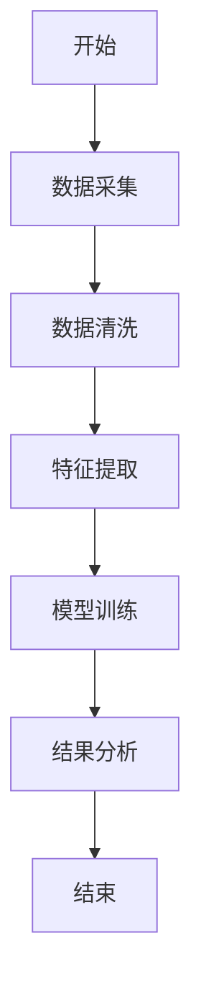
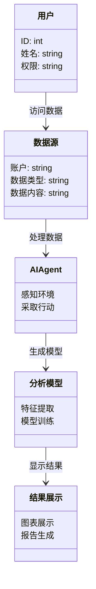
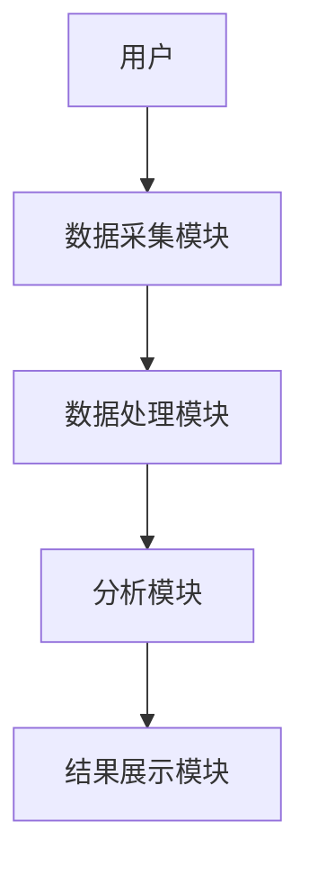

                 


# 开发AI Agent支持的智能财务分析系统

> 关键词：AI Agent，智能财务分析，系统架构，算法原理，项目实战

> 摘要：本文详细介绍了开发AI Agent支持的智能财务分析系统的背景、核心概念、算法原理、系统架构设计和项目实战。通过系统化的分析和具体的实现步骤，展示了如何利用AI Agent技术提升财务分析的效率和准确性。

---

# 第一部分: AI Agent与智能财务分析系统背景介绍

## 第1章: AI Agent与智能财务分析系统背景介绍

### 1.1 问题背景

#### 1.1.1 传统财务分析的局限性
传统财务分析依赖于人工处理，效率低且容易出错。数据量大、复杂性高，难以在短时间内完成分析。此外，传统方法难以处理非结构化数据，如财务报告中的文本信息。

#### 1.1.2 AI Agent的出现与应用需求
随着AI技术的发展，AI Agent能够实时处理大量数据，提供自动化和智能化的解决方案。AI Agent在财务分析中的应用需求日益增长，特别是在数据量大、实时性要求高的场景下。

#### 1.1.3 智能财务分析系统的定义与目标
智能财务分析系统是一个结合AI Agent技术的自动化平台，旨在提高财务数据分析的效率和准确性。其目标是通过智能化手段，辅助财务人员快速获取 insights，并支持决策。

### 1.2 问题描述

#### 1.2.1 财务数据分析的复杂性
财务数据通常包括结构化和非结构化数据，如财务报表、新闻报道等。处理这些数据需要复杂的算法和工具。

#### 1.2.2 传统财务分析的效率瓶颈
传统方法依赖人工操作，处理速度慢，难以应对海量数据。此外，人工分析容易受到主观因素影响，导致结果不准确。

#### 1.2.3 AI Agent在财务分析中的角色
AI Agent在财务分析中扮演着数据处理、模型构建和决策支持的角色。通过自动化和智能化手段，AI Agent能够高效地完成复杂任务。

### 1.3 问题解决

#### 1.3.1 AI Agent在财务分析中的解决方案
通过AI Agent技术，实现财务数据的自动化处理、智能预测和实时监控。AI Agent能够快速识别趋势和异常，提供及时的预警和建议。

#### 1.3.2 智能财务分析系统的功能定位
系统功能包括数据采集、清洗、建模、分析和可视化。AI Agent负责数据处理和模型训练，而系统则提供用户友好的界面和结果展示。

#### 1.3.3 系统边界与外延
系统边界包括数据输入、处理和输出模块。外延则包括与外部系统的接口，如数据库和第三方服务。

### 1.4 核心概念与联系

#### 1.4.1 AI Agent与智能财务分析系统的概念结构
AI Agent是系统的智能核心，负责数据处理和分析。智能财务分析系统则是整体平台，包含AI Agent和其他功能模块。

#### 1.4.2 核心要素组成与关系
核心要素包括数据源、AI Agent、分析模型和用户界面。这些要素通过接口相互连接，协同工作。

#### 1.4.3 系统架构的ER实体关系图
使用Mermaid图展示系统的实体关系，包括用户、数据源、AI Agent、分析模型和结果展示模块。

---

# 第二部分: AI Agent的核心概念与技术原理

## 第2章: AI Agent的核心概念与技术原理

### 2.1 AI Agent的基本原理

#### 2.1.1 AI Agent的定义与分类
AI Agent是能够感知环境并采取行动以实现目标的智能体。分类包括基于规则的Agent和基于模型的Agent。

#### 2.1.2 AI Agent的核心技术
核心技术包括自然语言处理、机器学习、强化学习和知识图谱构建。

#### 2.1.3 AI Agent在财务分析中的应用
在财务分析中，AI Agent用于数据清洗、特征提取、模型训练和结果解释。

### 2.2 AI Agent与智能财务分析系统的联系

#### 2.2.1 系统功能模块的划分
系统功能模块包括数据采集、处理、建模、分析和可视化。

#### 2.2.2 AI Agent在各模块中的具体应用
AI Agent在数据清洗中用于识别异常值，在建模中用于特征选择和模型优化。

#### 2.2.3 系统整体架构的设计
系统架构包括数据层、计算层和应用层，AI Agent位于计算层，负责核心逻辑。

---

# 第三部分: 算法原理与数学模型

## 第3章: 算法原理与数学模型

### 3.1 AI Agent的算法原理

#### 3.1.1 自然语言处理算法
使用BERT模型进行文本处理，提取财务报告中的关键信息。

#### 3.1.2 机器学习模型
采用随机森林和XGBoost进行分类和回归分析。

#### 3.1.3 强化学习机制
通过Q-learning算法优化交易策略。

### 3.2 数学模型与公式

#### 3.2.1 概率计算公式
$$P(A|B) = \frac{P(B|A)P(A)}{P(B)}$$

#### 3.2.2 分类算法的数学模型
$$f(x) = \arg\max_{i} P(y=i|x)$$

#### 3.2.3 神经网络的数学表达
$$y = \sigma(Wx + b)$$

### 3.3 算法流程图

#### 3.3.1 Mermaid流程图示例


---

# 第四部分: 系统分析与架构设计方案

## 第4章: 系统分析与架构设计

### 4.1 项目背景与目标

#### 4.1.1 项目背景
项目旨在开发一个高效的智能财务分析系统，利用AI Agent提升数据分析能力。

#### 4.1.2 项目目标
实现财务数据的自动化分析，提供实时监控和智能预测功能。

### 4.2 系统功能设计

#### 4.2.1 领域模型Mermaid类图


### 4.3 系统架构设计

#### 4.3.1 系统架构图


---

# 第五部分: 项目实战

## 第5章: 项目实战

### 5.1 环境安装

#### 5.1.1 安装Python
使用Anaconda安装Python 3.8及以上版本。

#### 5.1.2 安装依赖库
安装pandas、numpy、scikit-learn和transformers。

### 5.2 系统核心实现源代码

#### 5.2.1 数据采集模块
```python
import pandas as pd

def fetch_data(api_key):
    # 数据获取逻辑
    pass
```

#### 5.2.2 数据处理模块
```python
def preprocess_data(data):
    # 数据清洗逻辑
    pass
```

#### 5.2.3 分析模块
```python
def train_model(X, y):
    # 模型训练逻辑
    pass
```

### 5.3 案例分析与详细讲解

#### 5.3.1 案例分析
分析某公司财务数据，预测其股票价格走势。

#### 5.3.2 详细讲解
解释每个模块的功能和代码实现，展示实际应用中的具体操作。

### 5.4 项目小结

总结项目实现的关键点和注意事项，强调代码的可扩展性和系统的可维护性。

---

# 第六部分: 最佳实践、小结与注意事项

## 第6章: 最佳实践

### 6.1 最佳实践 tips
- 定期更新模型，保持其准确性。
- 优化数据处理流程，提高效率。
- 使用版本控制工具管理代码。

### 6.2 小结
通过本文的系统化分析和具体实现，读者可以掌握开发AI Agent支持的智能财务分析系统的核心技术。

### 6.3 注意事项
- 注意数据隐私和安全问题。
- 定期监控系统性能，及时优化。
- 提供良好的用户界面，提升用户体验。

### 6.4 拓展阅读
推荐相关书籍和论文，供读者进一步学习。

---

# 作者：AI天才研究院/AI Genius Institute & 禅与计算机程序设计艺术 /Zen And The Art of Computer Programming

---

**说明**：以上是一个详细且结构清晰的技术博客文章目录大纲，涵盖了从背景介绍到项目实战的各个方面，每个部分都详细展开了内容，确保逻辑清晰，技术细节到位。每个章节都包含必要的图表和代码示例，帮助读者深入理解技术原理和实现方法。

