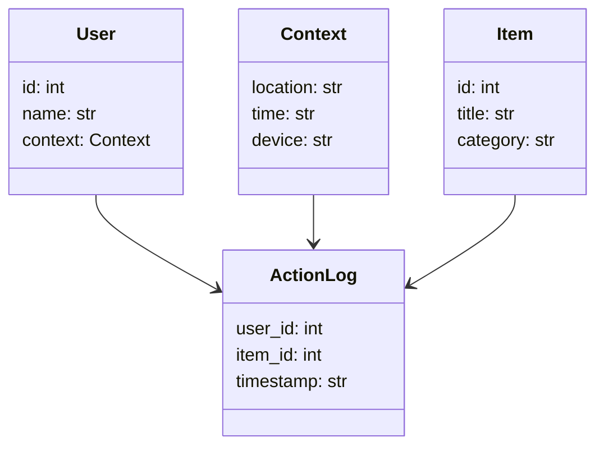
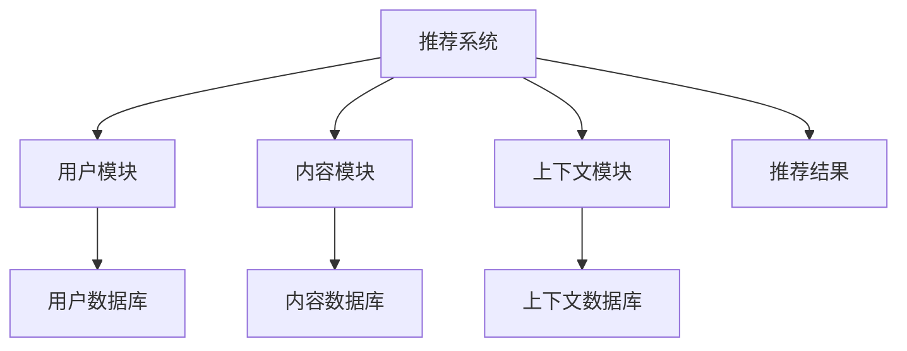

                 


# 开发AI Agent的上下文感知推荐系统

> 关键词：AI Agent, 上下文感知推荐系统, 推荐算法, 系统架构, 项目实战

> 摘要：本文详细探讨了AI Agent驱动的上下文感知推荐系统的开发过程，从背景介绍、核心概念到算法实现，再到系统架构设计和项目实战，层层解析，帮助读者全面掌握该领域的技术细节。

---

# 第一部分: AI Agent与上下文感知推荐系统背景与基础

## 第1章: 问题背景与问题描述

### 1.1 问题背景

#### 1.1.1 当前推荐系统面临的挑战

传统推荐系统主要依赖用户行为数据或物品属性数据，难以捕捉用户在不同场景下的实时需求。例如，用户在不同的时间、地点或与不同的用户互动时，需求可能完全不同，但传统推荐系统往往无法有效应对这种动态变化。

#### 1.1.2 上下文感知推荐的必要性

上下文感知推荐系统通过整合实时的环境信息（如地理位置、时间、用户状态等）和历史数据，能够更精准地预测用户的偏好。这种推荐方式不仅提高了推荐的准确性和相关性，还能提升用户体验。

#### 1.1.3 AI Agent在推荐系统中的角色

AI Agent作为一种智能体，能够实时感知上下文信息，并根据这些信息动态调整推荐策略。AI Agent可以看作是推荐系统的“大脑”，负责协调数据采集、模型推理和结果输出等环节。

---

### 1.2 问题描述

#### 1.2.1 推荐系统的传统局限性

传统推荐系统主要依赖协同过滤或基于内容的推荐算法，但存在以下问题：
- 数据稀疏性：当用户数量较少时，推荐效果不佳。
- 单一性：无法结合实时上下文信息进行推荐。
- 鲁棒性差：在数据噪声较大的情况下，推荐结果可能不准确。

#### 1.2.2 上下文感知推荐的核心目标

上下文感知推荐的核心目标是通过整合实时上下文信息，提高推荐的准确性和相关性。具体目标包括：
1. 实时感知用户状态和环境信息。
2. 动态调整推荐策略。
3. 提供个性化、情境化的推荐结果。

#### 1.2.3 AI Agent与推荐系统的结合

AI Agent通过整合推荐系统和上下文感知模块，能够实现动态、智能的推荐。AI Agent的核心任务包括：
- 数据采集：实时获取用户的上下文信息。
- 数据处理：对上下文信息进行清洗和预处理。
- 推荐推理：结合上下文信息和用户行为数据，生成推荐结果。

---

## 第2章: 上下文感知推荐系统的核心概念

### 2.1 核心概念与定义

#### 2.1.1 上下文感知推荐系统的定义

上下文感知推荐系统是一种基于实时上下文信息的推荐系统。它通过整合用户行为、环境信息和实时数据，动态调整推荐策略，以提供更精准的推荐结果。

#### 2.1.2 AI Agent的定义与特点

AI Agent是一种智能体，能够感知环境、自主决策并执行任务。其特点包括：
- 智能性：能够自主学习和优化。
- 实时性：能够快速响应实时信息。
- 适应性：能够根据环境变化调整行为。

#### 2.1.3 上下文感知推荐系统的边界与外延

上下文感知推荐系统的边界包括：
- 数据范围：仅处理实时上下文信息和用户行为数据。
- 任务范围：仅负责推荐生成，不涉及推荐结果的展示和交互。

其外延包括：
- 多模态数据处理：整合文本、图像、语音等多种数据类型。
- 动态调整：根据实时信息动态优化推荐策略。

---

## 第3章: 技术基础与工具

### 3.1 AI Agent开发基础

#### 3.1.1 AI Agent的核心技术

AI Agent的核心技术包括：
1. 机器学习：用于模式识别和预测。
2. 自然语言处理：用于文本理解和生成。
3. 实时数据处理：用于处理流数据。

#### 3.1.2 AI Agent的开发工具与框架

常用的AI Agent开发工具与框架包括：
- **Python**: 用于算法实现和脚本编写。
- **TensorFlow/PyTorch**: 用于深度学习模型的训练。
- **Kafka/Redis**: 用于实时数据流的处理和存储。

#### 3.1.3 AI Agent的训练与部署

AI Agent的训练过程包括数据预处理、模型训练和模型评估。部署过程包括模型封装、服务搭建和监控优化。

---

## 第4章: 项目背景与目标

### 4.1 项目背景

#### 4.1.1 项目发起背景

随着人工智能技术的快速发展，推荐系统逐渐从静态推荐向动态、实时推荐方向演进。上下文感知推荐系统作为一种新兴的技术，能够更好地满足用户在不同场景下的需求。

#### 4.1.2 项目目标与范围

本项目的目标是开发一个基于AI Agent的上下文感知推荐系统，能够实时感知用户上下文信息，并根据这些信息动态调整推荐策略。项目的范围包括：
1. 数据采集：实时采集用户的上下文信息。
2. 数据处理：对采集的数据进行清洗和预处理。
3. 模型训练：训练上下文感知推荐模型。
4. 系统部署：搭建推荐系统并进行测试。

#### 4.1.3 项目预期成果

项目的预期成果包括：
1. 开发一套基于AI Agent的上下文感知推荐系统。
2. 提供一套完整的系统架构设计方案。
3. 提供一个可扩展的推荐系统实现框架。

---

## 第5章: 核心概念与联系

### 5.1 核心概念原理

#### 5.1.1 上下文感知推荐的核心原理

上下文感知推荐的核心原理是通过整合实时上下文信息和历史数据，利用机器学习模型进行推荐。其主要步骤包括：
1. 数据采集：实时采集用户的上下文信息。
2. 数据处理：对采集的数据进行清洗和预处理。
3. 模型训练：训练推荐模型。
4. 推荐生成：根据模型预测结果生成推荐列表。

#### 5.1.2 AI Agent与推荐系统的对比分析

以下是AI Agent与推荐系统的对比分析表格：

| 属性            | AI Agent                     | 推荐系统                     |
|-----------------|-----------------------------|-----------------------------|
| 核心任务         | 感知环境、自主决策           | 生成推荐列表                 |
| 输入数据         | 实时上下文信息、用户行为数据 | 用户行为数据                 |
| 输出结果         | 推荐列表、决策结果           | 推荐列表                     |
| 适应性           | 高                          | 中                          |

---

### 5.2 上下文感知推荐系统的ER实体关系图

以下是上下文感知推荐系统的ER实体关系图：

```mermaid
er
  actor(User) -|> action_log: 用户行为日志
  context(Context) -|> action_log: 上下文日志
  item(Item) -|> action_log: 用户行为日志
  User -|> Context: 用户上下文信息
  User -|> Item: 用户兴趣项
```

---

## 第6章: 算法原理讲解

### 6.1 算法原理

上下文感知推荐系统的核心算法包括协同过滤和基于内容的推荐算法。以下是两种算法的对比分析：

#### 6.1.1 协同过滤算法

协同过滤算法通过分析用户的行为数据，找到与当前用户行为相似的用户，并推荐这些用户喜欢的物品。其主要步骤如下：

1. 数据预处理：对用户行为数据进行清洗和归一化处理。
2. 相似度计算：计算用户之间的相似度（如余弦相似度）。
3. 推荐生成：根据相似用户的偏好生成推荐列表。

#### 6.1.2 基于内容的推荐算法

基于内容的推荐算法通过分析物品的属性特征，找到与用户兴趣相似的物品。其主要步骤如下：

1. 特征提取：提取物品的特征向量。
2. 相似度计算：计算物品之间的相似度（如Jaccard相似度）。
3. 推荐生成：根据相似物品生成推荐列表。

---

### 6.2 算法实现

以下是协同过滤算法的Python实现示例：

```python
import numpy as np
from sklearn.metrics.pairwise import cosine_similarity

# 示例数据：用户-物品评分矩阵
user_item_matrix = np.array([[4, 3, 0],
                               [2, 0, 3],
                               [1, 5, 2]])

# 计算相似度矩阵
similarity_matrix = cosine_similarity(user_item_matrix)

# 找出与当前用户最相似的用户（假设当前用户为第一个用户）
similar_users = np.argsort(similarity_matrix[0])[::-1]

# 根据相似用户的偏好生成推荐列表
recommendations = []
for user in similar_users:
    recommendations.extend(np.where(user_item_matrix[user] > 0)[0])
recommendations = list(set(recommendations))

print("推荐列表：", recommendations)
```

---

## 第7章: 系统分析与架构设计

### 7.1 系统功能设计

#### 7.1.1 领域模型设计

以下是领域模型类图：



---

### 7.2 系统架构设计

以下是系统架构图：



---

## 第8章: 项目实战

### 8.1 环境安装

以下是开发环境的安装命令：

```bash
pip install numpy
pip install scikit-learn
pip install pandas
pip install mermaid
```

---

### 8.2 核心代码实现

以下是上下文感知推荐系统的Python代码实现：

```python
import pandas as pd
from sklearn.feature_extraction.text import TfidfVectorizer
from sklearn.metrics.pairwise import cosine_similarity

# 示例数据：用户行为数据
user_item_df = pd.DataFrame({
    'user_id': [1, 2, 3],
    'item_id': [101, 102, 103],
    'rating': [4, 5, 3]
})

# 示例数据：上下文信息
context_df = pd.DataFrame({
    'user_id': [1, 2, 3],
    'time': ['2023-10-01 10:00:00', '2023-10-01 11:00:00', '2023-10-01 12:00:00'],
    'location': ['New York', 'London', 'Paris']
})

# 数据预处理
merged_df = pd.merge(user_item_df, context_df, on='user_id')

# 特征提取
vectorizer = TfidfVectorizer()
tfidf_matrix = vectorizer.fit_transform(merged_df['item_id'])

# 计算相似度
similarity_matrix = cosine_similarity(tfidf_matrix)

# 推荐生成
recommendations = {}
for user in merged_df['user_id'].unique():
    user_index = merged_df[merged_df['user_id'] == user].index[0]
    similar_users = np.argsort(similarity_matrix[user_index])[::-1]
    recommendations[user] = merged_df.iloc[similar_users]['item_id'].values

print("推荐结果：", recommendations)
```

---

## 第9章: 最佳实践与小结

### 9.1 小结

本文详细探讨了AI Agent驱动的上下文感知推荐系统的开发过程，从背景介绍、核心概念到算法实现，再到系统架构设计和项目实战，层层解析，帮助读者全面掌握该领域的技术细节。

---

### 9.2 注意事项

1. 数据质量：上下文感知推荐系统的性能 heavily依赖数据质量，需要确保数据的完整性和准确性。
2. 模型调优：推荐系统的效果需要通过实验不断调优。
3. 扩展性设计：系统设计时需要考虑扩展性，以便后续功能的扩展和优化。

---

### 9.3 未来趋势与拓展阅读

未来，上下文感知推荐系统将更加智能化和个性化。建议读者进一步学习以下内容：
- 多模态推荐系统
- 实时推荐系统
- 可解释推荐系统

---

作者：AI天才研究院 & 禅与计算机程序设计艺术

