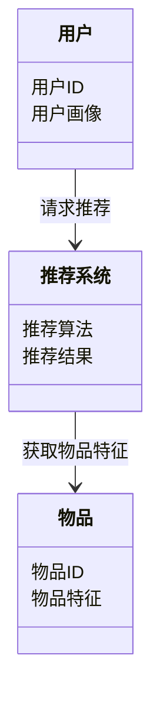

                 


# 开发AI Agent的个性化推荐系统

## 关键词：
- AI Agent
- 个性化推荐系统
- 协同过滤
- 知识图谱
- 系统架构
- 项目实战

## 摘要：
本文详细探讨了开发AI Agent个性化推荐系统的各个方面，从背景介绍到系统架构设计，再到项目实战。文章首先解释了AI Agent和个性化推荐系统的概念，讨论了当前推荐系统的痛点与挑战。接着，深入分析了协同过滤、基于内容的推荐和基于知识图谱的推荐算法，通过数学公式和Mermaid流程图展示了算法原理。随后，设计了推荐系统的整体架构，包括数据采集、特征提取、模型训练等模块，并提供了Python代码示例。最后，总结了系统优缺点，展望了未来发展方向，并给出了最佳实践建议。

---

# 第1章 AI Agent与个性化推荐系统概述

## 1.1 问题背景与描述

### 1.1.1 个性化推荐系统的背景
个性化推荐系统是一种基于用户行为和偏好，利用AI技术提供定制化建议的系统。随着互联网的快速发展，用户在面对海量信息时，需要系统帮助筛选出感兴趣的内容。个性化推荐系统广泛应用于电商、音乐、电影等领域，极大地提升了用户体验。

### 1.1.2 AI Agent在推荐系统中的作用
AI Agent（人工智能代理）能够通过分析用户行为和历史数据，主动为用户提供个性化推荐。AI Agent能够实时响应用户需求，优化推荐结果，提升推荐的准确性和相关性。

### 1.1.3 当前推荐系统的痛点与挑战
- 数据量大：用户行为数据繁多，处理难度大。
- 算法复杂：推荐算法需要不断优化，以适应不同场景。
- 用户隐私：如何在推荐过程中保护用户隐私是一个重要挑战。

## 1.2 问题解决与边界

### 1.2.1 个性化推荐的核心问题
个性化推荐的核心问题在于如何准确预测用户的偏好，推荐最相关的物品。这需要分析用户行为、物品属性以及两者之间的关系。

### 1.2.2 AI Agent在推荐系统中的边界
AI Agent的推荐系统边界包括数据采集、特征提取、模型训练和结果输出。AI Agent需要与其他系统模块协同工作，如用户交互界面和后端数据库。

### 1.2.3 推荐系统的外延与应用场景
推荐系统的外延包括实时推荐、离线推荐、混合推荐等。应用场景广泛，如电商、社交网络、新闻媒体等。

## 1.3 系统核心要素与组成

### 1.3.1 推荐系统的组成模块
推荐系统通常包括数据采集模块、特征提取模块、模型训练模块和结果输出模块。

### 1.3.2 AI Agent的核心要素
AI Agent的核心要素包括感知能力、决策能力和执行能力。感知能力用于收集用户数据，决策能力用于选择推荐策略，执行能力用于输出推荐结果。

### 1.3.3 系统架构的初步框架
推荐系统的初步架构包括数据层、算法层和应用层。数据层负责存储和管理数据，算法层负责推荐计算，应用层负责展示结果。

---

# 第2章 核心概念与联系

## 2.1 核心概念原理

### 2.1.1 推荐系统的原理
推荐系统通过分析用户行为和物品属性，利用算法生成个性化推荐。推荐系统的核心是计算用户和物品之间的相似度或相关性。

### 2.1.2 AI Agent的推荐机制
AI Agent通过感知用户需求，利用推荐算法生成推荐结果，并实时调整推荐策略以优化用户体验。

### 2.1.3 个性化推荐的核心算法
个性化推荐的核心算法包括协同过滤、基于内容的推荐和基于知识图谱的推荐。

## 2.2 概念属性对比表

| 概念 | 描述 |
|------|------|
| 协同过滤 | 基于用户相似性推荐 |
| 基于内容的推荐 | 基于物品特征推荐 |
| 基于知识图谱的推荐 | 基于语义理解推荐 |

## 2.3 ER实体关系图
```mermaid
er
actor: 用户
agent: AI Agent
item: 物品
preference: 用户偏好
interaction: 用户互动
```

---

# 第3章 算法原理与实现

## 3.1 协同过滤算法

### 3.1.1 基于用户的协同过滤
基于用户的协同过滤算法通过寻找与目标用户相似的用户群体，推荐这些用户喜欢的物品。相似度计算通常使用余弦相似度。

### 3.1.2 基于物品的协同过滤
基于物品的协同过滤算法通过寻找与目标物品相似的物品，推荐给用户。相似度计算同样使用余弦相似度。

### 3.1.3 混合协同过滤的实现
混合协同过滤结合了基于用户和基于物品的协同过滤，通过加权平均的方式生成推荐结果。

### 3.1.4 协同过滤的数学公式
相似度计算公式：
$$\text{sim}(i,j) = \frac{\sum_{k} (r_{ik} - \bar{r}_i)(r_{jk} - \bar{r}_j)}{\sqrt{\sum_{k} (r_{ik} - \bar{r}_i)^2} \sqrt{\sum_{k} (r_{jk} - \bar{r}_j)^2}}$$

## 3.2 基于内容的推荐

### 3.2.1 基于内容的推荐原理
基于内容的推荐通过分析物品的特征，计算物品之间的相似度，推荐相似的物品。

### 3.2.2 

---

# 第4章 系统架构设计

## 4.1 问题场景介绍

### 4.1.1 系统功能描述
推荐系统需要采集用户行为数据，提取特征，训练模型，并输出推荐结果。

### 4.1.2 系统需求分析
系统需要支持实时推荐、离线推荐、用户画像构建等功能。

## 4.2 系统功能设计

### 4.2.1 领域模型类图


### 4.2.2 系统架构图


## 4.3 系统接口设计

### 4.3.1 API接口定义
推荐系统提供RESTful API接口，支持用户请求和推荐结果返回。

### 4.3.2 API接口实现
通过Python Flask框架实现API接口，处理用户请求并返回推荐结果。

## 4.4 系统交互设计

### 4.4.1 用户与系统交互流程
用户发起推荐请求，系统处理并返回推荐结果。

### 4.4.2 系统与数据库交互
系统从数据库中获取用户行为数据和物品特征数据，进行推荐计算。

---

# 第5章 项目实战

## 5.1 环境安装

### 5.1.1 安装Python环境
使用Anaconda安装Python 3.8及以上版本。

### 5.1.2 安装依赖库
安装numpy、pandas、scikit-learn等依赖库。

## 5.2 系统核心实现

### 5.2.1 数据采集模块
编写代码采集用户行为数据，存储到数据库中。

### 5.2.2 特征提取模块
从用户行为数据中提取用户画像和物品特征。

### 5.2.3 模型训练模块
训练协同过滤模型，生成推荐结果。

## 5.3 代码实现示例

### 5.3.1 协同过滤算法实现
```python
import numpy as np

def user_based_collaborative_filtering(rating_matrix):
    # 计算平均评分
    avg_rating = np.mean(rating_matrix, axis=1)
    # 计算相似度矩阵
    similarity_matrix = np.zeros((n_users, n_users))
    for i in range(n_users):
        for j in range(n_users):
            similarity_matrix[i][j] = np.dot((rating_matrix[i] - avg_rating[i]), (rating_matrix[j] - avg_rating[j]).T)
            similarity_matrix[i][j] /= (np.sqrt(np.sum((rating_matrix[i] - avg_rating[i])**2)) * np.sqrt(np.sum((rating_matrix[j] - avg_rating[j])**2)))
    return similarity_matrix
```

### 5.3.2 推荐结果输出模块
编写代码将推荐结果输出到前端界面，供用户查看。

## 5.4 项目小结

### 5.4.1 实战项目总结
总结项目实现的关键步骤和遇到的问题，提出改进建议。

### 5.4.2 项目部署与测试
将推荐系统部署到云服务器，进行性能测试和功能测试。

---

# 第6章 总结与展望

## 6.1 系统优缺点分析

### 6.1.1 系统优点
推荐系统能够提升用户体验，提高用户满意度。

### 6.1.2 系统缺点
推荐系统的计算复杂度高，对数据量要求大。

## 6.2 未来发展方向

### 6.2.1 深度学习在推荐系统中的应用
研究基于深度学习的推荐算法，如神经网络协同过滤。

### 6.2.2 多模态推荐系统的开发
结合文本、图像等多种模态信息，提升推荐系统的准确性。

## 6.3 最佳实践 tips

### 6.3.1 数据预处理的重要性
在推荐系统中，数据预处理是提升推荐效果的关键步骤。

### 6.3.2 模型调优的技巧
通过交叉验证和网格搜索，优化推荐模型的参数。

---

作者：AI天才研究院/AI Genius Institute & 禅与计算机程序设计艺术 /Zen And The Art of Computer Programming

