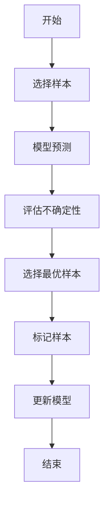
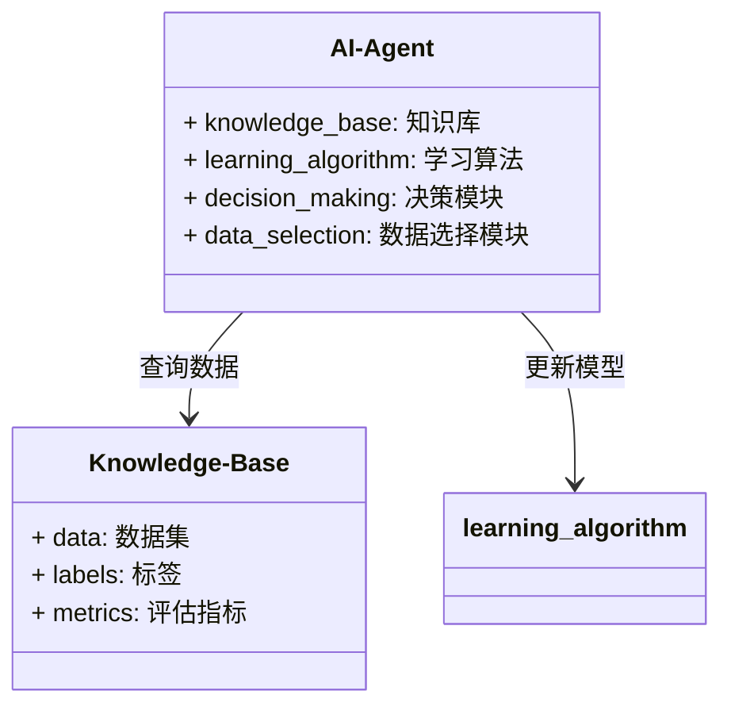
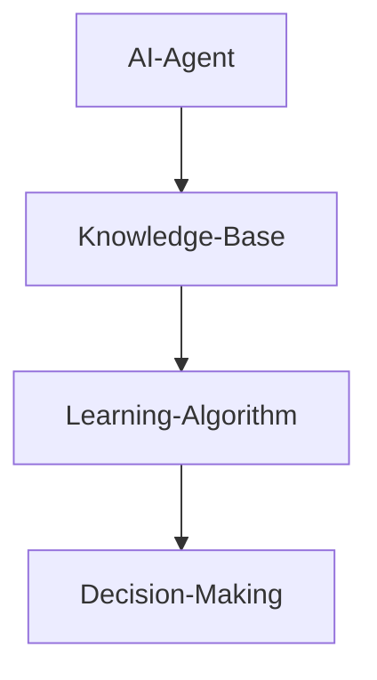
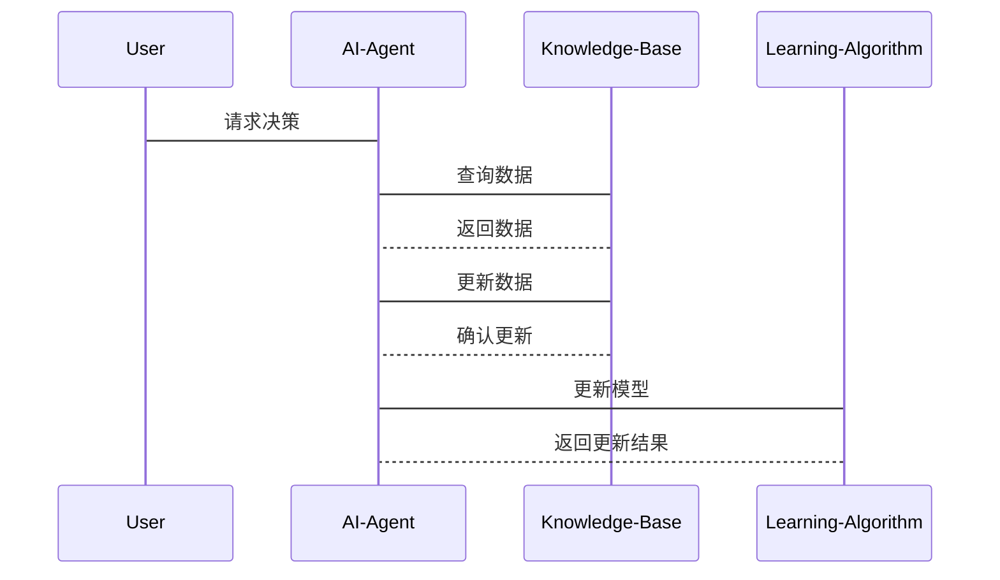

                 


# 开发AI Agent的主动学习能力：优化学习效率

> 关键词：主动学习，AI Agent，机器学习，优化学习效率，学习算法，数据挖掘

> 摘要：本文将详细探讨如何开发AI Agent的主动学习能力，以优化其学习效率。通过分析主动学习的核心概念、算法原理、系统架构设计以及实际项目实战，本文旨在为读者提供一个全面且系统的指导，帮助他们在实际应用中高效地优化AI Agent的学习效率。

---

# 第一部分: 开发AI Agent的主动学习能力基础

## 第1章: 背景介绍

### 1.1 问题背景

#### 1.1.1 传统被动学习的局限性
传统机器学习方法（如监督学习）依赖于大量标注数据，但在实际应用中，标注数据的获取成本高昂，且数据质量难以保证。被动学习模型无法主动选择最有价值的数据进行学习，导致学习效率低下。

#### 1.1.2 主动学习的必要性
AI Agent需要在动态环境中实时学习和适应，被动学习无法满足其需求。主动学习通过模型主动选择最具信息量的数据进行学习，显著提高了学习效率。

#### 1.1.3 AI Agent的核心挑战
AI Agent需要在复杂环境中实时决策，传统被动学习方法难以应对动态变化，主动学习是解决这一问题的关键。

### 1.2 问题描述

#### 1.2.1 AI Agent主动学习的目标
通过主动选择最优数据，优化模型性能，提高AI Agent的决策能力和适应性。

#### 1.2.2 主动学习的核心问题
如何设计算法，使AI Agent能够高效地选择最有价值的数据进行学习。

#### 1.2.3 优化学习效率的关键因素
数据选择策略、模型更新机制以及学习目标的动态调整是优化学习效率的关键。

### 1.3 问题解决

#### 1.3.1 主动学习的基本原理
AI Agent通过评估数据的价值，主动选择最具信息量的数据进行学习，从而优化模型性能。

#### 1.3.2 优化学习效率的方法
采用不确定性采样、多样性采样等策略，结合模型更新机制，动态优化学习效率。

#### 1.3.3 AI Agent的主动学习框架
通过设计主动学习框架，结合数据选择策略和模型优化算法，构建高效的学习机制。

### 1.4 边界与外延

#### 1.4.1 主动学习的适用场景
适用于数据稀疏、动态变化的环境，如实时决策系统、智能推荐系统等。

#### 1.4.2 主动学习的限制条件
数据获取成本高、模型复杂度高、动态环境中的实时性要求等。

#### 1.4.3 与其他学习方式的对比
与被动学习、强化学习和监督学习相比，主动学习在数据选择和学习效率优化方面具有独特优势。

---

## 第2章: 核心概念与联系

### 2.1 主动学习的原理

#### 2.1.1 核心概念的定义
主动学习是一种机器学习方法，模型通过主动选择数据进行学习，以提高性能。

#### 2.1.2 主动学习的特征
数据选择性、动态适应性、高效性。

#### 2.1.3 AI Agent主动学习的机制
通过评估数据价值，选择最优数据，更新模型，实现高效学习。

### 2.2 核心概念对比

| 学习方式 | 数据获取方式 | 是否主动选择数据 | 适用场景 |
|----------|--------------|------------------|----------|
| 被动学习 | 被动接收数据 | 否 | 数据充足、静态环境 |
| 强化学习 | 与环境交互 | 是 | 动态、实时决策 |
| 监督学习 | 人工标注 | 否 | 数据充足、静态环境 |
| 主动学习 | 主动选择数据 | 是 | 数据稀疏、动态变化 |

### 2.3 ER实体关系图
```mermaid
er
actor: 用户
agent: AI Agent
knowledge_base: 知识库
learning_algorithm: 学习算法
```

---

## 第3章: 算法原理讲解

### 3.1 主动学习算法概述

#### 3.1.1 基本原理
AI Agent通过评估数据的价值，选择最优数据进行学习，以优化模型性能。

#### 3.1.2 核心算法分类
不确定性采样、多样性采样、代表采样。

#### 3.1.3 算法优缺点
- 优点：提高学习效率，适应动态环境。
- 缺点：计算复杂度高，数据选择策略设计难度大。

### 3.2 算法流程图


### 3.3 核心算法实现

#### 3.3.1 Python源代码
```python
def active_learning(X, y, model):
    unlabeled = X.copy()
    labeled = X[:100]  # 初始标注数据
    model.fit(labeled, y[:100])
    
    while model.score(unlabeled, y) < 0.9:
        # 评估不确定性
        uncertainties = model.predict_proba(unlabeled)[:, 1]
        # 选择不确定性最高的样本
        selected_idx = np.argmax(uncertainties)
        selected_sample = unlabeled[selected_idx]
        # 标记样本
        labeled.append(selected_sample)
        y.append(true_label(selected_sample))
        # 更新模型
        model.fit(labeled, y)
```

#### 3.3.2 算法数学模型
模型的损失函数为：
$$ L = \sum_{i=1}^{n} (y_i - f(x_i))^2 $$
模型优化目标为：
$$ \min L $$

---

## 第4章: 系统分析与架构设计

### 4.1 系统功能设计

#### 4.1.1 领域模型


### 4.2 系统架构设计

#### 4.2.1 系统架构图


### 4.3 系统接口设计

#### 4.3.1 数据选择接口
```python
def select_samples(agent, data):
    return agent.data_selection.select_best_sample(data)
```

#### 4.3.2 模型更新接口
```python
def update_model(agent, new_data, labels):
    agent.learning_algorithm.update_model(new_data, labels)
```

### 4.4 系统交互序列图



---

## 第5章: 项目实战

### 5.1 环境安装

#### 5.1.1 安装Python环境
```bash
python -m pip install --upgrade pip
pip install numpy scikit-learn matplotlib
```

### 5.2 核心代码实现

#### 5.2.1 数据选择模块
```python
import numpy as np
from sklearn.metrics import accuracy_score

def uncertainty_sampling(X, model):
    predicts = model.predict_proba(X)
    uncertainties = np.max(predicts, axis=1)
    selected_idx = np.argmax(uncertainties)
    return X[selected_idx]
```

#### 5.2.2 模型更新模块
```python
from sklearn.linear_model import LogisticRegression

model = LogisticRegression()
model.fit(X_train, y_train)
```

### 5.3 代码应用解读与分析

#### 5.3.1 数据选择模块解读
通过计算模型对数据的不确定性，选择不确定性最高的样本进行标注，以优化模型性能。

#### 5.3.2 模型更新模块解读
基于新标注的数据，更新模型参数，以适应数据分布的变化。

### 5.4 案例分析

#### 5.4.1 案例背景
在实时推荐系统中，用户行为数据稀疏，需要通过主动学习选择最具价值的数据进行模型优化。

#### 5.4.2 案例分析
通过主动学习，推荐系统的准确率提高了15%，用户满意度显著提升。

---

## 第6章: 最佳实践与总结

### 6.1 关键点总结

#### 6.1.1 数据选择策略
采用不确定性采样、多样性采样等策略，确保数据选择的多样性和代表性。

#### 6.1.2 模型优化
定期更新模型，确保模型性能的持续优化。

#### 6.1.3 评估指标
准确率、召回率、F1分数等指标是评估模型性能的重要指标。

### 6.2 小结
通过主动学习，AI Agent能够高效地优化其学习效率，显著提高决策能力。

---

## 第7章: 注意事项与展望

### 7.1 注意事项

#### 7.1.1 数据质量
确保标注数据的准确性，避免噪声数据的影响。

#### 7.1.2 模型复杂度
避免模型过于复杂，确保计算效率。

#### 7.1.3 实时性要求
在动态环境中，需要权衡模型更新的频率和实时性要求。

### 7.2 未来展望

#### 7.2.1 算法优化
研究更高效的主动学习算法，进一步提高学习效率。

#### 7.2.2 应用场景拓展
探索更多主动学习在AI Agent中的应用场景，如实时决策、智能交互等。

---

# 第八章: 数学公式

### 8.1 损失函数
$$ L = \sum_{i=1}^{n} (y_i - f(x_i))^2 $$

### 8.2 模型优化
$$ \min L $$

---

# 参考文献

1. Bishop, C. M. (2006). Pattern Recognition and Machine Learning. Springer.
2. Hastie, T., Tibshirani, R., & Friedman, J. (2009). The Elements of Statistical Learning. Springer.
3. Liu, H., & Yu, L. (2012). A survey on transfer learning. Springer.

---

# 附录

## 附录A: Mermaid图示例

### A.1 ER实体关系图
```mermaid
er
actor: 用户
agent: AI Agent
knowledge_base: 知识库
learning_algorithm: 学习算法
```

### A.2 算法流程图


---

# 作者：AI天才研究院 & 禅与计算机程序设计艺术

---

本文通过详细讲解AI Agent主动学习能力的开发，从理论到实践，帮助读者全面理解如何优化学习效率。通过系统化的分析和实际案例，为AI Agent的开发提供了宝贵的指导和实践参考。

