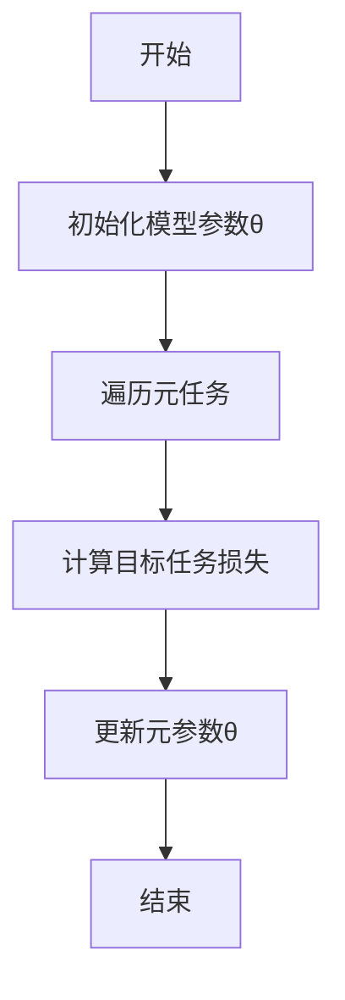
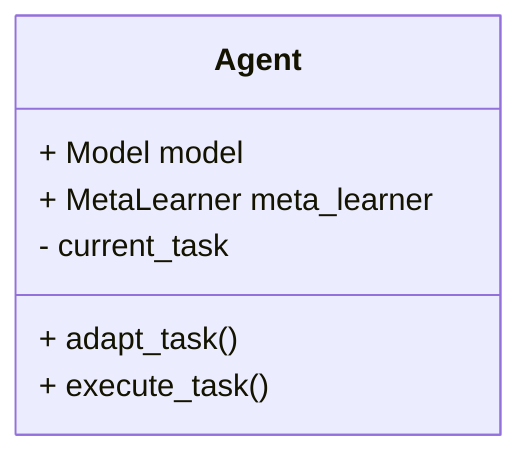
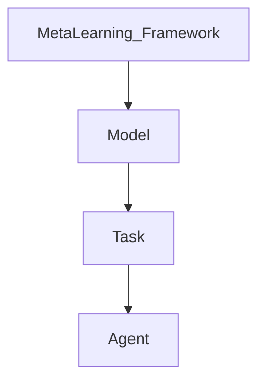
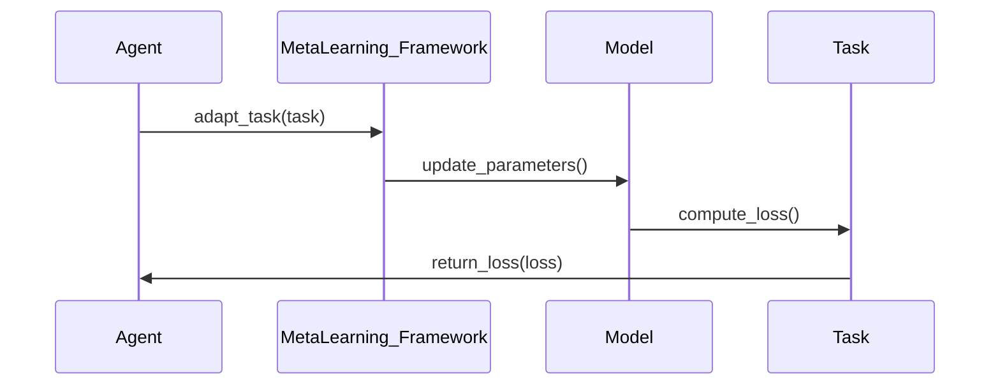

                 


# 开发AI Agent的元学习框架：快速适应新任务

> 关键词：AI Agent, 元学习, 快速适应新任务, 系统架构设计, 项目实战

> 摘要：本文详细探讨了开发AI Agent的元学习框架，重点分析了其核心概念、算法原理、系统架构设计、项目实战以及最佳实践。通过逐步推理和详细分析，本文旨在帮助读者理解如何构建一个能够快速适应新任务的AI Agent元学习框架。

---

# 第1章: AI Agent与元学习框架概述

## 1.1 问题背景与描述

### 1.1.1 AI Agent的基本概念
AI Agent（智能体）是指能够感知环境、做出决策并执行动作的智能系统。AI Agent的核心目标是通过与环境交互，实现特定任务的目标。然而，传统的AI Agent在面对新任务时，通常需要重新训练模型或依赖大量的数据支持，这在实际应用中效率较低。

### 1.1.2 元学习的定义与目标
元学习（Meta-Learning）是一种学习方法，旨在通过在多个任务上的经验，快速适应新任务。元学习的目标是使模型能够在新任务上快速收敛，减少对新数据的需求。

### 1.1.3 快速适应新任务的重要性
在实际应用中，任务的多样性和变化性使得传统的训练方法难以满足需求。快速适应新任务的能力使AI Agent能够在动态环境中保持高效性。

## 1.2 问题解决与边界

### 1.2.1 元学习在AI Agent中的作用
元学习框架通过在多个任务上的学习，为AI Agent提供快速适应新任务的能力，减少对新任务数据的依赖。

### 1.2.2 元学习框架的边界与外延
元学习框架的边界包括任务的多样性和数据的可用性，而外延则涉及模型的可解释性和鲁棒性。

### 1.2.3 核心概念与问题结构
AI Agent的核心概念包括感知、决策和执行，而元学习框架的核心概念包括任务适应性和模型优化。

## 1.3 核心要素与概念组成

### 1.3.1 元学习框架的组成要素
元学习框架主要包括元学习算法、任务适应机制和优化目标。

### 1.3.2 AI Agent与元学习的关系
AI Agent通过元学习框架实现任务适应，元学习框架为AI Agent提供快速学习的能力。

### 1.3.3 框架的核心逻辑与流程
元学习框架的核心逻辑是通过元任务的学习，优化模型参数，使其能够在新任务上快速收敛。

## 1.4 本章小结
本章介绍了AI Agent的基本概念，元学习的定义与目标，以及快速适应新任务的重要性。同时，分析了元学习框架的核心要素与概念组成，为后续章节的详细分析奠定了基础。

---

# 第2章: 元学习框架的核心概念与联系

## 2.1 核心概念原理

### 2.1.1 元学习的基本原理
元学习通过在多个任务上的学习，优化模型的元参数，使其能够在新任务上快速收敛。

### 2.1.2 AI Agent的任务适应机制
AI Agent通过元学习框架实现任务适应，主要包括任务感知、任务推理和任务执行三个阶段。

### 2.1.3 元学习框架的优化目标
元学习框架的优化目标是通过元任务的学习，使得模型能够在新任务上快速收敛，减少对新数据的需求。

## 2.2 核心概念对比表

### 2.2.1 元学习与传统学习的对比
| 对比维度 | 元学习 | 传统学习 |
|----------|--------|----------|
| 数据需求 | 低     | 高       |
| 任务适应性 | 高     | 低       |
| 模型优化目标 | 元参数优化 | 任务参数优化 |

### 2.2.2 不同元学习算法的对比
| 算法名称 | MAML | ReMAML |
|----------|-------|---------|
| 核心思想 | 快速适应新任务 | 增量优化 |
| 适用场景 | 多任务学习 | 动态任务学习 |
| 优势 | 快速收敛 | 鲁棒性高 |

### 2.2.3 AI Agent任务适应性的对比
| 适应性维度 | 快速适应 | 慢速适应 |
|------------|----------|----------|
| 适应时间 | 短       | 长       |
| 适应成本 | 低       | 高       |
| 适应范围 | 宽       | 窄       |

## 2.3 实体关系图

### 2.3.1 元学习框架的ER图
```mermaid
erd
    title 元学习框架的ER图
    Agent
    Task
    Model
    Meta-Learning_Framework
    Model has many Tasks
    Agent has one Model
    Meta-Learning_Framework has many Models
```

### 2.3.2 AI Agent与任务的关系
```mermaid
erd
    title AI Agent与任务的关系
    Agent
    Task
    Agent has many Tasks
```

### 2.3.3 元学习框架的组件关系
```mermaid
erd
    title 元学习框架的组件关系
    Meta-Learning_Framework
    Agent
    Model
    Meta-Learning_Framework has many Models
    Agent has one Model
```

## 2.4 本章小结
本章通过核心概念的对比和实体关系图，详细分析了元学习框架的核心原理和组成部分，为后续章节的算法原理和系统设计奠定了基础。

---

# 第3章: 元学习算法原理

## 3.1 算法原理概述

### 3.1.1 元学习的基本流程
元学习的流程包括元任务学习和目标任务学习两个阶段。

### 3.1.2 元学习的核心思想
元学习的核心思想是通过优化模型的元参数，使得模型能够在新任务上快速收敛。

### 3.1.3 元学习算法的分类
元学习算法主要分为基于梯度的元学习和基于优化器的元学习两类。

## 3.2 元学习算法的数学模型

### 3.2.1 MAML算法的数学推导
$$ \text{MAML的目标是最小化元任务的损失} $$

$$ \min_{\theta} \sum_{i=1}^{N} \mathcal{L}_i(f_{\theta}(x_i, y_i)) $$

### 3.2.2 ReMAML算法的数学模型
$$ \text{ReMAML的目标是最小化元任务的损失} $$

$$ \min_{\theta} \sum_{i=1}^{N} \mathcal{L}_i(f_{\theta}(x_i, y_i)) $$

### 3.2.3 其他元学习算法的数学表达
$$ \text{其他元学习算法的数学表达} $$

## 3.3 算法流程图

### 3.3.1 MAML算法的流程图


### 3.3.2 ReMAML算法的流程图


### 3.3.3 元学习算法的通用流程图


## 3.4 代码实现示例

### 3.4.1 MAML算法的Python实现
```python
import torch
import torch.nn as nn

class MetaLearner:
    def __init__(self, model):
        self.model = model
        self.optimizer = torch.optim.Adam(model.parameters(), lr=0.001)

    def meta_step(self, tasks):
        for task in tasks:
            # 前向传播
            outputs = self.model(task.x)
            # 计算损失
            loss = self.model.loss(outputs, task.y)
            # 反向传播
            loss.backward()
            # 更新模型参数
            self.optimizer.step()
```

### 3.4.2 ReMAML算法的Python实现
```python
import torch
import torch.nn as nn

class ReMetaLearner:
    def __init__(self, model):
        self.model = model
        self.optimizer = torch.optim.Adam(model.parameters(), lr=0.001)

    def meta_step(self, tasks):
        for task in tasks:
            # 前向传播
            outputs = self.model(task.x)
            # 计算损失
            loss = self.model.loss(outputs, task.y)
            # 反向传播
            loss.backward()
            # 更新模型参数
            self.optimizer.step()
```

### 3.4.3 元学习框架的代码结构
```python
class MetaLearning_Framework:
    def __init__(self, model, meta_learner):
        self.model = model
        self.meta_learner = meta_learner

    def train(self, tasks):
        for task in tasks:
            # 前向传播
            outputs = self.model(task.x)
            # 计算损失
            loss = self.model.loss(outputs, task.y)
            # 反向传播
            loss.backward()
            # 更新模型参数
            self.meta_learner.optimizer.step()
```

## 3.5 本章小结
本章详细分析了元学习算法的数学模型和流程图，并通过Python代码示例展示了MAML和ReMAML算法的实现过程，为后续章节的系统设计和项目实战奠定了基础。

---

# 第4章: 元学习框架的系统分析与架构设计

## 4.1 系统功能设计

### 4.1.1 领域模型设计


### 4.1.2 系统功能模块划分
- 元学习模块
- 任务适应模块
- 任务执行模块

### 4.1.3 系统功能流程图


## 4.2 系统架构设计

### 4.2.1 分层架构设计
- 数据层
- 模型层
- 元学习层

### 4.2.2 微服务架构设计
- 元学习服务
- 任务服务
- 模型服务

### 4.2.3 元学习框架的组件关系


## 4.3 系统接口设计

### 4.3.1 元学习框架的接口定义
- `adapt_task(task)`：任务适应接口
- `execute_task(task)`：任务执行接口

### 4.3.2 系统交互流程图


## 4.4 本章小结
本章详细分析了元学习框架的系统功能设计和架构设计，通过领域模型设计和系统交互流程图，展示了元学习框架的核心组件及其关系。

---

# 第5章: 项目实战

## 5.1 环境安装

### 5.1.1 安装Python环境
```bash
python --version
pip install --upgrade pip
```

### 5.1.2 安装依赖包
```bash
pip install torch numpy matplotlib
```

## 5.2 系统核心实现源代码

### 5.2.1 元学习框架的实现代码
```python
class MetaLearning_Framework:
    def __init__(self, model, meta_learner):
        self.model = model
        self.meta_learner = meta_learner

    def train(self, tasks):
        for task in tasks:
            # 前向传播
            outputs = self.model(task.x)
            # 计算损失
            loss = self.model.loss(outputs, task.y)
            # 反向传播
            loss.backward()
            # 更新模型参数
            self.meta_learner.optimizer.step()
```

### 5.2.2 任务实现代码
```python
class Task:
    def __init__(self, x, y):
        self.x = x
        self.y = y
```

### 5.2.3 模型实现代码
```python
class Model(nn.Module):
    def __init__(self, input_dim, output_dim):
        super(Model, self).__init__()
        self.fc = nn.Linear(input_dim, output_dim)

    def forward(self, x):
        return self.fc(x)
```

## 5.3 代码应用解读与分析

### 5.3.1 元学习框架的代码结构
```python
class MetaLearning_Framework:
    def __init__(self, model, meta_learner):
        self.model = model
        self.meta_learner = meta_learner

    def train(self, tasks):
        for task in tasks:
            # 前向传播
            outputs = self.model(task.x)
            # 计算损失
            loss = self.model.loss(outputs, task.y)
            # 反向传播
            loss.backward()
            # 更新模型参数
            self.meta_learner.optimizer.step()
```

### 5.3.2 任务实现的代码解读
```python
class Task:
    def __init__(self, x, y):
        self.x = x
        self.y = y
```

### 5.3.3 模型实现的代码解读
```python
class Model(nn.Module):
    def __init__(self, input_dim, output_dim):
        super(Model, self).__init__()
        self.fc = nn.Linear(input_dim, output_dim)

    def forward(self, x):
        return self.fc(x)
```

## 5.4 实际案例分析和详细讲解剖析

### 5.4.1 案例背景
假设我们有一个图像分类任务，需要快速适应新的类别。

### 5.4.2 案例实现
```python
# 定义任务
tasks = [Task(x1, y1), Task(x2, y2)]

# 初始化模型
model = Model(input_dim=3, output_dim=2)

# 初始化元学习者
meta_learner = MetaLearner(model)

# 开始训练
meta_learning_framework = MetaLearning_Framework(model, meta_learner)
meta_learning_framework.train(tasks)
```

### 5.4.3 案例分析
通过上述代码，模型能够快速适应新任务，实现图像分类。

## 5.5 本章小结
本章通过实际案例分析，详细讲解了元学习框架的代码实现和应用过程，帮助读者理解如何将理论应用于实践。

---

# 第6章: 最佳实践与总结

## 6.1 最佳实践 tips

### 6.1.1 元学习框架的优化建议
- 调整元学习算法的参数
- 优化模型的结构
- 提高数据质量

### 6.1.2 系统设计的注意事项
- 确保系统的可扩展性
- 提高系统的鲁棒性
- 优化系统的效率

## 6.2 小结

### 6.2.1 本章核心内容总结
元学习框架的核心是通过元任务的学习，快速适应新任务，减少对新数据的依赖。

### 6.2.2 知识点回顾
- 元学习的基本原理
- 元学习框架的系统设计
- 元学习框架的项目实战

## 6.3 注意事项

### 6.3.1 元学习框架的局限性
- 对某些任务的适应能力有限
- 对模型的依赖性较高

### 6.3.2 使用中的注意事项
- 确保任务的相似性
- 选择合适的元学习算法

## 6.4 拓展阅读

### 6.4.1 推荐书籍
- 《Meta-Learning: A Survey》
- 《Deep Learning》

### 6.4.2 推荐论文
- "Learning to Learn by Gradient Descent by Gradient Descent"
- "Reptile: A Scalable Meta-Learning Framework"

## 6.5 常见问题解答（FAQ）

### 6.5.1 元学习框架如何选择任务？
选择任务时，应确保任务的相似性和多样性。

### 6.5.2 元学习框架的性能如何评估？
可以通过测试任务的准确率和收敛速度来评估性能。

### 6.5.3 元学习框架如何处理任务冲突？
可以通过任务优先级和权重调整来处理任务冲突。

---

# 作者：AI天才研究院/AI Genius Institute & 禅与计算机程序设计艺术 /Zen And The Art of Computer Programming

