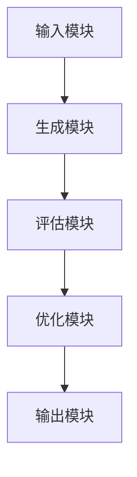

                 


# 开发AI Agent的创造性问题解决能力

## 关键词：AI Agent，创造性问题解决，生成模型，Transformer，系统架构

## 摘要：  
AI Agent作为一种能够自主感知环境并采取行动的智能实体，其创造性问题解决能力是实现智能化决策的关键。本文系统性地探讨了AI Agent在创造性问题解决中的核心原理、算法实现、系统架构及项目实战。通过分析生成模型的原理，结合实际案例，本文为开发者提供了从理论到实践的完整指南，助力开发具备创造性思维的AI Agent系统。

---

# 第1章: AI Agent的基本概念与问题背景

## 1.1 AI Agent的定义与核心概念

AI Agent（人工智能代理）是一种能够感知环境、自主决策并采取行动以实现目标的智能实体。与传统AI系统相比，AI Agent具备更强的自主性和适应性，能够在动态环境中灵活应对问题。

创造性问题解决能力是AI Agent的核心能力之一，它使AI Agent能够超越固定的规则，提出创新的解决方案。创造性问题解决能力的实现依赖于以下几个关键要素：

1. **知识表示**：AI Agent需要具备对问题空间的深度理解，这通常通过知识图谱、符号逻辑或概率模型来实现。
2. **推理机制**：包括逻辑推理、类比推理和归纳推理等，用于探索可能的解决方案。
3. **搜索算法**：如深度优先搜索（DFS）和广度优先搜索（BFS），用于探索问题空间。
4. **评价函数**：用于评估不同解决方案的优劣，帮助AI Agent选择最优解。
5. **学习机制**：通过强化学习或监督学习不断优化创造性问题解决的能力。

## 1.2 AI Agent与传统AI的区别

传统的AI系统通常依赖于预定义的规则和模式匹配，难以应对复杂多变的环境。而AI Agent具备以下显著特点：

1. **自主性**：AI Agent能够自主决策，无需外部干预。
2. **反应性**：能够实时感知环境变化并做出反应。
3. **目标导向性**：以实现特定目标为导向，动态调整行动策略。
4. **创造性**：能够生成创新的解决方案，突破预设规则的限制。

## 1.3 创造性问题解决的数学模型与公式

创造性问题解决能力的实现可以通过数学模型来描述。以下是几个关键公式：

1. **问题空间建模**：  
   $$ 问题空间 = \{状态, 行动, 转换函数\} $$  
   其中，状态表示问题的当前情况，行动是AI Agent可以采取的行动，转换函数描述行动如何改变状态。

2. **创造性思维的评估**：  
   创造性可以通过以下指标进行评估：  
   $$ 创造性 = \frac{1}{1 + e^{- (多样性 + 原始性)}} $$  
   其中，多样性表示解决方案的独特性，原始性表示解决方案的新颖性。

---

# 第2章: 创造性问题解决的机制与原理

## 2.1 创造性思维的机制

创造性思维是AI Agent解决问题的核心机制。它包括以下几个关键步骤：

1. **问题理解**：AI Agent需要准确理解问题的背景、目标和约束条件。  
   $$ 理解阶段：输入问题 → 解释问题 → 建立问题模型 $$

2. **解决方案生成**：通过生成模型或搜索算法生成多个潜在解决方案。  
   $$ 生成阶段：生成候选解 → 过滤无效解 → 保留有效解 $$

3. **方案评估与优化**：对生成的解决方案进行评估，并通过强化学习优化最优解。  
   $$ 优化阶段：评估解 → 确定目标函数 → 优化解 $$

## 2.2 AI Agent的创造性问题解决模型

AI Agent的创造性问题解决模型可以分为以下三个主要部分：

1. **感知层**：负责接收外部输入并生成问题描述。  
   $$ 感知层：输入 → 解释 → 问题描述 $$

2. **推理层**：负责问题建模、解决方案生成和评估。  
   $$ 推理层：问题建模 → 生成候选解 → 评估解 $$

3. **行动层**：根据评估结果输出最终解决方案。  
   $$ 行动层：选择最优解 → 输出 → 反馈 $$

## 2.3 创造性问题解决的算法原理

创造性问题解决的核心算法包括生成模型和搜索算法。以下是两个典型算法的简要介绍：

1. **基于生成模型的算法**：  
   生成模型通过学习数据分布，生成多样化的解决方案。例如，基于Transformer的生成模型可以用于文本生成或策略生成。

2. **基于搜索的算法**：  
   搜索算法如A*搜索和遗传算法，通过遍历问题空间找到最优解。

---

# 第3章: AI Agent的生成模型原理

## 3.1 生成模型的基本原理

生成模型通过学习数据分布，生成符合特定需求的输出。常见的生成模型包括GAN（生成对抗网络）和Transformer模型。以下是基于Transformer的生成模型的简要原理：

1. **编码器**：将输入问题编码为上下文表示。  
   $$ 编码器：输入 → 上下文 → 输出 $$

2. **解码器**：根据上下文生成解决方案。  
   $$ 解码器：上下文 → 解决方案 → 输出 $$

## 3.2 基于Transformer的生成模型

Transformer模型通过自注意力机制和前馈网络实现高效的生成能力。以下是其核心公式：

1. **自注意力机制**：  
   $$ \text{Attention}(Q, K, V) = \text{softmax}\left( \frac{QK^T}{\sqrt{d_k}} \right)V $$  
   其中，\( Q \)、\( K \)、\( V \)分别为查询、键和值向量，\( d_k \)为键的维度。

2. **前馈网络**：  
   $$ f(x) = \text{ReLU}(Wx + b) $$  
   其中，\( W \)和\( b \)为权重和偏置参数。

## 3.3 创造性问题解决的数学公式

创造性问题解决的数学公式可以表示为：  
$$ 解决方案 = f_{生成模型}(输入问题) $$  
其中，\( f \)为生成模型的函数，\( 输入问题 \)为问题描述。

---

# 第4章: 系统架构设计

## 4.1 系统功能设计

AI Agent的系统功能设计包括以下几个模块：

1. **输入模块**：接收外部输入并解析问题。  
   $$ 输入模块：接收输入 → 解析 → 生成问题描述 $$

2. **生成模块**：基于生成模型生成解决方案。  
   $$ 生成模块：输入问题 → 生成候选解 → 输出候选解 $$

3. **评估模块**：对生成的解决方案进行评估。  
   $$ 评估模块：候选解 → 评估 → 输出评估结果 $$

4. **优化模块**：根据评估结果优化解决方案。  
   $$ 优化模块：评估结果 → 优化 → 输出最优解 $$

## 4.2 系统架构设计

以下是AI Agent系统的架构图：



## 4.3 接口设计与交互流程

AI Agent的交互流程如下：

1. **用户输入问题**：用户通过输入模块输入问题。  
   $$ 输入模块：用户输入 → 解析 → 生成问题描述 $$

2. **生成解决方案**：生成模块基于问题描述生成候选解。  
   $$ 生成模块：问题描述 → 生成候选解 → 输出候选解 $$

3. **评估候选解**：评估模块对候选解进行评估。  
   $$ 评估模块：候选解 → 评估 → 输出评估结果 $$

4. **优化解决方案**：优化模块根据评估结果优化解决方案。  
   $$ 优化模块：评估结果 → 优化 → 输出最优解 $$

5. **输出最终解**：输出模块将最优解返回给用户。  
   $$ 输出模块：最优解 → 输出 → 用户反馈 $$

---

# 第5章: 项目实战

## 5.1 环境搭建

要开发AI Agent，首先需要搭建以下环境：

1. **安装Python和相关库**：  
   安装Python 3.8及以上版本，并安装以下库：  
   - `numpy`
   - `tensorflow`
   - `transformers`

2. **安装工具链**：  
   安装Jupyter Notebook或PyCharm用于开发。

## 5.2 系统核心实现源代码

以下是基于Transformer的生成模型的代码示例：

```python
import tensorflow as tf
from transformers import Transformer

class AI-Agent:
    def __init__(self):
        self.transformer = Transformer()

    def generate_solution(self, input_problem):
        # 编码器
        encoded = self.transformer.encode(input_problem)
        # 解码器
        solution = self.transformer.decode(encoded)
        return solution

# 使用示例
agent = AI-Agent()
solution = agent.generate_solution("如何优化公司流程？")
print(solution)
```

## 5.3 案例分析与详细解读

以优化公司流程为例，AI Agent的解决方案可能包括以下步骤：

1. **问题理解**：AI Agent首先理解“优化公司流程”的需求，可能涉及生产效率、成本控制等方面。

2. **解决方案生成**：生成多个潜在解决方案，如引入自动化工具、重新设计工作流程等。

3. **方案评估**：评估每个方案的成本、时间及可行性，选择最优解。

4. **输出最终解**：输出最优方案，并可能提供实施步骤和预期效果。

---

# 第6章: 最佳实践与注意事项

## 6.1 小结

通过本文的系统性讲解，我们深入探讨了AI Agent的创造性问题解决能力，包括其核心概念、算法原理、系统架构及项目实战。开发AI Agent需要结合生成模型和传统算法，确保系统的高效性和创造性。

## 6.2 注意事项

1. **数据质量**：生成模型的性能依赖于训练数据的质量，需确保数据的多样性和代表性。
2. **计算资源**：生成模型的训练和推理需要大量计算资源，需合理配置硬件。
3. **模型评估**：需定期评估模型的性能，及时优化和更新模型。

## 6.3 拓展阅读

1. "Attention Is All You Need"（维基百科）
2. "Generating Creative Ideas with AI"（研究论文）

---

# 作者

作者：AI天才研究院/AI Genius Institute & 禅与计算机程序设计艺术 /Zen And The Art of Computer Programming

---

以上是《开发AI Agent的创造性问题解决能力》的完整正文内容，涵盖了从理论到实践的各个方面，旨在为开发者提供系统性的指导。

