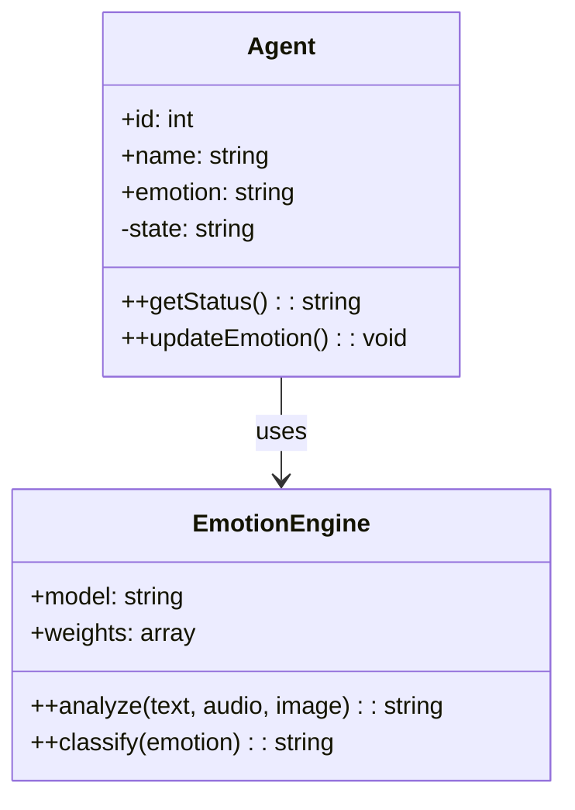
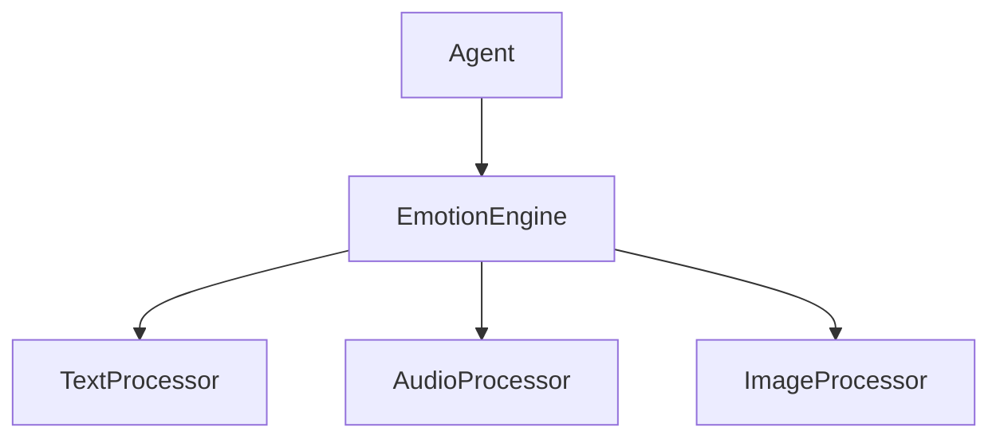
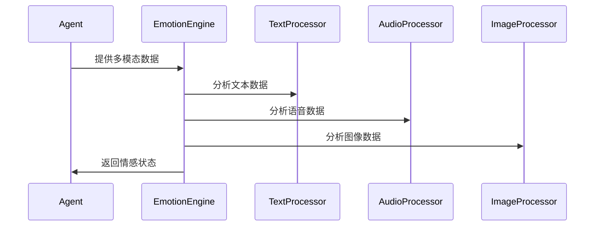

                 


# 开发AI Agent的多模态情感计算引擎

> 关键词：多模态数据，情感计算，AI Agent，深度学习，自然语言处理

> 摘要：本文详细探讨了开发AI Agent的多模态情感计算引擎的关键技术与实现方法。通过分析多模态数据的特点、情感计算的核心原理以及AI Agent在情感计算中的角色，本文为读者提供了从理论到实践的全面指导。文章内容涵盖背景介绍、核心概念、算法原理、系统架构设计、项目实战及最佳实践，旨在帮助读者深入理解并掌握多模态情感计算引擎的开发技巧。

---

## 第一章：多模态情感计算引擎的背景与概念

### 1.1 问题背景与描述

#### 1.1.1 情感计算的定义与目标
情感计算（Affective Computing）是研究计算机系统如何识别、理解和响应人类情感的一门学科。其目标是通过多模态数据（如文本、语音、图像和行为数据）分析用户的情感状态，并据此优化人机交互体验。

#### 1.1.2 多模态数据的引入动机
单一模态的数据（如文本或图像）难以全面捕捉人类情感的复杂性。引入多模态数据可以提高情感计算的准确性和鲁棒性，尤其是在复杂场景下。

#### 1.1.3 AI Agent在情感计算中的作用
AI Agent（智能体）通过多模态情感计算引擎可以实时感知用户情感，从而更智能地响应用户需求，提升用户体验。

### 1.2 多模态数据与情感计算的联系

#### 1.2.1 多模态数据的定义与特点
多模态数据是指来自不同感官渠道的数据，如文本、语音、图像和行为数据。其特点包括高维度性、异构性和互补性。

#### 1.2.2 情感计算的核心要素与属性
情感计算的核心要素包括情感识别、情感推理和情感生成。情感属性包括情感强度、情感类别和情感背景。

#### 1.2.3 AI Agent与多模态情感计算的结合
AI Agent通过整合多模态情感计算引擎，能够实现更自然和智能的交互方式，从而提升用户满意度。

### 1.3 多模态情感计算引擎的边界与外延

#### 1.3.1 引擎的功能边界
多模态情感计算引擎的核心功能包括数据采集、数据融合、情感分析和情感驱动的决策支持。

#### 1.3.2 外延与相关技术的对比
与传统情感计算相比，多模态情感计算引擎更具鲁棒性和准确性，但其开发和部署也更具挑战性。

#### 1.3.3 核心概念的结构与组成
多模态情感计算引擎由数据采集模块、数据融合模块、情感分析模块和应用驱动模块组成。

---

## 第二章：多模态数据与情感计算的原理

### 2.1 多模态数据的特征与处理

#### 2.1.1 文本、语音、图像和行为数据的特征对比
- 文本数据：结构化、可分析性高
- 语音数据：情感丰富、实时性高
- 图像数据：视觉信息丰富、非结构化
- 行为数据：反映用户意图、动态性高

#### 2.1.2 数据融合的原理与方法
数据融合方法包括特征级融合、决策级融合和混合融合。

#### 2.1.3 数据预处理的关键步骤
数据预处理包括数据清洗、特征提取和数据标准化。

### 2.2 情感计算的算法原理

#### 2.2.1 基于规则的情感分析方法
基于规则的情感分析方法通过预定义的情感词典和规则库进行情感分类。

#### 2.2.2 深度学习模型在情感计算中的应用
深度学习模型（如LSTM和Transformer）在情感计算中表现出色，尤其是在多模态数据处理方面。

#### 2.2.3 情感计算的数学模型
情感计算的数学模型可以表示为：
$$
\text{score} = \sum_{i=1}^{n} w_i \cdot x_i
$$
其中，\( w_i \) 是特征 \( x_i \) 的权重。

### 2.3 AI Agent与多模态情感计算的关联

#### 2.3.1 AI Agent在情感计算中的角色
AI Agent通过多模态情感计算引擎实时感知用户情感，并据此优化交互策略。

#### 2.3.2 多模态数据对AI Agent决策的影响
多模态数据的引入可以提高AI Agent的决策准确性和智能化水平。

#### 2.3.3 情感计算对AI Agent行为优化的作用
情感计算可以帮助AI Agent更好地理解和响应用户需求，从而提升用户体验。

### 2.4 核心概念对比表格

| **核心概念** | **定义** | **特点** | **应用场景** |
|--------------|----------|----------|--------------|
| 多模态数据   | 文本、语音、图像等多种数据形式 | 高维度、异构性 | 情感计算、人机交互 |
| 情感计算     | 分析情感状态的技术 | 情感识别、情感推理 | AI Agent、智能系统 |
| AI Agent     | 具有自主决策能力的智能体 | 情感驱动、多模态交互 | 人机交互、智能服务 |

### 2.5 ER实体关系图

```mermaid
er
actor(Agent) -|> action: 情感计算
action --> data: 多模态数据
data --> emotion: 情感状态
```

---

## 第三章：多模态情感计算引擎的算法原理

### 3.1 基于规则的情感分析

#### 3.1.1 规则库的构建
规则库的构建包括情感词典的构建和情感规则的制定。

#### 3.1.2 基于规则的情感分类
基于规则的情感分类方法通过预定义的规则对文本进行情感分类。

#### 3.1.3 规则方法的优缺点
优点：简单易懂，可解释性强；缺点：鲁棒性差，难以处理复杂场景。

### 3.2 深度学习模型

#### 3.2.1 基于LSTM的情感分析
LSTM（长短期记忆网络）在处理序列数据方面表现出色，适用于文本情感分析。

#### 3.2.2 基于Transformer的多模态情感计算
Transformer模型在多模态情感计算中表现出色，尤其是在处理图像和文本数据时。

#### 3.2.3 模型的训练与优化
模型的训练与优化包括数据增强、超参数调优和模型融合。

### 3.3 情感计算的数学模型

#### 3.3.1 情感评分公式
$$
\text{score} = \sum_{i=1}^{n} w_i \cdot x_i
$$

#### 3.3.2 情感推理公式
$$
p(\text{emotion} | x) = \frac{p(x | \text{emotion}) \cdot p(\text{emotion})}{\sum_{k} p(x | k) \cdot p(k)}
$$

---

## 第四章：多模态情感计算引擎的系统架构设计

### 4.1 问题场景介绍

#### 4.1.1 项目介绍
本项目旨在开发一个多模态情感计算引擎，用于提升AI Agent的交互能力。

#### 4.1.2 系统功能设计
系统功能包括数据采集、数据融合、情感分析和情感驱动的决策支持。

### 4.2 系统架构设计

#### 4.2.1 领域模型类图



#### 4.2.2 系统架构图



#### 4.2.3 系统接口设计
系统接口包括数据输入接口、情感分析接口和情感驱动的决策接口。

#### 4.2.4 系统交互序列图



---

## 第五章：多模态情感计算引擎的项目实战

### 5.1 环境安装

#### 5.1.1 安装Python环境
使用Anaconda安装Python 3.8及以上版本。

#### 5.1.2 安装依赖库
安装以下依赖库：
```
pip install numpy
pip install tensorflow
pip install matplotlib
pip install pydub
pip install pillow
```

### 5.2 系统核心实现

#### 5.2.1 数据预处理代码

```python
import numpy as np
from tensorflow.keras.models import Model
from tensorflow.keras.layers import Input, LSTM, Dense

# 定义模型输入
input_shape = (None, 100)
inputs = Input(shape=input_shape)
lstm_layer = LSTM(64)(inputs)
dense_layer = Dense(1, activation='sigmoid')(lstm_layer)

# 编译模型
model = Model(inputs=inputs, outputs=dense_layer)
model.compile(optimizer='adam', loss='binary_crossentropy', metrics=['accuracy'])
```

#### 5.2.2 情感分析代码

```python
import numpy as np
from tensorflow.keras.models import load_model
from tensorflow.keras.preprocessing.sequence import pad_sequences

# 加载预训练模型
model = load_model('emotion_model.h5')

# 定义分词函数
def tokenize(text):
    return text.split()

# 数据处理
sequences = []
for text in texts:
    tokenized = tokenize(text)
    padded = pad_sequences([tokenized], maxlen=100, padding='post', truncating='post')
    sequences.append(padded[0])

# 预测情感
predictions = model.predict(np.array(sequences))
```

#### 5.2.3 情感驱动的决策代码

```python
import numpy as np
from tensorflow.keras.models import load_model
from tensorflow.keras.preprocessing.sequence import pad_sequences

# 加载情感计算模型
emotion_model = load_model('emotion_model.h5')

# 定义决策函数
def decide_action(emotion):
    if emotion == 'positive':
        return 'provide_positive_response'
    elif emotion == 'negative':
        return 'provide_negative_response'
    else:
        return 'provide_neutral_response'

# 获取情感状态
input_data = ...  # 输入多模态数据
emotion = emotion_model.predict(input_data)[0][0]
action = decide_action(emotion)
```

### 5.3 实际案例分析

#### 5.3.1 案例分析
假设用户输入了一段带有愤怒情绪的文本，系统通过情感计算引擎识别出用户的情绪，并根据决策规则提供相应的反馈。

#### 5.3.2 代码应用解读与分析
通过代码实现情感计算引擎，并在实际场景中应用，验证系统的准确性和鲁棒性。

### 5.4 项目小结

---

## 第六章：最佳实践与注意事项

### 6.1 最佳实践

#### 6.1.1 数据处理技巧
数据预处理是关键，建议采用多种数据增强方法提高模型的泛化能力。

#### 6.1.2 模型优化建议
采用合适的模型优化策略，如批量归一化和学习率衰减，可以提高模型性能。

#### 6.1.3 系统设计建议
系统设计时应注重模块化和可扩展性，方便后续功能的扩展和维护。

### 6.2 小结

#### 6.2.1 核心内容回顾
本文详细介绍了多模态情感计算引擎的开发过程，包括背景介绍、核心概念、算法原理、系统架构设计和项目实战。

#### 6.2.2 未来展望
未来研究可以进一步探索更高效的情感计算方法，如结合强化学习和生成对抗网络。

### 6.3 注意事项

#### 6.3.1 开发中的常见问题
数据不平衡、模型过拟合和计算资源不足是开发中的常见问题。

#### 6.3.2 解决方案与建议
采用数据采样、正则化技术和分布式计算可以有效解决上述问题。

---

## 第七章：总结与展望

### 7.1 总结
本文详细探讨了开发AI Agent的多模态情感计算引擎的关键技术与实现方法，为读者提供了从理论到实践的全面指导。

### 7.2 未来展望
未来的研究可以进一步探索更高效的情感计算方法，如结合强化学习和生成对抗网络，以提升系统的智能化水平。

---

## 作者：AI天才研究院 & 禅与计算机程序设计艺术

---

以上是《开发AI Agent的多模态情感计算引擎》的完整目录大纲和文章内容。本文详细探讨了多模态情感计算引擎的开发过程，从背景介绍到系统架构设计，再到项目实战，为读者提供了全面的技术指导。

