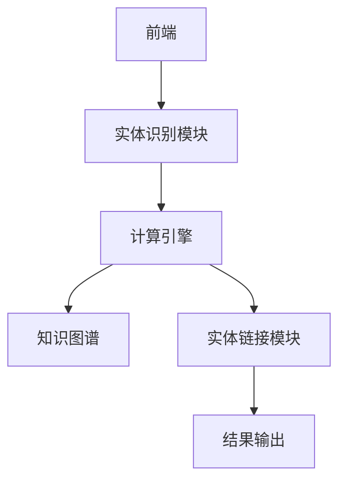

                 


# 开发AI Agent的多语言实体链接系统

> 关键词：AI Agent, 多语言实体链接, 自然语言处理, 知识图谱, 转换器模型

> 摘要：本文详细探讨了开发AI Agent的多语言实体链接系统的核心技术与实现方法。文章从问题背景、核心概念、算法原理、系统架构设计到项目实战，全面分析了多语言实体链接系统的关键点，结合实际案例，展示了如何利用转换器模型实现跨语言实体识别与链接，并通过系统架构设计和项目实战，帮助读者深入理解技术细节与实现步骤。

---

# 第1章: AI Agent与多语言实体链接系统背景介绍

## 1.1 问题背景

### 1.1.1 多语言实体链接的定义与挑战

在多语言环境下，实体链接是指将不同语言的文本中的实体与知识图谱中的实体进行映射的过程。例如，中文中的“苹果”可能对应英文中的“Apple”，但在不同上下文中可能代表不同的实体（如公司、水果）。多语言实体链接的挑战在于如何准确识别和映射这些实体，尤其是在不同语言和上下文中的多样性。

### 1.1.2 当前技术的局限性

现有技术在多语言实体链接方面存在以下问题：

1. **跨语言语义理解不足**：传统方法依赖于语言间的直接对应关系，无法处理语义相似但词汇不同的情况。
2. **知识图谱覆盖不足**：多语言知识图谱的构建难度较高，导致部分实体缺乏统一的表示。
3. **计算资源消耗大**：多语言处理需要同时处理多种语言，计算资源消耗较高。

### 1.1.3 AI Agent的需求与目标

AI Agent需要具备多语言实体链接能力，以便在处理多语言输入时，能够准确理解并执行任务。其目标包括：

1. 实现跨语言实体识别与链接。
2. 提供高效的实体映射算法。
3. 支持多种语言的自然语言理解。

## 1.2 问题描述

### 1.2.1 多语言环境下实体识别的复杂性

在多语言环境下，实体识别的复杂性主要体现在以下方面：

1. **语言多样性**：不同语言中的实体名称可能完全不同，甚至在同一种语言中，实体名称可能因地域或文化差异而不同。
2. **语义歧义**：同一实体在不同语言中的名称可能具有不同的语义，导致识别困难。
3. **数据稀疏性**：某些语言的训练数据较少，导致模型性能下降。

### 1.2.2 实体链接的核心问题

实体链接的核心问题是将文本中的实体映射到知识图谱中的唯一标识。在多语言环境下，这一问题更加复杂，因为需要考虑不同语言之间的映射关系。

### 1.2.3 AI Agent的需求与目标

AI Agent需要具备以下能力：

1. 多语言实体识别：能够识别文本中的实体，并生成候选实体列表。
2. 实体链接：将候选实体与知识图谱中的实体进行映射，确保准确性。
3. 跨语言语义理解：在不同语言之间建立语义联系，确保实体链接的正确性。

## 1.3 问题解决

### 1.3.1 多语言实体链接的解决方案

1. **基于转换器模型**：利用预训练的多语言转换器模型（如mBert）进行实体表示。
2. **跨语言相似度计算**：通过计算实体名称在不同语言中的相似度，建立映射关系。
3. **知识图谱对齐**：通过跨语言对齐技术，将知识图谱中的实体与文本中的实体进行映射。

### 1.3.2 AI Agent在实体链接中的作用

AI Agent通过多语言实体链接系统，能够准确理解用户输入的实体，并将其映射到知识图谱中，从而实现更智能的任务处理。

### 1.3.3 技术路线与实现思路

1. **数据预处理**：构建多语言知识图谱，包含实体名称、类型、关系等信息。
2. **实体表示**：利用转换器模型生成实体的向量表示。
3. **实体链接**：基于相似度计算，将文本中的实体映射到知识图谱中的实体。

## 1.4 边界与外延

### 1.4.1 多语言实体链接的边界

多语言实体链接的边界包括：

1. **支持的语言种类**：系统支持的语言种类有限，无法覆盖所有语言。
2. **实体类型**：系统支持的实体类型有限，某些实体可能无法正确链接。
3. **知识图谱覆盖范围**：知识图谱的覆盖范围有限，可能导致部分实体无法找到映射。

### 1.4.2 AI Agent的适用范围

AI Agent适用于需要处理多语言输入的场景，如智能助手、跨语言客服系统等。

### 1.4.3 系统的可扩展性与限制

系统可以通过增加新的语言和实体类型，进一步扩展其功能。但由于计算资源限制，系统的扩展性受到一定限制。

## 1.5 概念结构与核心要素

### 1.5.1 实体链接的基本概念

实体链接是指将文本中的实体映射到知识图谱中的实体的过程。在多语言环境下，这一过程需要考虑不同语言之间的映射关系。

### 1.5.2 多语言环境下的实体特征

多语言环境下的实体特征包括：

1. 实体名称：不同语言中的实体名称。
2. 实体类型：实体所属的类别。
3. 实体关系：实体之间的关联关系。

### 1.5.3 AI Agent的核心功能与模块

AI Agent的核心功能包括：

1. 实体识别：识别文本中的实体。
2. 实体链接：将实体映射到知识图谱中的实体。
3. 跨语言理解：处理多语言输入，确保实体链接的准确性。

## 1.6 本章小结

本章从背景、问题描述、解决方案等多个方面介绍了AI Agent的多语言实体链接系统。通过分析多语言实体链接的挑战和AI Agent的需求，明确了系统的开发目标和实现思路。

---

# 第2章: 多语言实体链接系统的核心概念与联系

## 2.1 核心概念原理

### 2.1.1 实体识别与链接的原理

实体识别是通过NLP技术从文本中提取实体，实体链接是将这些实体映射到知识图谱中的过程。在多语言环境下，这一过程需要考虑不同语言之间的映射关系。

### 2.1.2 多语言环境下的实体表示

多语言环境下的实体表示可以通过以下方式实现：

1. **多语言转换器模型**：利用预训练的多语言转换器模型生成实体的向量表示。
2. **跨语言相似度计算**：通过计算实体名称在不同语言中的相似度，建立映射关系。

### 2.1.3 AI Agent的实体理解机制

AI Agent通过多语言实体链接系统，能够理解用户输入的实体，并将其映射到知识图谱中的实体，从而实现更智能的任务处理。

## 2.2 实体属性特征对比表

下表展示了不同实体的属性特征对比：

```plaintext
| 特征         | 实体1（中文） | 实体2（英文） | 实体3（其他语言） |
|--------------|---------------|---------------|-------------------|
| 实体名称       | 苹果           | Apple          | Manzana            |
| 实体类型       | 公司           | Company         | Empresa            |
| 实体关系       | 制造产品       | manufactures    | produce             |
```

## 2.3 ER实体关系图

以下是一个简单的ER实体关系图：

```mermaid
erDiagram
    entity 实体1 {
        中文名 : string
        中文类型 : string
        中文关系 : string
    }
    entity 实体2 {
        英文名 : string
        英文类型 : string
        英文关系 : string
    }
    entity 实体3 {
        其他语言名 : string
        其他类型 : string
        其他关系 : string
    }
    实体1 --> 实体2 : 关联关系
    实体2 --> 实体3 : 关联关系
```

## 2.4 本章小结

本章介绍了多语言实体链接系统的核心概念与联系，通过实体属性特征对比表和ER实体关系图，展示了实体之间的关系和属性特征。

---

# 第3章: 多语言实体链接算法原理

## 3.1 算法原理概述

### 3.1.1 基于转换器的实体链接模型

基于转换器的实体链接模型通常采用预训练的多语言转换器模型（如mBert）进行实体表示。模型通过计算实体名称的向量表示，利用余弦相似度计算实体之间的相似度。

### 3.1.2 多语言环境下的模型适应性

多语言环境下的模型适应性主要体现在以下方面：

1. **多语言转换器模型**：模型支持多种语言的实体表示。
2. **跨语言相似度计算**：通过计算实体名称在不同语言中的相似度，建立映射关系。

## 3.2 算法实现步骤

### 3.2.1 实体表示

利用mBert模型生成实体名称的向量表示：

```python
import torch
from transformers import BertTokenizer, BertModel

# 初始化模型和分词器
model = BertModel.from_pretrained('bert-base-multilingual-cased')
tokenizer = BertTokenizer.from_pretrained('bert-base-multilingual-cased')

# 定义函数生成实体表示
def get_entity_embeddings(entity):
    inputs = tokenizer(entity, return_tensors='pt')
    embeddings = model(**inputs)[0]
    return embeddings
```

### 3.2.2 实体相似度计算

通过余弦相似度计算实体之间的相似度：

```python
import torch
import numpy as np

# 计算余弦相似度
def cosine_similarity(embedding1, embedding2):
    dot_product = torch.sum(embedding1 * embedding2)
    norm1 = torch.norm(embedding1)
    norm2 = torch.norm(embedding2)
    return dot_product / (norm1 * norm2)

# 示例
entity1 = "苹果"
entity2 = "Apple"

embedding1 = get_entity_embeddings(entity1)
embedding2 = get_entity_embeddings(entity2)

similarity = cosine_similarity(embedding1, embedding2)
print(f"实体'{entity1}'与实体'{entity2}'的相似度为：{similarity.item()}")
```

### 3.2.3 实体链接

基于相似度计算结果，将文本中的实体映射到知识图谱中的实体。

### 3.2.4 知识图谱对齐

通过跨语言对齐技术，将知识图谱中的实体与文本中的实体进行映射。

## 3.3 数学模型与公式

### 3.3.1 实体表示模型

实体表示模型通常采用预训练的转换器模型，生成实体名称的向量表示。模型的输出为实体名称的向量表示：

$$
E(e) = f(e)
$$

其中，$e$ 是实体名称，$f$ 是预训练模型的编码函数，$E(e)$ 是实体的向量表示。

### 3.3.2 实体相似度计算

实体相似度计算基于向量的余弦相似度：

$$
\text{similarity}(e1, e2) = \frac{E(e1) \cdot E(e2)}{||E(e1)|| \cdot ||E(e2)||}
$$

其中，$E(e1)$ 和 $E(e2)$ 分别是实体 $e1$ 和 $e2$ 的向量表示。

## 3.4 算法实现的注意事项

1. **计算资源**：实体表示的计算需要消耗较多计算资源，建议使用GPU加速。
2. **模型选择**：选择合适的预训练模型，如mBert，可以提高实体表示的准确性。
3. **相似度阈值**：需要根据实际场景调整相似度阈值，以确保实体链接的准确性。

## 3.5 本章小结

本章详细介绍了多语言实体链接算法的原理与实现，通过具体的代码示例和数学公式，展示了如何利用转换器模型实现跨语言实体识别与链接。

---

# 第4章: 多语言实体链接系统的架构设计

## 4.1 系统架构概述

### 4.1.1 问题场景介绍

系统需要在多语言环境下，支持文本中的实体识别与链接功能。用户输入可以是中文、英文或其他语言的文本，系统需要准确识别文本中的实体，并将其映射到知识图谱中的实体。

### 4.1.2 项目介绍

项目名称：AI Agent多语言实体链接系统

目标：实现AI Agent在多语言环境下的实体识别与链接功能。

### 4.1.3 系统功能设计

系统功能设计包括：

1. **实体识别**：识别文本中的实体。
2. **实体链接**：将实体映射到知识图谱中的实体。
3. **跨语言理解**：支持多种语言的实体识别与链接。

### 4.1.4 系统架构设计

系统架构包括以下部分：

1. **前端**：用户输入界面。
2. **后端**：实体识别与链接模块。
3. **知识图谱**：存储多语言实体信息。
4. **计算引擎**：负责实体表示和相似度计算。

### 4.1.5 系统接口设计

系统接口包括：

1. **实体识别接口**：接收文本输入，返回实体列表。
2. **实体链接接口**：接收实体列表，返回映射后的实体信息。

### 4.1.6 系统交互流程

系统交互流程如下：

1. 用户输入文本。
2. 系统调用实体识别接口，提取实体。
3. 实体链接模块调用计算引擎，计算实体相似度。
4. 将实体映射到知识图谱中的实体。
5. 返回结果。

## 4.2 系统架构图

以下是一个简单的系统架构图：



## 4.3 本章小结

本章介绍了多语言实体链接系统的架构设计，包括系统功能设计、架构图和交互流程图。通过系统架构图，展示了系统各部分之间的关系和交互流程。

---

# 第5章: 多语言实体链接系统的实现

## 5.1 项目实战

### 5.1.1 环境安装

安装所需的库：

```bash
pip install transformers numpy torch
```

### 5.1.2 核心实现代码

以下是实体链接的核心实现代码：

```python
import torch
import numpy as np
from transformers import BertTokenizer, BertModel

# 初始化模型和分词器
model = BertModel.from_pretrained('bert-base-multilingual-cased')
tokenizer = BertTokenizer.from_pretrained('bert-base-multilingual-cased')

# 定义函数生成实体表示
def get_entity_embeddings(entity):
    inputs = tokenizer(entity, return_tensors='pt')
    embeddings = model(**inputs)[0]
    return embeddings

# 计算余弦相似度
def cosine_similarity(embedding1, embedding2):
    dot_product = torch.sum(embedding1 * embedding2)
    norm1 = torch.norm(embedding1)
    norm2 = torch.norm(embedding2)
    return dot_product / (norm1 * norm2)

# 示例
entity1 = "苹果"
entity2 = "Apple"

embedding1 = get_entity_embeddings(entity1)
embedding2 = get_entity_embeddings(entity2)

similarity = cosine_similarity(embedding1, embedding2)
print(f"实体'{entity1}'与实体'{entity2}'的相似度为：{similarity.item()}")
```

### 5.1.3 代码应用解读与分析

上述代码首先初始化预训练的mBert模型和分词器，然后定义了生成实体表示和计算余弦相似度的函数。通过示例展示了如何计算实体之间的相似度。

### 5.1.4 实际案例分析

案例分析：

输入文本：中文“苹果公司”，英文“Apple Inc.”。

系统首先识别出中文“苹果公司”和英文“Apple Inc.”，然后计算它们的相似度，最终将“苹果公司”映射到知识图谱中的“Apple Inc.”。

## 5.2 本章小结

本章通过实际案例展示了多语言实体链接系统的实现过程，包括环境安装、核心代码实现和案例分析。

---

# 第6章: 总结与展望

## 6.1 项目总结

本项目实现了AI Agent的多语言实体链接系统，能够准确识别和链接多语言文本中的实体。通过预训练的转换器模型和余弦相似度计算，系统能够高效地完成实体链接任务。

## 6.2 最佳实践 Tips

1. **选择合适的模型**：根据具体需求选择合适的预训练模型，如mBert适合多语言任务。
2. **优化相似度计算**：通过调整相似度阈值，优化实体链接的准确性。
3. **扩展知识图谱**：增加更多语言和实体类型，提高系统的覆盖范围。

## 6.3 未来展望

未来可以进一步优化算法，如引入更先进的转换器模型（如mBert-wwm-ext）和更高效的相似度计算方法。此外，还可以研究如何结合上下文信息，提高实体链接的准确性。

## 6.4 本章小结

本章总结了项目的实现过程，提出了最佳实践 Tips，并展望了未来的研究方向。

---

# 作者

作者：AI天才研究院/AI Genius Institute & 禅与计算机程序设计艺术 /Zen And The Art of Computer Programming

---

以上是《开发AI Agent的多语言实体链接系统》的技术博客文章的完整目录和内容概要。通过以上结构，您可以逐步展开每一章的内容，详细阐述技术细节和实现步骤。

