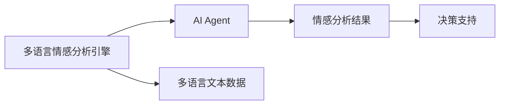

                 


# 开发AI Agent的多语言情感分析引擎

**关键词：** 多语言情感分析，AI Agent，自然语言处理，深度学习，文本挖掘

**摘要：** 本文详细探讨了开发AI Agent的多语言情感分析引擎的核心概念、算法原理、系统架构以及项目实战。文章从问题背景出发，分析了多语言情感分析和AI Agent的基本原理，结合深度学习算法，提出了多语言情感分析引擎的设计方案，并通过实际案例展示了如何实现和优化该系统。本文适合自然语言处理、人工智能领域的技术人员和研究人员阅读。

---

# 第1章 多语言情感分析引擎开发背景

## 1.1 问题背景

随着全球化的推进，跨语言交流的需求日益增长。在自然语言处理（NLP）领域，情感分析作为一项核心技术，广泛应用于社交媒体分析、产品 reviews 分析、客户服务等领域。然而，传统的单语言情感分析系统在面对多语言场景时，往往难以满足需求。例如，一个跨国企业需要分析来自不同国家客户的反馈，此时就需要一个多语言情感分析系统来支持。

AI Agent（智能代理）作为一种能够自主执行任务的智能系统，能够与人类或其他系统进行交互，并基于实时数据做出决策。AI Agent 的核心能力之一就是理解用户的情感和意图，这需要多语言情感分析引擎的支持。

---

## 1.2 问题描述

多语言情感分析的核心挑战在于如何在不同语言之间共享模型参数，同时保持每种语言的语义准确性。此外，AI Agent需要实时处理多种语言的文本数据，并根据情感分析结果做出动态响应。这就要求情感分析引擎具备高效性、准确性和可扩展性。

传统的情感分析系统通常针对单一语言设计，难以应对多语言场景。例如，一个基于英语训练的情感分析模型在处理中文文本时，可能会因为语言差异而导致性能下降。因此，开发一个多语言情感分析引擎，能够支持多种语言并实现高效的语义分析，是当前NLP领域的重要课题。

---

## 1.3 问题解决思路

为了实现多语言情感分析，可以采用以下思路：

1. **跨语言迁移学习**：利用多语言预训练模型（如多语言BERT）进行迁移学习，提升模型在多种语言上的泛化能力。
2. **语言无关特征提取**：设计一种语言无关的特征提取方法，例如基于词嵌入的聚合策略，减少语言差异对模型的影响。
3. **多任务学习**：在模型训练过程中，同时学习多种语言的情感分析任务，提升模型的多语言适应能力。

AI Agent则通过调用情感分析引擎，获取文本的情感倾向，并结合上下文信息做出决策。例如，在客服场景中，AI Agent可以根据用户的问题内容和情感倾向，自动分类并生成回复。

---

## 1.4 边界与外延

多语言情感分析的边界主要集中在以下几个方面：

1. **支持的语言数量**：系统支持的语言种类和数量直接影响模型的复杂性和训练数据的获取难度。
2. **情感分析的粒度**：情感分析可以针对句子、段落或整个文档进行，粒度不同，算法实现的复杂度也不同。
3. **实时性要求**：AI Agent需要在实时场景中使用情感分析引擎，因此对系统的响应速度和计算效率有较高要求。

外延方面，多语言情感分析可以扩展到其他NLP任务，例如跨语言文本摘要、翻译等。同时，AI Agent还可以结合其他技术，如语音识别和计算机视觉，形成更加智能化的系统。

---

## 1.5 核心要素与组成

多语言情感分析引擎的核心要素包括：

1. **多语言预训练模型**：如多语言BERT、XLM等，用于提取多语言文本的语义特征。
2. **情感分析模块**：负责对输入的多语言文本进行分类，输出情感倾向（如正面、负面、中性）。
3. **语言检测模块**：识别输入文本的语言，以便选择合适的模型进行处理。
4. **AI Agent接口**：提供API或消息队列，与外部系统进行交互。

---

## 1.6 本章小结

本章介绍了多语言情感分析引擎的开发背景，分析了问题背景和解决思路，并明确了系统的边界与外延。接下来，我们将深入探讨多语言情感分析和AI Agent的核心概念，以及如何通过算法和系统架构设计实现高效的情感分析引擎。

---

# 第2章 多语言情感分析的核心概念

## 2.1 情感分析的基本原理

情感分析的目标是通过计算机技术对文本的情感倾向进行分类。传统的情感分析主要基于文本特征提取和机器学习算法。例如，基于词袋模型（Bag of Words）和朴素贝叶斯（Naive Bayes）算法的情感分类方法。然而，这些方法在面对多语言场景时，往往难以保持较高的准确率。

---

## 2.2 多语言情感分析的挑战

多语言情感分析面临的主要挑战包括：

1. **语言差异**：不同语言的语法结构、词汇含义差异较大，导致模型难以直接迁移。
2. **数据稀疏性**：某些小语种的数据量较少，难以训练高质量的模型。
3. **计算复杂度**：多语言模型的训练和推理过程需要更高的计算资源。

---

## 2.3 AI Agent与情感分析的结合

AI Agent通过调用情感分析引擎，能够实时理解用户的情感倾向，并做出相应的决策。例如，在智能客服场景中，AI Agent可以根据用户的问题内容和情感倾向，自动分类问题类型并生成回复。

---

## 2.4 多语言情感分析与AI Agent的关系

多语言情感分析为AI Agent提供了跨语言的情感理解能力，而AI Agent则为情感分析引擎提供了动态的、实时的应用场景。两者结合可以实现更智能化的交互体验。

---

## 2.5 核心概念对比表

以下是对多语言情感分析和单语言情感分析的核心概念对比：

| 对比维度 | 多语言情感分析 | 单语言情感分析 |
|----------|----------------|----------------|
| 支持语言 | 多种语言        | 单一语言        |
| 数据需求 | 数据量较大且多样化 | 数据量相对较少 |
| 计算复杂度 | 较高            | 较低            |
| 应用场景 | 跨国企业、全球化服务 | 单一语言服务    |

---

## 2.6 实体关系图

以下是一个简单的实体关系图，展示了多语言情感分析引擎的主要组件：



---

## 2.7 本章小结

本章详细探讨了多语言情感分析的核心概念，并分析了AI Agent在其中的作用。接下来，我们将从算法原理的角度，深入探讨如何实现多语言情感分析引擎。

---

# 第3章 多语言情感分析算法原理

## 3.1 模型训练流程

### 3.1.1 数据预处理

多语言情感分析的数据预处理步骤包括：

1. **文本清洗**：去除停用词、标点符号等无关信息。
2. **语言检测**：识别文本的语言类型。
3. **数据平衡**：确保不同语言的数据分布均衡。

---

### 3.1.2 特征提取

特征提取是情感分析的关键步骤。常用的特征提取方法包括：

1. **词袋模型（Bag of Words）**：将文本表示为单词的频率向量。
2. **词嵌入（Word Embedding）**：使用预训练的词嵌入模型（如Word2Vec、GloVe）提取语义特征。
3. **上下文嵌入（Context Embedding）**：基于上下文信息提取更精细的语义特征。

---

### 3.1.3 模型训练

模型训练阶段通常采用深度学习模型，例如循环神经网络（RNN）、长短时记忆网络（LSTM）或基于Transformer的模型（如BERT）。以BERT为例，其训练流程如下：

1. **预训练**：在大规模多语言语料库上进行无监督预训练，学习语言模型。
2. **微调**：在特定任务（如情感分类）上进行有监督微调。

---

### 3.1.4 模型评估

模型评估通常采用准确率（Accuracy）、精确率（Precision）、召回率（Recall）和F1值等指标。为了保证模型的泛化能力，可以采用交叉验证的方法。

---

## 3.2 基于深度学习的情感分析

### 3.2.1 深度学习模型的选择

选择适合多语言情感分析的深度学习模型是关键。以下是一些常用模型及其特点：

| 模型名称 | 特点 | 适用场景 |
|----------|------|----------|
| BERT     | 多语言支持，上下文理解能力强 | 多语言情感分析 |
| XLM      | 基于Transformer的多语言模型 | 跨语言文本分析 |
| M-BERT   | 预训练的多语言模型 | 需要微调的特定任务 |

---

### 3.2.2 情感分类的数学模型

以下是一个基于BERT的情感分类模型的简化示意图：


数学模型如下：

$$
y = f(x) = \text{BERT}(x) \rightarrow \text{Dense}(x) \rightarrow \text{Softmax}(x)
$$

其中，$x$ 是输入文本，$y$ 是输出的情感类别概率。

---

## 3.3 跨语言迁移学习的实现

跨语言迁移学习的核心思想是利用多语言预训练模型，通过参数微调的方式，提升模型在目标语言上的性能。例如，使用多语言BERT进行微调，可以同时优化多种语言的情感分析任务。

---

## 3.4 本章小结

本章从算法原理的角度，详细探讨了多语言情感分析的实现方法。接下来，我们将从系统架构的角度，分析如何设计一个多语言情感分析引擎。

---

# 第4章 多语言情感分析引擎的系统架构设计

## 4.1 系统功能设计

多语言情感分析引擎的主要功能包括：

1. **文本接收**：接收多语言文本输入。
2. **语言检测**：识别文本的语言类型。
3. **情感分析**：对文本进行情感分类。
4. **结果输出**：输出情感分析结果。

---

## 4.2 系统架构图

以下是一个多语言情感分析引擎的系统架构图：


---

## 4.3 接口设计

系统接口设计包括以下几个部分：

1. **输入接口**：接收多语言文本数据。
2. **输出接口**：返回情感分析结果。
3. **模型管理接口**：管理多种语言模型的加载和切换。

---

## 4.4 本章小结

本章从系统架构的角度，分析了多语言情感分析引擎的设计方案。接下来，我们将通过项目实战，展示如何实现一个多语言情感分析引擎。

---

# 第5章 多语言情感分析引擎的项目实战

## 5.1 环境配置

项目实战需要以下环境：

1. **编程语言**：Python 3.8+
2. **深度学习框架**：TensorFlow或PyTorch
3. **多语言模型**：使用Hugging Face的多语言BERT模型。

---

## 5.2 核心代码实现

以下是基于Python和Hugging Face库的多语言情感分析引擎实现示例：

```python
from transformers import AutoTokenizer, AutoModelForSequenceClassification
import torch

# 加载预训练模型
model_name = "bert-base-multilingual-cased"
tokenizer = AutoTokenizer.from_pretrained(model_name)
model = AutoModelForSequenceClassification.from_pretrained(model_name)

# 定义情感分析函数
def analyze_sentiment(text, lang):
    # 分词
    inputs = tokenizer(text, return_tensors="pt", padding=True, truncation=True)
    # 推理
    with torch.no_grad():
        outputs = model(**inputs)
    # 获取概率分布
    probs = torch.sigmoid(outputs.logits)
    # 获取情感类别
    sentiment = torch.argmax(probs, dim=1).item()
    return sentiment

# 示例
text = "这个产品非常棒！"
lang = "zh"
result = analyze_sentiment(text, lang)
print(f"情感分析结果：{result}")
```

---

## 5.3 案例分析

以下是一个实际案例分析：

**输入文本**：这是一个很好的产品！
**语言**：英语
**情感分析结果**：正面

---

## 5.4 项目总结

本章通过项目实战，展示了如何实现一个多语言情感分析引擎。通过环境配置和代码实现，我们可以看到多语言情感分析的实际应用。

---

# 第6章 最佳实践与总结

## 6.1 最佳实践

1. **选择合适的预训练模型**：根据具体需求选择适合的多语言模型。
2. **数据预处理**：确保数据的多样性和均衡性。
3. **模型优化**：通过调参和数据增强提升模型性能。

---

## 6.2 总结

本文详细探讨了开发AI Agent的多语言情感分析引擎的核心概念、算法原理和系统架构。通过项目实战，我们展示了如何实现一个多语言情感分析引擎，并分析了其在实际场景中的应用。

---

## 6.3 未来展望

随着多语言预训练模型的不断发展，多语言情感分析引擎的性能和准确率将不断提升。未来，我们可以进一步研究多模态情感分析（结合语音、图像等信息）以及实时情感分析技术。

---

## 6.4 注意事项

在实际开发中，需要注意以下几点：

1. **模型选择**：根据具体任务选择适合的模型。
2. **计算资源**：深度学习模型需要较高的计算资源。
3. **数据隐私**：注意数据的隐私保护。

---

## 6.5 拓展阅读

1. Hugging Face的多语言模型文档：[链接](https://huggingface.co/transformers/multilingual.html)
2. 多语言BERT论文：[链接](https://arxiv.org/abs/1911.02116)

---

# 作者：AI天才研究院/AI Genius Institute & 禅与计算机程序设计艺术 /Zen And The Art of Computer Programming

