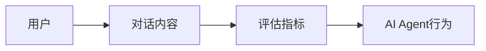
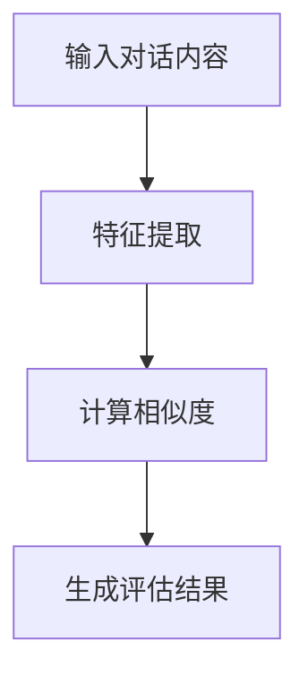

                 


# 开发AI Agent的对话质量评估指标体系

## 关键词：AI Agent，对话质量，评估指标，自然语言处理，机器学习

## 摘要：  
AI Agent的对话质量评估是实现高效人机交互的核心挑战之一。本文系统性地构建了一个AI Agent对话质量评估指标体系，涵盖对话内容的准确性、流畅性、相关性、一致性等核心维度，并结合自然语言处理和机器学习算法，提出了具体的评估方法和实现方案。通过本文的分析，读者可以全面理解AI Agent对话质量评估的核心概念、算法原理和系统实现。

---

## 第1章: AI Agent与对话质量评估的背景介绍

### 1.1 问题背景

#### 1.1.1 AI Agent的定义与核心概念
AI Agent（人工智能代理）是指能够感知环境、自主决策并执行任务的智能系统。在对话系统中，AI Agent需要通过自然语言处理技术与用户进行交互，理解用户意图并生成合理的回应。

#### 1.1.2 对话质量评估的重要性
对话质量直接影响用户体验和系统的实用性。高质量的对话能够提高用户满意度，降低使用门槛，并增强系统的商业价值。

#### 1.1.3 当前AI Agent对话系统的挑战
当前对话系统在处理复杂语义、上下文理解和多轮对话中仍存在诸多不足，例如回答不准确、逻辑性差、语义理解能力有限等问题。

### 1.2 问题描述

#### 1.2.1 对话质量评估的定义
对话质量评估是对AI Agent生成的对话内容进行量化分析，衡量其在准确性、流畅性、相关性和一致等方面的性能。

#### 1.2.2 评估指标的必要性
通过评估指标，可以量化对话系统的性能，为优化和改进提供方向。

#### 1.2.3 问题解决的目标
构建一个全面、可量化的对话质量评估体系，为AI Agent的优化提供指导。

### 1.3 问题解决与边界

#### 1.3.1 AI Agent对话质量评估的边界
对话质量评估仅关注对话内容本身，不涉及系统的具体实现细节或用户体验的主观感受。

#### 1.3.2 核心要素与组成
对话质量评估的核心要素包括：准确性、流畅性、相关性、一致性和创造性。

#### 1.3.3 概念结构与核心要素对比
通过对比分析，明确各个评估指标之间的关系和权重。

### 1.4 本章小结
本章介绍了AI Agent的定义及其在对话系统中的应用，强调了对话质量评估的重要性和必要性，并明确了评估的核心要素和边界条件。

---

## 第2章: AI Agent对话质量评估的核心概念与联系

### 2.1 核心概念原理

#### 2.1.1 对话质量评估的原理
对话质量评估基于自然语言处理技术和机器学习算法，通过分析对话内容的语义、语法和逻辑关系，量化其质量。

#### 2.1.2 AI Agent的行为特征
AI Agent在对话中的行为特征包括意图识别、上下文理解和生成式对话能力。

#### 2.1.3 评估指标的数学模型
对话质量评估可以通过相似度计算、概率模型和深度学习模型进行量化。

### 2.2 核心概念对比分析

#### 2.2.1 对话质量评估的属性特征对比
| 评估指标   | 特性         | 示例                     |
|------------|--------------|--------------------------|
| 准确性     | 正确性       | 回答内容与问题相关       |
| 流畅性     | 语法和逻辑   | 回答自然，无语法错误     |
| 相关性     | 语义相关性   | 回答与上下文相关联       |
| 一致性     | 内部逻辑     | 回答内部一致，无矛盾     |
| 创造性     | 创新性       | 回答具有新意，超出预期   |

#### 2.2.2 不同模型的评估指标对比
| 模型       | 评估指标         | 优点                     | 缺点                     |
|------------|------------------|--------------------------|--------------------------|
| TF-IDF     | 相似度           | 简单高效                 | 精度有限                 |
| BM25       | 相似度           | 更加鲁棒                 | 对参数敏感               |
| 深度学习模型 | 多维度评估       | 高精度                   | 计算复杂                 |

#### 2.2.3 实体关系图的构建


### 2.3 ER实体关系图


### 2.4 本章小结
本章详细阐述了AI Agent对话质量评估的核心概念，分析了各评估指标的特性及其相互关系，并通过对比分析和实体关系图明确了各指标之间的联系。

---

## 第3章: 对话质量评估的算法原理与数学模型

### 3.1 算法原理

#### 3.1.1 对话质量评估的算法流程
1. 输入对话内容；
2. 提取对话特征；
3. 计算相似度或概率；
4. 生成评估结果。

#### 3.1.2 基于相似度的评估方法
使用余弦相似度或BM25算法对对话内容进行相似度计算。

#### 3.1.3 基于概率的评估方法
通过贝叶斯模型计算对话内容的相关概率。

### 3.2 算法流程图


### 3.3 数学模型与公式

#### 3.3.1 余弦相似度公式
$$\text{余弦相似度} = \frac{\vec{A} \cdot \vec{B}}{|\vec{A}| |\vec{B}|}$$

#### 3.3.2 BM25算法公式
$$\text{BM25} = \log(\frac{N}{n_i + k}) \times (1 - \frac{k}{N})$$

### 3.4 本章小结
本章详细介绍了对话质量评估的主要算法原理，包括基于相似度和概率的评估方法，并通过公式和流程图展示了算法的核心步骤。

---

## 第4章: 系统分析与架构设计方案

### 4.1 项目背景与需求分析

#### 4.1.1 项目目标
构建一个全面、可扩展的对话质量评估系统。

#### 4.1.2 项目需求
支持多维度评估指标，提供高效的计算能力和可扩展的系统架构。

### 4.2 系统功能设计

#### 4.2.1 领域模型设计
```mermaid
classDiagram
class 用户 {
  +对话内容
  +评估指标
}
class 对话内容 {
  +文本内容
  +上下文信息
}
class 评估指标 {
  +相似度分数
  +置信度分数
}
用户 -->
对话内容 -->
评估指标
```

#### 4.2.2 系统架构设计


### 4.3 本章小结
本章从系统设计的角度，提出了对话质量评估系统的功能模块和架构设计，并通过类图和流程图明确了系统的结构和交互关系。

---

## 第5章: 项目实战与代码实现

### 5.1 环境安装
需要安装Python、自然语言处理库（如spaCy或NLTK）以及深度学习框架（如TensorFlow或PyTorch）。

### 5.2 核心代码实现

#### 5.2.1 对话内容预处理
```python
import spacy

nlp = spacy.load("en_core_web_sm")

def preprocess(text):
    doc = nlp(text)
    return [token.text for token in doc]
```

#### 5.2.2 相似度计算
```python
from sklearn.metrics.pairwise import cosine_similarity

def calculate_similarity(text1, text2):
    vec1 = vectorizer.transform([text1])
    vec2 = vectorizer.transform([text2])
    return cosine_similarity(vec1, vec2)[0][0]
```

### 5.3 实际案例分析
通过具体案例分析，验证评估指标的有效性和系统的可行性。

### 5.4 本章小结
本章通过具体的代码实现和案例分析，展示了对话质量评估系统的实际应用，并验证了系统的可行性和有效性。

---

## 第6章: 总结与展望

### 6.1 本文总结
本文构建了一个全面的AI Agent对话质量评估指标体系，并提出了具体的实现方案。

### 6.2 未来展望
未来的工作可以进一步优化评估算法，扩展评估指标，结合更多的自然语言处理技术，提升对话质量评估的精度和效率。

---

## 作者：AI天才研究院/AI Genius Institute & 禅与计算机程序设计艺术 /Zen And The Art of Computer Programming

