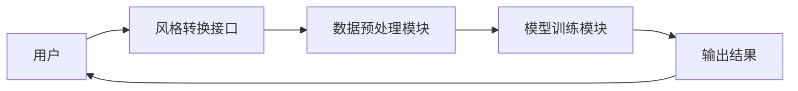

                 


# 开发AI Agent的文本风格转换能力

> 关键词：AI Agent, 文本风格转换, 自然语言处理, 生成对抗网络, 预训练模型, 风格建模

> 摘要：本文深入探讨了开发具备文本风格转换能力的AI Agent的关键技术与实现方法。从核心概念到算法原理，从系统架构到项目实战，全面解析了AI Agent在文本风格转换中的应用。通过详细的技术分析和实际案例，展示了如何利用自然语言处理和机器学习技术实现高效的风格转换，并对系统设计和实现中的关键问题进行了深入讨论。

---

# 第一部分: AI Agent与文本风格转换概述

## 第1章: 引言

### 1.1 AI Agent的定义与背景

#### 1.1.1 AI Agent的基本概念
AI Agent（人工智能代理）是指能够感知环境、执行任务并做出决策的智能实体。它通过接收输入、处理信息并输出结果来与用户或系统交互。AI Agent的核心能力包括自然语言理解、推理、学习和自适应优化。

#### 1.1.2 文本风格转换的背景与意义
文本风格转换是将一段文本从一种表达方式转换为另一种表达方式的过程，例如将正式的法律文本转换为口语化的解释，或将复杂的学术语言简化为通俗易懂的内容。随着自然语言处理技术的发展，文本风格转换在内容创作、信息处理和人机交互等领域具有广泛的应用前景。

#### 1.1.3 AI Agent在文本风格转换中的作用
AI Agent可以通过分析输入文本的语义和上下文，生成符合目标风格的输出文本。这种能力使得AI Agent能够为用户提供个性化的文本处理服务，提升用户体验和效率。

### 1.2 文本风格转换的核心问题

#### 1.2.1 文本风格的定义与分类
文本风格可以分为多个维度，包括语气、用词、句式等。例如，正式风格注重严谨和规范，而口语风格则更加随意和自然。文本风格的分类为风格转换提供了基础。

#### 1.2.2 文本风格转换的目标与挑战
文本风格转换的目标是在保持原文内容不变的情况下，改变其表达方式。然而，这一过程面临诸多挑战，例如如何准确提取文本的特征，如何避免信息损失，以及如何处理风格之间的细微差异。

#### 1.2.3 AI Agent在风格转换中的任务边界
AI Agent在风格转换中的任务包括文本理解、风格分析、内容生成等。然而，AI Agent的风格转换能力受限于数据质量和模型性能，需要在特定范围内实现。

---

## 第2章: 文本风格转换的核心概念与联系

### 2.1 文本风格转换的核心原理

#### 2.1.1 特征提取与风格建模
特征提取是通过自然语言处理技术从文本中提取关键特征，例如词向量、句向量等。风格建模则是将这些特征映射到特定的风格表示空间中。

#### 2.1.2 风格迁移与内容保持
风格迁移是指将一种风格的特点转移到另一种风格的过程。内容保持则是指在转换过程中保持原文的语义信息不变。

#### 2.1.3 风格表示与转换策略
风格表示通常采用向量或概率分布的形式，风格转换策略则包括基于生成对抗网络（GAN）的方法和基于预训练语言模型的方法。

### 2.2 核心概念对比分析

#### 2.2.1 不同风格转换方法的对比
以下是几种主流风格转换方法的对比：

| 方法 | 原理 | 优点 | 缺点 |
|------|------|------|------|
| GAN | 对抗训练，生成器和判别器相互博弈 | 高质量生成 | 训练不稳定 |
| 预训练模型微调 | 利用大规模预训练语言模型进行微调 | 多任务能力强 | 需要大量数据 |

#### 2.2.2 风格与内容的分离与融合
风格与内容的分离可以通过提取内容向量和风格向量来实现，而融合则需要将不同风格的特征重新组合。

#### 2.2.3 风格转换中的特征提取与重建
特征提取和重建是风格转换的关键步骤，特征提取决定了风格转换的效果，而重建则决定了生成文本的质量。

---

### 2.3 系统架构与实体关系图

#### 2.3.1 系统实体关系图
以下是系统实体关系图：


---

## 第3章: 文本风格转换的算法原理

### 3.1 基于生成对抗网络（GAN）的风格转换算法

#### 3.1.1 GAN的基本原理
GAN由生成器和判别器组成，生成器通过对抗训练生成符合目标风格的文本，而判别器则负责区分生成文本和真实文本。

#### 3.1.2 GAN的数学模型
生成器的损失函数为：
$$ L_G = \log(D(G(x))) $$
判别器的损失函数为：
$$ L_D = \log(D(x)) + \log(1 - D(G(x))) $$

#### 3.1.3 GAN的实现步骤
1. 初始化生成器和判别器的参数。
2. 训练判别器以区分真实文本和生成文本。
3. 训练生成器以欺骗判别器。
4. 重复训练直到损失函数收敛。

#### 3.1.4 GAN的优缺点
优点：生成质量高；缺点：训练不稳定，难以控制生成结果。

---

### 3.2 基于预训练语言模型的风格转换算法

#### 3.2.1 预训练语言模型的基本原理
预训练语言模型（如BERT、GPT）通过大规模数据预训练，能够捕获文本中的语义和语法信息。

#### 3.2.2 预训练模型的微调方法
通过在特定任务上对预训练模型进行微调，可以实现风格转换。

#### 3.2.3 预训练模型的数学模型
以GPT为例，其数学模型为：
$$ P(y|x) = \frac{1}{Z} \exp(f(x,y)) $$
其中，$f(x,y)$是模型的输出，$Z$是归一化因子。

---

### 3.3 风格转换算法的实现步骤

#### 3.3.1 数据预处理
将输入文本分词、去停用词并生成训练样本。

#### 3.3.2 模型训练
使用预处理后的数据训练生成器和判别器（以GAN为例）。

#### 3.3.3 模型评估
通过 BLEU、ROUGE 等指标评估生成文本的质量。

---

## 第4章: 系统架构与实现

### 4.1 系统功能设计

#### 4.1.1 系统模块划分
系统主要模块包括：
- 数据预处理模块
- 模型训练模块
- 风格转换接口

#### 4.1.2 系统功能流程
1. 数据预处理模块接收输入文本并进行清洗。
2. 模型训练模块基于清洗后的数据训练风格转换模型。
3. 风格转换接口接收用户请求并返回生成文本。

---

### 4.2 系统架构设计

#### 4.2.1 系统架构图
以下是系统架构图：


---

### 4.3 系统接口设计

#### 4.3.1 接口输入
- 输入文本
- 目标风格

#### 4.3.2 接口输出
- 转换后的文本
- 转换结果的状态码

---

### 4.4 系统交互流程

#### 4.4.1 交互流程图
以下是系统交互流程图：



---

## 第5章: 项目实战

### 5.1 环境安装与配置

#### 5.1.1 安装Python环境
```bash
python --version
pip install --upgrade pip
```

#### 5.1.2 安装依赖库
```bash
pip install numpy pandas torch
```

---

### 5.2 核心代码实现

#### 5.2.1 数据预处理
```python
def preprocess(text):
    # 分词
    tokens = text.split()
    # 去停用词
    filtered_tokens = [token for token in tokens if token not in stop_words]
    return ' '.join(filtered_tokens)
```

#### 5.2.2 模型定义
```python
class Generator(nn.Module):
    def __init__(self, input_dim, output_dim):
        super(Generator, self).__init__()
        self.fc = nn.Linear(input_dim, output_dim)
    def forward(self, x):
        return torch.relu(self.fc(x))
```

#### 5.2.3 模型训练
```python
def train(generator, discriminator, optimizer_G, optimizer_D, criterion):
    for epoch in range(num_epochs):
        for batch in dataloader:
            # 判别器训练
            optimizer_D.zero_grad()
            real_output = discriminator(batch)
            D_loss = criterion(real_output, torch.ones_like(real_output))
            D_loss.backward()
            optimizer_D.step()
            # 生成器训练
            optimizer_G.zero_grad()
            fake_output = generator(batch)
            G_loss = criterion(fake_output, torch.zeros_like(fake_output))
            G_loss.backward()
            optimizer_G.step()
```

---

### 5.3 项目小结

#### 5.3.1 代码实现的关键点
- 数据预处理的重要性
- 模型训练的稳定性
- 接口设计的合理性

#### 5.3.2 项目实现中的注意事项
- 数据质量对模型性能的影响
- 模型调参的重要性
- 生成文本的质量评估

---

## 第6章: 总结与展望

### 6.1 总结
本文系统地探讨了开发AI Agent文本风格转换能力的关键技术，包括核心概念、算法原理、系统架构和项目实战。通过详细的技术分析和实际案例，展示了如何利用自然语言处理和机器学习技术实现高效的风格转换。

### 6.2 展望
未来，随着自然语言处理技术的不断发展，AI Agent的文本风格转换能力将更加智能化和多样化。研究方向包括多风格转换、实时风格转换、风格保持与内容保持的平衡等。

---

## 第7章: 最佳实践与注意事项

### 7.1 开发中的注意事项
- 数据质量对模型性能的影响
- 模型调参的重要性
- 生成文本的可解释性

### 7.2 实践中的小结
- 选择合适的算法和模型
- 注重数据预处理和特征提取
- 提供用户友好的接口设计

---

## 第8章: 拓展阅读与学习建议

### 8.1 拓展阅读
- 《生成对抗网络：理论与实践》
- 《预训练语言模型的风格转换研究》

### 8.2 学习建议
- 系统学习自然语言处理基础知识
- 关注最新的研究成果和技术动态
- 多实践，积累项目经验

---

## 作者

作者：AI天才研究院/AI Genius Institute  
联系邮箱：[contact@aiagent.com](mailto:contact@aiagent.com)

