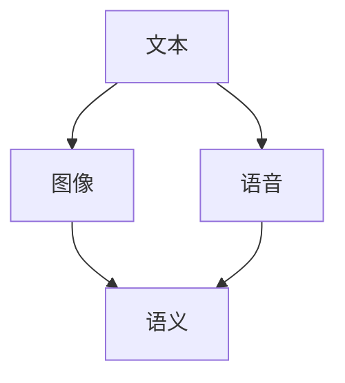
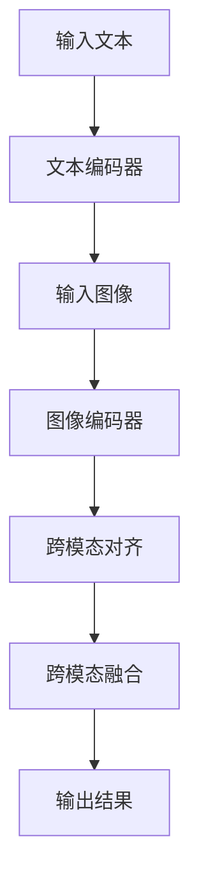
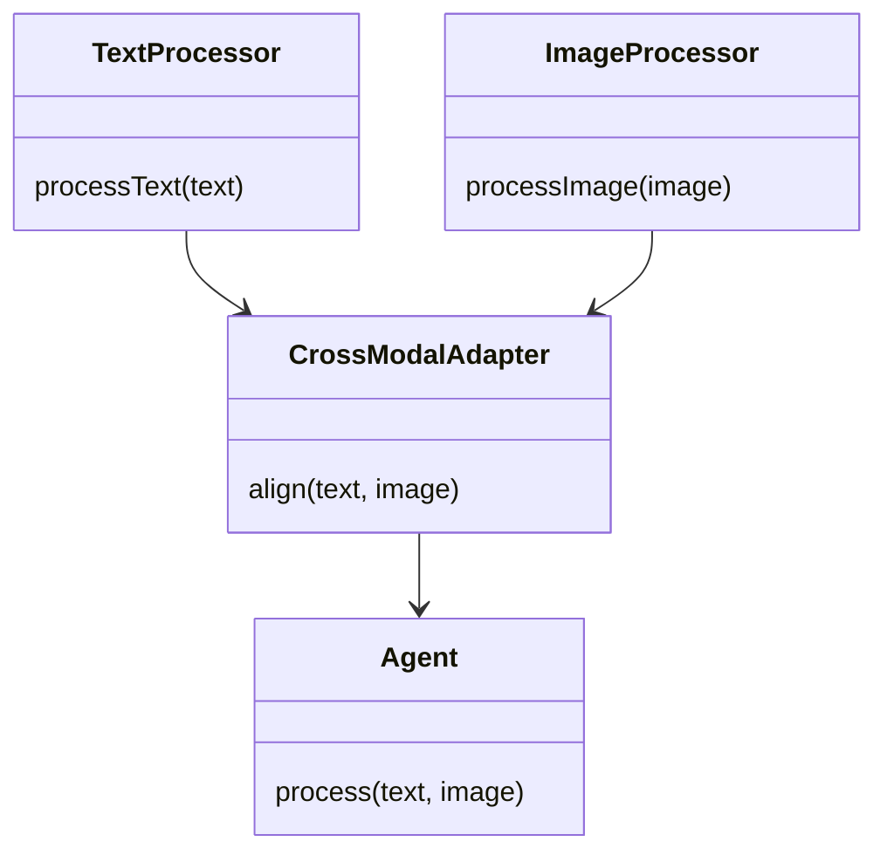
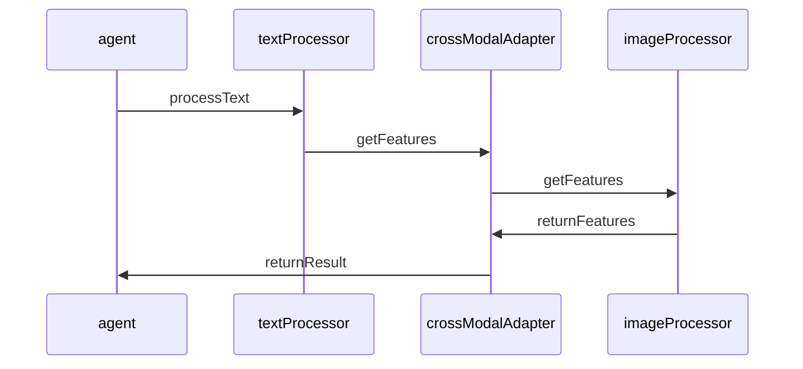

                 


# 开发AI Agent的跨模态学习能力：整合多源信息

## 关键词：AI Agent, 跨模态学习, 多源信息整合, 机器学习, 深度学习, 自然语言处理, 图像处理

## 摘要：  
本文深入探讨AI Agent在跨模态学习中的应用，分析其整合多源信息的能力。通过背景介绍、核心概念、算法原理、系统架构、项目实战和最佳实践，详细阐述AI Agent如何通过跨模态学习提升性能，整合文本、图像、语音等多种信息源，实现复杂任务的高效解决。文章还通过实际案例和代码示例，展示跨模态学习技术在AI Agent中的具体应用，为开发者提供实用的技术指导。

---

# 第一部分: AI Agent与跨模态学习概述

## 第1章: AI Agent与跨模态学习的背景

### 1.1 AI Agent的基本概念

#### 1.1.1 AI Agent的定义与特点  
AI Agent（人工智能代理）是指具有感知环境、做出决策并执行操作的智能实体。其特点包括自主性、反应性、目标导向性和社会性。AI Agent能够根据环境输入做出响应，并通过学习和适应提升性能。

#### 1.1.2 AI Agent的核心功能与应用场景  
AI Agent的核心功能包括信息处理、决策制定和任务执行。其应用场景广泛，如智能助手、自动驾驶、智能客服等。

#### 1.1.3 跨模态学习的定义与特点  
跨模态学习是指在同一模型中处理和学习多种数据模态（如文本、图像、语音）的能力。其特点在于能够整合不同模态的信息，提升模型的泛化能力和鲁棒性。

### 1.2 跨模态学习的背景与意义  
跨模态学习的背景源于单一模态模型在复杂任务中的局限性。通过整合多模态信息，AI Agent能够更好地理解环境，做出更准确的决策。

### 1.3 本章小结  
本章介绍了AI Agent的基本概念、核心功能及其应用场景，并阐述了跨模态学习的背景和意义，为后续内容打下基础。

---

## 第2章: 跨模态学习的核心概念与联系

### 2.1 跨模态学习的核心原理  
跨模态学习的核心原理包括多模态编码、模态对齐和模态融合。通过将不同模态的信息映射到共同的语义空间，实现信息的有效整合。

### 2.2 跨模态学习的属性对比表  
下表展示了跨模态学习的主要属性及其描述：

| 属性 | 描述 |
|------|------|
| 输入模态 | 文本、图像、语音等 |
| 输出模态 | 文本、图像、语音等 |
| 对齐方式 | 显式对齐、隐式对齐 |
| 融合方式 | 线性融合、非线性融合 |

### 2.3 跨模态学习的ER实体关系图  
下图展示了跨模态学习的实体关系：



### 2.4 本章小结  
本章详细讲解了跨模态学习的核心原理，并通过对比表和ER图展示了其属性和关系，为后续算法设计提供了理论基础。

---

## 第3章: 跨模态学习的算法原理

### 3.1 跨模态学习的算法框架  
跨模态学习的算法框架包括多模态编码器、模态对齐网络和模态融合网络。

#### 3.1.1 多模态编码器  
多模态编码器将输入的文本、图像等信息编码为语义向量。例如，文本编码器可以使用BERT模型提取文本特征，图像编码器可以使用ResNet提取图像特征。

#### 3.1.2 模态对齐网络  
模态对齐网络将不同模态的特征对齐到共同的语义空间。常用的方法包括对比学习和注意力机制。

#### 3.1.3 模态融合网络  
模态融合网络将对齐后的特征融合，生成最终的输出。常见的融合方法包括加法、乘法和注意力机制。

### 3.2 跨模态学习的数学模型  

#### 3.2.1 多模态编码器的数学表示  
文本编码器的数学表示如下：

$$
x_{text} = encoder_{text}(input_{text})
$$

图像编码器的数学表示如下：

$$
x_{image} = encoder_{image}(input_{image})
$$

#### 3.2.2 模态对齐的数学表示  
跨模态对齐的相似度计算公式为：

$$
sim(x_{text}, x_{image}) = \frac{x_{text} \cdot x_{image}}{||x_{text}|| \cdot ||x_{image}||}
$$

#### 3.2.3 模态融合的数学表示  
模态融合的数学表示如下：

$$
y = decoder(x_{text}, x_{image})
$$

### 3.3 跨模态学习的算法流程图  



### 3.4 本章小结  
本章详细讲解了跨模态学习的算法框架和数学模型，并通过流程图展示了算法的整体流程。

---

## 第4章: 系统架构与设计

### 4.1 系统架构设计  

#### 4.1.1 系统功能模块  
系统功能模块包括文本处理模块、图像处理模块、跨模态对齐模块和融合模块。

#### 4.1.2 系统类图设计  
下图展示了系统的类图：



### 4.2 系统接口设计  

#### 4.2.1 系统接口描述  
系统接口包括文本处理接口、图像处理接口和跨模态融合接口。

#### 4.2.2 系统交互序列图  
下图展示了系统的交互序列：



### 4.3 本章小结  
本章详细设计了系统的架构和接口，并通过类图和序列图展示了系统的运行流程。

---

## 第5章: 项目实战

### 5.1 环境安装  

#### 5.1.1 安装Python环境  
安装Python 3.8及以上版本。

#### 5.1.2 安装依赖库  
安装以下依赖库：

```
pip install numpy
pip install matplotlib
pip install transformers
pip install tensorflow
```

### 5.2 系统核心实现源代码  

#### 5.2.1 文本编码器  
文本编码器的实现代码如下：

```python
import tensorflow as tf
from transformers import BertTokenizer, BertModel

class TextEncoder:
    def __init__(self, model_name='bert-base-uncased'):
        self.tokenizer = BertTokenizer.from_pretrained(model_name)
        self.model = BertModel.from_pretrained(model_name)
    
    def encode(self, text):
        inputs = self.tokenizer(text, return_tensors='tf')
        outputs = self.model(inputs)
        return outputs.last_hidden_state.numpy()
```

#### 5.2.2 图像编码器  
图像编码器的实现代码如下：

```python
import tensorflow as tf
from tensorflow.keras.applications import ResNet50
from tensorflow.keras.preprocessing import image

class ImageEncoder:
    def __init__(self):
        self.model = ResNet50(weights='imagenet', include_top=False)
    
    def encode(self, image_path):
        img = image.load_img(image_path, target_size=(224, 224))
        img_array = image.img_to_array(img)
        img_array = tf.expand_dims(img_array, 0)
        features = self.model(img_array)
        return features.numpy()
```

#### 5.2.3 跨模态对齐网络  
跨模态对齐网络的实现代码如下：

```python
import tensorflow as tf

class CrossModalAdapter:
    def __init__(self, embedding_dim=256):
        self.W_text = tf.Variable(tf.random.truncated_normal([256, 256], mean=0, stddev=0.1))
        self.W_image = tf.Variable(tf.random.truncated_normal([256, 256], mean=0, stddev=0.1))
    
    def align(self, text_features, image_features):
        text_aligned = tf.matmul(text_features, self.W_text)
        image_aligned = tf.matmul(image_features, self.W_image)
        return text_aligned, image_aligned
```

#### 5.2.4 跨模态融合网络  
跨模态融合网络的实现代码如下：

```python
import tensorflow as tf

class CrossModalFuser:
    def __init__(self, embedding_dim=256):
        self.W_fuse = tf.Variable(tf.random.truncated_normal([256, 256], mean=0, stddev=0.1))
    
    def fuse(self, text_aligned, image_aligned):
        fused = tf.add(text_aligned, image_aligned)
        fused = tf.nn.relu(fused)
        return fused
```

### 5.3 案例分析与实际应用  

#### 5.3.1 案例分析  
以文本和图像的跨模态分类任务为例，分析系统的实现过程。

#### 5.3.2 实际应用  
展示系统在实际场景中的应用效果，如智能客服中的图像和文本信息整合。

### 5.4 本章小结  
本章通过实际项目展示了跨模态学习技术的实现过程，并通过案例分析和实际应用验证了系统的有效性。

---

## 第6章: 最佳实践与注意事项

### 6.1 最佳实践  

#### 6.1.1 数据预处理技巧  
确保数据的均衡性和多样性，避免数据偏差。

#### 6.1.2 模型调优技巧  
使用交叉验证和超参数优化提升模型性能。

### 6.2 注意事项  

#### 6.2.1 模型的可解释性  
跨模态模型的可解释性较差，需注意模型的可解释性问题。

#### 6.2.2 数据隐私问题  
处理多模态数据时，需注意数据隐私和安全问题。

### 6.3 拓展阅读  
推荐阅读相关领域的经典论文和书籍，深入理解跨模态学习的最新进展。

### 6.4 本章小结  
本章总结了跨模态学习开发中的最佳实践和注意事项，为开发者提供了实用的指导。

---

## 第7章: 小结

### 7.1 本章总结  
本文详细探讨了AI Agent的跨模态学习能力，分析了其整合多源信息的能力，并通过实际案例展示了跨模态学习技术的应用。

### 7.2 展望未来  
未来，随着AI技术的不断发展，跨模态学习将在更多领域得到应用，推动AI Agent的智能化发展。

### 7.3 本章小结  
本章总结了全文的主要内容，并对未来的研究方向进行了展望。

---

## 作者：AI天才研究院/AI Genius Institute & 禅与计算机程序设计艺术 /Zen And The Art of Computer Programming

---

通过本文的详细分析，读者可以全面理解AI Agent的跨模态学习能力，并掌握整合多源信息的核心技术。希望本文能为相关领域的研究和应用提供有价值的参考。

