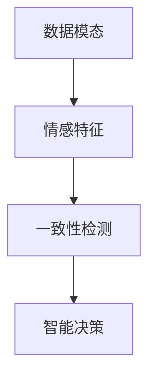
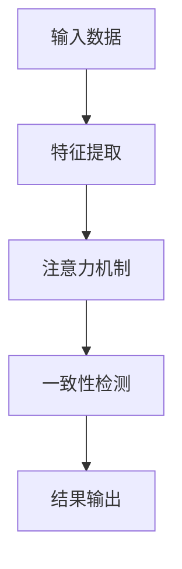
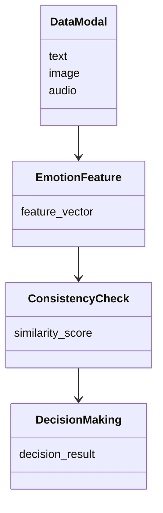
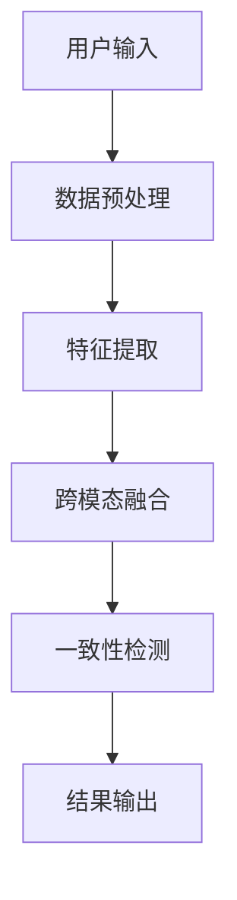

                 


# 开发AI Agent的跨模态情感一致性检测

> 关键词：跨模态情感一致性检测、AI Agent、多模态数据、情感分析、对比学习

> 摘要：本文深入探讨了开发AI Agent的跨模态情感一致性检测的技术与方法。通过分析多模态数据的特性，结合情感一致性检测的核心原理，提出了基于对比学习的跨模态匹配算法，并详细阐述了系统架构设计与实现方案。文章内容涵盖背景介绍、核心概念、算法原理、系统架构、项目实战等多个方面，旨在为AI Agent的跨模态情感一致性检测提供全面的技术指导。

---

# 第一部分: 跨模态情感一致性检测的背景与概念

# 第1章: 跨模态情感一致性检测的背景与问题定义

## 1.1 情感一致性检测的背景

### 1.1.1 多模态数据的兴起

在人工智能领域，多模态数据的处理是当前研究的热点之一。随着传感器技术、自然语言处理（NLP）和计算机视觉（CV）的发展，我们能够从多种模态（如文本、图像、语音等）中获取信息。然而，如何在这些模态之间建立有效的关联，尤其是情感一致性检测方面，仍然面临诸多挑战。

**例如，在社交媒体分析中，一条用户的评论可能包含文本、表情符号和图片等多种模态的信息。** 通过跨模态情感一致性检测，我们可以判断这些模态之间的情感表达是否一致，从而更准确地理解用户的真实情感。

### 1.1.2 情感一致性检测的重要性

情感一致性检测的核心目标是确保不同模态的数据在情感表达上保持一致。这在多个实际场景中具有重要意义：

- **人机交互**：在与AI Agent对话时，用户的情感一致性可以帮助AI更好地理解用户意图。
- **内容审核**：在社交媒体或电商平台中，检测内容的情感一致性有助于识别虚假评论或恶意信息。
- **情感计算**：跨模态的情感一致性检测可以提升情感计算的准确性和鲁棒性。

### 1.1.3 AI Agent在情感一致性检测中的作用

AI Agent作为智能体，需要具备跨模态数据处理和情感分析的能力。通过情感一致性检测，AI Agent可以更准确地理解用户的意图和情感状态，从而提供更个性化的服务。

---

## 1.2 跨模态数据与情感分析的结合

### 1.2.1 跨模态数据的定义与特点

跨模态数据指的是来自不同感知模态的数据，例如：

- **文本模态**：包括评论、对话等。
- **图像模态**：包括图片、视频等。
- **语音模态**：包括音频、语音识别结果等。

跨模态数据的特点包括：

1. **异构性**：不同模态的数据形式和特征完全不同。
2. **互补性**：不同模态的数据可以相互补充，提供更全面的信息。
3. **一致性**：在情感表达上，不同模态的数据可能具有一定的关联性。

### 1.2.2 情感一致性检测的核心概念

情感一致性检测是指在跨模态数据中，判断不同模态的情感表达是否一致。例如，在一条社交媒体帖子中，文本描述了“我非常高兴”，但图片却表现出悲伤的情绪。此时，情感一致性检测可以帮助我们识别这种不一致。

### 1.2.3 问题解决的边界与外延

情感一致性检测的边界包括：

- **数据范围**：仅限于跨模态数据。
- **情感范围**：通常限于正面、负面和中性情感。

情感一致性检测的外延包括：

- **情感强度检测**：检测情感的强度是否一致。
- **情感类型扩展**：支持更多细分的情感类型（如愤怒、嫉妒等）。

---

## 1.3 跨模态情感一致性检测的核心要素

### 1.3.1 数据模态的多样性

跨模态数据的多样性是情感一致性检测的基础。不同模态的数据需要进行有效的融合和对比。

### 1.3.2 情感表达的统一性

情感一致性检测的目标是确保不同模态的情感表达一致。这需要对情感进行统一的编码和对比。

### 1.3.3 AI Agent的智能决策能力

AI Agent需要根据跨模态情感一致性检测的结果，做出智能的决策。例如，在客服系统中，AI Agent可以根据用户的情感一致性来调整回应的语气和内容。

---

## 1.4 本章小结

本章主要介绍了跨模态情感一致性检测的背景、核心概念和核心要素。通过分析多模态数据的特性和情感一致性检测的重要性，我们明确了AI Agent在情感一致性检测中的关键作用。

---

# 第2章: 跨模态情感一致性检测的核心概念与联系

## 2.1 跨模态数据处理的基本原理

### 2.1.1 多模态数据的融合方法

跨模态数据的融合方法包括：

1. **特征级融合**：将不同模态的特征向量进行融合。
2. **决策级融合**：将不同模态的决策结果进行融合。
3. **混合融合**：结合特征级和决策级的融合方法。

### 2.1.2 情感一致性检测的核心概念

情感一致性检测的核心概念包括：

- **情感编码**：将不同模态的情感表达转换为统一的编码。
- **对比学习**：通过对比不同模态的数据，检测情感一致性。

### 2.1.3 AI Agent的情感决策机制

AI Agent的情感决策机制需要结合跨模态情感一致性检测的结果，做出智能的回应。

---

## 2.2 核心概念的对比分析

### 2.2.1 情感一致性与语义一致性对比

- **情感一致性**：关注情感表达是否一致。
- **语义一致性**：关注语义内容是否一致。

### 2.2.2 跨模态数据与单模态数据的对比

- **跨模态数据**：包含多种模态的信息。
- **单模态数据**：仅包含一种模态的信息。

### 2.2.3 AI Agent与传统情感分析的对比

- **AI Agent**：具备跨模态数据处理和情感一致性检测的能力。
- **传统情感分析**：通常仅处理单模态数据。

---

## 2.3 跨模态情感一致性检测的ER实体关系图



---

## 2.4 本章小结

本章通过对比分析和实体关系图，详细阐述了跨模态情感一致性检测的核心概念和联系。通过对比不同概念的异同，我们进一步明确了情感一致性检测的定义和实现方法。

---

# 第3章: 跨模态情感一致性检测的算法原理

## 3.1 主流算法概述

### 3.1.1 基于对比学习的跨模态匹配

对比学习是一种有效的跨模态匹配方法。通过对比不同模态的数据，可以检测情感一致性。

### 3.1.2 基于注意力机制的多模态融合

注意力机制可以帮助模型关注不同模态的重要特征，从而实现有效的融合。

### 3.1.3 基于图神经网络的跨模态推理

图神经网络可以有效地处理跨模态数据的关联性，从而实现跨模态推理。

---

## 3.2 对比学习算法的数学模型

### 3.2.1 对比学习的基本公式

$$ L = -\log \frac{e^{sim(x,y)}}{e^{sim(x,y)} + e^{sim(x,z)}} $$

其中，\( sim(x,y) \) 表示模态 \( x \) 和模态 \( y \) 之间的相似度。

### 3.2.2 模态融合的对齐策略

$$ f(x) = \sigma(Wx + b) $$

其中，\( \sigma \) 表示sigmoid函数，\( W \) 和 \( b \) 是模型参数。

---

## 3.3 基于多模态注意力的算法流程



---

## 3.4 算法实现的Python代码示例

```python
def contrastive_loss(x, y, z):
    sim_xy = torch.cosine_similarity(x, y)
    sim_xz = torch.cosine_similarity(x, z)
    numerator = torch.exp(sim_xy)
    denominator = torch.exp(sim_xy) + torch.exp(sim_xz)
    loss = -torch.log(numerator / denominator)
    return loss
```

---

## 3.5 本章小结

本章详细介绍了跨模态情感一致性检测的算法原理，包括对比学习、注意力机制和图神经网络等方法。通过数学公式和算法流程图，我们明确了不同算法的实现细节。

---

# 第4章: 跨模态情感一致性检测的系统分析与架构设计

## 4.1 问题场景介绍

跨模态情感一致性检测系统需要处理多种模态的数据，例如文本、图像和语音等。系统需要对这些数据进行特征提取、融合和一致性检测，最终输出一致性结果。

---

## 4.2 系统功能设计

### 4.2.1 领域模型类图



### 4.2.2 系统架构设计



---

## 4.3 系统接口设计

### 4.3.1 输入接口

- **文本输入**：支持多种文本格式，如JSON、XML等。
- **图像输入**：支持多种图像格式，如JPEG、PNG等。

### 4.3.2 输出接口

- **一致性结果**：输出一致性检测的结果，例如“一致”或“不一致”。
- **相似度分数**：输出一致性相似度分数。

---

## 4.4 本章小结

本章通过系统分析和架构设计，明确了跨模态情感一致性检测系统的实现框架。通过领域模型类图和系统架构图，我们明确了系统各部分的功能和接口设计。

---

# 第5章: 跨模态情感一致性检测的项目实战

## 5.1 环境安装与配置

### 5.1.1 Python环境配置

安装必要的Python库：

```bash
pip install torch torchvision matplotlib
```

### 5.1.2 数据集准备

下载并准备多模态数据集，例如文本和图像数据。

---

## 5.2 系统核心实现

### 5.2.1 特征提取模块

```python
import torch
import torch.nn as nn

class FeatureExtractor(nn.Module):
    def __init__(self, input_dim, output_dim):
        super(FeatureExtractor, self).__init__()
        self.linear = nn.Linear(input_dim, output_dim)
    
    def forward(self, x):
        return self.linear(x)
```

### 5.2.2 对比学习模块

```python
def contrastive_loss(x, y, z):
    sim_xy = torch.cosine_similarity(x, y)
    sim_xz = torch.cosine_similarity(x, z)
    numerator = torch.exp(sim_xy)
    denominator = torch.exp(sim_xy) + torch.exp(sim_xz)
    loss = -torch.log(numerator / denominator)
    return loss
```

### 5.2.3 一致性检测模块

```python
def consistency_check(features, threshold):
    similarity = torch.mean(features, dim=1)
    return similarity > threshold
```

---

## 5.3 代码应用解读与分析

通过上述代码，我们可以实现跨模态情感一致性检测的基本功能。特征提取模块负责将输入数据转换为特征向量，对比学习模块计算不同模态之间的相似度，一致性检测模块判断相似度是否超过阈值。

---

## 5.4 实际案例分析

**案例分析**：

假设我们有一个文本评论“我非常高兴”和一张表情图片。通过特征提取模块，我们提取文本和图像的特征向量。对比学习模块计算文本和图像的相似度，发现相似度低于阈值，因此判断情感不一致。

---

## 5.5 本章小结

本章通过项目实战，详细介绍了跨模态情感一致性检测系统的实现过程。通过代码实现和案例分析，我们明确了系统的核心功能和实现细节。

---

# 第6章: 跨模态情感一致性检测的最佳实践与总结

## 6.1 最佳实践 tips

1. **数据预处理**：确保数据的干净和一致性。
2. **模型调参**：通过实验调整模型参数，优化性能。
3. **多模态融合**：结合多种模态的数据，提升检测的准确率。

## 6.2 小结

通过本文的介绍，我们全面探讨了跨模态情感一致性检测的技术与方法。从背景介绍到算法实现，从系统架构到项目实战，我们详细阐述了实现跨模态情感一致性检测的各个方面。

## 6.3 注意事项

1. **数据隐私**：注意保护用户数据的隐私和安全。
2. **模型鲁棒性**：确保模型在不同场景下的鲁棒性。
3. **实时性优化**：优化模型的计算效率，提升实时性。

## 6.4 拓展阅读

1. **对比学习**：深入研究对比学习在跨模态匹配中的应用。
2. **多模态融合**：探索更有效的多模态数据融合方法。
3. **情感计算**：研究更复杂的情感类型和情感强度检测。

---

# 作者：AI天才研究院/AI Genius Institute & 禅与计算机程序设计艺术 /Zen And The Art of Computer Programming

