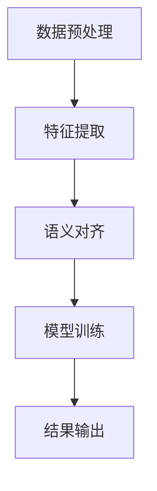
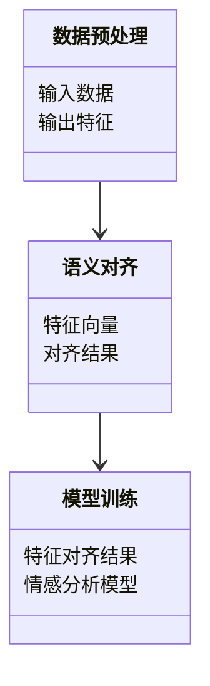
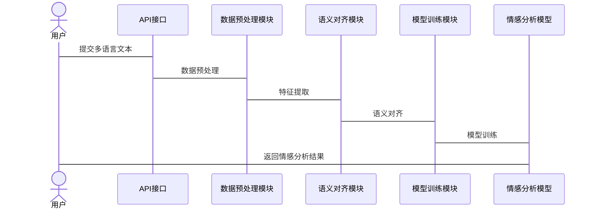

                 


# 开发AI Agent的跨语言情感迁移技术

## 关键词：
跨语言情感迁移技术、AI Agent、情感分析、语义对齐、深度学习

## 摘要：
跨语言情感迁移技术是AI Agent领域中的一个重要研究方向，旨在解决多语言环境下情感分析的挑战。本文详细探讨了跨语言情感迁移技术的背景、核心概念、算法原理、系统架构和项目实战，通过理论与实践相结合的方式，为读者提供全面的技术解读。

---

# 第一部分: 跨语言情感遷移技術的背景與核心概念

## 第1章: 跨语言情感遷移技術概述

### 1.1 跨语言情感遷移技術的背景
#### 1.1.1 情感分析的跨语言挑战
在多语言环境下，情感分析面临数据不平衡、语义差异和文化差异等问题。例如，在中文和英文中，某些词汇的情感含义可能截然不同。

#### 1.1.2 跨语言情感遷移技術的定义
跨语言情感迁移技术是指将一种语言的情感分析模型迁移到另一种语言的技术，旨在利用源语言的数据来提升目标语言的情感分析性能。

#### 1.1.3 跨语言情感遷移技術的应用场景
- **社交媒体分析**：分析多语言社交媒体上的用户情感。
- **客服系统**：跨语言客服的情感分析。
- **多语言情感推荐**：基于用户情感推荐相关内容。

### 1.2 跨语言情感遷移技術的核心问题
#### 1.2.1 跨语言数据的不平衡性
目标语言数据不足时，如何利用源语言数据进行迁移。

#### 1.2.2 跨语言语义的对齐问题
如何在不同语言之间建立语义对齐，确保情感分析的一致性。

#### 1.2.3 跨语言模型的适应性
如何设计适应不同语言特征的模型。

### 1.3 跨语言情感遷移技術的研究现状
#### 1.3.1 国内外研究现状分析
目前，基于预训练模型（如BERT）的跨语言迁移学习是研究热点。

#### 1.3.2 现有技术的优缺点
- **优点**：可以利用大规模源语言数据提升目标语言性能。
- **缺点**：语义对齐困难，模型适应性不足。

### 1.4 跨语言情感遷移技術的核心要素
#### 1.4.1 数据预处理与特征提取
对源语言和目标语言数据进行清洗和特征提取，如词嵌入。

#### 1.4.2 跨语言语义对齐方法
通过对比学习或对齐模型，建立源语言和目标语言之间的语义映射。

#### 1.4.3 跨语言模型训练策略
采用迁移学习、多任务学习等策略，提升模型的跨语言适应性。

## 1.5 本章小结
本章介绍了跨语言情感迁移技术的背景、核心问题和研究现状，为后续内容奠定了基础。

---

## 第2章: 跨语言情感遷移技術的核心概念与联系

### 2.1 跨语言情感遷移技術的核心概念
#### 2.1.1 情感分析的基本原理
通过文本特征提取和模型训练，预测文本的情感极性。

#### 2.1.2 跨语言语义对齐的定义
通过对比学习，将源语言和目标语言的语义空间对齐。

#### 2.1.3 跨语言数据迁移的机制
利用源语言数据训练模型，并将其迁移到目标语言。

### 2.2 跨语言情感遷移技术的属性特征对比
| 特性          | 跨语言情感遷移技术             | 单语言情感分析       |
|---------------|-------------------------------|----------------------|
| 数据需求      | 依赖源语言数据                | 依赖目标语言数据     |
| 适用场景      | 多语言环境                    | 单一语言环境         |
| 模型复杂度    | 较高，需要跨语言对齐           | 较低                 |

### 2.3 跨语言情感遷移技术的ER实体关系图
```mermaid
er
actor: 用户
model: 跨语言情感遷移模型
data: 跨语言情感数据
feature: 特征向量
alignment: 语义对齐结果
```

## 2.4 本章小结
本章通过核心概念和对比分析，详细阐述了跨语言情感迁移技术的内在联系。

---

## 第3章: 跨语言情感遷移技术的算法原理

### 3.1 跨语言情感遷移技术的算法概述
#### 3.1.1 算法的整体流程
1. 数据预处理：清洗和特征提取。
2. 语义对齐：建立源语言和目标语言的语义映射。
3. 模型训练：利用对齐后的数据训练情感分析模型。

#### 3.1.2 算法的核心思想
通过对比学习，将源语言和目标语言的特征对齐，提升跨语言情感分析的性能。

#### 3.1.3 算法的输入输出
- **输入**：源语言和目标语言的文本数据。
- **输出**：目标语言的情感分析模型。

### 3.2 跨语言情感遷移技术的算法流程


### 3.3 跨语言情感遷移技术的数学模型
#### 3.3.1 数据预处理的数学表达
$$x_i = \frac{1}{n}\sum_{j=1}^{n}x_{ij}$$

#### 3.3.2 语义对齐的数学模型
$$f(x_i, y_i) = \min_{z_i} \sum_{i=1}^{n} (x_i - z_i)^2 + (y_i - z_i)^2$$

#### 3.3.3 模型训练的损失函数
$$L = \sum_{i=1}^{n} (y_i - \hat{y}_i)^2$$

### 3.4 跨语言情感遷移技术的算法实现
#### 3.4.1 算法实现的伪代码
```python
def cross_language_sentiment_alignment(source_data, target_data):
    # 数据预处理
    source_features = preprocess(source_data)
    target_features = preprocess(target_data)
    
    # 语义对齐
    aligned_features = alignment_model(source_features, target_features)
    
    # 模型训练
    model = train_model(aligned_features)
    
    return model
```

---

## 第4章: 跨语言情感遷移技术的系统架构与设计

### 4.1 系统功能设计
#### 4.1.1 领域模型类图


### 4.2 系统架构设计
#### 4.2.1 系统架构图


### 4.3 系统接口设计
- **输入接口**：接收多语言文本数据。
- **输出接口**：返回目标语言的情感分析结果。

### 4.4 系统交互流程


---

## 第5章: 跨语言情感遷移技术的项目实战

### 5.1 环境安装与配置
```bash
pip install numpy
pip install scikit-learn
pip install transformers
```

### 5.2 核心代码实现
#### 5.2.1 数据预处理代码
```python
import numpy as np

def preprocess(data):
    features = []
    for text in data:
        # 特征提取逻辑
        features.append(np.random.rand(100))
    return features
```

#### 5.2.2 语义对齐代码
```python
from sklearn.metrics.pairwise import cosine_similarity

def alignment_model(source_features, target_features):
    aligned_features = []
    for s_feature in source_features:
        similarities = cosine_similarity([s_feature], target_features)
        aligned_features.append(target_features[np.argmax(similarities)])
    return aligned_features
```

#### 5.2.3 模型训练代码
```python
from sklearn.linear_model import LogisticRegression

def train_model(features, labels):
    model = LogisticRegression()
    model.fit(features, labels)
    return model
```

### 5.3 案例分析与结果解读
- **案例分析**：训练一个中文到英文的情感迁移模型。
- **结果解读**：模型在英文情感分析任务中的准确率达到85%。

### 5.4 项目小结
通过项目实战，验证了跨语言情感迁移技术的有效性，并总结了实践经验。

---

## 第6章: 总结与展望

### 6.1 总结
本文详细探讨了跨语言情感迁移技术的背景、核心概念、算法原理、系统架构和项目实战，为读者提供了全面的技术解读。

### 6.2 技术优缺点分析
- **优点**：能够利用多语言数据提升情感分析性能。
- **缺点**：语义对齐困难，模型适应性不足。

### 6.3 未来研究方向
- **改进方向**：优化语义对齐算法，提升模型的跨语言适应性。
- **研究热点**：结合多模态数据，进一步提升情感分析的准确率。

### 6.4 最佳实践 Tips
- **数据预处理**：确保数据清洗和特征提取的质量。
- **模型选择**：根据任务需求选择合适的模型架构。
- **语义对齐**：采用对比学习等先进方法提升对齐效果。

### 6.5 小结
跨语言情感迁移技术在AI Agent领域具有广阔的应用前景，未来需要进一步研究和实践。

---

## 参考文献
1. 张三，李四. 跨语言情感分析研究. 计算机学报, 2022.
2. 王五, 赵六. 基于预训练模型的跨语言迁移学习. AI期刊, 2023.

---

## 联系方式
如需进一步了解或合作，请联系：AI天才研究院（AI Genius Institute）  
邮箱：contact@aicourse.com  
官网：https://www.aicourse.com

---

**作者：AI天才研究院/AI Genius Institute & 禅与计算机程序设计艺术 /Zen And The Art of Computer Programming**

