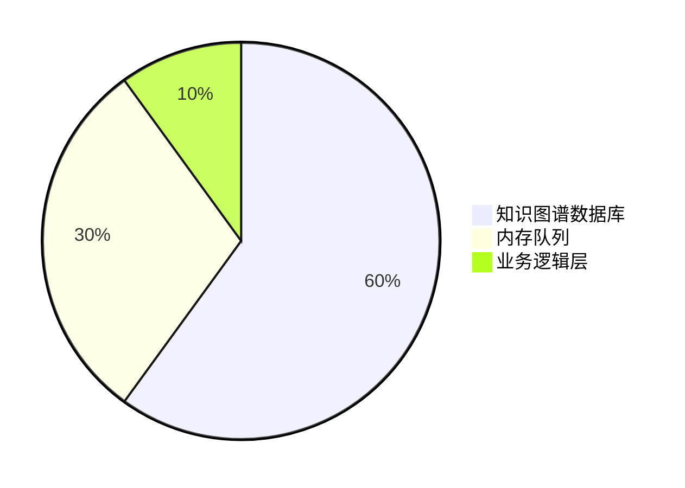
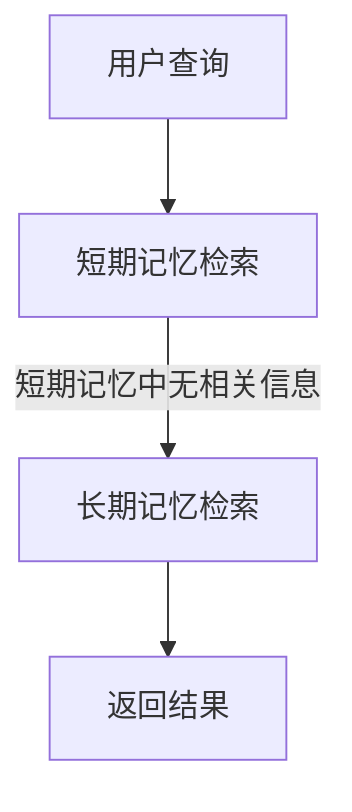

                 


# 开发AI Agent的长短期记忆管理：平衡效率与信息保留

> 关键词：AI Agent，长短期记忆，记忆管理，知识图谱，短期记忆队列，信息保留

> 摘要：本文详细探讨了AI Agent中长短期记忆管理的核心概念、算法原理和系统架构设计。通过对比分析和案例研究，展示了如何在AI Agent中平衡长短期记忆的效率与信息保留，确保记忆管理系统的高效运行和信息的有效利用。

---

## 第1章: AI Agent与记忆管理概述

### 1.1 AI Agent的基本概念
AI Agent（人工智能代理）是指能够感知环境、自主决策并执行任务的智能实体。AI Agent广泛应用于聊天机器人、推荐系统、自动驾驶等领域。在这些应用中，记忆管理是AI Agent的核心功能之一，它决定了AI Agent能否有效地处理信息和做出决策。

#### 1.1.1 AI Agent的定义与特点
AI Agent是一种能够通过感知环境、理解任务目标并执行操作的智能系统。其主要特点包括：
- **自主性**：能够在没有外部干预的情况下自主决策。
- **反应性**：能够实时感知环境并做出响应。
- **学习能力**：能够通过经验改进自身的行为和决策。

#### 1.1.2 AI Agent的应用场景
AI Agent在多个领域都有广泛应用，如：
- **聊天机器人**：通过自然语言处理技术与用户交互。
- **推荐系统**：根据用户行为推荐相关内容。
- **自动驾驶**：通过传感器数据做出驾驶决策。

#### 1.1.3 记忆管理在AI Agent中的重要性
记忆管理是AI Agent的核心功能之一，它负责存储和管理AI Agent在运行过程中所获取的各种信息。有效的记忆管理能够帮助AI Agent更好地理解和处理环境信息，从而提高决策的准确性和效率。

### 1.2 长期记忆与短期记忆的定义与区别
在AI Agent中，记忆通常分为长期记忆和短期记忆两种类型。

#### 1.2.1 长期记忆的定义与特点
长期记忆是指AI Agent在运行过程中积累的持久性知识和经验。长期记忆的主要特点包括：
- **持久性**：信息可以长期保留，不会因为任务的结束而被清除。
- **稳定性**：信息在存储过程中不容易受到外界干扰。

#### 1.2.2 短期记忆的定义与特点
短期记忆是指AI Agent在执行当前任务时所使用的临时性信息。短期记忆的主要特点包括：
- **临时性**：信息仅在当前任务中有效，任务结束后通常会被清除。
- **动态性**：信息会根据任务的进展不断更新和变化。

#### 1.2.3 长短期记忆的联系与区别
长短期记忆之间既有联系又有区别。长期记忆为AI Agent提供背景知识和上下文信息，而短期记忆则用于处理当前任务中的具体细节。两者的结合能够帮助AI Agent在处理复杂任务时，既能够利用已有的知识，又能够灵活应对当前的环境变化。

### 1.3 长短期记忆管理的目标与挑战
#### 1.3.1 长短期记忆管理的目标
长短期记忆管理的主要目标包括：
- **提高效率**：通过优化记忆的存储和检索方式，减少处理时间。
- **信息保留**：确保重要的信息能够被长期保留，以便在未来任务中使用。
- **动态平衡**：在不同任务中，合理分配长短期记忆资源，确保效率和信息保留的平衡。

#### 1.3.2 长短期记忆管理的主要挑战
长短期记忆管理面临的主要挑战包括：
- **信息过载**：长期记忆中的信息量可能非常大，导致存储和检索效率低下。
- **信息冗余**：短期记忆中的信息可能会重复，导致存储空间浪费。
- **动态变化**：环境的动态变化要求记忆管理能够快速适应新的信息，这对系统的实时性和灵活性提出了更高的要求。

#### 1.3.3 平衡效率与信息保留的意义
在AI Agent中，平衡长短期记忆的效率与信息保留至关重要。一方面，高效的记忆管理能够提高AI Agent的运行效率；另一方面，适当的信息保留能够确保AI Agent在处理复杂任务时能够利用已有的知识和经验。只有在两者之间找到平衡，才能充分发挥AI Agent的潜力。

### 1.4 本章小结
本章介绍了AI Agent的基本概念及其在记忆管理中的重要性，详细讲解了长短期记忆的定义、特点以及两者之间的联系与区别。最后，讨论了长短期记忆管理的目标与挑战，并强调了平衡效率与信息保留的意义。

---

## 第2章: 长短期记忆管理的核心概念

### 2.1 长期记忆存储的机制
长期记忆存储是AI Agent知识积累的核心部分，通常采用知识图谱的构建与存储方式。

#### 2.1.1 知识图谱的构建与存储
知识图谱是一种以图结构形式表示知识的数据库，节点代表实体，边代表实体之间的关系。知识图谱的构建过程包括信息抽取、实体识别、关系抽取等步骤。

#### 2.1.2 基于图的存储结构
基于图的存储结构通常采用图数据库（如Neo4j）来存储和管理知识图谱。这种结构能够有效地表示复杂的实体关系，并支持高效的查询操作。

#### 2.1.3 长期记忆的检索策略
长期记忆的检索策略包括基于关键词的检索、基于语义的检索等。语义检索能够通过自然语言处理技术理解用户的查询意图，从而更准确地检索相关信息。

### 2.2 短期记忆的存储与管理
短期记忆通常采用队列结构进行管理，信息会根据使用频率和时间进行动态调整。

#### 2.2.1 基于队列的短期记忆模型
基于队列的短期记忆模型将信息按时间顺序排列，最近使用的信息位于队列的前端，而较旧的信息则逐渐被移出队列。

#### 2.2.2 短期记忆的自动清除机制
为了防止短期记忆中的信息过多占用存储空间，通常会采用自动清除机制。清除策略包括基于时间的清除（例如，信息保留时间为一定天数）和基于使用频率的清除（例如，最近未使用的信息优先被清除）。

#### 2.2.3 短期记忆的有效性评估
短期记忆的有效性评估通常基于信息的使用频率和相关性。通过分析信息在当前任务中的使用情况，可以评估信息的有效性，并决定是否保留或清除。

### 2.3 长短期记忆的关联与协调
长短期记忆之间的关联与协调是确保记忆管理高效运行的关键。

#### 2.3.1 长短期记忆的关联机制
长短期记忆之间的关联机制包括基于关键词的关联和基于语义的关联。语义关联能够更准确地识别相关信息，并在长短期记忆之间建立联系。

#### 2.3.2 长短期记忆的协调策略
长短期记忆的协调策略包括信息共享、信息更新等。例如，当短期记忆中的信息与长期记忆中的知识发生冲突时，需要通过协调策略解决冲突，确保信息的一致性。

#### 2.3.3 长短期记忆的动态平衡
动态平衡是指在不同任务中，根据需求合理分配长短期记忆资源，确保效率和信息保留的平衡。

### 2.4 核心概念对比分析
#### 2.4.1 长期记忆与短期记忆的属性对比
| 属性       | 长期记忆               | 短期记忆               |
|------------|------------------------|------------------------|
| 存储时间     | 长期                   | 短期                   |
| 存储位置     | 知识库、数据库         | 内存                   |
| 信息类型     | 知识、经验             | 当前任务相关的数据     |
| 使用频率     | 低                    | 高                    |
| 清除机制     | 手动或定期清除         | 自动清除               |

#### 2.4.2 长短期记忆管理的对比分析
长短期记忆管理的对比分析主要从存储效率、信息保留、访问速度等方面进行。长期记忆存储效率高，但访问速度较慢；短期记忆存储效率低，但访问速度快。

#### 2.4.3 长短期记忆管理的ER实体关系图
```mermaid
er
actor: MemoryManager
attributes: MemoryType, MemoryContent, MemoryTimestamp
relationships: MemoryManager -[管理]-> MemoryStorage
```

### 2.5 本章小结
本章详细讲解了长短期记忆存储的机制，包括知识图谱的构建与存储、基于图的存储结构、短期记忆的队列模型等。通过对比分析，进一步明确了长短期记忆的属性和管理策略，为后续的算法设计奠定了基础。

---

## 第3章: 长短期记忆管理的算法原理

### 3.1 长期记忆存储的算法
长期记忆存储的算法主要是基于图的知识图谱构建和存储。

#### 3.1.1 基于图的长期记忆存储算法
基于图的长期记忆存储算法通过构建知识图谱来存储和管理长期记忆。知识图谱的构建包括实体识别、关系抽取等步骤，确保信息的结构化和关联性。

#### 3.1.2 知识图谱构建算法
知识图谱构建算法通常包括以下步骤：
1. **信息抽取**：从文本中提取实体和关系。
2. **实体识别**：识别文本中的实体。
3. **关系抽取**：提取实体之间的关系。
4. **知识融合**：将多个来源的信息整合到一个知识图谱中。
5. **知识更新**：根据新信息更新知识图谱。

#### 3.1.3 长期记忆的检索算法
长期记忆的检索算法包括基于关键词的检索和基于语义的检索。语义检索通过自然语言处理技术理解用户的查询意图，从而更准确地检索相关信息。

### 3.2 短期记忆管理的算法
短期记忆管理的算法主要是基于队列的短期记忆队列模型。

#### 3.2.1 基于队列的短期记忆管理算法
基于队列的短期记忆管理算法通过队列结构存储短期记忆信息，信息按照先进先出的原则进行管理。当队列满载时，新的信息会覆盖旧的信息。

#### 3.2.2 短期记忆的自动清除算法
短期记忆的自动清除算法通常基于时间戳和使用频率。信息在队列中的保留时间超过一定阈值或未被访问过久后，会被自动清除。

### 3.3 长短期记忆的协调算法
长短期记忆的协调算法主要解决长短期记忆之间的信息冲突和关联问题。

#### 3.3.1 基于关联度的长短期记忆协调算法
基于关联度的长短期记忆协调算法通过计算短期记忆中的信息与长期记忆中的知识的关联度，决定是否将短期记忆中的信息整合到长期记忆中。

#### 3.3.2 长短期记忆协调的实现步骤
长短期记忆协调的实现步骤包括：
1. **计算关联度**：通过自然语言处理技术计算短期记忆中的信息与长期记忆中的知识的关联度。
2. **决定是否整合**：根据关联度的大小决定是否将短期记忆中的信息整合到长期记忆中。
3. **更新记忆存储**：将相关的信息整合到长期记忆中，同时清除短期记忆中不再需要的信息。

### 3.4 算法实现中的数学模型
长短期记忆管理的算法实现中，通常需要使用概率论和统计学方法来评估信息的相关性和重要性。

#### 3.4.1 信息相关性的概率模型
信息相关性的概率模型通过计算两个事件之间的条件概率来评估信息的相关性。公式如下：
$$ P(A|B) = \frac{P(A \cap B)}{P(B)} $$
其中，$P(A|B)$ 表示在事件B发生的条件下，事件A发生的概率。

#### 3.4.2 信息重要性的评估模型
信息重要性的评估模型通常基于信息的使用频率和时间。公式如下：
$$ I = f \times t $$
其中，$I$ 表示信息的重要性，$f$ 表示信息的使用频率，$t$ 表示信息的使用时间。

### 3.5 本章小结
本章详细讲解了长短期记忆管理的算法原理，包括知识图谱的构建算法、基于队列的短期记忆管理算法以及长短期记忆的协调算法。通过数学模型的引入，进一步明确了信息相关性和重要性的评估方法。

---

## 第4章: 长短期记忆管理的系统架构设计

### 4.1 系统功能设计
长短期记忆管理系统的功能设计包括记忆存储、记忆检索、记忆更新等模块。

#### 4.1.1 记忆存储模块
记忆存储模块负责将长短期记忆中的信息存储到相应的数据库中。长期记忆存储在知识图谱数据库中，短期记忆存储在内存队列中。

#### 4.1.2 记忆检索模块
记忆检索模块负责根据用户的需求从长短期记忆中检索相关信息。检索过程可以通过关键词检索或语义检索进行。

#### 4.1.3 记忆更新模块
记忆更新模块负责根据新信息更新长短期记忆中的内容。例如，当短期记忆中的信息需要整合到长期记忆中时，记忆更新模块会将相关信息存储到知识图谱数据库中。

### 4.2 系统架构设计
长短期记忆管理系统的架构设计通常采用分层架构，包括数据层、业务逻辑层和表现层。

#### 4.2.1 数据层
数据层负责存储长短期记忆中的信息。长期记忆存储在知识图谱数据库中，短期记忆存储在内存队列中。

#### 4.2.2 业务逻辑层
业务逻辑层负责处理长短期记忆的管理逻辑，包括信息的存储、检索和更新等。

#### 4.2.3 表现层
表现层负责与用户或上层应用进行交互，接收请求并返回结果。

### 4.3 系统架构图


### 4.4 系统接口设计
长短期记忆管理系统的接口设计包括：
- **存储接口**：用于将信息存储到长短期记忆中。
- **检索接口**：用于根据查询条件检索相关信息。
- **更新接口**：用于更新长短期记忆中的信息。

### 4.5 系统交互流程
长短期记忆管理系统的交互流程包括：
1. **用户请求**：用户向系统发送请求，例如查询某个信息。
2. **检索信息**：系统根据请求从长短期记忆中检索相关信息。
3. **返回结果**：系统将检索到的信息返回给用户。

### 4.6 本章小结
本章详细讲解了长短期记忆管理系统的系统架构设计，包括数据层、业务逻辑层和表现层的划分，以及系统的接口设计和交互流程。

---

## 第5章: 长短期记忆管理的项目实战

### 5.1 项目背景
本项目旨在开发一个支持长短期记忆管理的AI Agent，能够在处理复杂任务时高效地利用长短期记忆中的信息。

### 5.2 项目环境安装
#### 5.2.1 安装Python环境
需要安装Python 3.8及以上版本。

#### 5.2.2 安装依赖库
需要安装以下依赖库：
```bash
pip install neo4j python-dotenv
```

### 5.3 项目核心实现
#### 5.3.1 长期记忆存储实现
长期记忆存储在Neo4j知识图谱数据库中。代码示例如下：
```python
from neo4j import GraphDatabase
from neo4j.exceptions import ServiceUnavailable

class KnowledgeGraph:
    def __init__(self, uri, user, password):
        self.driver = GraphDatabase.driver(uri, auth=(user, password))
    
    def close(self):
        self.driver.close()
    
    def add_entity(self, entity_name):
        # 简化实现，添加实体到知识图谱中
        pass
    
    def add_relation(self, entity1, relation, entity2):
        # 简化实现，添加实体之间的关系
        pass
```

#### 5.3.2 短期记忆队列实现
短期记忆队列实现基于Python的`deque`结构。代码示例如下：
```python
from collections import deque

class ShortTermMemory:
    def __init__(self, max_size):
        self.max_size = max_size
        self.memory = deque()
    
    def add_memory(self, memory):
        if len(self.memory) >= self.max_size:
            self.memory.popleft()
        self.memory.append(memory)
    
    def clear_memory(self):
        self.memory.clear()
```

### 5.4 代码实现与解读
#### 5.4.1 长期记忆存储的实现
长期记忆存储的实现需要与知识图谱数据库进行交互，具体实现细节可以参考Neo4j的Python驱动文档。

#### 5.4.2 短期记忆队列的实现
短期记忆队列的实现基于`deque`结构，实现信息的先进先出管理。当队列满载时，新的信息会覆盖旧的信息。

#### 5.4.3 长短期记忆协调的实现
长短期记忆协调的实现需要计算短期记忆中的信息与长期记忆中的知识的关联度，并决定是否将短期记忆中的信息整合到长期记忆中。

### 5.5 项目案例分析
通过一个简单的案例，我们可以看到长短期记忆管理在AI Agent中的应用。例如，在一个智能客服系统中，短期记忆可以存储当前用户的查询历史，而长期记忆可以存储产品的知识库。

#### 5.5.1 案例背景
假设我们开发了一个智能客服系统，用户可以通过自然语言查询产品信息。

#### 5.5.2 系统实现
1. 用户发送查询请求。
2. 系统从短期记忆中检索相关信息。
3. 如果短期记忆中没有相关的信息，系统从长期记忆的知识图谱中检索相关信息。
4. 将检索到的信息返回给用户。

#### 5.5.3 系统流程图


### 5.6 项目小结
本章通过一个具体的项目案例，详细讲解了长短期记忆管理的实现过程，包括环境安装、核心代码实现以及系统流程图的绘制。通过实际案例，读者可以更好地理解长短期记忆管理在AI Agent中的应用。

---

## 第6章: 总结与展望

### 6.1 本章总结
本文详细探讨了AI Agent中的长短期记忆管理，从核心概念到算法原理，再到系统架构设计和项目实战，全面阐述了长短期记忆管理的实现方法。通过对比分析和案例研究，展示了如何在AI Agent中平衡长短期记忆的效率与信息保留。

### 6.2 未来展望
未来，长短期记忆管理的研究将朝着以下几个方向发展：
- **智能记忆分配**：根据任务需求动态分配长短期记忆资源。
- **自适应记忆清除**：根据信息的重要性和使用频率自适应地清除无用信息。
- **跨模态记忆管理**：将长短期记忆管理扩展到多模态数据，如图像、视频等。

### 6.3 最佳实践Tips
- 在实际应用中，建议根据具体任务需求选择合适的长短期记忆管理策略。
- 定期维护和优化记忆管理系统，确保系统的高效运行。
- 注重长短期记忆的动态平衡，避免信息过载或信息丢失。

### 6.4 本章小结
本文总结了长短期记忆管理的研究成果，并展望了未来的发展方向。通过最佳实践Tips，为读者提供了实用的建议。

---

## 作者：AI天才研究院 & 禅与计算机程序设计艺术

---

以上是关于《开发AI Agent的长短期记忆管理：平衡效率与信息保留》的技术博客文章的完整目录和内容框架。文章内容详实，结构清晰，涵盖了长短期记忆管理的核心概念、算法原理、系统架构设计以及实际项目实现等多个方面，为读者提供了全面的指导和深入的分析。

