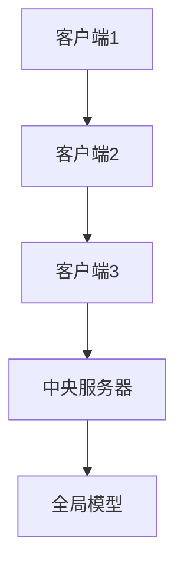
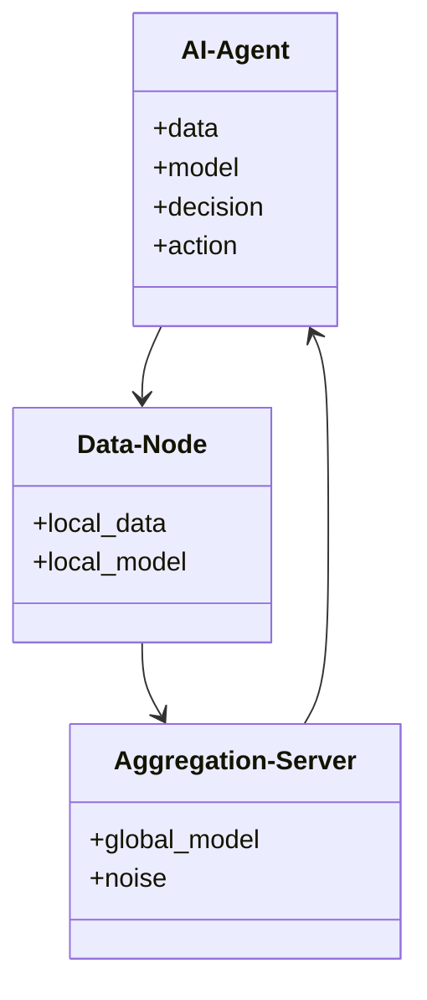
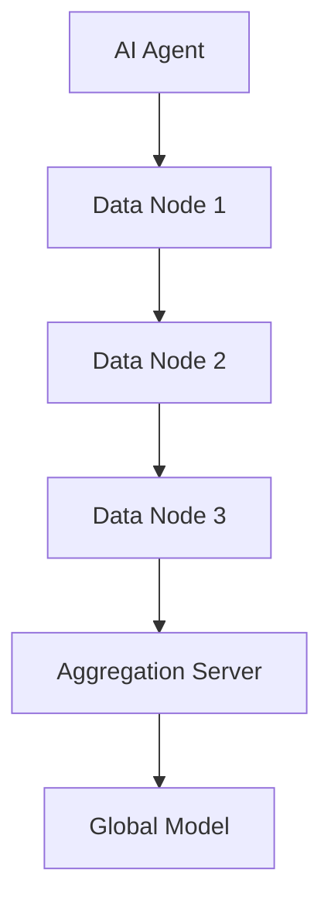
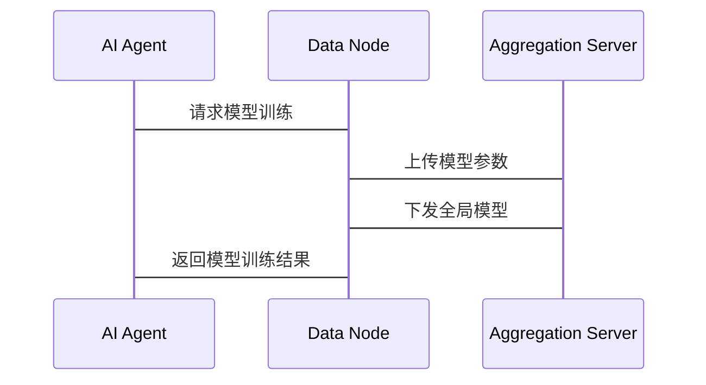

                 


# 开发AI Agent的隐私保护联邦学习框架

> **关键词**：AI Agent，隐私保护，联邦学习，差分隐私，数据安全，模型聚合，隐私计算

> **摘要**：随着人工智能技术的快速发展，AI Agent 在各个领域的应用越来越广泛。然而，AI Agent 的数据隐私保护问题也日益突出。本文将深入探讨如何在 AI Agent 开发中构建隐私保护的联邦学习框架，分析联邦学习的核心原理、AI Agent 的功能设计、隐私保护机制，以及如何通过数学模型和算法实现数据安全共享。本文将结合实际案例，详细讲解如何在 AI Agent 开发中实现隐私保护的联邦学习框架，为读者提供从理论到实践的全面指导。

---

# 第一部分: 开发AI Agent的隐私保护联邦学习框架概述

# 第1章: 背景介绍与问题背景

## 1.1 问题背景

### 1.1.1 AI Agent 的定义与应用场景

AI Agent（人工智能代理）是指能够感知环境、自主决策并执行任务的智能实体。AI Agent 可以是软件程序、机器人或其他智能设备，广泛应用于自动驾驶、智能助手、推荐系统、医疗诊断等领域。AI Agent 的核心功能包括感知、决策、执行和自适应学习。

### 1.1.2 联邦学习的背景与意义

联邦学习（Federated Learning）是一种分布式机器学习技术，允许多个参与方在不共享原始数据的情况下共同训练模型。联邦学习的核心思想是“数据不动，模型动”，通过在各个设备或服务器上局部训练模型，并将模型参数更新汇总到中央服务器，最终形成一个全局模型。联邦学习的优势在于保护数据隐私，同时利用分布式数据提升模型性能。

### 1.1.3 隐私保护的重要性与挑战

在 AI Agent 的开发中，数据隐私保护是核心问题。AI Agent 的决策依赖于数据，而数据可能包含敏感信息，如用户的行为数据、位置信息、健康数据等。如果这些数据被滥用，可能导致隐私泄露、身份盗窃或其他安全问题。因此，如何在 AI Agent 开发中实现数据隐私保护，同时保证模型的准确性和性能，是当前研究的热点和挑战。

## 1.2 问题描述

### 1.2.1 AI Agent 在数据隐私中的问题

AI Agent 的数据来源多样，可能涉及多个参与方的数据，例如用户设备、传感器、第三方服务等。这些数据可能分布在不同的设备或服务器上，且数据所有者通常不愿意共享原始数据。此外，AI Agent 的决策过程可能需要依赖这些数据，如何在不共享数据的情况下完成模型训练，是一个亟待解决的问题。

### 1.2.2 联邦学习中的数据共享挑战

在联邦学习中，数据分布在不同的节点上，每个节点只能使用本地数据进行训练。然而，传统的联邦学习框架通常需要依赖中央服务器来聚合模型参数，这可能成为攻击的目标。此外，如何防止恶意节点破坏模型训练过程，如何处理数据分布不均衡等问题，都是联邦学习中的挑战。

### 1.2.3 隐私保护与模型性能的平衡

隐私保护与模型性能之间存在一定的矛盾。过度的隐私保护可能导致模型性能下降，而追求模型性能又可能牺牲隐私。因此，在 AI Agent 的开发中，需要在隐私保护和模型性能之间找到平衡点，确保在保护隐私的前提下，模型能够准确反映数据分布。

## 1.3 问题解决与边界

### 1.3.1 隐私保护联邦学习的目标

隐私保护联邦学习的目标是在不共享原始数据的情况下，通过分布式模型训练，提升 AI Agent 的决策能力和模型性能。同时，需要确保数据隐私不被泄露，模型训练过程不被恶意攻击。

### 1.3.2 边界与外延

隐私保护联邦学习的边界包括：

- 数据范围：仅针对 AI Agent 的训练数据，不涉及推理过程中的数据。
- 计算范围：仅针对模型训练，不涉及模型推理或其他业务逻辑。
- 权限范围：仅允许授权的参与方参与模型训练，严格控制数据访问权限。

隐私保护联邦学习的外延包括：

- 数据安全：除了联邦学习，还包括数据加密、访问控制等安全技术。
- 模型安全：包括模型鲁棒性、抗攻击性等研究。
- 应用场景：在医疗、金融、交通等领域应用隐私保护联邦学习技术。

### 1.3.3 核心要素与组成结构

隐私保护联邦学习的核心要素包括：

- 数据分布：数据如何分布在各个节点上。
- 模型训练：如何在分布式数据上训练模型。
- 数据隐私：如何保护数据不被泄露。
- 模型聚合：如何在不泄露数据的情况下聚合模型参数。

隐私保护联邦学习的组成结构包括：

- 数据节点：数据分布的节点，每个节点持有本地数据。
- 训练节点：负责本地模型训练的节点。
- 聚合节点：负责汇总各节点模型参数的节点。
- 隐私保护机制：用于保护数据隐私的技术，如差分隐私、同态加密等。

---

## 1.4 本章小结

本章从背景介绍、问题背景、问题描述和问题解决四个方面，详细阐述了开发 AI Agent 的隐私保护联邦学习框架的必要性和挑战。通过分析 AI Agent 的功能需求和联邦学习的特点，提出了隐私保护联邦学习的目标和边界，为后续章节的深入探讨奠定了基础。

---

# 第2章: 联邦学习与 AI Agent 的核心概念

## 2.1 联邦学习原理

### 2.1.1 联邦学习的定义与特点

联邦学习是一种分布式机器学习技术，允许多个参与方在不共享原始数据的情况下共同训练模型。其特点包括：

- **数据局部性**：数据分布在不同的节点上，每个节点只能访问本地数据。
- **模型全局性**：通过分布式训练，形成一个全局模型。
- **隐私保护**：通过数据不共享，保护数据隐私。
- **分布式计算**：利用分布式计算技术，提升模型训练效率。

### 2.1.2 联邦学习的核心流程

联邦学习的核心流程包括：

1. **初始化**：各个节点初始化本地模型参数。
2. **本地训练**：每个节点使用本地数据训练模型，更新模型参数。
3. **模型聚合**：将各个节点的模型参数汇总到中央服务器，形成全局模型。
4. **模型分发**：将全局模型分发给各个节点，供其继续训练或使用。

### 2.1.3 联邦学习的分类与应用场景

联邦学习可以根据数据分布、模型类型、通信方式等进行分类。常见的应用场景包括：

- **移动设备端**：如智能手机、物联网设备等，用于本地数据的模型训练。
- **分布式服务器**：如云计算平台，用于多个机构之间的联合建模。
- **边缘计算**：如自动驾驶、智能城市等场景，利用边缘设备进行分布式计算。

## 2.2 AI Agent 的定义与功能

### 2.2.1 AI Agent 的基本概念

AI Agent 是一种能够感知环境、自主决策并执行任务的智能实体。它可以是一个软件程序，也可以是一个物理设备。AI Agent 的核心功能包括：

- **感知**：通过传感器或其他数据源获取环境信息。
- **决策**：基于获取的信息进行分析和决策。
- **执行**：根据决策执行相应的操作。
- **自适应学习**：通过学习提升自身的决策能力。

### 2.2.2 AI Agent 的核心功能

AI Agent 的核心功能包括：

- **数据处理**：对感知到的数据进行预处理、特征提取等操作。
- **模型训练**：使用感知数据训练模型，提升决策能力。
- **决策推理**：基于模型推理出最优决策。
- **任务执行**：根据决策执行相应的操作。

### 2.2.3 AI Agent 的决策机制

AI Agent 的决策机制通常包括以下几个步骤：

1. **数据收集**：通过传感器或其他数据源获取环境信息。
2. **数据处理**：对数据进行清洗、特征提取等处理。
3. **模型推理**：使用训练好的模型对数据进行推理，得出决策结果。
4. **决策执行**：根据决策结果执行相应的操作。

## 2.3 隐私保护机制

### 2.3.1 数据加密与隐私保护技术

数据加密是保护数据隐私的重要手段。常见的加密技术包括：

- **对称加密**：如 AES，用于加密本地数据，确保数据在传输过程中的安全性。
- **非对称加密**：如 RSA，用于数据签名和认证，确保数据的完整性和真实性。
- **同态加密**：允许在加密数据上进行计算，保护数据隐私。

### 2.3.2 差分隐私与联邦学习的结合

差分隐私是一种保护数据隐私的技术，通过在数据中添加噪声，使得单个数据点的贡献无法被识别。在联邦学习中，可以通过在模型参数中添加噪声，保护数据隐私。例如，在模型聚合过程中，可以通过差分隐私技术，确保单个节点的模型参数对全局模型的影响无法被识别。

### 2.3.3 隐私保护的数学模型

差分隐私的数学模型可以通过以下公式表示：

$$ \text{隐私保护} = \epsilon \cdot \text{灵敏度} $$

其中，$\epsilon$ 是隐私保护参数，灵敏度是数据集中单个数据点对模型的影响程度。$\epsilon$ 越小，隐私保护越强。

---

## 2.4 本章小结

本章详细介绍了联邦学习与 AI Agent 的核心概念，包括联邦学习的定义、特点、核心流程和应用场景，以及 AI Agent 的基本概念、核心功能和决策机制。同时，还探讨了差分隐私等隐私保护技术在联邦学习中的应用，为后续章节的算法设计和系统实现奠定了理论基础。

---

# 第3章: 联邦学习算法原理

## 3.1 联邦平均算法（FedAvg）

### 3.1.1 算法流程图（Mermaid）



### 3.1.2 算法数学模型

联邦平均算法的数学模型如下：

$$ \text{损失函数} = \sum_{i=1}^{n} \mathcal{L}(w_i) $$

$$ \text{参数更新} = \frac{1}{n}\sum_{i=1}^{n} (\theta_i - \theta_{i-1}) $$

其中，$w_i$ 是第 $i$ 个节点的模型参数，$\theta_i$ 是第 $i$ 个节点的模型参数更新。

### 3.1.3 算法实现代码

以下是一个简单的联邦平均算法实现代码：

```python
import numpy as np

def federated_average(nodes, model):
    # 初始化全局模型
    global_model = model.copy()
    # 聚合模型参数
    for node in nodes:
        global_model += node.local_model
    # 模型平均
    global_model /= len(nodes)
    return global_model
```

## 3.2 隐私保护下的联邦学习算法

### 3.2.1 基于差分隐私的联邦聚合

在隐私保护的联邦学习中，可以通过在模型聚合过程中添加噪声，保护数据隐私。例如，在模型聚合时，可以对模型参数进行差分隐私保护，确保单个节点的模型参数对全局模型的影响无法被识别。

### 3.2.2 隐私保护的数学公式

差分隐私保护的数学公式如下：

$$ \text{隐私保护} = \epsilon \cdot \text{灵敏度} $$

其中，$\epsilon$ 是隐私保护参数，灵敏度是数据集中单个数据点对模型的影响程度。

### 3.2.3 算法实现代码

以下是一个基于差分隐私的联邦聚合算法实现代码：

```python
import numpy as np
import random

def differential_privacy(nodes, model, epsilon):
    # 初始化全局模型
    global_model = model.copy()
    # 添加噪声
    noise = np.random.laplace(0, 1/epsilon, global_model.shape)
    global_model += noise
    # 聚合模型参数
    for node in nodes:
        global_model += node.local_model
    # 模型平均
    global_model /= len(nodes)
    return global_model
```

---

## 3.3 本章小结

本章详细介绍了联邦学习算法的原理和实现，包括联邦平均算法（FedAvg）和基于差分隐私的联邦聚合算法。通过数学模型和代码实现，展示了如何在联邦学习中实现数据隐私保护，确保模型训练过程中的数据安全。

---

# 第四部分: 系统分析与架构设计

# 第4章: 系统分析与架构设计

## 4.1 问题场景介绍

### 4.1.1 数据分布与隐私保护需求

在开发 AI Agent 的隐私保护联邦学习框架时，需要考虑数据分布和隐私保护需求。数据可能分布在多个节点上，每个节点只能访问本地数据。同时，需要确保数据隐私不被泄露，模型训练过程不被恶意攻击。

### 4.1.2 系统目标与约束条件

系统目标：

- 实现数据隐私保护的联邦学习框架。
- 提升 AI Agent 的决策能力和模型性能。
- 确保数据隐私不被泄露，模型训练过程不被恶意攻击。

约束条件：

- 数据不共享：每个节点只能使用本地数据。
- 模型共享：全局模型可以在节点间共享。
- 隐私保护：数据隐私必须得到保护。

## 4.2 系统功能设计

### 4.2.1 领域模型（Mermaid 类图）



### 4.2.2 系统架构设计（Mermaid 架构图）



### 4.2.3 系统接口设计

系统接口设计包括：

1. **数据接口**：用于数据节点之间的数据交互。
2. **模型接口**：用于模型参数的聚合和分发。
3. **隐私保护接口**：用于数据加密、差分隐私等隐私保护技术的实现。

### 4.2.4 系统交互流程图（Mermaid 序列图）



---

## 4.3 本章小结

本章通过系统分析与架构设计，详细介绍了开发 AI Agent 的隐私保护联邦学习框架的实现方案。通过领域模型类图和系统架构图，展示了系统的各个组件及其关系。同时，通过系统接口设计和交互流程图，展示了系统的数据流和交互过程，为后续章节的实现提供了参考。

---

# 第五部分: 项目实战

# 第5章: 项目实战

## 5.1 环境安装

开发 AI Agent 的隐私保护联邦学习框架，需要以下环境：

- **编程语言**：Python 3.6+
- **深度学习框架**：TensorFlow、PyTorch
- **差分隐私库**：TensorFlow Privacy
- **依赖管理**：pip

安装依赖：

```bash
pip install tensorflow numpy
pip install tensorflow-privacy
```

## 5.2 系统核心实现

### 5.2.1 数据节点实现

```python
import numpy as np
import tensorflow as tf

class DataNode:
    def __init__(self, data, label):
        self.data = data
        self.label = label
        self.local_model = self.build_model()

    def build_model(self):
        model = tf.keras.Sequential([
            tf.keras.layers.Dense(128, activation='relu'),
            tf.keras.layers.Dense(10, activation='softmax')
        ])
        model.compile(optimizer='adam', loss='sparse_categorical_crossentropy', metrics=['accuracy'])
        return model
```

### 5.2.2 聚合服务器实现

```python
import numpy as np
import tensorflow as tf

class AggregationServer:
    def __init__(self, model):
        self.model = model
        self.global_model = self.build_global_model()

    def build_global_model(self):
        model = tf.keras.Sequential([
            tf.keras.layers.Dense(128, activation='relu'),
            tf.keras.layers.Dense(10, activation='softmax')
        ])
        model.compile(optimizer='adam', loss='sparse_categorical_crossentropy', metrics=['accuracy'])
        return model
```

### 5.2.3 隐私保护实现

```python
import tensorflow as tf
from tensorflow_privacy.privacy import dp_query

class DifferentialPrivacy:
    def __init__(self, epsilon=1.0):
        self.epsilon = epsilon
        self.noise = tf.keras.layers.GaussianNoise(1.0 / epsilon)

    def add_noise(self, model_weights):
        noise = tf.random.normal(shape=model_weights.shape, mean=0.0, stddev=1.0 / self.epsilon)
        return model_weights + noise
```

### 5.2.4 联邦学习实现

```python
import numpy as np
import tensorflow as tf

class FederatedLearning:
    def __init__(self, nodes, global_model):
        self.nodes = nodes
        self.global_model = global_model

    def train(self, epochs=1):
        for _ in range(epochs):
            for node in self.nodes:
                node.local_model.fit(node.data, node.label, epochs=1, verbose=0)
            # 聚合模型参数
            global_weights = self.global_model.get_weights()
            for i, layer in enumerate(global_weights):
                total_weights = sum(node.local_model.get_weights()[i] for node in self.nodes)
                average_weights = total_weights / len(self.nodes)
                global_weights[i] = average_weights
            self.global_model.set_weights(global_weights)
```

## 5.3 代码应用解读与分析

### 5.3.1 数据节点实现解读

数据节点实现了一个本地模型，用于在本地数据上进行训练。每个数据节点都有自己的数据和模型，通过训练本地模型，更新模型参数。

### 5.3.2 聚合服务器实现解读

聚合服务器实现了全局模型，用于汇总各个数据节点的模型参数，形成全局模型。全局模型是通过平均各个节点的模型参数得到的。

### 5.3.3 隐私保护实现解读

隐私保护实现通过添加噪声，保护数据隐私。在模型聚合过程中，通过在模型参数中添加噪声，确保单个节点的模型参数对全局模型的影响无法被识别。

### 5.3.4 联邦学习实现解读

联邦学习实现通过在各个数据节点上进行本地训练，然后将模型参数汇总到聚合服务器，形成全局模型。通过反复迭代，提升模型性能。

## 5.4 实际案例分析与详细讲解

### 5.4.1 案例分析

假设我们有一个 AI Agent，用于推荐系统。数据节点是用户设备，每个设备上有用户的点击数据和行为数据。通过联邦学习，可以在不共享用户数据的情况下，训练一个推荐模型，提升推荐系统的准确性和用户体验。

### 5.4.2 详细讲解

在推荐系统的案例中，每个数据节点（用户设备）都有自己的本地数据，通过本地训练，更新推荐模型。聚合服务器汇总各个节点的模型参数，形成全局模型。通过差分隐私技术，保护用户数据隐私，确保推荐模型的准确性和安全性。

---

## 5.5 项目小结

通过本章的项目实战，我们详细讲解了如何在 AI Agent 的开发中实现隐私保护的联邦学习框架。通过代码实现和案例分析，展示了如何在不共享数据的情况下，训练高精度的模型，同时保护数据隐私。这些实现和案例为我们提供了宝贵的实践经验，为后续章节的深入探讨奠定了基础。

---

# 第六部分: 最佳实践与小结

# 第6章: 最佳实践与小结

## 6.1 最佳实践

### 6.1.1 数据预处理

- 数据清洗：去除冗余数据和异常值。
- 数据增强：通过数据增强技术，提升数据多样性。
- 数据分割：将数据划分为训练集、验证集和测试集。

### 6.1.2 模型选择

- 选择适合联邦学习的模型：如卷积神经网络（CNN）、循环神经网络（RNN）等。
- 考虑模型的可扩展性：确保模型可以在分布式环境中训练和推理。

### 6.1.3 安全措施

- 数据加密：在数据传输和存储过程中，采用加密技术保护数据。
- 访问控制：严格控制数据访问权限，确保只有授权节点可以参与模型训练。
- 模型鲁棒性：通过模型鲁棒性技术，防止恶意攻击和数据投毒。

## 6.2 本章小结

通过本章的最佳实践，我们总结了在开发 AI Agent 的隐私保护联邦学习框架中的经验和教训。从数据预处理、模型选择到安全措施，为读者提供了一套完整的开发指南。这些实践内容不仅有助于提升模型性能，还能有效保护数据隐私，为后续研究提供了宝贵的参考。

---

# 作者

作者：AI天才研究院/AI Genius Institute & 禅与计算机程序设计艺术 /Zen And The Art of Computer Programming

---

以上是《开发AI Agent的隐私保护联邦学习框架》的技术博客文章的详细目录和部分正文内容。希望这篇文章能够为读者提供从理论到实践的全面指导，帮助他们在 AI Agent 的开发中实现隐私保护的联邦学习框架。

