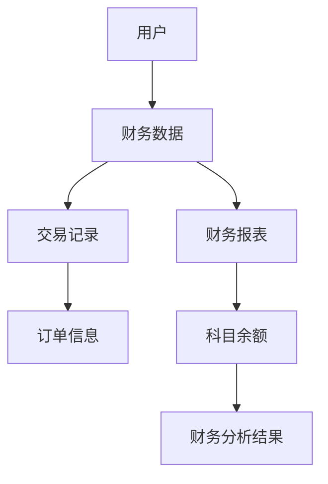
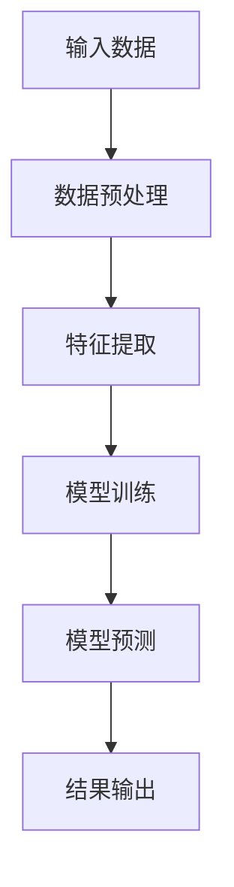
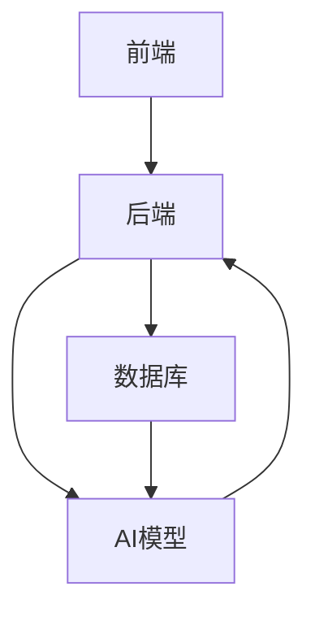
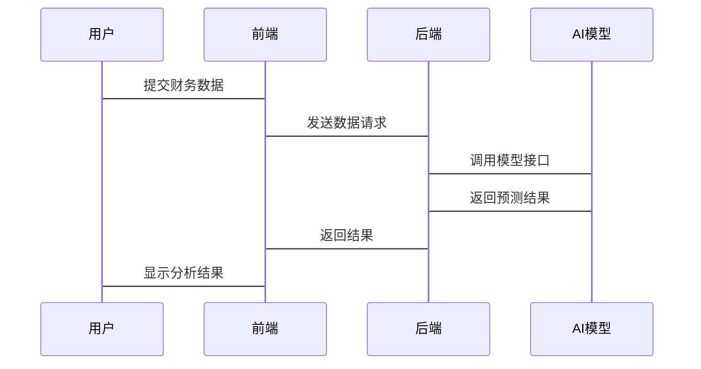

                 


# 开发AI辅助的企业财务情景分析工具

## 关键词：AI, 企业财务, 情景分析, 机器学习, 深度学习, 自然语言处理

## 摘要：  
本文详细探讨了开发AI辅助的企业财务情景分析工具的全过程，从问题背景到技术实现，从系统架构到项目实战，系统地介绍了如何利用AI技术提升企业财务分析的效率与准确性。文章深入分析了AI在财务数据处理、预测建模和文本挖掘中的应用，并通过具体案例展示了工具的实际应用场景。通过对技术细节的逐一解读，本文旨在为企业技术人员和管理者提供一套完整的解决方案，助力企业实现智能化财务分析。

---

# 第一部分: 问题背景与需求分析

## 第1章: 问题背景与需求分析

### 1.1 问题背景  
企业财务分析是企业管理中的核心环节，但传统财务分析依赖人工处理，存在效率低、误差大、覆盖范围有限等问题。随着AI技术的发展，利用机器学习和深度学习模型对财务数据进行智能化分析，已成为提升企业财务管理效率的重要手段。

#### 1.1.1 企业财务分析的痛点  
- **数据量大**：企业每天产生的财务数据种类繁多，包括交易记录、财务报表、订单信息等，人工分析效率低下。  
- **复杂性高**：财务数据涉及多维度的关联关系，人工难以快速发现潜在问题。  
- **预测难度大**：传统财务预测依赖经验判断，缺乏数据驱动的精准预测能力。  

#### 1.1.2 AI技术在财务分析中的应用潜力  
- **自动化处理**：AI可以快速处理大量结构化和非结构化数据，提升分析效率。  
- **智能预测**：基于机器学习的模型能够准确预测财务趋势，辅助决策。  
- **实时监控**：AI可以实时分析财务数据，发现异常情况并及时预警。  

#### 1.1.3 企业财务情景分析工具的定义与目标  
- **定义**：AI辅助的企业财务情景分析工具是指利用AI技术对财务数据进行处理、分析和预测的系统。  
- **目标**：通过自动化、智能化的分析，帮助企业快速识别财务风险、优化资源配置、提升预测精度。  

### 1.2 问题描述  
#### 1.2.1 财务数据的复杂性与多样性  
财务数据不仅包括结构化的表格数据（如财务报表、订单信息），还可能包含非结构化的文本数据（如财务报告、合同文本）。这些数据需要经过清洗、整合和分析，才能用于模型训练。

#### 1.2.2 传统财务分析的局限性  
- **效率低下**：人工分析需要大量时间，难以满足实时需求。  
- **准确性受限**：人为疏忽可能导致分析结果偏差。  
- **覆盖面有限**：传统方法难以同时处理多维度数据，难以发现复杂关联。  

#### 1.2.3 需求场景与用户画像  
- **需求场景**：  
  - 财务预测：预测未来财务状况，如收入预测、成本预测。  
  - 异常检测：识别财务数据中的异常值，如 fraudulent transactions。  
  - 风险评估：评估企业财务风险，如信用风险、流动性风险。  
- **用户画像**：  
  - 财务管理人员：需要快速获取财务分析结果。  
  - 企业高管：需要基于数据驱动的决策支持。  
  - 数据科学家：需要工具支持AI模型的训练与部署。  

#### 1.2.4 问题解决与边界  
- **问题解决**：通过AI技术实现财务数据的自动化分析和预测，提升分析效率和准确性。  
- **边界与适用范围**：  
  - 适用于企业级财务分析，不适用于个人财务管理。  
  - 适用于结构化和非结构化数据的分析，不支持实时交易处理。  

#### 1.2.5 核心功能与非核心功能  
- **核心功能**：  
  - 数据清洗与整合：处理财务数据，消除重复和错误。  
  - 财务预测：基于历史数据预测未来财务状况。  
  - 异常检测：识别财务数据中的异常值。  
- **非核心功能**：  
  - 生成财务报告：虽然重要，但属于辅助功能。  
  - 与其他系统的集成：属于系统架构设计的范畴。  

### 1.3 核心概念与组成  
#### 1.3.1 核心概念原理  
- **数据处理**：AI工具需要对财务数据进行清洗、整合和预处理，确保数据质量。  
- **模型训练**：基于历史数据训练机器学习模型，用于预测和分析。  
- **结果解释**：模型输出结果需要可解释，便于用户理解。  

#### 1.3.2 核心概念属性对比  
| **属性**       | **结构化数据**       | **非结构化数据**       |  
|----------------|----------------------|------------------------|  
| 数据格式       | 表格形式             | 文本形式               |  
| 处理难度       | 较低                 | 较高                   |  
| 分析效率       | 高                  | 中                     |  

#### 1.3.3 ER实体关系图  


### 1.4 本章小结  
本章详细介绍了企业财务分析的痛点、AI技术的应用潜力以及工具的核心概念和组成。通过对问题背景的分析，明确了AI辅助财务分析工具的必要性和可行性。

---

# 第二部分: AI辅助财务分析的核心概念与技术

## 第2章: AI与财务分析的结合原理

### 2.1 核心概念原理  
#### 2.1.1 AI模型在财务数据处理中的作用  
- **数据清洗**：AI模型可以自动识别并处理数据中的缺失值、重复值等问题。  
- **特征提取**：通过深度学习模型提取财务数据中的高维特征，提升模型性能。  

#### 2.1.2 自然语言处理在财务文本分析中的应用  
- **文本摘要**：对财务报告进行摘要，提取关键信息。  
- **情感分析**：分析财务文本中的情感倾向，识别潜在风险。  

#### 2.1.3 深度学习在财务预测中的优势  
- **非线性关系**：深度学习能够捕捉数据中的非线性关系，提升预测精度。  
- **特征交互**：深度学习模型可以自动学习特征之间的交互作用，无需手动特征工程。  

### 2.2 核心概念属性对比  
#### 2.2.1 AI模型的可解释性与不可解释性对比  
| **属性**       | **可解释性模型**（如线性回归）       | **不可解释性模型**（如神经网络）       |  
|----------------|--------------------------------|----------------------------------|  
| 解释性         | 高                              | 低                                |  
| 预测精度       | 低                              | 高                                |  
| 应用场景       | 适用于业务逻辑清晰的场景           | 适用于复杂非线性关系的场景           |  

#### 2.2.2 不同AI技术在财务分析中的适用场景对比  
| **技术**       | **适用场景**                   |  
|----------------|-------------------------------|  
| 机器学习       | 财务预测、分类、聚类           |  
| 深度学习       | 文本分析、图像识别             |  
| 自然语言处理   | 财务文本挖掘、情感分析         |  

### 2.3 本章小结  
本章详细分析了AI技术在财务分析中的核心作用，包括数据处理、文本分析和预测建模等方面，并通过对比不同技术的优劣势，明确了在不同场景下的适用性。

---

## 第3章: 算法原理与实现

### 3.1 算法原理  
#### 3.1.1 基于Transformer的文本处理流程  
- **输入数据**：财务报告文本。  
- **数据预处理**：分词、去除停用词、词向量化。  
- **模型训练**：基于Transformer架构，进行文本摘要或情感分析。  

#### 3.1.2 财务预测的深度学习模型  
- **模型结构**：使用LSTM（长短期记忆网络）进行时间序列预测。  
- **训练过程**：输入历史财务数据，输出未来财务状况预测。  

#### 3.1.3 时间序列分析的算法选择  
- **ARIMA**：适用于线性时间序列预测。  
- **LSTM**：适用于非线性时间序列预测，能够捕捉长期依赖关系。  

### 3.2 算法流程图  


### 3.3 数学模型与公式  
#### 3.3.1 Transformer模型的注意力机制  
$$\text{Attention}(Q,K,V) = \text{softmax}\left(\frac{QK^T}{\sqrt{d_k}}\right)V$$  

#### 3.3.2 LSTM模型的结构  
- **遗忘门**：$$f_t = \sigma(W_f \cdot [h_{t-1}, x_t] + b_f)$$  
- **输入门**：$$i_t = \sigma(W_i \cdot [h_{t-1}, x_t] + b_i)$$  
- **候选状态**：$$o_t = \tanh(W_o \cdot [h_{t-1}, x_t] + b_o)$$  
- **输出门**：$$h_t = f_t \cdot o_t$$  

### 3.4 本章小结  
本章详细介绍了AI辅助财务分析中常用的算法原理，包括Transformer模型、LSTM模型以及时间序列分析方法，并通过流程图和数学公式进行了详细阐述。

---

## 第4章: 系统分析与架构设计

### 4.1 问题场景介绍  
#### 4.1.1 财务数据处理场景  
- 数据清洗、整合、分析与预测。  
#### 4.1.2 系统功能场景  
- 数据采集、处理、分析、预测与可视化。  

### 4.2 项目介绍  
#### 4.2.1 项目目标  
开发一个基于AI的企业财务情景分析工具，实现财务数据的智能化分析与预测。  

#### 4.2.2 项目范围  
- 数据范围：财务报表、交易记录、订单信息。  
- 功能范围：数据处理、预测建模、结果可视化。  

### 4.3 系统功能设计  
#### 4.3.1 领域模型  


#### 4.3.2 系统架构设计  


#### 4.3.3 系统接口设计  
- **数据接口**：提供财务数据的读取和写入接口。  
- **模型接口**：提供AI模型的调用接口，支持批量预测和实时预测。  

#### 4.3.4 系统交互流程  


### 4.4 本章小结  
本章详细设计了AI辅助财务分析工具的系统架构，包括领域模型、系统架构图、接口设计和交互流程，并通过mermaid图展示了系统的整体结构。

---

## 第5章: 项目实战

### 5.1 环境安装  
#### 5.1.1 开发环境  
- Python 3.8+  
- PyTorch 1.9+  
- Jupyter Notebook  
- Pandas、NumPy  

#### 5.1.2 安装依赖  
```bash
pip install torch pandas numpy matplotlib seaborn
```

### 5.2 核心实现  
#### 5.2.1 数据处理代码  
```python
import pandas as pd
import numpy as np

# 数据加载
df = pd.read_csv('financial_data.csv')

# 数据清洗
df.dropna(inplace=True)
df = df[~df.duplicated()]
```

#### 5.2.2 模型训练代码  
```python
import torch
import torch.nn as nn
import torch.optim as optim

# 定义LSTM模型
class LSTMModel(nn.Module):
    def __init__(self, input_size, hidden_size, output_size):
        super(LSTMModel, self).__init__()
        self.lstm = nn.LSTM(input_size, hidden_size, batch_first=True)
        self.fc = nn.Linear(hidden_size, output_size)

    def forward(self, x):
        out, _ = self.lstm(x)
        out = self.fc(out[:, -1, :])
        return out

# 训练过程
model = LSTMModel(input_size=1, hidden_size=64, output_size=1)
criterion = nn.MSELoss()
optimizer = optim.Adam(model.parameters(), lr=0.001)

for epoch in range(100):
    outputs = model(X_train)
    loss = criterion(outputs, y_train)
    optimizer.zero_grad()
    loss.backward()
    optimizer.step()
```

#### 5.2.3 结果可视化  
```python
import matplotlib.pyplot as plt

# 预测结果
y_pred = model(X_test).detach().numpy()

# 可视化
plt.plot(y_test.numpy(), label='True')
plt.plot(y_pred, label='Predicted')
plt.xlabel('Time Step')
plt.ylabel('Financial Value')
plt.legend()
plt.show()
```

### 5.3 项目小结  
本章通过实际案例展示了AI辅助财务分析工具的开发过程，从环境安装到数据处理，再到模型训练和结果可视化，详细解读了每个步骤的具体实现。

---

## 第6章: 最佳实践与总结

### 6.1 最佳实践  
#### 6.1.1 数据处理  
- 确保数据质量，清洗和预处理是关键。  
- 结构化数据和非结构化数据的处理方式不同，需分别处理。  

#### 6.1.2 模型选择  
- 根据具体场景选择合适的算法，线性回归适用于简单场景，深度学习适用于复杂场景。  

#### 6.1.3 结果解释  
- 确保模型结果可解释，便于用户理解和使用。  
- 提供可视化工具，帮助用户直观理解分析结果。  

### 6.2 注意事项  
- **数据隐私**：处理企业财务数据时，需注意数据隐私和安全性。  
- **模型局限性**：AI模型可能存在过拟合或欠拟合问题，需通过交叉验证等方法进行优化。  

### 6.3 拓展阅读  
- 《Deep Learning for Finance》  
- 《Python机器学习实战》  

### 6.4 本章小结  
本章总结了AI辅助财务分析工具开发的最佳实践，提出了数据处理、模型选择和结果解释的关键注意事项，并推荐了相关拓展阅读资料。

---

## 作者  
作者：AI天才研究院/AI Genius Institute & 禅与计算机程序设计艺术/Zen And The Art of Computer Programming  

---

通过以上详细的内容，我们可以看到，AI辅助的企业财务情景分析工具的开发涉及多个技术层面，从数据处理到模型训练，从系统架构到结果可视化，每一步都需要仔细设计和实现。希望本文能为企业技术人员和管理者提供有价值的参考和启发。

