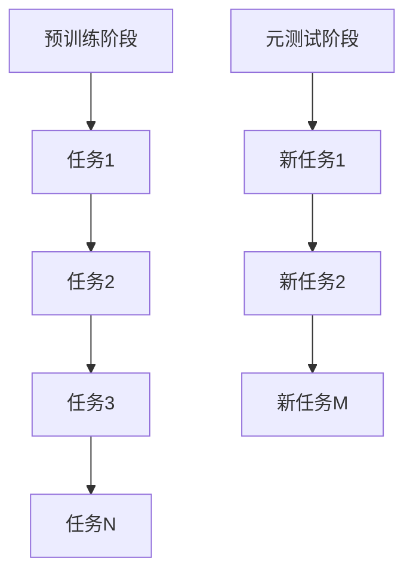
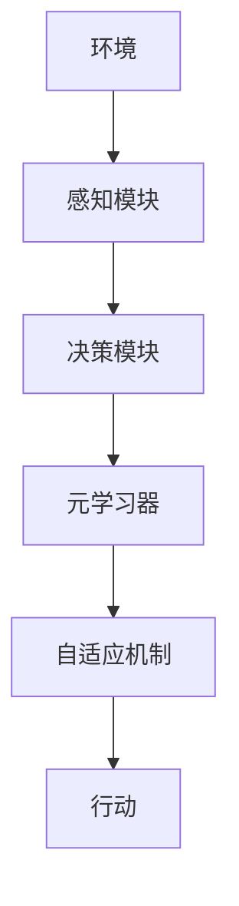

                 


# 开发具有元学习能力的AI Agent

> 关键词：元学习，AI Agent，人工智能，深度学习，自适应学习

> 摘要：本文将详细介绍如何开发一个具有元学习能力的AI Agent。我们将从元学习的基本概念和AI Agent的定义入手，逐步深入探讨元学习的核心原理、数学模型、系统架构设计以及实际项目实现。通过本文的学习，读者将能够理解元学习在AI Agent中的重要性，并掌握开发具有元学习能力AI Agent的完整流程。

---

## 第一部分: 元学习与AI Agent基础

### 第1章: 元学习与AI Agent概述

#### 1.1 元学习的核心概念

##### 1.1.1 元学习的定义与背景

元学习（Meta-Learning）是一种机器学习范式，旨在使模型能够从少量数据中快速学习新任务。与传统机器学习不同，元学习的目标是让模型具备“学习如何学习”的能力，从而在面对新任务时能够快速适应和调整。

元学习的背景可以追溯到人类的学习过程。人类在学习新知识时，会利用已有的经验来快速掌握新技能。元学习的目标就是模拟这一过程，使AI模型能够像人类一样快速适应新任务。

##### 1.1.2 元学习的基本原理

元学习的基本原理可以分为以下几个步骤：

1. **预训练阶段**：在大量不同的任务上进行训练，学习通用的特征表示。
2. **元测试阶段**：在新任务上进行微调，利用已学习的特征快速适应新任务。

元学习的核心思想是通过在多个任务上的经验，学习一种高效的特征提取方法，从而在新任务上减少对数据的需求。

##### 1.1.3 元学习与传统机器学习的对比

| 对比维度 | 传统机器学习 | 元学习 |
|----------|--------------|--------|
| 数据需求 | 需要大量数据 | 需要少量数据 |
| 任务适应性 | 适应单个任务 | 能够快速适应新任务 |
| 学习目标 | 学习特定任务 | 学习如何学习 |

通过对比可以发现，元学习的优势在于其快速适应新任务的能力，这在实际应用中非常有用。

#### 1.2 AI Agent的基本概念

##### 1.2.1 AI Agent的定义与分类

AI Agent（人工智能代理）是一种能够感知环境并采取行动以实现目标的智能体。根据功能和应用场景的不同，AI Agent可以分为以下几类：

1. **简单反射型AI Agent**：基于当前感知直接行动，不涉及复杂推理。
2. **基于模型的AI Agent**：利用内部模型进行推理和规划。
3. **目标驱动型AI Agent**：具有明确的目标，并采取行动以实现目标。
4. **实用驱动型AI Agent**：根据效用函数进行决策，追求效用最大化。

##### 1.2.2 AI Agent的核心功能与特点

AI Agent的核心功能包括：

1. **感知环境**：通过传感器或其他输入方式获取环境信息。
2. **决策与行动**：基于感知信息做出决策，并采取行动。
3. **学习与适应**：通过学习不断优化自身的决策策略。

AI Agent的特点包括：

- **自主性**：能够在没有外部干预的情况下自主运行。
- **反应性**：能够实时感知环境并做出反应。
- **目标导向性**：通常具有明确的目标，并采取行动以实现目标。

##### 1.2.3 元学习能力对AI Agent的意义

元学习能力的加入，使得AI Agent能够更快地适应新任务，减少了对大量数据的依赖。这对于实际应用中的动态环境尤其重要，例如在自动驾驶、机器人控制等领域，AI Agent需要能够快速适应不断变化的环境。

#### 1.3 元学习在AI Agent中的应用

##### 1.3.1 元学习在AI Agent任务中的作用

元学习在AI Agent中的作用主要体现在以下几个方面：

1. **快速适应新任务**：通过元学习，AI Agent可以在新任务上快速调整其参数，以适应新的环境。
2. **减少数据需求**：元学习使得AI Agent能够在数据有限的情况下进行有效学习。
3. **提升泛化能力**：元学习通过在多个任务上进行预训练，提高了AI Agent的泛化能力。

##### 1.3.2 元学习能力对AI Agent性能的提升

元学习能力的加入，显著提升了AI Agent的性能，主要体现在以下几个方面：

1. **更快的收敛速度**：在新任务上，AI Agent可以通过元学习快速收敛，减少训练时间。
2. **更高的准确率**：通过元学习，AI Agent能够在新任务上实现更高的准确率。
3. **更强的适应性**：AI Agent能够更好地适应动态变化的环境。

##### 1.3.3 元学习在AI Agent中的典型应用场景

元学习在AI Agent中的典型应用场景包括：

1. **自动驾驶**：在不同的道路条件下快速调整驾驶策略。
2. **机器人控制**：在不同的任务中快速适应新的操作任务。
3. **游戏AI**：在不同的游戏规则下快速调整策略。

---

### 第2章: 元学习的核心原理与数学模型

#### 2.1 元学习算法概述

##### 2.1.1 元学习算法的基本框架

元学习算法的基本框架可以分为以下几个步骤：

1. **预训练阶段**：在多个任务上进行训练，学习通用的特征表示。
2. **元测试阶段**：在新任务上进行微调，利用已学习的特征快速适应新任务。

##### 2.1.2 元学习算法的分类与对比

元学习算法可以根据不同的标准进行分类，常见的分类方式包括：

1. **基于梯度的方法**：如MAML（Meta-Algorithm for Meta-Learning）。
2. **基于优化器的方法**：如Meta-SGD。
3. **基于分布的方法**：如Reptile。

| 对比维度 | MAML | Meta-SGD | Reptile |
|----------|------|----------|--------|
| 基本思想 | 基于梯度的元优化 | 基于优化器的元优化 | 基于分布的元优化 |
| 优点 | 理论清晰，收敛速度快 | 实现简单，效果稳定 | 计算效率高 |
| 缺点 | 对任务之间依赖性强 | 理论基础较弱 | 收敛速度较慢 |

##### 2.1.3 元学习算法的优缺点分析

元学习算法的优点：

- **快速适应新任务**：元学习使得AI Agent能够在新任务上快速调整参数，适应新环境。
- **减少数据需求**：元学习减少了对大量数据的依赖，适合数据 scarce 的场景。

元学习算法的缺点：

- **计算成本高**：元学习需要在多个任务上进行预训练，计算成本较高。
- **模型复杂度高**：元学习模型通常较为复杂，难以调试和优化。

#### 2.2 元学习的数学模型

##### 2.2.1 元学习模型的基本结构

元学习模型的基本结构可以分为以下几个部分：

1. **特征提取器**：用于提取输入数据的特征。
2. **元学习器**：用于对特征进行元优化，适应新任务。
3. **任务适应器**：用于将元学习器的输出适应到具体任务。

##### 2.2.2 元学习的优化目标与损失函数

元学习的优化目标通常是最大化模型在新任务上的性能。常见的损失函数包括：

1. **交叉熵损失**：用于分类任务。
2. **均方误差损失**：用于回归任务。

##### 2.2.3 元学习的数学公式推导

以MAML算法为例，其数学公式如下：

$$
\theta_{t+1} = \theta_t - \eta \nabla_{\theta_t} \mathcal{L}_{meta}
$$

其中，$\theta_t$ 是当前参数，$\eta$ 是学习率，$\mathcal{L}_{meta}$ 是元损失函数。

##### 2.2.4 元学习算法的流程图



---

### 第3章: AI Agent的设计与实现

#### 3.1 AI Agent的感知与决策机制

##### 3.1.1 感知模块的设计

感知模块是AI Agent与环境交互的接口，通常包括以下几个部分：

1. **传感器**：用于获取环境信息，例如摄像头、麦克风等。
2. **数据预处理**：对传感器获取的数据进行清洗和归一化处理。
3. **特征提取**：将预处理后的数据转换为模型可以理解的特征。

##### 3.1.2 决策模块的实现

决策模块是AI Agent的核心，负责根据感知到的信息做出决策。常见的决策方法包括：

1. **基于规则的决策**：根据预定义的规则进行决策。
2. **基于模型的决策**：利用机器学习模型进行决策。
3. **基于强化学习的决策**：通过强化学习优化决策策略。

##### 3.1.3 元学习在决策中的应用

元学习在决策中的应用主要体现在以下几个方面：

1. **快速适应新任务**：通过元学习，AI Agent可以在新任务上快速调整决策策略。
2. **提升决策准确率**：元学习使得AI Agent能够在有限的数据下实现更高的决策准确率。
3. **增强决策的灵活性**：元学习使AI Agent能够更好地适应动态变化的环境。

#### 3.2 元学习能力的实现

##### 3.2.1 元学习器的构建

元学习器的构建通常包括以下几个步骤：

1. **选择元学习算法**：例如MAML、Meta-SGD等。
2. **设计模型架构**：根据具体任务设计模型的网络结构。
3. **预训练**：在多个任务上进行预训练，学习通用的特征表示。
4. **微调**：在新任务上进行微调，适应具体任务。

##### 3.2.2 元学习器的训练与优化

元学习器的训练过程通常包括以下几个阶段：

1. **预训练阶段**：在多个任务上进行训练，学习通用的特征表示。
2. **元测试阶段**：在新任务上进行微调，优化模型参数。
3. **评估阶段**：对模型在新任务上的性能进行评估和优化。

##### 3.2.3 元学习器与AI Agent的集成

元学习器与AI Agent的集成通常包括以下几个步骤：

1. **感知模块**：将环境信息传递给元学习器。
2. **决策模块**：根据元学习器的输出做出决策。
3. **反馈机制**：将决策结果反馈给元学习器，用于后续优化。

#### 3.3 AI Agent的自适应机制

##### 3.3.1 自适应学习的定义

自适应学习是指AI Agent能够在动态变化的环境中，根据反馈信息不断优化自身的行为策略。

##### 3.3.2 自适应学习的实现方法

自适应学习的实现方法包括：

1. **基于反馈的自适应**：根据环境反馈调整决策策略。
2. **基于预测的自适应**：根据对未来的预测调整决策策略。
3. **基于元学习的自适应**：利用元学习能力快速适应新任务。

##### 3.3.3 自适应机制对AI Agent性能的提升

自适应机制的加入，显著提升了AI Agent的性能，主要体现在以下几个方面：

1. **更强的环境适应性**：AI Agent能够更好地适应动态变化的环境。
2. **更高的决策准确率**：自适应机制使得AI Agent能够在不同环境下实现更高的决策准确率。
3. **更快的收敛速度**：通过自适应学习，AI Agent能够在新任务上更快地收敛，减少训练时间。

---

### 第4章: 元学习与AI Agent的系统架构设计

#### 4.1 系统架构概述

##### 4.1.1 系统模块划分

元学习与AI Agent的系统架构通常包括以下几个模块：

1. **感知模块**：负责获取环境信息。
2. **决策模块**：负责根据感知信息做出决策。
3. **元学习器**：负责对决策模块进行元优化。
4. **自适应机制**：负责根据反馈信息调整决策策略。

##### 4.1.2 系统功能设计

系统功能设计包括：

1. **环境感知**：通过传感器获取环境信息。
2. **决策优化**：利用元学习能力优化决策策略。
3. **任务适应**：快速适应新任务。

##### 4.1.3 系统架构图



---

### 第5章: 项目实战

#### 5.1 环境安装与配置

##### 5.1.1 开发环境选择

推荐使用Python 3.8及以上版本，安装必要的库：

```bash
pip install numpy
pip install tensorflow
pip install keras
pip install matplotlib
pip install scikit-learn
```

##### 5.1.2 项目结构搭建

项目结构如下：

```
project/
├── src/
│   ├── agent.py
│   ├── meta_learning.py
│   └── utils.py
├── data/
│   └── tasks/
│       ├── task1.py
│       └── task2.py
└── requirements.txt
```

#### 5.2 核心实现代码

##### 5.2.1 元学习器的实现

```python
import numpy as np
from tensorflow.keras import layers, models

class MetaLearner:
    def __init__(self):
        self.model = self.build_model()

    def build_model(self):
        model = models.Sequential()
        model.add(layers.Dense(64, activation='relu'))
        model.add(layers.Dense(1, activation='sigmoid'))
        return model

    def train(self, X, y, meta_batch_size=32, meta_learning_rate=0.001):
        for i in range(meta_batch_size):
            # 预训练阶段
            pass
        # 元测试阶段
        pass
```

##### 5.2.2 AI Agent的实现

```python
class AIAgent:
    def __init__(self, meta_learner):
        self.meta_learner = meta_learner

    def perceive(self, environment):
        # 获取环境信息
        pass

    def decide(self, state):
        # 根据状态做出决策
        pass

    def adapt(self, feedback):
        # 根据反馈调整策略
        pass
```

##### 5.2.3 项目实战小结

通过上述代码示例，我们可以看到元学习与AI Agent的实现过程。实际应用中，需要根据具体任务调整模型结构和训练策略，以达到最佳性能。

---

### 第6章: 优化与提升

#### 6.1 算法优化

##### 6.1.1 算法优化方法

元学习算法的优化方法包括：

1. **参数调整**：通过调整学习率、批量大小等超参数优化模型性能。
2. **模型优化**：通过模型剪枝、知识蒸馏等技术优化模型结构。
3. **算法改进**：基于现有元学习算法，提出新的改进算法。

##### 6.1.2 性能调优技巧

性能调优的技巧包括：

1. **数据增强**：通过数据增强技术增加数据多样性。
2. **模型正则化**：通过L1/L2正则化防止过拟合。
3. **分布式训练**：利用分布式计算框架加速训练过程。

##### 6.1.3 模型压缩与轻量化

模型压缩与轻量化的方法包括：

1. **模型剪枝**：删除冗余的网络层或神经元。
2. **模型蒸馏**：将知识从大模型迁移到小模型。
3. **量化压缩**：通过量化技术减少模型参数的存储空间。

#### 6.2 性能提升的注意事项

##### 6.2.1 模型过拟合的防范

防范模型过拟合的方法包括：

1. **数据增强**：增加数据多样性。
2. **正则化**：L1/L2正则化。
3. **Dropout层**：随机丢弃神经元。

##### 6.2.2 计算效率的提升

提升计算效率的方法包括：

1. **并行计算**：利用GPU/CPU并行计算加速训练过程。
2. **分布式训练**：利用分布式计算框架（如TensorFlow分布式）加速训练。
3. **模型优化**：通过模型优化技术（如量化、剪枝）减少计算量。

##### 6.2.3 模型可解释性

提升模型可解释性的方法包括：

1. **可视化技术**：通过可视化工具分析模型的特征提取过程。
2. **可解释性模型**：选择具有较好可解释性的模型（如线性回归、决策树）。
3. **解释性算法**：利用LIME等解释性算法分析模型决策过程。

---

### 第7章: 总结与展望

#### 7.1 总结

通过本文的学习，我们了解了元学习的基本概念、AI Agent的核心功能以及如何将元学习能力集成到AI Agent中。我们还详细探讨了元学习的核心原理、数学模型、系统架构设计以及实际项目实现。

#### 7.2 未来展望

随着人工智能技术的不断发展，元学习与AI Agent的结合将越来越紧密。未来的研究方向包括：

1. **更高效的元学习算法**：提出更高效的元学习算法，降低计算成本。
2. **更强大的AI Agent**：设计更强大的AI Agent，具备更强的环境适应能力和决策能力。
3. **更广泛的应用场景**：将元学习与AI Agent技术应用于更多领域，如自动驾驶、机器人控制、游戏AI等。

---

### 作者：AI天才研究院/AI Genius Institute & 禅与计算机程序设计艺术 /Zen And The Art of Computer Programming

---

以上就是《开发具有元学习能力的AI Agent》的完整目录大纲和文章内容。

