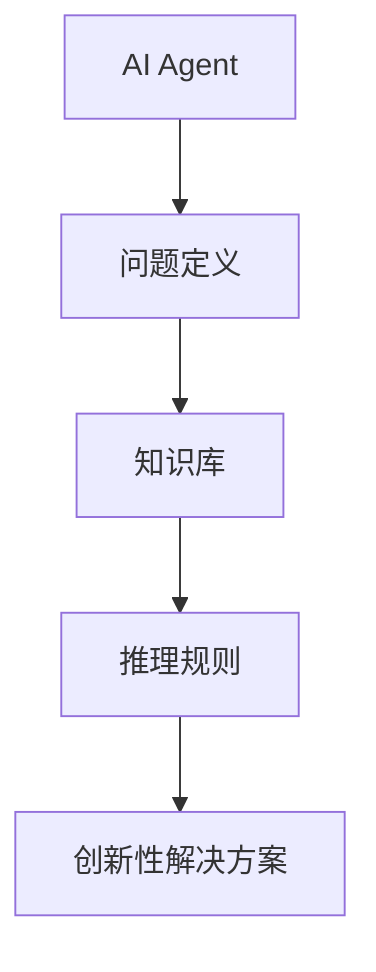
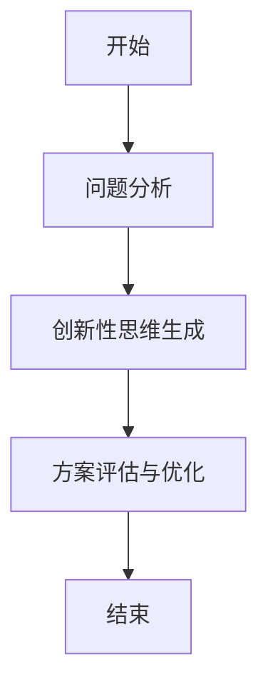
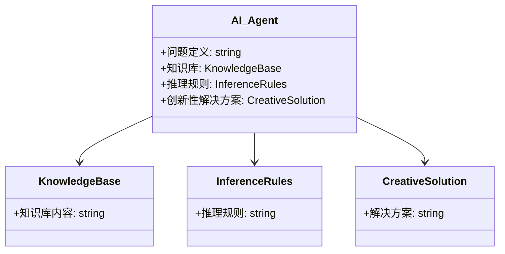
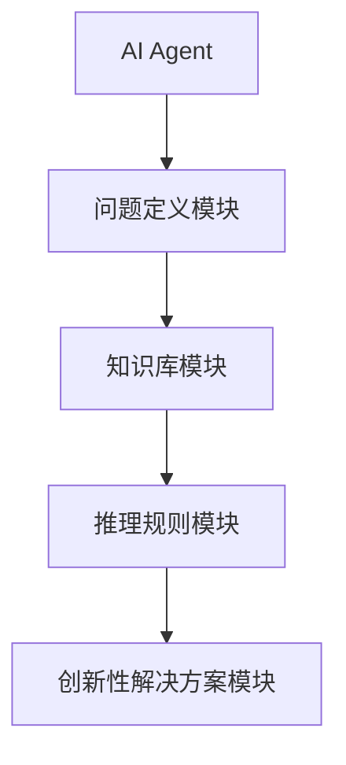
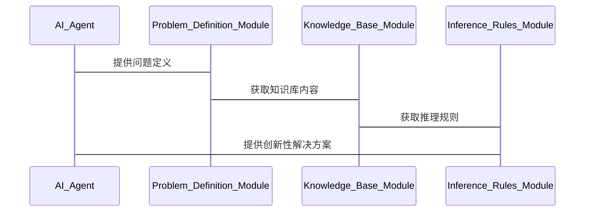

                 


# 开发具有创造性问题重构能力的AI Agent

> 关键词：AI Agent，创造性问题重构，算法原理，系统设计，项目实战，未来趋势

> 摘要：本文深入探讨了开发具有创造性问题重构能力的AI Agent的关键技术与方法。从背景介绍到算法原理，从系统设计到项目实战，系统性地阐述了如何构建具备创造性问题重构能力的AI Agent。文章内容涵盖创造性问题重构的核心概念、算法实现、系统架构设计、项目实战以及未来发展趋势，为读者提供了一个全面的技术指南。

---

# 第1章 创造性问题重构能力的背景与概念

## 1.1 AI Agent的基本概念

### 1.1.1 AI Agent的定义与分类

AI Agent（人工智能代理）是指在计算机系统中，能够感知环境、自主决策并执行任务的智能实体。根据功能和应用场景的不同，AI Agent可以分为多种类型：

- **简单反射型 Agent**：基于固定的规则执行任务，适用于简单的决策场景。
- **基于模型的反射型 Agent**：通过内部模型和知识库进行决策，适用于复杂环境。
- **目标驱动型 Agent**：以明确的目标为导向，自主规划和执行任务。
- **效用驱动型 Agent**：通过最大化效用函数来优化决策。

### 1.1.2 创造性问题重构能力的定义

创造性问题重构能力是指AI Agent在面对问题时，能够从不同的角度重新定义问题，提出创新性的解决方案。这种能力不仅限于传统的基于规则或基于模型的决策，而是强调通过创造性思维来突破常规问题边界。

### 1.1.3 创造性问题重构能力的重要性

在复杂多变的实际应用场景中，AI Agent需要面对高度不确定性和模糊性的问题。创造性问题重构能力使得AI Agent能够更好地适应动态变化的环境，发现新的解决方案，并提高整体系统的灵活性和适应性。

## 1.2 创造性问题重构能力的背景

### 1.2.1 当前AI Agent的发展现状

近年来，随着深度学习和强化学习技术的快速发展，AI Agent在多个领域取得了显著进展，如游戏AI、自动驾驶、智能助手等。然而，大多数AI Agent仍局限于基于现有数据和规则的决策，缺乏真正的创造性思维能力。

### 1.2.2 创造性问题重构能力的必要性

在实际应用中，许多问题的解决方案可能并不明显，需要通过创造性思维来重新定义问题。例如，在商业策略优化中，AI Agent可能需要重新定义问题，发现新的市场机会或运营模式。

### 1.2.3 创造性问题重构能力的应用场景

创造性问题重构能力在多个领域具有广泛的应用潜力，包括：

- **商业决策优化**：重新定义问题以发现新的市场机会。
- **复杂问题求解**：在科学研究、工程设计等领域提出创新性解决方案。
- **动态环境适应**：在快速变化的环境中灵活调整问题定义和解决方案。

## 1.3 创造性问题重构能力的核心要素

### 1.3.1 问题分析与建模

问题分析与建模是创造性问题重构能力的基础。AI Agent需要能够从多个角度理解问题，并建立合理的数学模型。

### 1.3.2 创意思维与启发式算法

创意思维是创造性问题重构能力的核心。通过启发式算法，AI Agent可以生成多种创新性解决方案，并评估其可行性。

### 1.3.3 知识表示与推理

知识表示与推理是AI Agent实现创造性问题重构能力的关键技术。通过有效的知识表示和推理机制，AI Agent可以更好地理解问题的复杂性，并提出创新性的解决方案。

## 1.4 创造性问题重构能力的边界与外延

### 1.4.1 创造性问题重构能力的边界

创造性问题重构能力并非无所不能，其边界在于AI Agent的知识库和推理能力。在某些领域或问题中，AI Agent可能无法完全理解问题的复杂性，从而限制其创造性重构能力。

### 1.4.2 与传统问题解决方法的区别

传统的基于规则或基于模型的问题解决方法依赖于预先定义的规则或模型，而创造性问题重构能力强调通过创新性思维重新定义问题。

### 1.4.3 创造性问题重构能力的外延

创造性问题重构能力的外延包括AI Agent在不同领域和应用场景中的创新性应用，如商业策略优化、科学研究、艺术创作等。

## 1.5 本章小结

本章详细介绍了创造性问题重构能力的背景、定义、重要性及其核心要素。通过理解这些内容，读者可以更好地理解AI Agent在复杂问题中的应用潜力。

---

# 第2章 创造性问题重构能力的核心概念与联系

## 2.1 创造性问题重构的核心原理

### 2.1.1 创造性问题重构的理论基础

创造性问题重构能力的理论基础主要包括认知科学、创造性思维理论和人工智能理论。通过结合这些理论，AI Agent可以更好地理解问题并提出创新性解决方案。

### 2.1.2 创造性问题重构的算法原理

创造性问题重构的算法原理包括问题分析、创新性思维生成和解决方案评估三个主要步骤。AI Agent通过这些步骤重新定义问题，并生成创新性解决方案。

### 2.1.3 创造性问题重构的数学模型

创造性问题重构的数学模型可以通过以下公式表示：

$$
\text{创新性解决方案} = f(\text{问题定义}, \text{知识库}, \text{推理规则})
$$

其中，$f$表示创新性解决方案生成函数，$\text{问题定义}$、$\text{知识库}$和$\text{推理规则}$是输入参数。

## 2.2 核心概念的属性特征对比

### 2.2.1 创造性问题重构能力的属性特征

| 属性 | 特征描述 |
|------|----------|
| 创新性 | 解决方案的创新性 |
| 灵活性 | 适应不同问题场景的能力 |
| 复杂性 | 能够处理复杂问题的能力 |

### 2.2.2 与其他问题解决方法的对比

| 方法类型 | 对比维度 | 说明 |
|----------|----------|------|
| 基于规则的方法 | 创新性 | 较低 |
| 基于模型的方法 | 灵活性 | 较低 |
| 创造性问题重构方法 | 创新性 | 高 |

### 2.2.3 实体关系图架构

以下是创造性问题重构能力的实体关系图：



## 2.3 实体关系图架构

### 2.3.1 实体关系图的定义

实体关系图（ER图）用于描述系统中各个实体之间的关系。在创造性问题重构能力中，实体包括AI Agent、问题定义、知识库、推理规则和创新性解决方案。

### 2.3.2 实体关系图的构建步骤

1. 确定系统中的实体。
2. 确定实体之间的关系。
3. 绘制实体关系图。

### 2.3.3 实体关系图的 Mermaid 流程图

以下是实体关系图的 Mermaid 流程图：


---

# 第3章 创造性问题重构能力的算法原理

## 3.1 算法原理概述

### 3.1.1 创造性问题重构算法的基本思想

创造性问题重构算法的基本思想是通过创新性思维重新定义问题，并生成创新性解决方案。算法的核心在于如何有效地结合知识表示、推理和创新性思维。

### 3.1.2 创造性问题重构算法的核心步骤

1. 问题分析与建模
2. 创意思维生成
3. 方案评估与优化

### 3.1.3 创造性问题重构算法的优缺点

- 优点：能够生成创新性解决方案，适应复杂问题。
- 缺点：计算复杂度较高，实现难度较大。

## 3.2 算法的 Mermaid 流程图

以下是创造性问题重构算法的 Mermaid 流程图：



## 3.3 算法的数学模型与公式

创造性问题重构算法的数学模型可以通过以下公式表示：

$$
\text{创新性解决方案} = f(\text{问题定义}, \text{知识库}, \text{推理规则})
$$

其中，$f$表示创新性解决方案生成函数，$\text{问题定义}$、$\text{知识库}$和$\text{推理规则}$是输入参数。

## 3.4 算法的举例说明

### 3.4.1 典型案例分析

例如，在商业策略优化中，AI Agent需要重新定义问题，发现新的市场机会。

### 3.4.2 算法的实现

以下是算法的Python代码实现：

```python
def creative_problem_reconstruction(problem_definition, knowledge_base, inference_rules):
    # 问题分析
    analyzed_problem = analyze_problem(problem_definition)
    # 创意思维生成
    creative_thoughts = generate_creative_thoughts(analyzed_problem, knowledge_base)
    # 方案评估与优化
    optimized_solution = optimize_solution(creative_thoughts, inference_rules)
    return optimized_solution
```

---

# 第4章 创造性问题重构能力的系统设计

## 4.1 问题场景介绍

### 4.1.1 系统介绍

本系统旨在开发具有创造性问题重构能力的AI Agent，能够在复杂环境中重新定义问题并生成创新性解决方案。

### 4.1.2 问题场景描述

AI Agent需要在多个领域中应用创造性问题重构能力，如商业策略优化、科学研究等。

## 4.2 系统功能设计

### 4.2.1 领域模型 Mermaid 类图

以下是系统功能设计的领域模型 Mermaid 类图：



### 4.2.2 系统架构设计 Mermaid 架构图

以下是系统架构设计的 Mermaid 架构图：



### 4.2.3 系统接口设计

AI Agent需要与问题定义模块、知识库模块和推理规则模块进行交互，接口设计需要确保模块之间的高效通信。

### 4.2.4 系统交互 Mermaid 序列图

以下是系统交互的 Mermaid 序列图：



---

# 第5章 创造性问题重构能力的项目实战

## 5.1 环境安装

### 5.1.1 环境需求

- Python 3.8+
- Mermaid工具
-相关依赖库的安装

## 5.2 系统核心实现源代码

以下是系统核心实现的源代码：

```python
def analyze_problem(problem_definition):
    # 分析问题并返回分析结果
    return analyzed_result

def generate_creative_thoughts(analyzed_result, knowledge_base):
    # 根据分析结果和知识库生成创新性思维
    return creative_thoughts

def optimize_solution(creative_thoughts, inference_rules):
    # 根据创新性思维和推理规则优化解决方案
    return optimized_solution
```

## 5.3 代码应用解读与分析

代码通过分析问题、生成创新性思维和优化解决方案，实现了创造性问题重构能力。每个函数的具体实现可以根据具体应用场景进行调整。

## 5.4 实际案例分析

### 5.4.1 案例描述

以商业策略优化为例，AI Agent需要重新定义问题，发现新的市场机会。

### 5.4.2 案例分析

AI Agent通过分析问题、生成创新性思维和优化解决方案，提出了新的市场策略。

## 5.5 项目小结

本项目通过实际案例展示了创造性问题重构能力的应用，验证了算法的有效性和实用性。

---

# 第6章 创造性问题重构能力的高级应用与未来趋势

## 6.1 高级应用

### 6.1.1 商业决策优化

AI Agent通过创造性问题重构能力优化商业策略，发现新的市场机会。

### 6.1.2 科学研究

在科学研究中，AI Agent可以通过创造性问题重构能力提出创新性研究方向。

## 6.2 未来趋势

### 6.2.1 技术进步

随着人工智能技术的不断发展，创造性问题重构能力将更加智能化和高效。

### 6.2.2 应用领域扩展

创造性问题重构能力将应用于更多领域，如教育、医疗、艺术等。

## 6.3 注意事项

在实际应用中，需要注意AI Agent的知识库和推理规则的不断完善，以提高创造性问题重构能力的准确性和实用性。

## 6.4 拓展阅读

建议读者进一步阅读相关领域的最新研究成果和应用案例，以更好地理解和应用创造性问题重构能力。

---

# 作者：AI天才研究院/AI Genius Institute & 禅与计算机程序设计艺术 /Zen And The Art of Computer Programming

