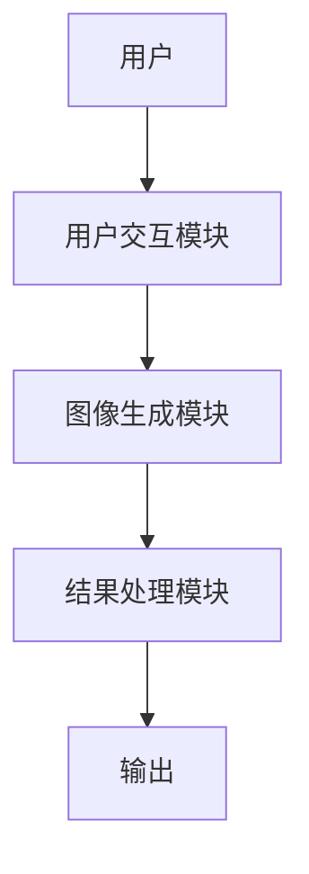

                 


# 开发具有图像生成能力的AI Agent

> 关键词：AI Agent, 图像生成, GAN, Diffusion模型, 系统架构

> 摘要：本文详细探讨了开发具有图像生成能力的AI Agent的各个方面，从基础概念到系统架构设计，再到实际项目案例，全面解析了图像生成技术在AI Agent中的应用和实现。

---

## 第1章: AI Agent与图像生成概述

### 1.1 AI Agent的基本概念
AI Agent（人工智能代理）是一种能够感知环境、自主决策并执行任务的智能实体。它能够通过传感器获取信息，利用推理和学习能力解决问题，并通过执行器与环境交互。

**AI Agent的核心特征**：
- **自主性**：能够自主决策，无需外部干预。
- **反应性**：能够实时感知环境并做出响应。
- **目标导向性**：具有明确的目标，驱动行为。
- **社会性**：能够与其他Agent或人类进行交互和协作。

AI Agent在图像生成中的作用至关重要。图像生成能够为AI Agent提供视觉信息，增强其感知能力，使其能够更好地理解和处理复杂任务。

---

### 1.2 图像生成技术的发展历程

图像生成技术经历了从传统方法到深度学习的演变：

- **传统图像生成方法**：基于数学模型，如线性变换、傅里叶变换等，生成简单图形。
- **基于深度学习的图像生成技术**：以GAN、VAE和Diffusion模型为代表，能够生成高质量、多样化的图像。

当前，深度学习模型在图像生成领域占据主导地位，尤其是在生成逼真图像方面表现出色。

---

### 1.3 AI Agent与图像生成的结合

AI Agent通过集成图像生成模块，能够执行以下任务：
- **数据增强**：通过生成图像扩展数据集，提升模型训练效果。
- **视觉推理**：结合图像生成能力，增强对环境的理解。
- **人机交互**：生成图像用于可视化反馈，改善用户体验。

图像生成能力的加入，显著提升了AI Agent的智能化水平，使其能够处理更复杂的任务。

---

## 第2章: 图像生成模型的核心原理

### 2.1 生成对抗网络（GAN）原理

GAN由生成器和判别器组成，通过对抗训练生成图像。

**GAN的基本结构**：
- **生成器**：通过反向传播学习生成图像，使得判别器难以区分真实与生成图像。
- **判别器**：判断输入图像是否为真实图像，目标是区分生成图像和真实图像。

**GAN的训练过程**：
1. 初始化生成器和判别器的参数。
2. 判别器判断真实图像，生成器生成假图像。
3. 判别器评估生成图像，生成器优化参数以欺骗判别器。
4. 循环迭代，直至生成器生成逼真图像。

**GAN的优缺点**：
- **优点**：生成图像质量高，多样性好。
- **缺点**：训练不稳定，易出现模式坍塌。

---

### 2.2 变分自编码器（VAE）原理

VAE通过编码器将输入图像映射到潜在空间，解码器将潜在向量还原为图像。

**VAE的基本结构**：
- **编码器**：将图像压缩为潜在向量。
- **解码器**：将潜在向量映射回图像。

**VAE的训练过程**：
1. 编码器将输入图像编码为潜在向量。
2. 解码器根据潜在向量重建图像。
3. 损失函数包括重构损失和正则化损失。

**VAE的优缺点**：
- **优点**：生成图像具有良好的语义结构。
- **缺点**：生成图像的质量通常低于GAN。

---

### 2.3 Diffusion模型原理

Diffusion模型通过逐步添加噪声并逐步去噪生成图像。

**Diffusion模型的基本结构**：
- **正向过程**：逐步向图像添加噪声。
- **反向过程**：学习如何从噪声中恢复图像。

**Diffusion模型的训练过程**：
1. 正向过程：将图像逐步添加噪声，记录每个时间步的噪声分布。
2. 反向过程：训练网络从噪声中恢复图像，匹配正向过程的分布。

**Diffusion模型的优缺点**：
- **优点**：生成图像质量高，样本多样性好。
- **缺点**：训练时间较长，推理过程较慢。

---

## 第3章: AI Agent的图像生成需求分析

### 3.1 AI Agent的功能需求

AI Agent的图像生成需求分为基本、高级和定制化三个层次：

- **基本需求**：生成简单图像，如产品推荐中的商品图片。
- **高级需求**：生成复杂图像，如3D模型或场景图像。
- **定制化需求**：根据用户需求生成特定风格的图像。

---

### 3.2 AI Agent的性能需求

性能需求包括生成速度、图像质量和系统稳定性：

- **生成速度**：要求在合理时间内生成图像，满足实时需求。
- **图像质量**：生成图像需清晰、逼真，符合用户期望。
- **系统稳定性**：确保生成过程稳定，避免崩溃或错误。

---

### 3.3 AI Agent的用户需求

用户需求涵盖对图像生成的期望、反馈和个性化需求：

- **用户期望**：生成符合预期的图像。
- **用户反馈**：提供反馈机制以优化生成效果。
- **个性化需求**：支持用户定制生成图像的风格和内容。

---

## 第4章: 开发AI Agent的图像生成模块

### 4.1 图像生成模块的设计原则

设计图像生成模块需遵循模块化、可扩展性和可维护性原则：

- **模块化设计**：将生成器、判别器等模块独立设计，便于维护和升级。
- **可扩展性设计**：支持多种生成模型的集成，方便功能扩展。
- **可维护性设计**：设计清晰的接口和文档，便于开发和调试。

---

### 4.2 图像生成模块的实现步骤

实现图像生成模块包括以下步骤：

1. **确定生成模型**：选择合适的生成模型（如GAN、Diffusion）。
2. **模型训练与优化**：调整超参数，优化模型性能。
3. **模型部署与集成**：将模型集成到AI Agent中，确保与其他模块协同工作。

---

## 第5章: 系统架构与设计

### 5.1 系统整体架构

系统架构包括以下几个模块：

- **用户交互模块**：接收用户输入并生成图像请求。
- **图像生成模块**：根据请求生成图像。
- **结果处理模块**：对生成的图像进行处理和反馈。

系统架构图如下：



---

## 第6章: 项目实战

### 6.1 环境安装

安装必要的库和工具：

```bash
pip install tensorflow-gan keras matplotlib numpy
```

---

### 6.2 核心实现源代码

以下是一个简单的GAN实现代码：

```python
import tensorflow as tf
from tensorflow.keras import layers

# 定义生成器
def build_generator():
    model = tf.keras.Sequential([
        layers.Dense(256, activation='relu'),
        layers.Dense(128, activation='relu'),
        layers.Dense(784, activation='sigmoid'),
    ])
    return model

# 定义判别器
def build_discriminator():
    model = tf.keras.Sequential([
        layers.Dense(256, activation='relu'),
        layers.Dense(128, activation='relu'),
        layers.Dense(1, activation='sigmoid'),
    ])
    return model

# 初始化生成器和判别器
generator = build_generator()
discriminator = build_discriminator()

# 定义损失函数和优化器
cross_entropy = tf.keras.losses.BinaryCrossentropy()
generator_optimizer = tf.keras.optimizers.Adam(0.0002)
discriminator_optimizer = tf.keras.optimizers.Adam(0.0002)

# 训练循环
for epoch in range(num_epochs):
    for batch in dataset:
        noise = tf.random.normal([batch_size, 100])
        generated_images = generator(noise)
        real_output = discriminator(batch)
        generated_output = discriminator(generated_images)

        # 计算损失
        gen_loss = cross_entropy(tf.ones_like(generated_output), generated_output)
        disc_loss = cross_entropy(tf.ones_like(real_output), real_output) + cross_entropy(tf.zeros_like(generated_output), generated_output)

        # 更新参数
        generator_optimizer.minimize(gen_loss, generator trainable_weights)
        discriminator_optimizer.minimize(disc_loss, discriminator trainable_weights)
```

---

### 6.3 实际案例分析

以电商推荐系统为例，AI Agent可以根据用户喜好生成个性化的产品图片，提升用户体验和转化率。

---

## 第7章: 高级主题

### 7.1 模型优化与部署

模型优化包括剪枝、量化等技术，降低计算成本和资源消耗。

### 7.2 安全与伦理问题

确保生成图像的合法性，避免生成有害内容。

---

## 第8章: 最佳实践与小结

### 8.1 最佳实践

- 定期测试和优化生成模型，确保生成效果符合预期。
- 保持模块化设计，方便功能扩展和维护。

### 8.2 小结

本文详细探讨了开发具有图像生成能力的AI Agent的各个方面，从核心原理到实际应用，为开发者提供了全面的指导。

---

## 作者信息

作者：AI天才研究院/AI Genius Institute & 禅与计算机程序设计艺术 /Zen And The Art of Computer Programming

---

通过以上内容，您可以逐步完成从理论到实践的开发过程，构建一个具有图像生成能力的AI Agent。

