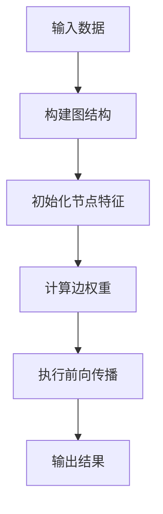
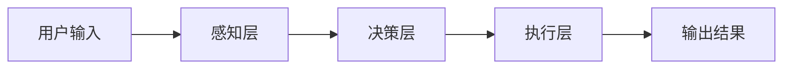
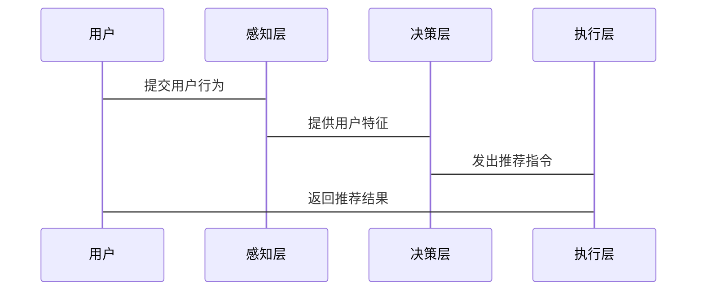

                 


# 开发具有图神经网络能力的AI Agent

> 关键词：AI Agent，图神经网络，人工智能，机器学习，深度学习，图计算

> 摘要：本文将详细探讨如何开发具有图神经网络能力的AI Agent。通过分析图神经网络的核心概念、算法原理以及AI Agent的系统架构，结合实际项目案例，帮助读者掌握从理论到实践的开发流程。文章内容涵盖背景介绍、核心概念、算法原理、系统设计、项目实战以及最佳实践，旨在为开发者提供全面的技术指导。

---

## 目录大纲

### 第一部分: 开发具有图神经网络能力的AI Agent背景介绍

#### 第1章: 图神经网络与AI Agent的背景

##### 1.1 图神经网络的核心概念

###### 1.1.1 图神经网络的定义与特点

- 图的定义：图由节点（顶点）和边（边）组成，节点表示实体，边表示实体之间的关系。
- 图神经网络的特点：能够处理图结构数据，捕捉节点间的关系，适用于社交网络、推荐系统等场景。

##### 1.1.2 图神经网络的应用场景

- 社交网络分析：检测社区、推荐好友。
- 推荐系统：基于用户行为图进行个性化推荐。
- 医疗领域：分析药物分子结构，辅助药物研发。

##### 1.1.3 图神经网络与传统神经网络的对比

| 特性             | 图神经网络                 | 传统神经网络             |
|------------------|---------------------------|--------------------------|
| 数据结构         | 图结构                     | 线性或非线性结构           |
| 关系处理         | 善于处理节点间关系         | 不擅长处理复杂关系         |
| 应用场景         | 社交网络、推荐系统         | 图像识别、自然语言处理     |

##### 1.2 AI Agent的基本概念

###### 1.2.1 AI Agent的定义与分类

- AI Agent的定义：AI Agent是一种能够感知环境、做出决策并执行操作的智能实体。
- AI Agent的分类：基于智能水平可分为简单反射型、基于模型的反应型、目标驱动型和实用驱动型。

##### 1.2.2 图神经网络在AI Agent中的作用

- 图神经网络用于AI Agent的感知层，帮助AI Agent理解复杂的关系型数据。
- 图神经网络用于决策层，辅助AI Agent做出基于关系的最优决策。

#### 第2章: 图神经网络与AI Agent的核心概念

##### 2.1 图神经网络的原理

###### 2.1.1 图卷积网络（GCN）的数学模型

$$ y = \sigma(A X X^T) $$
其中，$A$是图的邻接矩阵，$X$是节点特征矩阵，$\sigma$是激活函数。

##### 2.1.2 图注意力机制（GAT）的实现原理

$$ \alpha_{ij} = \text{softmax}(\frac{e^{q_j^T k_i}}{\sqrt{d}}) $$
其中，$\alpha_{ij}$是注意力权重，$q_j$是查询向量，$k_i$是键向量。

##### 2.1.3 图神经网络的实现步骤



##### 2.2 AI Agent的系统架构

###### 2.2.1 AI Agent的感知层

- 感知层的作用：感知环境中的数据，提取特征。
- 感知层的关键技术：自然语言处理、计算机视觉、图数据处理。

###### 2.2.2 AI Agent的决策层

- 决策层的作用：基于感知层提供的信息，做出决策。
- 决策层的关键技术：强化学习、监督学习、图神经网络。

###### 2.2.3 AI Agent的执行层

- 执行层的作用：将决策转化为实际操作。
- 执行层的关键技术：机器人控制、自动化脚本、API调用。

##### 2.3 图神经网络与AI Agent的结合模型

###### 2.3.1 图神经网络在AI Agent感知层的应用

- 感知层的输入：图结构数据。
- 感知层的处理：通过图神经网络提取节点特征。

###### 2.3.2 图神经网络在AI Agent决策层的应用

- 决策层的输入：节点特征向量。
- 决策层的处理：基于图神经网络输出决策结果。

###### 2.3.3 图神经网络在AI Agent执行层的应用

- 执行层的输入：决策结果。
- 执行层的处理：通过图神经网络优化执行过程。

---

### 第三部分: 图神经网络与AI Agent的核心概念

#### 第3章: 图神经网络的算法原理

##### 3.1 图卷积网络（GCN）算法

###### 3.1.1 GCN的基本原理

- GCN通过聚合节点及其邻居的信息，生成节点的表示向量。
- GCN的传播规则：$h_i^{(l+1)} = \sigma(\sum_j a_{ij} h_j^{(l)})$

###### 3.1.2 GCN的数学模型

$$ y = \sigma(A X X^T) $$
其中，$A$是图的邻接矩阵，$X$是节点特征矩阵，$\sigma$是激活函数。

##### 3.2 图注意力机制（GAT）的实现

###### 3.2.1 GAT的基本原理

- GAT通过计算节点之间的注意力权重，确定每个节点的重要性。
- 注意力权重的计算公式：$\alpha_{ij} = \text{softmax}(\frac{e^{q_j^T k_i}}{\sqrt{d}})$

##### 3.3 图神经网络的代码实现

###### 3.3.1 使用PyTorch实现GCN

```python
import torch
from torch import nn

class GCN(nn.Module):
    def __init__(self, input_dim, hidden_dim, output_dim):
        super(GCN, self).__init__()
        self.A = nn.Parameter(torch.randn(input_dim, input_dim))  # 邻接矩阵
        self.W = nn.Parameter(torch.randn(input_dim, hidden_dim))
        self.U = nn.Parameter(torch.randn(hidden_dim, output_dim))
        self.relu = nn.ReLU()
        self.softmax = nn.Softmax(dim=1)

    def forward(self, x):
        x = torch.mm(x, self.W)  # 线性变换
        x = torch.mm(self.A, x)  # 图卷积操作
        x = self.relu(x)
        x = torch.mm(x, self.U)  # 最终变换
        x = self.softmax(x)
        return x
```

##### 3.4 图神经网络的数学模型

- GCN的数学模型：$y = \sigma(A X X^T)$
- GAT的数学模型：$\alpha_{ij} = \text{softmax}(\frac{e^{q_j^T k_i}}{\sqrt{d}})$

---

### 第四部分: 图神经网络与AI Agent的系统设计

#### 第4章: 图神经网络与AI Agent的系统架构设计

##### 4.1 系统功能设计

###### 4.1.1 问题场景介绍

- 问题场景：设计一个基于图神经网络的AI Agent，用于推荐系统。
- 问题目标：通过图神经网络分析用户行为，推荐个性化内容。

##### 4.2 系统架构设计

###### 4.2.1 系统架构图



##### 4.3 系统接口设计

###### 4.3.1 输入接口

- 输入接口：接收用户行为数据，构建图结构。
- 输入格式：JSON格式的用户行为日志。

##### 4.4 系统交互设计

###### 4.4.1 序列图



---

### 第五部分: 图神经网络与AI Agent的项目实战

#### 第5章: 图神经网络与AI Agent的项目实战

##### 5.1 环境安装

- 安装PyTorch：`pip install torch`
- 安装网络x库：`pip install networkx`

##### 5.2 代码实现

###### 5.2.1 实现GCN模型

```python
import torch
import networkx as nx

class GCNModel:
    def __init__(self, nodes, edges):
        self.G = nx.Graph()
        self.G.add_nodes_from(nodes)
        self.G.add_edges_from(edges)

    def train(self):
        # 训练模型，更新节点特征
        pass

    def predict(self, node):
        # 预测节点的特征
        return self.G.nodes[node]['feature']
```

##### 5.3 案例分析

###### 5.3.1 案例介绍

- 案例名称：社交网络影响力分析
- 案例目标：通过图神经网络分析用户的影响力，辅助推荐好友。

##### 5.4 代码解读与分析

- 代码功能：构建社交网络图，训练GCN模型，预测节点影响力。
- 代码实现：通过PyTorch实现GCN模型，训练节点特征，预测影响力。

---

### 第六部分: 图神经网络与AI Agent的最佳实践

#### 第6章: 图神经网络与AI Agent的最佳实践

##### 6.1 小结

- 图神经网络AI Agent的优势：能够处理复杂的关系型数据，提供高效的决策支持。
- 图神经网络AI Agent的挑战：需要处理大规模图数据，模型的可解释性较差。

##### 6.2 注意事项

- 数据预处理：确保图结构数据的准确性和完整性。
- 模型调优：选择合适的超参数，优化模型性能。
- 模型部署：考虑模型的实时性，优化推理速度。

##### 6.3 拓展阅读

- 推荐书籍：《图神经网络：理论与实践》
- 推荐博客：[AI Agent与图神经网络结合的最新研究](#)

---

作者：AI天才研究院/AI Genius Institute & 禅与计算机程序设计艺术 /Zen And The Art of Computer Programming

---

以上是《开发具有图神经网络能力的AI Agent》的详细目录大纲和内容框架，涵盖了从理论到实践的各个方面，旨在为开发者提供全面的技术指导。

