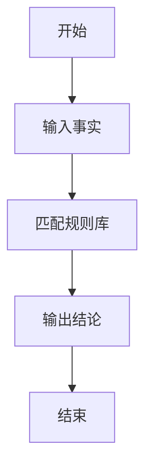
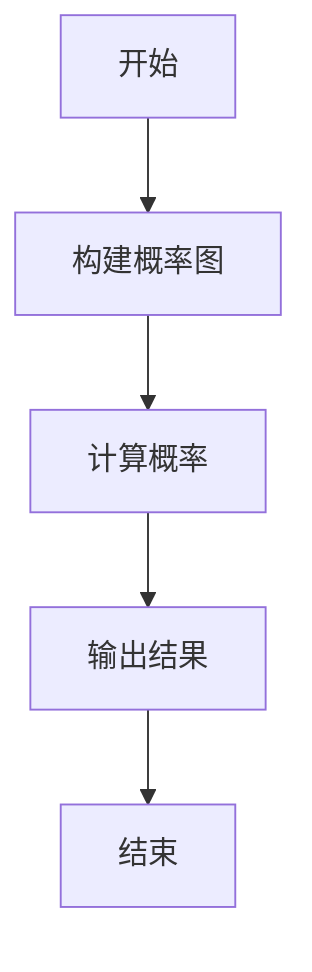
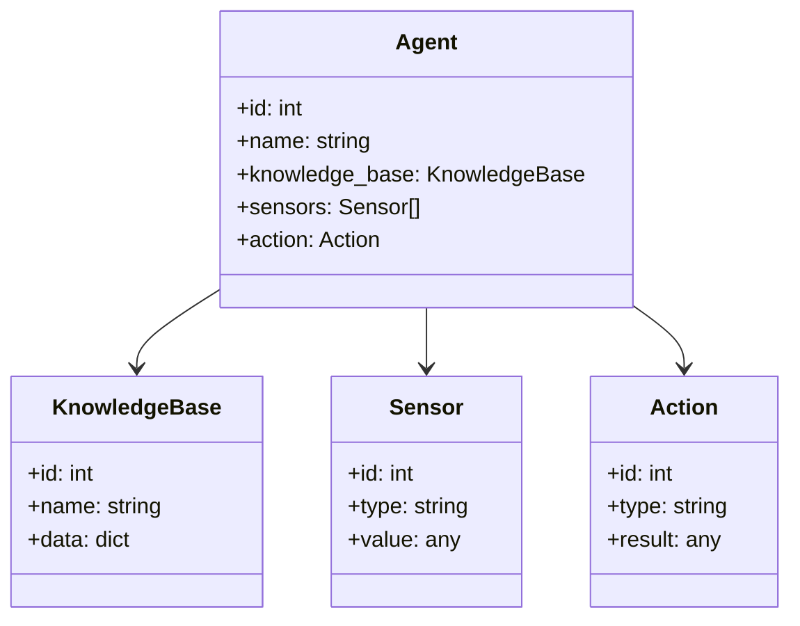
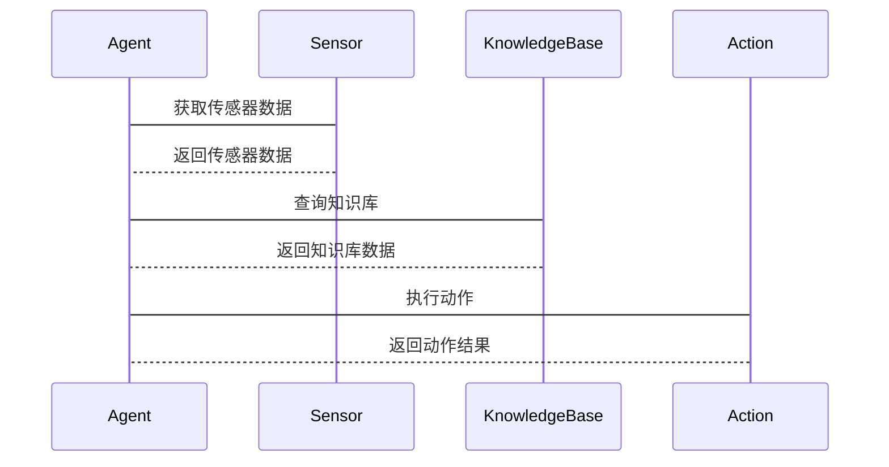

                 


# 开发具有复杂场景理解能力的AI Agent

---

## 关键词

- AI Agent
- 复杂场景理解
- 多模态数据处理
- 知识图谱构建
- 动态环境适应

---

## 摘要

本文将深入探讨如何开发具有复杂场景理解能力的AI Agent。从背景介绍到算法实现，从系统架构设计到项目实战，我们将全面分析AI Agent在复杂场景中的应用，包括多模态数据处理、知识图谱构建和动态环境适应等关键技术。通过详细的技术分析和实际案例，帮助读者掌握开发复杂场景理解AI Agent的核心方法。

---

## 第一部分: AI Agent与复杂场景理解概述

### 第1章: 问题背景与目标

#### 1.1 问题背景

AI Agent（人工智能代理）是指能够感知环境并采取行动以实现目标的智能实体。随着AI技术的快速发展，AI Agent的应用场景越来越广泛，如智能助手、自动驾驶、智能客服等。然而，在实际应用中，AI Agent面临着复杂场景理解的巨大挑战。复杂场景通常涉及多模态数据、动态变化的环境和复杂的任务目标，这些都使得AI Agent的理解和决策能力变得尤为重要。

#### 1.2 问题描述

复杂场景理解的核心问题在于如何有效地处理和融合来自不同模态的数据（如文本、图像、语音等），构建对场景的全面理解，并在此基础上做出准确的决策。AI Agent需要具备以下能力：

1. **多模态数据处理**：能够同时处理多种类型的数据，并从中提取有用的信息。
2. **知识图谱构建**：能够将分散的知识整合成一个结构化的知识图谱，以便更好地理解和推理。
3. **动态环境适应**：能够实时感知环境的变化，并根据变化调整自己的行为和决策。

#### 1.3 问题解决思路

1. **多模态数据融合**：通过多种模态的数据互补，提高场景理解的准确性。
2. **知识图谱构建**：利用知识图谱将分散的知识组织起来，形成一个可推理的结构。
3. **动态环境适应**：通过实时感知和反馈机制，使AI Agent能够快速适应环境的变化。

---

### 第2章: AI Agent的核心概念与联系

#### 2.1 核心概念原理

1. **多模态数据处理**：AI Agent需要能够处理文本、图像、语音等多种模态的数据，并通过融合这些数据来提高理解能力。
2. **知识图谱构建**：通过构建知识图谱，将分散的知识整合起来，形成一个结构化的知识网络，以便进行推理和决策。
3. **动态环境适应**：AI Agent需要能够实时感知环境的变化，并根据变化调整自己的行为和决策。

#### 2.2 概念属性对比表

以下是核心概念的对比表：

| 概念       | 多模态数据处理 | 知识图谱构建 | 动态环境适应 |
|------------|---------------|-------------|--------------|
| 定义       | 处理多种模态的数据，并进行融合和分析 | 将分散的知识整合成结构化的图谱 | 实时感知环境变化，并调整行为和决策 |
| 优势       | 提高理解的全面性和准确性 | 便于推理和决策 | 提高适应性和灵活性 |
| 应用场景   | 智能助手、自动驾驶等 | 知识检索、推理 | 动态环境中的实时决策 |

#### 2.3 ER实体关系图

以下是核心概念的ER实体关系图：

```mermaid
er
    actor(Agent)
    actor(环境)
    actor(目标)
    relation(感知)
    relation(推理)
    relation(决策)
```

---

## 第二部分: 算法原理讲解

### 第3章: 基于规则的推理算法

#### 3.1 算法原理

基于规则的推理是一种简单但有效的推理方法，通过预定义的规则来实现推理。其核心思想是将知识表示为规则，并通过规则的匹配来推导新的结论。

#### 3.2 算法流程

以下是基于规则的推理算法的流程图：



#### 3.3 Python实现

以下是基于规则的推理算法的Python实现：

```python
# 定义规则库
rules = {
    "规则1": {"前提": "如果天气是晴天", "结论": "那么建议穿轻便衣物"},
    "规则2": {"前提": "如果时间是周末", "结论": "那么建议安排休闲活动"}
}

# 推理函数
def inference(fact):
    for rule in rules:
        if rule["前提"] in fact:
            return rule["结论"]
    return None

# 示例调用
fact = {"天气是晴天", "时间是周末"}
result = inference(fact)
print(result)
```

#### 3.4 数学模型

基于规则的推理算法的数学模型可以表示为：

$$
\text{结论} = \sum_{i=1}^{n} \text{规则}_i \times \text{前提}_i
$$

其中，$\text{规则}_i$表示第i条规则的权重，$\text{前提}_i$表示第i条规则的前提条件。

---

### 第4章: 基于概率图模型的算法

#### 4.1 算法原理

概率图模型是一种基于概率论的推理方法，通过构建概率图来表示变量之间的关系，并通过概率传播来实现推理。

#### 4.2 算法流程

以下是基于概率图模型的算法流程图：



#### 4.3 Python实现

以下是基于概率图模型的Python实现：

```python
import numpy as np

# 定义概率矩阵
transition_matrix = np.array([[0.8, 0.2],
                               [0.3, 0.7]])

# 马尔可夫链推断
def markov_inference(start_state, steps):
    current_state = start_state
    for _ in range(steps):
        current_state = np.argmax(transition_matrix[current_state])
    return current_state

# 示例调用
start_state = 0  # 初始状态
steps = 5        # 推理步骤
result = markov_inference(start_state, steps)
print(result)
```

#### 4.4 数学模型

基于概率图模型的数学模型可以表示为：

$$
P(X|Y) = \frac{P(Y|X)P(X)}{P(Y)}
$$

其中，$P(X|Y)$表示在$Y$发生的条件下，$X$发生的概率，$P(Y|X)$表示在$X$发生的条件下，$Y$发生的概率，$P(X)$表示$X$发生的先验概率，$P(Y)$表示$Y$发生的边际概率。

---

## 第三部分: 系统分析与架构设计

### 第5章: 系统功能设计

#### 5.1 领域模型

以下是领域模型的类图：



#### 5.2 系统架构设计

以下是系统架构设计的架构图：


#### 5.3 接口设计

以下是系统接口设计的交互序列图：



---

### 第6章: 项目实战

#### 6.1 环境安装

以下是项目实战的环境安装步骤：

1. 安装Python和相关库（如numpy、pandas、scikit-learn等）。
2. 安装Jupyter Notebook或其他IDE用于开发和测试。
3. 安装必要的深度学习框架（如TensorFlow、PyTorch等）。

#### 6.2 核心代码实现

以下是项目实战的核心代码实现：

```python
# 多模态数据处理
import numpy as np
from PIL import Image
import torch

# 知识图谱构建
from networkx import Graph

# 动态环境适应
import gym

# 示例代码：多模态数据处理
def process_multimodal_data(image_path, text):
    image = Image.open(image_path)
    # 处理图像数据
    image_features = extract_features(image)
    # 处理文本数据
    text_features = extract_features(text)
    return image_features + text_features

# 示例代码：知识图谱构建
def build_knowledge_graph(data):
    graph = Graph()
    for item in data:
        graph.add_node(item['node'])
        graph.add_edge(item['node'], item['relation'], item['target'])
    return graph

# 示例代码：动态环境适应
def adapt_to_environment(env):
    state = env.reset()
    while True:
        action = policy(state)
        next_state, reward, done, info = env.step(action)
        state = next_state
        if done:
            break
    return reward, info
```

#### 6.3 功能解读与分析

1. **多模态数据处理**：通过处理图像和文本数据，提取特征并进行融合，以提高场景理解的准确性。
2. **知识图谱构建**：将分散的知识整合成一个结构化的图谱，以便进行推理和决策。
3. **动态环境适应**：通过实时感知环境的变化，并根据变化调整自己的行为和决策，以提高适应性。

---

## 第四部分: 最佳实践

### 第7章: 小结

通过本文的介绍，我们详细探讨了如何开发具有复杂场景理解能力的AI Agent。从背景介绍到算法实现，从系统架构设计到项目实战，我们全面分析了AI Agent在复杂场景中的应用，包括多模态数据处理、知识图谱构建和动态环境适应等关键技术。通过详细的技术分析和实际案例，帮助读者掌握开发复杂场景理解AI Agent的核心方法。

---

### 第8章: 注意事项

1. **数据质量**：多模态数据的融合需要高质量的数据，否则会影响理解的准确性。
2. **知识图谱的可扩展性**：知识图谱的构建需要考虑可扩展性，以便能够适应不断变化的需求。
3. **动态环境的实时性**：动态环境适应需要实时感知和反馈机制，以确保快速响应。

---

### 第9章: 拓展阅读

1. **《Deep Learning》 - Ian Goodfellow**
2. **《Probabilistic Graphical Models》 - Kevin P. Murphy**
3. **《Multi-modal Data Processing》 - 李航

---

## 作者

作者：AI天才研究院/AI Genius Institute & 禅与计算机程序设计艺术 /Zen And The Art of Computer Programming

---

感谢您的阅读！希望本文能为您提供有价值的技术见解和实践指导。

