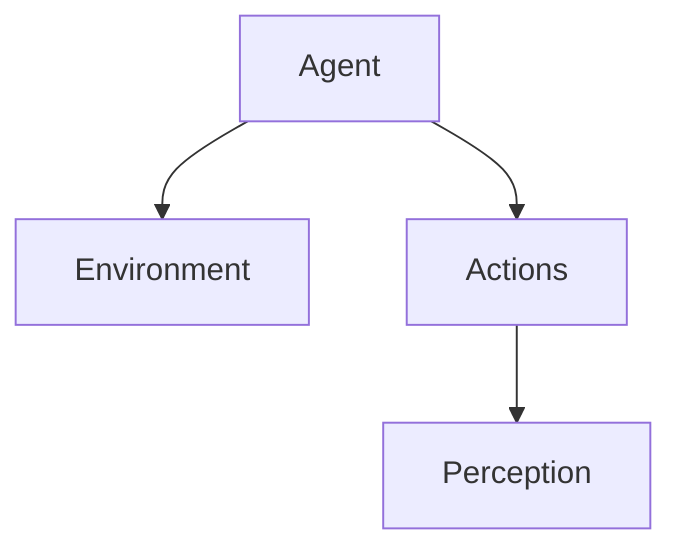

                 


# 《开发具有复杂系统建模与仿真能力的AI Agent》

> 关键词：AI Agent，复杂系统建模，系统仿真，强化学习，马尔可夫决策过程，系统架构设计，项目实战

> 摘要：本文深入探讨了开发具有复杂系统建模与仿真能力的AI Agent的关键技术与方法。从AI Agent的核心概念出发，结合复杂系统的建模与仿真方法，详细讲解了相关的算法实现、系统架构设计及实际项目案例。通过理论与实践相结合的方式，帮助读者全面掌握AI Agent在复杂系统中的应用。

---

# 《开发具有复杂系统建模与仿真能力的AI Agent》

## 第1章: AI Agent概述

### 1.1 AI Agent的基本概念
- 1.1.1 什么是AI Agent
  - AI Agent的定义
  - AI Agent的类型
  - AI Agent的核心能力
- 1.1.2 复杂系统建模与仿真的重要性
  - 复杂系统的定义
  - 复杂系统的特征
  - 复杂系统建模的挑战与意义

### 1.2 本书的目标与方法
- 1.2.1 本书的目标
- 1.2.2 本书的方法论
- 1.2.3 本书的结构安排

---

## 第2章: AI Agent的核心概念与联系

### 2.1 AI Agent的核心概念原理
- 2.1.1 知识表示
  - 知识表示的定义
  - 知识表示的方法
- 2.1.2 行为决策
  - 行为决策的过程
  - 行为决策的策略
- 2.1.3 状态感知
  - 状态感知的定义
  - 状态感知的技术

### 2.2 核心概念对比表
- 2.2.1 知识表示与行为决策的对比
- 2.2.2 状态感知与系统建模的对比

### 2.3 ER实体关系图架构


---

## 第3章: 复杂系统建模与仿真基础

### 3.1 系统建模的方法与工具
- 3.1.1 系统建模的定义
- 3.1.2 系统建模的方法
  - 面向对象建模
  - 面向过程建模
- 3.1.3 常用建模工具
  - 状态图
  - 时序图
  - 类图

### 3.2 系统仿真方法
- 3.2.1 系统仿真的定义
- 3.2.2 系统仿真的步骤
  - 确定仿真目标
  - 建立仿真模型
  - 运行仿真
  - 分析结果

### 3.3 系统建模与仿真的数学基础
- 3.3.1 概率论基础
- 3.3.2 优化方法
- 3.3.3 图论基础

---

## 第4章: AI Agent的算法实现

### 4.1 强化学习算法
- 4.1.1 强化学习的定义
- 4.1.2 Q-learning算法
  - Q-learning的原理
  - Q-learning的实现步骤
  - Q-learning的数学模型
    $$ Q(s, a) = Q(s, a) + \alpha (r + \gamma \max Q(s', a') - Q(s, a)) $$
  - Q-learning的Python实现示例
    ```python
    def q_learning(env, num_episodes=1000):
        Q = defaultdict(lambda: np.zeros(env.action_space.n))
        for episode in range(num_episodes):
            state = env.reset()
            for _ in range(max_steps):
                action = np.argmax(Q[state])
                next_state, reward, done, _ = env.step(action)
                Q[state][action] += alpha * (reward + gamma * np.max(Q[next_state]) - Q[state][action])
                state = next_state
                if done:
                    break
        return Q
    ```

### 4.2 马尔可夫决策过程
- 4.2.1 马尔可夫决策过程的定义
- 4.2.2 马尔可夫决策过程的数学模型
  $$ P(s' | s, a) $$
- 4.2.3 马尔可夫决策过程的实现
  ```mermaid
  graph TD
  S[State] --> A[Action]
  A --> S'[Next State]
  ```

---

## 第5章: 系统架构与设计

### 5.1 系统架构设计
- 5.1.1 项目背景介绍
- 5.1.2 系统功能设计
  - 领域模型类图
    ```mermaid
    classDiagram
    class Agent {
        - state
        - knowledge
        - action
        + perceive(perception)
        + decide(action)
    }
    class Environment {
        - state
        + update_state(action)
    }
    Agent --> Environment
    ```

- 5.1.3 系统架构设计
  - 系统架构图
    ```mermaid
    graph TD
    Agent --> Controller
    Controller --> Environment
    Environment --> Sensor
    Sensor --> Agent
    ```

### 5.2 系统接口设计
- 5.2.1 接口定义
  - 输入接口
  - 输出接口
- 5.2.2 接口实现
  - Python接口
  - RESTful API接口

### 5.3 系统交互设计
- 5.3.1 交互流程
- 5.3.2 交互序列图
  ```mermaid
  sequenceDiagram
  participant Agent
  participant Controller
  participant Environment
  Agent -> Controller: send action
  Controller -> Environment: execute action
  Environment -> Controller: return state
  Controller -> Agent: update state
  ```

---

## 第6章: 项目实战

### 6.1 环境搭建
- 6.1.1 开发环境
  - 操作系统
  - 开发工具
  - 依赖库安装
    ```bash
    pip install numpy matplotlib gym
    ```

### 6.2 核心代码实现
- 6.2.1 Agent类实现
  ```python
  class Agent:
      def __init__(self, state_space, action_space):
          self.q_table = np.zeros((state_space, action_space))
      
      def perceive(self, state):
          # 处理状态
          return state
      
      def decide(self, state):
          # 选择动作
          return np.argmax(self.q_table[state])
  ```

- 6.2.2 Environment类实现
  ```python
  class Environment:
      def __init__(self):
          self.state = 0
      
      def update_state(self, action):
          # 更新状态
          self.state = self.state + action
          return self.state
  ```

### 6.3 代码应用解读与分析
- 6.3.1 代码功能分析
- 6.3.2 代码优化建议

### 6.4 案例分析
- 6.4.1 案例背景
- 6.4.2 案例实现
- 6.4.3 案例结果与分析

### 6.5 项目小结
- 6.5.1 项目总结
- 6.5.2 经验教训
- 6.5.3 未来改进方向

---

## 第7章: 总结与展望

### 7.1 本书总结
- 7.1.1 核心内容回顾
- 7.1.2 学习成果总结

### 7.2 未来展望
- 7.2.1 AI Agent的发展趋势
- 7.2.2 复杂系统建模与仿真技术的未来方向

---

## 附录
- 附录A: 常用工具与库
- 附录B: 术语表
- 附录C: 参考文献

---

## 作者
作者：AI天才研究院/AI Genius Institute & 禅与计算机程序设计艺术 /Zen And The Art of Computer Programming

