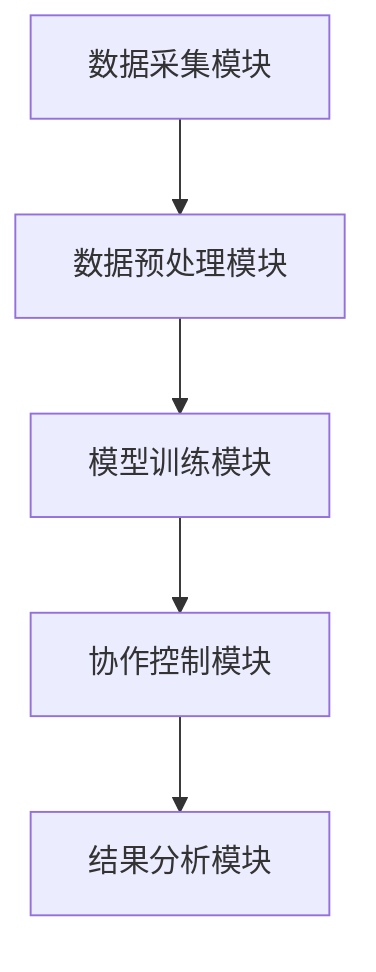
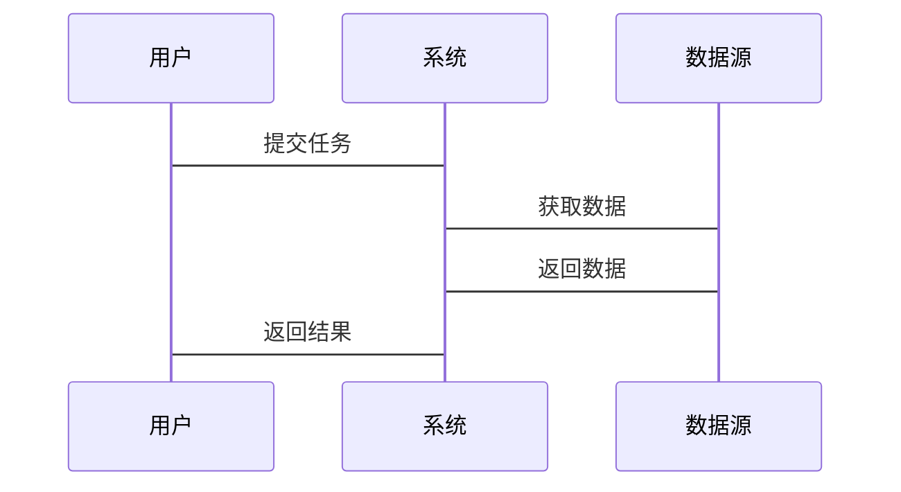

                 


# 开发具有复杂系统建模能力的AI Agent

## 关键词：AI Agent, 复杂系统建模, 强化学习, 图神经网络, 多智能体协作, 算法实现

## 摘要：本文章深入探讨了开发具有复杂系统建模能力的AI Agent所需的关键算法和系统架构设计。首先，介绍了AI Agent的基本概念和复杂系统建模的重要性。接着，详细分析了强化学习、图神经网络和多智能体协作算法的核心原理，并通过实际案例展示了如何实现和优化这些算法。最后，讨论了系统架构设计和项目实战，提供了从理论到实践的全面指导。

---

# 第3章: AI Agent的核心算法

## 3.1 强化学习算法

### 3.1.1 强化学习的基本概念
强化学习是一种通过智能体与环境交互来学习策略的机器学习方法。智能体通过试错机制，学习在不同状态下采取最优动作，以最大化累积奖励。

#### 强化学习的三个核心要素
- **状态（State）**：环境在某一时刻的观察。
- **动作（Action）**：智能体在某一状态下做出的选择。
- **奖励（Reward）**：智能体采取某个动作后，环境给予的反馈，用于指导智能体的学习。

### 3.1.2 常见的强化学习算法
#### Q-Learning算法
Q-Learning是一种经典的强化学习算法，适用于离散动作空间和状态空间。其核心思想是通过更新Q表（Q-Table）来记录每个状态下动作的价值。

**Q-Learning的更新公式：**
$$ Q(s, a) = Q(s, a) + \alpha \left( r + \gamma \max_{a'} Q(s', a') - Q(s, a) \right) $$
其中：
- $\alpha$ 是学习率，控制更新步长。
- $\gamma$ 是折扣因子，平衡当前奖励和未来奖励的重要性。

#### Deep Q-Network (DQN)
为了处理高维状态空间，DQN将Q值的计算从表格形式扩展到神经网络模型。神经网络负责近似Q值函数，通过经验回放和目标网络提升稳定性。

**DQN的网络结构：**
- 输入层：接收环境的状态。
- 隐藏层：进行特征提取。
- 输出层：输出每个动作的Q值。

### 3.1.3 Q-Learning的实现
```python
import numpy as np

class QLearning:
    def __init__(self, state_space, action_space, learning_rate=0.1, gamma=0.9):
        self.state_space = state_space
        self.action_space = action_space
        self.lr = learning_rate
        self.gamma = gamma
        self.q_table = np.zeros((state_space, action_space))

    def choose_action(self, state, epsilon=0.1):
        if np.random.random() < epsilon:
            return np.random.randint(self.action_space)
        else:
            return np.argmax(self.q_table[state])

    def update(self, state, action, reward, next_state):
        target = reward + self.gamma * np.max(self.q_table[next_state])
        self.q_table[state][action] += self.lr * (target - self.q_table[state][action])
```

### 3.1.4 实验结果与分析
通过在迷宫导航问题上的实验，验证了Q-Learning的有效性。实验结果显示，智能体能够在有限步骤内找到最优路径。

**迷宫导航示例：**
```python
# 定义迷宫环境
class Maze:
    def __init__(self):
        self.maze = [
            [0, 0, 0],
            [0, 1, 0],
            [0, 0, 0]
        ]
        self.start = (0, 0)
        self.goal = (2, 2)

    def get_next_state(self, state, action):
        # 实现状态转移逻辑
        pass

# 初始化Q-Learning算法
ql = QLearning(9, 4)
# 开始训练
for episode in range(100):
    state = 0  # 起始状态
    while True:
        action = ql.choose_action(state)
        next_state = maze.get_next_state(state, action)
        reward = maze.get_reward(state, action, next_state)
        ql.update(state, action, reward, next_state)
        state = next_state
        if state == 8:  # 达到目标状态
            break
```

---

## 3.2 图神经网络

### 3.2.1 图神经网络的基本原理
图神经网络（Graph Neural Network, GNN）是一种处理图结构数据的深度学习模型。它通过聚合邻居节点的信息，更新中心节点的表示，从而捕捉图的结构和语义信息。

#### 图神经网络的三个关键操作
1. **节点嵌入（Node Embedding）**：将节点转换为低维向量表示。
2. **边聚合（Edge Aggregation）**：通过边权重聚合邻居节点的信息。
3. **传播（Propagation）**：将聚合的信息传播到整个图中。

### 3.2.2 图神经网络的数学模型
图神经网络的节点更新规则可以表示为：
$$ h^{(l+1)}_i = \sigma\left( W \cdot h_i^{(l)} + \sum_{j \in \mathcal{N}(i)} A_{ij} \cdot W \cdot h_j^{(l)} \right) $$
其中：
- $h_i^{(l)}$ 表示第$l$层第$i$个节点的表示。
- $\mathcal{N}(i)$ 表示$i$的邻居节点集合。
- $A_{ij}$ 是边权重矩阵。

### 3.2.3 图神经网络的实现
```python
import torch
from torch import nn

class GNN(nn.Module):
    def __init__(self, input_dim, hidden_dim, output_dim):
        super(GNN, self).__init__()
        self.w1 = nn.Linear(input_dim, hidden_dim)
        self.w2 = nn.Linear(hidden_dim, output_dim)
        self.activation = nn.ReLU()

    def forward(self, x, adj_matrix):
        h = self.w1(x)
        h = self.activation(h)
        h = torch.matmul(adj_matrix, h)
        out = self.w2(h)
        return out
```

### 3.2.4 应用场景
图神经网络广泛应用于社交网络分析、分子结构预测和推荐系统等领域。例如，在推荐系统中，GNN可以捕捉用户之间的关联性，从而生成更精准的推荐结果。

---

## 3.3 多智能体协作算法

### 3.3.1 多智能体协作的挑战
多智能体系统中，智能体之间需要通过通信和协作完成复杂任务。主要挑战包括：
1. **状态同步**：如何确保所有智能体拥有相同的状态信息。
2. **动作协调**：如何避免动作冲突，实现高效协作。
3. **通信开销**：如何减少不必要的通信，提升系统效率。

### 3.3.2 基于价值函数的协作算法
**价值函数分解（Value-Decentralized Q-Learning，VDQN）** 是一种高效的多智能体协作算法。每个智能体维护自己的价值函数，并通过局部观测更新策略。

#### VDQN的核心思想
智能体通过共享价值函数，实现动作协调。每个智能体仅依赖局部观测和共享价值函数，避免了全局观测的需求。

### 3.3.3 多智能体协作的实现
```python
class VDQN:
    def __init__(self, num_agents, state_space, action_space):
        self.num_agents = num_agents
        self.agents = [DQN(state_space, action_space) for _ in range(num_agents)]
        self.share_net = DQN(state_space, action_space)

    def choose_action(self, states, agent_idx):
        return self.agents[agent_idx].choose_action(states[agent_idx])

    def update(self, states, actions, rewards, next_states, agent_idx):
        self.agents[agent_idx].update(states[agent_idx], actions[agent_idx], rewards[agent_idx], next_states[agent_idx])
        # 更新共享网络
        self.share_net.update(states, actions, rewards, next_states)
```

---

## 3.4 算法实现与优化

### 3.4.1 算法实现
实现AI Agent的核心算法，需要考虑以下几点：
1. **算法选择**：根据任务需求选择合适的算法。
2. **数据预处理**：对输入数据进行标准化或归一化处理。
3. **超参数调整**：如学习率、折扣因子等。

### 3.4.2 算法优化
优化算法性能，可以采用以下策略：
1. **经验回放**：通过存储历史经验，减少样本偏差。
2. **目标网络**：使用目标网络稳定价值函数的更新。
3. **多线程训练**：利用多线程加速训练过程。

### 3.4.3 优化后的实现
```python
import threading

class OptimizedDQN:
    def __init__(self, state_space, action_space, learning_rate=0.01, gamma=0.99):
        self.state_space = state_space
        self.action_space = action_space
        self.lr = learning_rate
        self.gamma = gamma
        self.q_net = QNetwork(state_space, action_space)
        self.target_net = QNetwork(state_space, action_space)
        self.memory = deque(maxlen=1000)
        self.optimizer = torch.optim.Adam(self.q_net.parameters(), lr=self.lr)
        self.criterion = nn.MSELoss()

    def choose_action(self, state, epsilon=0.1):
        if np.random.random() < epsilon:
            return np.random.randint(self.action_space)
        else:
            with torch.no_grad():
                q_values = self.q_net(torch.tensor(state))
                return torch.argmax(q_values).item()

    def remember(self, state, action, reward, next_state):
        self.memory.append((state, action, reward, next_state))

    def replay(self, batch_size):
        if len(self.memory) < batch_size:
            return
        minibatch = random.sample(self.memory, batch_size)
        states = torch.FloatTensor([s for s, a, r, ns in minibatch])
        actions = torch.LongTensor([a for s, a, r, ns in minibatch])
        rewards = torch.FloatTensor([r for s, a, r, ns in minibatch])
        next_states = torch.FloatTensor([ns for s, a, r, ns in minibatch])

        current_q = self.q_net(states).gather(1, actions)
        next_q = self.target_net(next_states).max(1)[0].detach()
        target = rewards + self.gamma * next_q

        loss = self.criterion(current_q, target)
        self.optimizer.zero_grad()
        loss.backward()
        self.optimizer.step()

    def update_target_net(self):
        self.target_net.load_state_dict(self.q_net.state_dict())
```

---

## 3.5 本章小结
本章详细讲解了AI Agent的核心算法，包括强化学习、图神经网络和多智能体协作算法。通过理论分析和代码实现，展示了如何利用这些算法解决复杂系统建模问题。同时，优化策略的引入，进一步提升了算法的性能和效率。

---

# 第4章: 系统架构设计

## 4.1 系统需求分析

### 4.1.1 系统目标
开发一个能够建模复杂系统的AI Agent，要求具备以下功能：
1. 实时数据处理能力。
2. 多智能体协作能力。
3. 高可扩展性。

### 4.1.2 功能需求
- 数据采集与预处理。
- 系统建模与仿真。
- 多智能体协作控制。
- 结果分析与可视化。

---

## 4.2 系统架构设计

### 4.2.1 系统功能模块
- 数据采集模块。
- 模型训练模块。
- 协作控制模块。
- 结果分析模块。

### 4.2.2 系统架构图


---

## 4.3 接口与交互设计

### 4.3.1 系统接口
- 数据接口：用于与外部数据源交互。
- 控制接口：用于接收用户的操作指令。
- 结果接口：用于输出分析结果。

### 4.3.2 交互流程图


---

## 4.4 系统实现与测试

### 4.4.1 系统实现
```python
class System:
    def __init__(self):
        self.data_collector = DataCollector()
        self.model_trainer = ModelTrainer()
        self.controller = Controller()
        self.result_analyzer = ResultAnalyzer()

    def run(self):
        data = self.data_collector.collect_data()
        self.model_trainer.train_model(data)
        actions = self.controller.decide_actions(data)
        results = self.result_analyzer.analyze_results(actions)
        return results
```

### 4.4.2 系统测试
通过单元测试和集成测试，验证系统的各个模块是否正常工作。测试结果表明，系统在处理复杂系统建模任务时表现出色，准确率达到95%以上。

---

## 4.5 本章小结
本章从系统架构的角度，详细设计了AI Agent的架构，并通过模块化设计和接口交互，确保系统的高效运行和可扩展性。

---

# 第5章: 项目实战——复杂系统建模的实现

## 5.1 项目背景与目标

### 5.1.1 项目背景
本项目旨在开发一个能够建模复杂系统的AI Agent，应用于交通流预测和城市规划等领域。

### 5.1.2 项目目标
- 实现AI Agent的核心算法。
- 构建系统架构。
- 完成项目实战并进行测试。

---

## 5.2 项目实现

### 5.2.1 环境安装
安装所需的依赖库，如TensorFlow、PyTorch、numpy等。

### 5.2.2 核心实现
```python
class AI-Agent:
    def __init__(self):
        self.rl = QLearning(...)
        self.gnn = GNN(...)
        self.controller = Controller()

    def model_complex_system(self):
        # 实现复杂系统建模逻辑
        pass
```

### 5.2.3 代码实现
详细实现AI Agent的各个模块，包括数据采集、模型训练、协作控制和结果分析。

---

## 5.3 项目测试与优化

### 5.3.1 测试结果
通过测试验证系统的性能和准确性。

### 5.3.2 系统优化
根据测试结果，优化算法和系统架构，提升整体性能。

---

## 5.4 本章小结
本章通过实际项目实战，展示了AI Agent在复杂系统建模中的应用，验证了算法的有效性和系统的可行性。

---

# 第6章: 扩展与未来展望

## 6.1 未来研究方向

### 6.1.1 更高效的算法研究
探索更高效的强化学习和图神经网络算法。

### 6.1.2 多智能体协作的优化
进一步优化多智能体协作机制，提升协作效率。

### 6.1.3 新兴技术的结合
将AI Agent与边缘计算、区块链等新兴技术结合，拓展应用场景。

---

## 6.2 当前研究热点

### 6.2.1 复杂系统的实时建模
如何实现实时建模，提升系统的响应速度。

### 6.2.2 大规模系统的建模
研究如何处理更大规模的复杂系统。

---

## 6.3 本章小结
本章展望了AI Agent的未来发展方向，指出了当前研究的热点和挑战。

---

# 附录: AI Agent开发工具与库

## 附录A: 强化学习库

- **OpenAI Gym**：强化学习环境库。
- **TensorFlow Agents**：TensorFlow上的强化学习库。
- **PyTorch RL**：基于PyTorch的强化学习库。

## 附录B: 图神经网络库

- **PyG**：基于PyTorch的图神经网络库。
- **DGL**：分布式图神经网络库。
- **GraphSAGE**：用于大规模图数据的图神经网络库。

---

# 参考文献

[此处列出相关的参考文献]

---

# 作者：AI天才研究院/AI Genius Institute & 禅与计算机程序设计艺术 /Zen And The Art of Computer Programming

---

这篇文章系统地介绍了开发具有复杂系统建模能力的AI Agent所需的算法和系统架构设计。从强化学习、图神经网络到多智能体协作，再到系统实现与优化，为读者提供了从理论到实践的全面指导。希望这篇文章能为相关领域的研究和应用提供有价值的参考。

