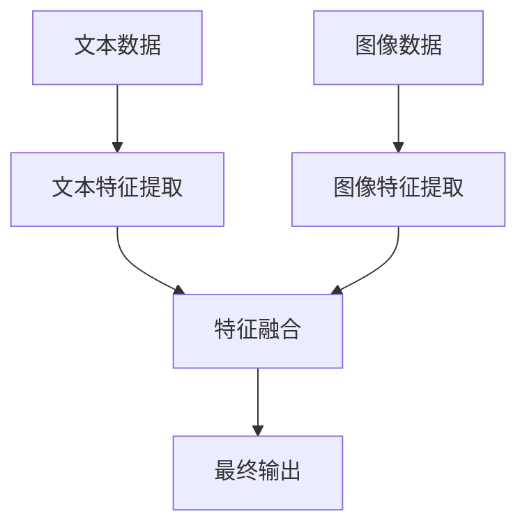
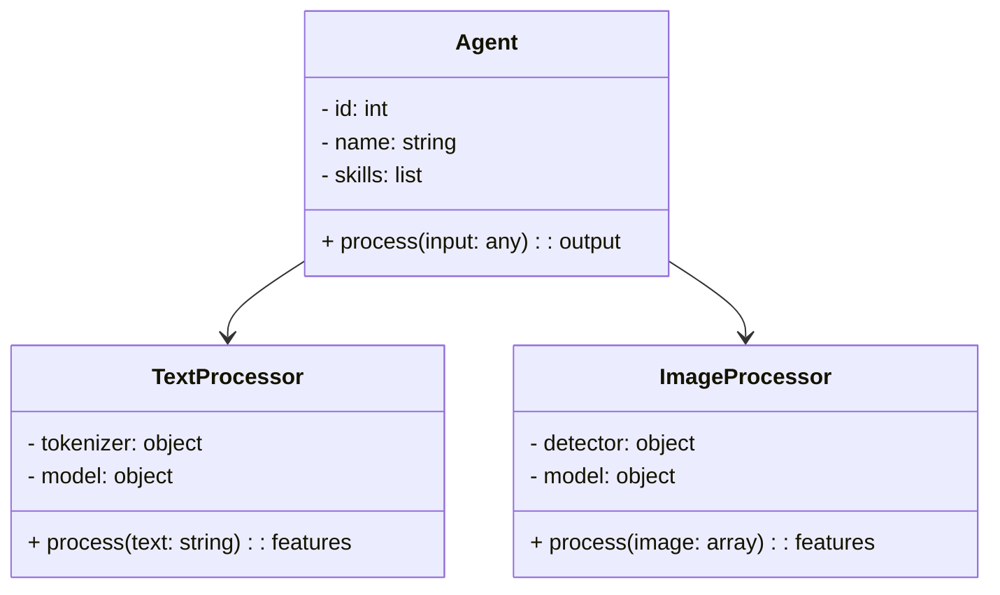
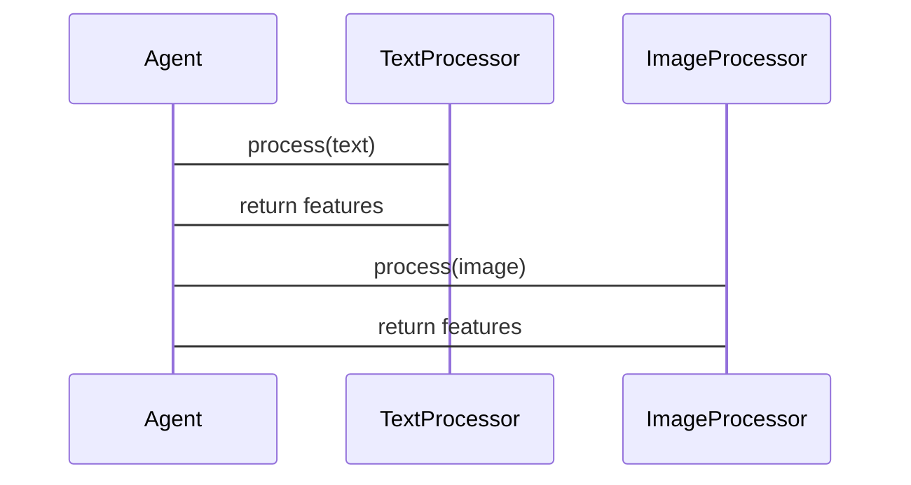

                 


# 开发具有多模态学习能力的AI Agent

> **关键词：** 多模态学习，AI Agent，深度学习，自然语言处理，计算机视觉

> **摘要：**  
> 本文深入探讨了开发具有多模态学习能力的AI Agent的各个方面，包括背景介绍、核心概念、算法原理、系统设计、项目实战以及最佳实践。通过结合多模态数据（如文本、图像和语音）的处理能力，AI Agent能够更全面地理解和执行任务，从而提升智能系统的性能和应用范围。文章从理论到实践，系统地阐述了多模态学习在AI Agent开发中的重要性，并通过具体案例展示了其实现过程和应用价值。

---

## 第一部分: 多模态学习与AI Agent概述

### 第1章: 多模态学习与AI Agent背景介绍

#### 1.1 多模态学习的背景与问题背景
多模态学习是一种结合多种数据形式（如文本、图像、语音、视频等）的学习方法。随着人工智能技术的快速发展，单模态数据的处理已无法满足复杂场景的需求，例如图像识别需要结合上下文文本信息来提高准确性，语音识别需要结合情感分析来提升交互体验。AI Agent作为智能系统的核心，需要能够处理和理解多模态数据，从而更好地完成任务。

#### 1.2 AI Agent的核心概念与问题描述
AI Agent是一种具备自主决策和执行能力的智能实体，能够感知环境、理解任务需求并采取行动。传统的AI Agent通常依赖单模态数据进行处理，例如仅基于文本或图像进行分析，这限制了其在复杂场景下的应用能力。多模态学习能力的引入，使得AI Agent能够整合多种数据形式，从而提升其智能性和适应性。

#### 1.3 多模态学习能力对AI Agent的意义
多模态学习能力使AI Agent能够更好地理解和处理复杂的现实场景。例如，在智能客服系统中，AI Agent可以通过结合用户的文本输入、语音情感和面部表情来提供更个性化的服务。此外，多模态学习还能提高AI Agent的泛化能力，使其在不同领域和场景下都能表现出色。

#### 1.4 多模态学习能力的边界与外延
多模态学习能力的边界主要在于如何有效地融合多种数据形式，并避免信息过载。外延则包括从简单的数据融合到更复杂的知识图谱构建和推理能力。AI Agent的多模态学习能力需要在保证性能的前提下，合理设计数据处理流程和模型结构。

#### 1.5 多模态学习能力的概念结构与核心要素
多模态学习能力的核心要素包括：数据采集、数据预处理、模型训练、结果融合与输出。通过这些要素的协同工作，AI Agent能够实现对多模态数据的高效处理和利用。

---

### 第2章: 多模态学习与AI Agent的核心概念与联系

#### 2.1 多模态学习的核心概念与原理
多模态学习通过结合多种数据形式，利用其互补性来提升模型的性能。例如，在自然语言处理中，结合图像信息可以提高文本分类的准确性。

#### 2.2 多模态学习的特征对比表格
以下是一个对比表格，展示了多模态学习与单模态学习在数据来源、处理方式和应用场景上的差异：

| 特性                | 单模态学习         | 多模态学习         |
|---------------------|------------------|------------------|
| 数据来源            | 单一数据形式       | 多种数据形式       |
| 处理方式            | 仅依赖单一数据     | 融合多种数据       |
| 应用场景            | 简单场景           | 复杂场景           |

#### 2.3 多模态学习的ER实体关系图
以下是多模态学习的ER实体关系图：

```mermaid
erDiagram
    actor(Agent) {
        role 用户
    }
    actor(数据源) {
        role 文本、图像、语音等
    }
    actor(模型) {
        role 处理多模态数据
    }
    actor(输出) {
        role 结果
    }
    Agent --> 数据源: 获取数据
    数据源 --> 模型: 提供数据
    模型 --> 输出: 生成结果
```

---

## 第二部分: 多模态学习算法原理

### 第3章: 多模态学习算法原理

#### 3.1 多模态学习算法概述
多模态学习算法的核心思想是将多种数据形式通过某种方式融合，从而提升模型的性能。常见的方法包括特征对齐、联合表示学习和多任务学习。

#### 3.2 多模态学习算法的详细讲解
以下是一个多模态融合模型的结构示意图：



模型的损失函数可以表示为：

$$ L = \alpha L_{text} + \beta L_{image} + (1-\alpha-\beta)L_{joint} $$

其中，$L_{text}$ 和 $L_{image}$ 分别是文本和图像的损失，$L_{joint}$ 是联合损失，$\alpha$ 和 $\beta$ 是权重系数。

---

### 第4章: 多模态学习算法的系统分析与架构设计

#### 4.1 多模态学习系统的场景与项目介绍
多模态学习系统可以应用于智能客服、自动驾驶、智能家居等多个领域。例如，在智能客服中，系统需要结合用户的文本输入、语音情感和面部表情来提供个性化的服务。

#### 4.2 多模态学习系统的功能设计
以下是系统功能模块划分：



---

### 第5章: 多模态学习系统的接口与交互设计

#### 5.1 多模态学习系统的接口设计
以下是系统接口设计：



---

## 第三部分: 多模态学习系统实战

### 第6章: 多模态学习系统的环境安装与核心实现

#### 6.1 多模态学习系统的环境安装
以下是环境安装要求：

- Python 3.8+
- PyTorch 1.9+
- transformers库
- OpenCV库

#### 6.2 多模态学习系统的代码实现
以下是核心代码实现：

```python
import torch
from transformers import BertTokenizer, BertModel
import cv2

class TextProcessor:
    def __init__(self):
        self.tokenizer = BertTokenizer.from_pretrained('bert-base-uncased')
        self.model = BertModel.from_pretrained('bert-base-uncased')

    def process(self, text):
        inputs = self.tokenizer(text, return_tensors='pt')
        outputs = self.model(**inputs)
        return outputs.last_hidden_state

class ImageProcessor:
    def __init__(self):
        self.detector = cv2.CascadeClassifier(cv2.data.haarcascades + 'haarcascade_frontalface_default.xml')

    def process(self, image):
        gray = cv2.cvtColor(image, cv2.COLOR_BGR2GRAY)
        faces = self.detector.detectMultiScale(gray)
        return faces

# 示例代码
text = "这是一个多模态学习的例子。"
image = cv2.imread('example.jpg')

text_features = TextProcessor().process(text)
image_features = ImageProcessor().process(image)
```

---

### 第7章: 多模态学习系统的案例分析与项目总结

#### 7.1 多模态学习系统的实际案例分析
以下是一个实际案例分析：

- **案例背景：** 智能客服系统需要结合用户的文本输入、语音情感和面部表情来提供个性化的服务。
- **实现过程：** 使用BERT模型处理文本，结合语音情感分析和面部表情识别模型进行特征提取，最终生成个性化的回复。

#### 7.2 多模态学习系统的项目总结
- **项目成果：** 提高了AI Agent的智能性和适应性。
- **项目不足：** 多模态数据的融合可能会增加计算复杂度。
- **未来展望：** 进一步优化多模态数据的融合方式，提升模型的性能。

---

## 第四部分: 最佳实践与注意事项

### 第8章: 多模态学习与AI Agent开发的最佳实践

#### 8.1 多模态学习开发的注意事项
- 确保数据的多样性和质量。
- 合理设计模型结构，避免信息过载。
- 定期进行模型优化和调参。

#### 8.2 小结
多模态学习能力的引入显著提升了AI Agent的智能性和应用范围。通过合理设计和优化，AI Agent能够更好地服务于复杂的现实场景。

#### 8.3 注意事项
- 数据安全和隐私保护。
- 模型的可解释性和透明性。
- 多模态数据的实时处理能力。

#### 8.4 拓展阅读
推荐阅读《Deep Learning》和《Pattern Recognition and Machine Learning》等书籍，以深入了解多模态学习的理论和应用。

---

## 作者信息

**作者：** AI天才研究院/AI Genius Institute & 禅与计算机程序设计艺术 /Zen And The Art of Computer Programming

