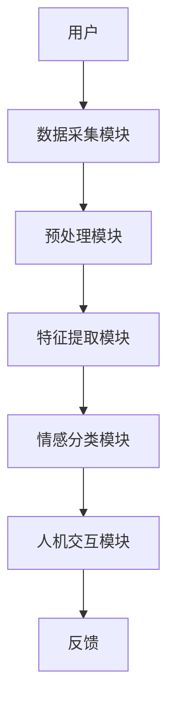

                 


# 开发具有多模态情感分析能力的AI Agent

> 关键词：多模态情感分析，AI Agent，深度学习，文本挖掘，语音处理，图像识别

> 摘要：本文将详细探讨如何开发具有多模态情感分析能力的AI Agent。从基础概念到核心算法，从系统架构设计到实际项目实现，我们将逐步解析多模态情感分析的技术原理和实现方法。通过本文，读者将掌握如何利用文本、语音、图像等多种模态数据，构建一个能够准确理解人类情感的智能代理系统。

---

# 第1章: 多模态情感分析概述

## 1.1 情感分析的基本概念

### 1.1.1 情感分析的定义与背景
情感分析是自然语言处理（NLP）中的一个经典任务，旨在通过计算机技术分析文本中隐含的情感倾向。传统的情感分析主要基于文本数据，属于单模态分析。然而，随着AI技术的发展，仅依赖文本信息已经无法满足复杂场景的需求，多模态情感分析应运而生。

### 1.1.2 单模态与多模态情感分析的对比
| 对比维度 | 单模态情感分析 | 多模态情感分析 |
|----------|----------------|----------------|
| 数据来源 | 文本、语音或图像中的单一类型 | 文本、语音、图像等多种类型 |
| 信息利用 | 仅依赖单一模态数据 | 融合多种模态数据，信息互补 |
| 精准度 | 较低，受单一数据限制 | 较高，多种数据相互补充 |

### 1.1.3 多模态情感分析的优势与应用场景
多模态情感分析通过融合多种数据类型，能够更全面地捕捉人类情感信息。其应用场景包括智能客服、语音助手、社交媒体情感分析、心理健康辅助等。

## 1.2 AI Agent的基本概念

### 1.2.1 AI Agent的定义与特点
AI Agent（人工智能代理）是一种能够感知环境、执行任务的智能实体。它具有自主性、反应性、目标导向性和社交能力等特点。

### 1.2.2 AI Agent的核心功能与能力
1. 感知能力：通过多种传感器或接口获取环境信息。
2. 决策能力：基于获取的信息做出决策。
3. 执行能力：通过执行器或API实现任务。
4. 学习能力：通过机器学习算法不断优化自身能力。

### 1.2.3 多模态情感分析在AI Agent中的作用
多模态情感分析是AI Agent实现情感理解与人机交互的核心技术。通过分析用户的文本、语音和图像信息，AI Agent能够更准确地理解用户情感，提供更智能的服务。

## 1.3 多模态数据预处理基础

### 1.3.1 文本数据的清洗与增强
- 文本清洗：去除噪声、填充空缺值、统一格式。
- 文本增强：同义词替换、数据增广。

### 1.3.2 语音数据的采集与特征提取
- 语音采集：通过麦克风或API获取语音信号。
- 特征提取：梅尔频率倒谱系数（MFCC）、声学特征提取。

### 1.3.3 图像数据的处理与标注
- 图像处理：图像增强、去噪、标准化。
- 图像标注：目标检测、情感标签标注。

## 1.4 本章小结
本章介绍了多模态情感分析的基本概念、AI Agent的核心功能以及多模态数据预处理的基础知识，为后续章节的深入分析奠定了基础。

---

# 第2章: 文本情感分析算法

## 2.1 基于传统NLP的情感分析

### 2.1.1 词袋模型与词嵌入
- 词袋模型：将文本表示为单词的集合，不考虑顺序。
- 词嵌入：通过Word2Vec、GloVe等模型将单词映射为低维向量。

### 2.1.2 基于SVM和随机森林的传统分类方法
- SVM：支持向量机，常用于文本分类。
- 随机森林：基于决策树的集成学习方法。

### 2.1.3 情感词典与规则引擎
- 情感词典：通过预定义的情感词汇表进行情感分析。
- 规则引擎：基于语法规则和情感词典进行情感推理。

## 2.2 基于深度学习的情感分析

### 2.2.1 RNN与LSTM在文本情感分析中的应用
- RNN：循环神经网络，适用于序列数据。
- LSTM：长短期记忆网络，解决RNN的长序列训练问题。

### 2.2.2 Transformer架构与BERT模型
- Transformer：基于注意力机制的序列模型。
- BERT：Bidirectional Encoder Representations from Transformers，预训练语言模型。

### 2.2.3 情感分析的端到端模型设计
- 端到端模型：从原始文本直接输出情感标签，无需特征提取。

## 2.3 情感分析的数学模型与公式

### 2.3.1 词嵌入的表示方法
$$ \text{Word Embedding}: w_i \in \mathbb{R}^d $$
其中，\( w_i \) 表示第 \( i \) 个单词的嵌入向量，\( d \) 是嵌入维度。

### 2.3.2 情感分类的损失函数与优化目标
$$ \text{损失函数}: L = -\sum_{i=1}^n y_i \log p_i + (1-y_i) \log (1-p_i) $$
其中，\( y_i \) 是真实标签，\( p_i \) 是模型预测的概率。

### 2.3.3 注意力机制在情感分析中的应用
$$ \text{注意力权重}: \alpha_i = \frac{\exp(e_i)}{\sum_{j=1}^n \exp(e_j)} $$
其中，\( e_i \) 是第 \( i \) 个词与当前词的相关性评分。

---

# 第3章: 语音情感分析算法

## 3.1 语音信号处理基础

### 3.1.1 语音信号的特征提取与表示
- MFCC（梅尔频率倒谱系数）：提取语音的时频特征。
- 声学特征提取：包括音调、音量、音速等。

### 3.1.2 语音信号的时频分析
- STFT（短时傅里叶变换）：分析语音的时频特性。
- Wavelet变换：多分辨率分析语音信号。

## 3.2 基于深度学习的语音情感分析

### 3.2.1 声学模型与端到端语音识别
- 声学模型：将语音信号映射为语言模型的输入。
- 端到端语音识别：通过神经网络直接将语音信号转换为文本。

### 3.2.2 基于CNN与RNN的语音情感分类
- CNN：卷积神经网络，提取语音的局部特征。
- RNN：循环神经网络，捕捉时序信息。

### 3.2.3 语音情感分析的挑战与解决方案
- 数据量不足：通过数据增强和迁移学习解决。
- 计算资源限制：优化模型结构，降低计算复杂度。

## 3.3 语音情感分析的数学模型

### 3.3.1 声学模型的损失函数与优化
$$ \text{损失函数}: L = \frac{1}{N}\sum_{i=1}^N (y_i - \hat{y}_i)^2 $$
其中，\( y_i \) 是真实标签，\( \hat{y}_i \) 是模型预测值。

### 3.3.2 注意力机制在语音情感分析中的应用
$$ \text{注意力权重}: \beta_i = \frac{\exp(s_i)}{\sum_{j=1}^n \exp(s_j)} $$
其中，\( s_i \) 是第 \( i \) 个时间步的注意力评分。

---

# 第4章: 图像情感分析算法

## 4.1 基于传统CV的情感分析

### 4.1.1 图像特征提取与表示
- SIFT：图像的局部特征描述。
- HOG：图像的边缘方向直方图特征。

### 4.1.2 图像分类与情感分析
- 基于KNN、SVM的传统图像分类方法。

## 4.2 基于深度学习的图像情感分析

### 4.2.1 基于CNN的图像情感分类
- AlexNet、VGG、ResNet等经典网络结构。

### 4.2.2 基于Transformer的图像情感分析
- Vision Transformer（ViT）：将图像划分为块，应用Transformer进行分类。

## 4.3 图像情感分析的数学模型

### 4.3.1 基于CNN的损失函数
$$ \text{损失函数}: L = -\sum_{i=1}^n y_i \log p_i + (1-y_i) \log (1-p_i) $$
其中，\( y_i \) 是真实标签，\( p_i \) 是模型预测的概率。

### 4.3.2 注意力机制在图像分析中的应用
$$ \text{注意力权重}: \gamma_i = \frac{\exp(a_i)}{\sum_{j=1}^n \exp(a_j)} $$
其中，\( a_i \) 是第 \( i \) 个区域的注意力评分。

---

# 第5章: 多模态数据融合方法

## 5.1 多模态数据融合的必要性
- 单一模态数据的局限性。
- 多模态数据的互补性。

## 5.2 多模态数据融合的核心方法

### 5.2.1 晚期融合（Late Fusion）
- 分别对每种模态进行特征提取，最后将特征向量融合。

### 5.2.2 早期融合（Early Fusion）
- 在特征提取阶段就开始融合多种模态数据。

### 5.2.3 中间融合（Middle Fusion）
- 在模型的中间层进行特征融合。

## 5.3 多模态融合的数学模型

### 5.3.1 晚期融合的实现方式
$$ \text{融合特征向量}: z = [z_t, z_v, z_i] $$
其中，\( z_t \) 是文本特征，\( z_v \) 是语音特征，\( z_i \) 是图像特征。

### 5.3.2 早期融合的实现方式
$$ \text{融合模型}: f(z_t, z_v, z_i) = \text{softmax}(Wz + b) $$

---

# 第6章: 系统架构与实现

## 6.1 系统功能设计

### 6.1.1 功能模块划分
- 数据采集模块：文本、语音、图像的采集与预处理。
- 情感分析模块：多模态数据的特征提取与情感分类。
- 人机交互模块：用户输入与AI Agent的反馈。

### 6.1.2 系统功能流程
1. 用户输入：文本、语音或图像。
2. 数据预处理：清洗与特征提取。
3. 多模态融合：特征向量的融合与计算。
4. 情感分类：模型预测情感标签。
5. 人机交互：根据情感反馈提供服务。

## 6.2 系统架构设计

### 6.2.1 系统架构图


### 6.2.2 接口设计
- 输入接口：文本输入、语音输入、图像输入。
- 输出接口：情感标签输出、反馈信息输出。

## 6.3 本章小结
本章详细介绍了系统的功能设计与架构设计，为后续的实现奠定了基础。

---

# 第7章: 项目实战

## 7.1 环境安装与配置

### 7.1.1 环境搭建
- 安装Python、TensorFlow、Keras、OpenCV等依赖库。

### 7.1.2 数据集准备
- 文本数据集：Twitter情感数据集。
- 语音数据集：自定义语音采集。
- 图像数据集：公开图像情感数据集。

## 7.2 核心代码实现

### 7.2.1 文本情感分析代码
```python
import tensorflow as tf
from tensorflow.keras import layers

model = tf.keras.Sequential([
    layers.Embedding(vocab_size, 16),
    layers.LSTM(32),
    layers.Dense(2, activation='softmax')
])
```

### 7.2.2 语音情感分析代码
```python
import librosa
import numpy as np

def extract_features(audio_path):
    audio, sr = librosa.load(audio_path, sr=16000)
    mfccs = librosa.feature.mfcc(y=audio, sr=sr, n_mfcc=13)
    return mfccs.T
```

### 7.2.3 图像情感分析代码
```python
import tensorflow as tf
import cv2

model = tf.keras.Sequential([
    layers.Conv2D(32, (3,3), activation='relu'),
    layers.MaxPooling2D((2,2)),
    layers.Flatten(),
    layers.Dense(2, activation='softmax')
])
```

## 7.3 实际案例分析与实现

### 7.3.1 情感分类案例
- 文本案例：分析社交媒体上的用户评论情感。
- 语音案例：分析语音电话中的客户情绪。
- 图像案例：分析图像中的情感倾向。

## 7.4 项目总结与优化

### 7.4.1 项目小结
- 系统实现了文本、语音、图像的情感分析功能。
- 实现了多模态数据的融合与情感分类。

### 7.4.2 优化建议
- 数据增强：增加数据多样性。
- 模型优化：尝试更复杂的网络结构。
- 性能优化：优化计算效率。

---

# 第8章: 高级主题与未来展望

## 8.1 多模态情感分析的前沿研究

### 8.1.1 模型压缩与轻量化
- 剪枝、量化、知识蒸馏等技术。

### 8.1.2 多模态情感分析的边缘计算
- 在边缘设备上实现低功耗、实时情感分析。

## 8.2 未来研究方向

### 8.2.1 情感分析的跨模态迁移学习
- 利用跨模态数据增强情感分析能力。

### 8.2.2 情感分析的实时性与可解释性
- 提高情感分析的实时性。
- 提升模型的可解释性。

## 8.3 本章小结
本章探讨了多模态情感分析的前沿研究和未来发展方向，为读者提供了进一步研究的思路。

---

# 作者：AI天才研究院/AI Genius Institute & 禅与计算机程序设计艺术 /Zen And The Art of Computer Programming

