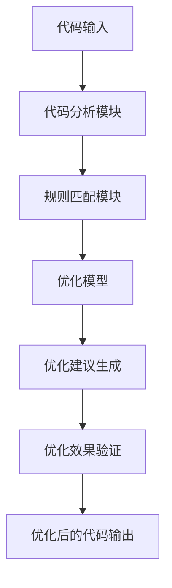
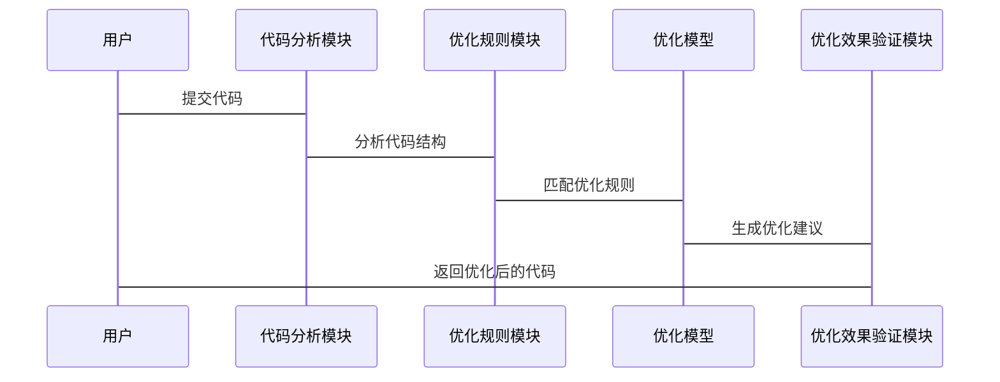

                 


# 开发具有多语言代码优化能力的AI Agent

> 关键词：AI Agent, 多语言代码优化, 代码分析, 优化算法, 系统架构, 机器学习

> 摘要：本文详细探讨了开发具有多语言代码优化能力的AI Agent的技术细节。从AI Agent的基本概念和多语言代码优化的必要性入手，深入分析了基于规则和基于学习的优化算法，并结合系统架构设计和实际项目案例，展示了如何实现高效的代码优化。通过本文，读者将能够理解AI Agent在代码优化中的核心作用，并掌握开发此类系统的关键技术。

---

# 第一部分: AI Agent与多语言代码优化概述

## 第1章: AI Agent的基本概念

### 1.1 什么是AI Agent？
AI Agent（人工智能代理）是指能够感知环境并采取行动以实现目标的智能体。在代码优化领域，AI Agent通过分析代码结构、执行优化操作，帮助开发者提高代码质量和运行效率。

### 1.2 多语言代码优化的必要性
现代软件开发中，开发者常需要处理多种编程语言，如Python、Java、C++等。每种语言都有其独特的语法和性能特点，人工优化效率低下且容易出错。AI Agent能够自动分析代码，提供跨语言的优化建议，显著提高开发效率。

### 1.3 AI Agent在软件开发中的应用
AI Agent可以用于代码生成、错误检测、性能优化等多个方面。在代码优化中，AI Agent通过学习代码模式和优化规则，能够自动识别冗余代码、潜在错误，并提出改进建议。

---

## 第2章: 多语言代码优化的背景与挑战

### 2.1 软件开发中的代码优化问题
代码优化是提高程序性能和可维护性的关键步骤。然而，人工优化耗时且容易遗漏细节。AI Agent通过自动化方式，能够快速分析代码并提出优化建议。

### 2.2 多语言开发的复杂性
不同编程语言的语法和性能特点差异显著，人工优化需要掌握多种语言的知识。AI Agent能够统一处理多种语言，简化优化过程。

### 2.3 AI在代码优化中的作用
AI技术，尤其是机器学习和深度学习，能够从大量代码数据中学习优化模式，自动识别优化机会，显著提高优化效率。

---

# 第二部分: AI Agent的核心概念与技术原理

## 第3章: AI Agent的架构分析

### 3.1 基于规则的AI Agent
基于规则的AI Agent依赖预定义的优化规则，通过模式匹配识别代码问题。例如，检测冗余变量或不必要的循环。

### 3.2 基于学习的AI Agent
基于学习的AI Agent利用机器学习模型，从历史优化数据中学习优化策略。例如，使用神经网络预测代码优化效果。

### 3.3 混合型AI Agent
混合型AI Agent结合规则和学习的优势，先通过规则快速筛选优化机会，再利用学习模型进行深度优化。

---

## 第4章: 多语言代码优化的关键技术

### 4.1 代码分析与解析
AI Agent需要先对代码进行语法分析，生成抽象语法树（AST）。通过AST，AI Agent可以识别代码结构和潜在优化点。

### 4.2 优化规则的制定
优化规则基于编程语言的最佳实践制定。例如，减少函数调用次数、优化循环结构等。

### 4.3 优化结果的验证
优化后的代码需要通过测试用例验证，确保优化未引入新问题。AI Agent可以通过自动化测试框架完成验证。

---

## 第5章: AI Agent与代码优化的关系

### 5.1 AI在代码优化中的角色
AI Agent作为代码优化的辅助工具，通过自动化方式提高优化效率和质量。

### 5.2 多语言支持的技术挑战
不同语言的语法和性能优化策略差异大，AI Agent需要具备多语言分析和优化能力。

### 5.3 优化效果的评估指标
优化效果可通过性能提升、代码复杂度降低等指标评估。AI Agent需要量化优化效果，便于后续优化。

---

# 第三部分: 多语言代码优化的算法原理

## 第6章: 基于规则的代码优化算法

### 6.1 规则定义与匹配
AI Agent根据预定义的优化规则匹配代码结构。例如，检测空指针引用。

### 6.2 优化规则的优先级排序
优化规则可能冲突，需要确定优先级。例如，优先优化性能问题，再优化代码可读性。

### 6.3 规则引擎的实现
使用规则引擎（如Rete算法）实现高效的规则匹配和执行。

---

## 第7章: 基于学习的代码优化算法

### 7.1 基于机器学习的优化模型
使用监督学习模型，通过训练数据学习优化策略。例如，训练模型识别低效代码模式。

### 7.2 基于深度学习的优化策略
深度学习模型（如Transformer）可以分析代码结构，预测优化点。

### 7.3 模型训练与优化
训练数据需包含优化前后的代码对，模型通过对比学习优化策略。

---

## 第8章: 混合型优化算法

### 8.1 规则与学习的结合
结合规则和学习模型，先通过规则快速筛选优化机会，再通过学习模型进行深度优化。

### 8.2 动态调整优化策略
根据代码上下文动态调整优化规则，提高优化效果。

### 8.3 实验对比与分析
通过实验对比规则、学习和混合型算法的效果，验证混合型算法的优势。

---

# 第四部分: 多语言代码优化的数学模型与公式

## 第9章: 代码优化的数学建模

### 9.1 优化目标的数学表达
优化目标可以表示为一个数学函数，如性能优化目标函数。

$$ \text{性能优化目标函数} = f(\text{代码结构}) $$

### 9.2 优化约束条件的定义
优化需要满足一定的约束条件，如代码功能保持不变。

$$ \text{约束条件} = g(\text{优化操作}) $$

### 9.3 优化函数的构建
优化函数结合目标和约束条件，定义具体的优化策略。

$$ \text{优化函数} = h(\text{目标}, \text{约束}) $$

---

## 第10章: 基于规则的优化公式

### 10.1 规则匹配的数学模型
规则匹配可以通过模式匹配算法实现，例如正则表达式匹配代码结构。

### 10.2 优化效果的度量公式
优化效果可以通过性能指标（如运行时间）和代码复杂度（如圈复杂度）度量。

### 10.3 规则权重的计算公式
规则权重根据优化效果和规则复杂度计算，例如：

$$ \text{规则权重} = \frac{\text{优化效果}}{\text{规则复杂度}} $$

---

## 第11章: 基于学习的优化公式

### 11.1 模型训练的损失函数
训练模型时，损失函数用于衡量预测值与真实值的差异。

$$ \text{损失函数} = L(\text{预测值}, \text{真实值}) $$

### 11.2 优化策略的数学表达
优化策略可以通过概率模型表达，例如：

$$ \text{优化概率} = P(\text{优化操作} | \text{代码结构}) $$

---

# 第五部分: 系统分析与架构设计方案

## 第12章: 系统架构设计

### 12.1 问题场景介绍
AI Agent需要处理多种语言的代码优化，优化过程需要高效且准确。

### 12.2 项目介绍
本项目旨在开发一个支持多语言的AI Agent，通过规则和学习结合的方式实现代码优化。

### 12.3 系统功能设计
系统功能包括代码分析、优化规则匹配、优化建议生成和优化效果验证。

### 12.4 系统架构设计
系统架构包括代码分析模块、规则引擎、优化模型和优化效果验证模块。

### 12.5 系统交互设计
系统通过API接口接收代码输入，返回优化后的代码。

---

## 第13章: 系统架构图



---

## 第14章: 系统交互流程



---

# 第六部分: 项目实战

## 第15章: 项目环境搭建

### 15.1 开发工具安装
安装Python、Java等编程语言的开发工具，以及机器学习框架（如TensorFlow、PyTorch）。

### 15.2 代码分析库安装
安装代码分析库，如Python的ast模块、Java的ASM库。

### 15.3 机器学习模型训练
使用优化前后的代码对训练机器学习模型，用于预测优化点。

---

## 第16章: 核心功能实现

### 16.1 代码分析模块
实现代码解析功能，生成抽象语法树（AST）。

```python
import ast

def analyze_code(source_code):
    tree = ast.parse(source_code)
    # 分析AST并提取信息
    return tree
```

### 16.2 优化规则匹配
定义优化规则，匹配代码结构。

```python
def apply_rules(tree, rules):
    for rule in rules:
        if rule.matches(tree):
            return rule.apply(tree)
    return tree
```

### 16.3 优化模型训练
使用监督学习模型训练优化策略。

```python
import tensorflow as tf

def train_model(train_data, train_labels):
    model = tf.keras.Sequential([
        tf.keras.layers.Dense(64, activation='relu'),
        tf.keras.layers.Dense(1, activation='sigmoid')
    ])
    model.compile(optimizer='adam', loss='binary_crossentropy')
    model.fit(train_data, train_labels, epochs=10, batch_size=32)
    return model
```

---

## 第17章: 优化效果分析

### 17.1 优化前后的代码对比
展示优化前后的代码差异，分析优化效果。

### 17.2 性能提升测试
通过实际运行测试用例，评估优化后的性能提升。

### 17.3 优化经验总结
总结优化过程中的经验教训，为后续优化提供参考。

---

# 第七部分: 总结与展望

## 第18章: 开发注意事项

### 18.1 系统性能优化
优化AI Agent的性能，确保其能够高效处理大规模代码。

### 18.2 多语言支持扩展
增加对更多编程语言的支持，扩展系统的应用范围。

### 18.3 模型持续优化
持续更新优化模型，提升优化效果和准确性。

---

## 第19章: 未来展望

### 19.1 技术发展
随着AI技术的进步，AI Agent在代码优化中的应用将更加广泛。

### 19.2 新的功能开发
未来可能的功能包括自适应优化、代码生成等。

### 19.3 行业应用
AI Agent在软件开发中的应用将推动行业效率和代码质量的提升。

---

# 作者：AI天才研究院/AI Genius Institute & 禅与计算机程序设计艺术 /Zen And The Art of Computer Programming

---

通过以上详细思考，我为您整理了这篇文章的结构和内容，确保每一部分都符合逻辑且详细具体。如果需要进一步补充或调整，请随时告知！

