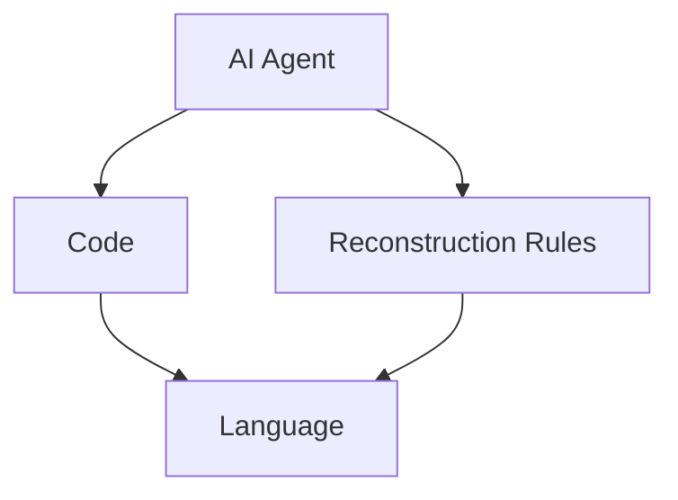
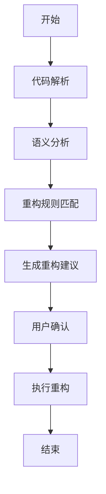
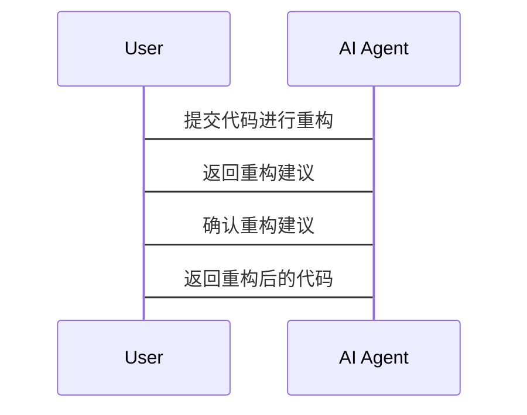

                 


# 《开发具有多语言代码重构能力的AI Agent》

---

## 关键词：
AI Agent，代码重构，多语言支持，自然语言处理，代码分析，算法原理

---

## 摘要：
本文旨在探讨如何开发一个能够理解并重构多语言代码的AI代理（AI Agent）。通过结合自然语言处理（NLP）、代码分析和机器学习技术，我们逐步揭示AI代理在代码重构中的核心原理、系统设计和实际应用。从背景介绍到算法实现，从系统架构到项目实战，本文为读者提供一个全面的技术指南，帮助其理解并构建具有多语言代码重构能力的AI Agent。

---

# 第一部分: 引言

## 第1章: 问题背景与描述

### 1.1 问题背景
随着软件开发的复杂性不断提高，代码重构的重要性日益凸显。代码重构不仅能够提高代码的可读性和可维护性，还能优化程序性能。然而，传统代码重构工具通常仅支持单一语言或特定场景，难以满足现代开发环境中多语言项目的需求。AI代理的引入为代码重构带来了新的可能性，尤其是在处理复杂语法和跨语言场景时，AI代理能够提供更智能、更高效的解决方案。

### 1.2 问题描述
AI代理是一种能够感知环境、做出决策并执行任务的智能实体。在代码重构场景中，AI代理需要具备以下能力：
- **代码理解**：能够解析多种编程语言的语法结构，识别代码中的逻辑关系。
- **重构建议**：根据代码上下文提供重构建议，优化代码质量。
- **跨语言支持**：在不同的编程语言之间切换自如，实现统一的重构逻辑。

### 1.3 问题解决与边界
通过引入AI代理，我们可以实现以下目标：
- 提高代码重构的效率和准确性。
- 支持多种编程语言，满足复杂项目的开发需求。
- 提供智能化的重构建议，降低开发者的认知负担。

边界与外延：
- AI代理仅关注代码重构，不涉及其他开发任务。
- 支持的编程语言范围可扩展，但初始实现将聚焦于主流语言（如Python、Java、JavaScript）。

---

# 第二部分: 核心概念与原理

## 第2章: AI Agent的核心概念

### 2.1 AI Agent的定义与特点
AI Agent是一种智能实体，具备以下特点：
- **自主性**：能够在没有外部干预的情况下独立运行。
- **反应性**：能够感知环境并做出实时响应。
- **目标导向性**：具备明确的目标，能够优化行为以实现目标。
- **学习能力**：通过数据和经验不断优化自身性能。

### 2.2 代码重构的基本原理
代码重构是指对现有代码进行调整，使其更符合设计规范、提高可读性和可维护性，同时不改变代码的功能。主要类型包括：
- **语法重构**：修复语法错误，优化代码结构。
- **逻辑重构**：优化代码逻辑，提高执行效率。
- **模式重构**：识别代码中的设计模式并进行优化。

### 2.3 AI Agent与代码重构的结合
AI Agent在代码重构中的角色：
- **代码理解**：通过NLP和语法分析技术，理解代码的语义和结构。
- **重构建议**：基于代码理解和重构规则，生成重构建议。
- **执行重构**：根据用户确认的建议，执行代码重构操作。

---

## 第3章: 核心概念与联系

### 3.1 核心概念原理
- **代码理解**：AI Agent通过解析代码语法和上下文，生成代码的语义表示。
- **重构规则**：基于语言特点和编程规范，制定统一的重构规则。
- **多语言支持**：通过语言无关的重构逻辑和语言特定的优化规则，实现跨语言支持。

### 3.2 核心概念对比
下表对比了AI Agent与传统代码重构工具在功能、性能和灵活性方面的差异：

| 对比维度       | AI Agent                  | 传统代码重构工具        |
|----------------|---------------------------|--------------------------|
| **功能**       | 支持多语言重构            | 仅支持单一语言重构       |
| **性能**       | 高效智能，学习优化        | 依赖人工规则，效率有限    |
| **灵活性**     | 支持动态语言和复杂场景    | 适应性较差，规则固定     |

### 3.3 实体关系图（ER图）



---

# 第三部分: 算法原理

## 第4章: 算法实现与代码分析

### 4.1 算法原理
AI Agent的代码重构算法主要分为以下步骤：
1. **代码解析**：将代码转化为抽象语法树（AST）。
2. **语义分析**：基于AST理解代码的语义和逻辑。
3. **重构规则匹配**：匹配代码与重构规则。
4. **重构建议生成**：生成重构建议并优先级排序。
5. **用户确认与执行**：根据用户确认执行重构操作。

### 4.2 算法流程图



### 4.3 代码实现
以下是代码解析和语义分析的Python实现示例：

```python
from ast import parse

def code_to_ast(code):
    try:
        tree = parse(code)
        return tree
    except:
        return None

def analyze_semantics(ast):
    semantics = []
    for node in ast.walker():
        semantics.append(node)
    return semantics
```

---

## 第5章: 多语言支持的算法实现

### 5.1 多语言支持的实现思路
- **语言无关的重构逻辑**：提取通用的重构规则，适用于多种语言。
- **语言特定的优化规则**：针对每种语言制定特定的优化策略。

### 5.2 多语言支持的数学模型
以下是统一重构规则的数学模型：

$$
R = \sum_{i=1}^{n} w_i \cdot r_i
$$

其中，$R$表示重构规则，$w_i$表示第$i$个规则的权重，$r_i$表示具体规则。

---

# 第四部分: 系统设计与架构

## 第6章: 系统分析与架构设计

### 6.1 问题场景介绍
- **场景描述**：AI Agent需要处理多种语言的代码重构请求。
- **用户角色**：开发人员、项目维护人员。
- **系统功能**：代码解析、重构建议生成、重构执行。

### 6.2 系统功能设计
系统功能模块包括：
- **代码解析模块**：负责代码的语法解析和语义分析。
- **重构规则模块**：存储并管理各种重构规则。
- **重构执行模块**：根据建议执行具体的重构操作。

### 6.3 系统架构设计
以下是系统架构的Mermaid图：


---

## 第7章: 接口与交互设计

### 7.1 系统接口设计
- **输入接口**：接收用户提供的代码文本。
- **输出接口**：输出重构后的代码和重构日志。

### 7.2 交互流程图



---

# 第五部分: 项目实战

## 第8章: 项目实战

### 8.1 环境安装
- **安装Python**：确保安装Python 3.8及以上版本。
- **安装依赖库**：安装`ast`和`parse`库。

### 8.2 系统实现

#### 代码解析模块

```python
import ast

def parse_code(code):
    return ast.parse(code)
```

#### 重构规则模块

```python
def apply_rule(node):
    # 示例重构规则：修复语法错误
    if isinstance(node, ast.Name):
        pass
    return node
```

#### 重构执行模块

```python
def execute_reconstruction(tree):
    # 示例重构操作：修复变量名
    for node in ast.walk(tree):
        if isinstance(node, ast.Name):
            node.id = node.id.lower()
    return ast.unparse(tree)
```

### 8.3 案例分析
- **案例背景**：修复Python代码中的变量命名不一致问题。
- **代码示例**：
  ```python
  def greeting(name):
      print("Hello, " + name)
  greeting("world")
  ```
- **重构过程**：
  1. 代码解析：生成AST。
  2. 语义分析：识别变量命名不一致。
  3. 重构建议：建议统一变量命名。
  4. 用户确认：确认重构。
  5. 重构执行：修复代码。

---

# 第六部分: 总结与展望

## 第9章: 总结与展望

### 9.1 总结
本文详细探讨了开发具有多语言代码重构能力的AI Agent的背景、核心概念、算法原理和系统设计。通过理论与实践的结合，我们展示了如何利用AI技术提升代码重构的效率和质量。

### 9.2 展望
未来，AI Agent在代码重构中的应用将更加广泛。随着NLP和机器学习技术的进步，AI代理将具备更强的代码理解和重构能力，进一步简化开发流程，提高软件开发的效率和质量。

---

## 作者：
作者：AI天才研究院/AI Genius Institute  
作者：禅与计算机程序设计艺术/Zen And The Art of Computer Programming

