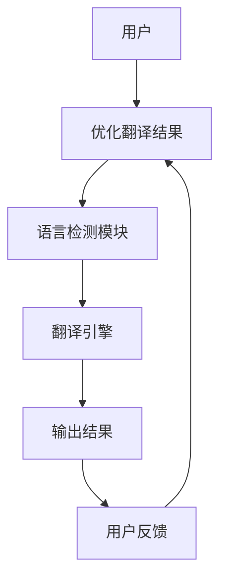
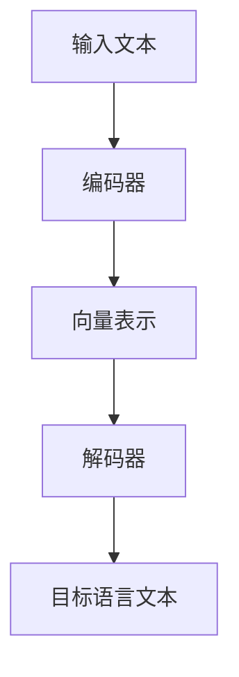
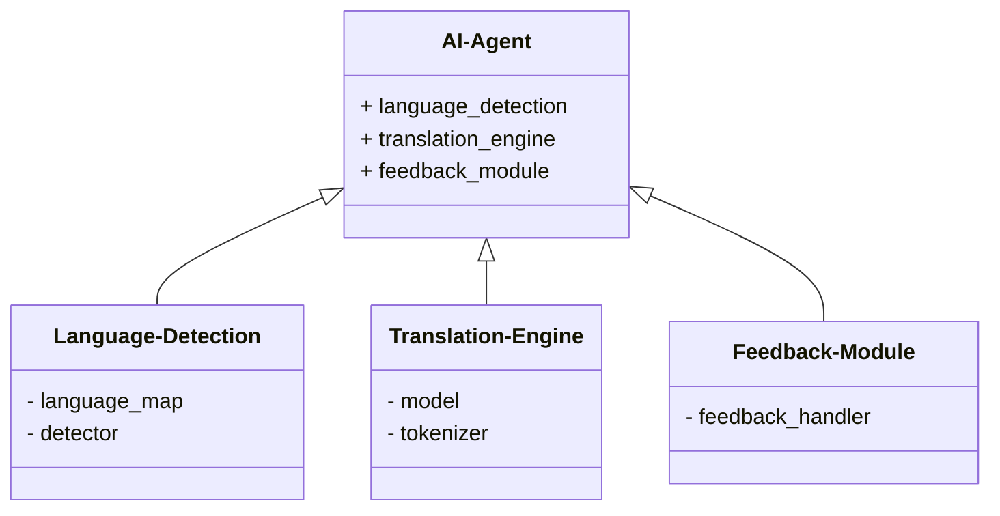
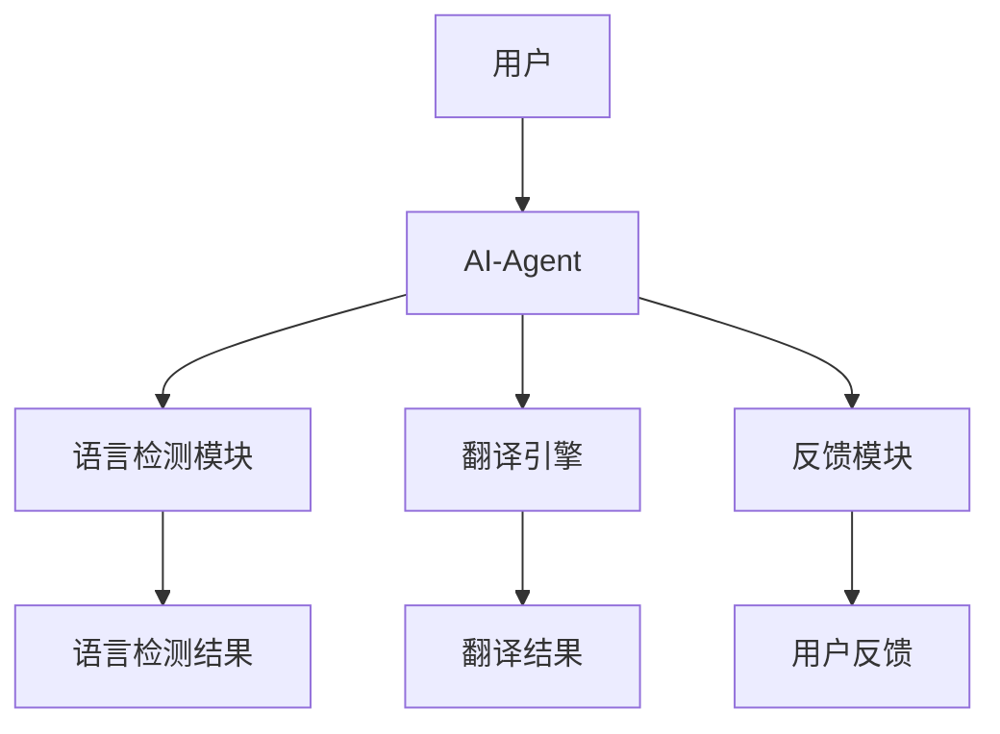
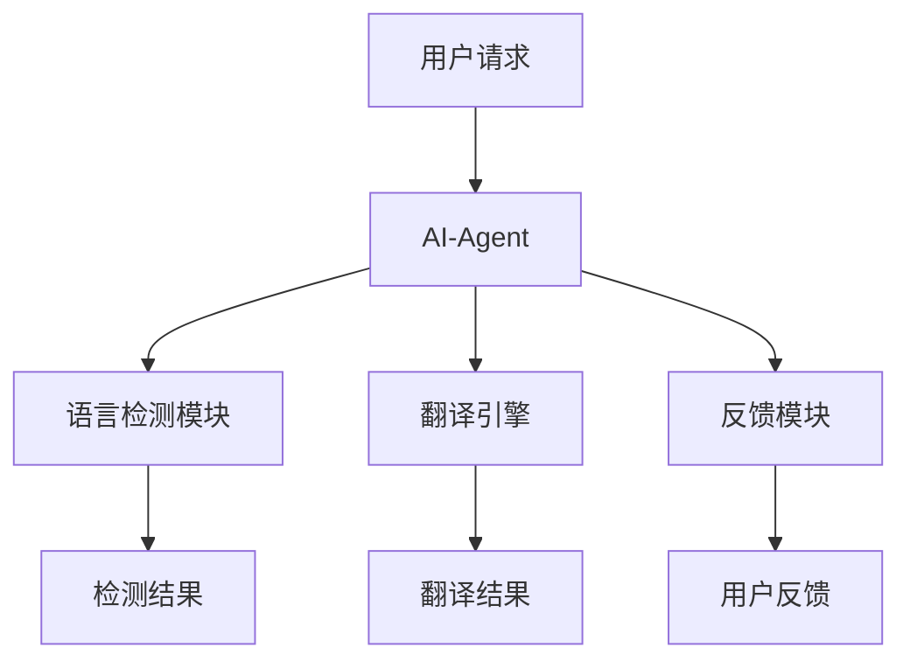

                 


# 开发具有多语言翻译能力的AI Agent

> 关键词：AI Agent, 多语言翻译, 自然语言处理, 机器学习, 深度学习

> 摘要：本文将详细探讨如何开发具有多语言翻译能力的AI Agent。通过分析多语言翻译的核心原理、AI Agent的架构设计以及实际项目实现，我们将为读者提供从理论到实践的全面指导。

---

## 第一部分: 背景介绍

### 第1章: AI Agent与多语言翻译概述

#### 1.1 AI Agent的基本概念
##### 1.1.1 AI Agent的定义
AI Agent（人工智能代理）是一种能够感知环境并采取行动以实现目标的智能实体。它可以是一个软件程序，也可以是一个物理设备，通过与用户的交互或环境的反馈来执行任务。

##### 1.1.2 AI Agent的核心功能
AI Agent的核心功能包括：
- **感知环境**：通过传感器、API或其他输入方式获取数据。
- **决策与推理**：基于获取的数据进行分析、推理和决策。
- **执行操作**：根据决策结果执行相应的操作，如发送消息、调整参数等。

##### 1.1.3 多语言翻译能力的重要性
在全球化背景下，AI Agent需要能够处理多种语言，以便在全球范围内提供服务。多语言翻译能力使得AI Agent能够与不同语言的用户进行有效沟通，提升用户体验。

#### 1.2 多语言翻译的必要性
##### 1.2.1 全球化背景下的语言障碍
随着全球化的深入，跨语言交流变得越来越频繁。然而，语言障碍可能导致信息传递不准确，影响用户体验和业务效率。

##### 1.2.2 多语言翻译在AI Agent中的应用场景
- **跨语言对话**：支持用户使用多种语言与AI Agent交互。
- **内容转换**：将用户提供的内容翻译成多种语言，以便在全球范围内分发。
- **多语言支持的系统集成**：在复杂的系统中，确保不同语言模块之间的 seamless communication。

##### 1.2.3 多语言翻译的挑战与解决方案
- **挑战**：不同语言的语法结构差异、文化背景差异、实时翻译的性能要求等。
- **解决方案**：采用先进的NLP技术、预训练语言模型（如BERT、GPT）、多语言翻译模型等。

#### 1.3 技术背景与发展趋势
##### 1.3.1 自然语言处理（NLP）技术的发展
NLP技术的进步为多语言翻译提供了坚实的基础。近年来，基于深度学习的NLP模型（如Transformer）在多语言翻译任务中表现出色。

##### 1.3.2 机器学习在翻译中的应用
机器学习，尤其是深度学习，通过训练大量双语或多语数据，使得机器能够自动学习语言的结构和语义，从而实现高质量的翻译。

##### 1.3.3 多语言模型的最新进展
最新的多语言模型（如Marian、Fairseq）能够在单一模型中支持多种语言的翻译，具有高效性和灵活性。

### 1.4 本章小结
通过本章的介绍，我们了解了AI Agent的基本概念、多语言翻译的重要性以及当前的技术背景和发展趋势。

---

## 第二部分: 多语言翻译与AI Agent的核心概念

### 第2章: 多语言翻译模型的核心原理

#### 2.1 多语言翻译模型的定义与特点
##### 2.1.1 多语言翻译模型的定义
多语言翻译模型是一种能够处理多种语言的NLP模型，能够在单一模型中实现多种语言的翻译任务。

##### 2.1.2 多语言翻译模型的核心特点
- **多任务学习**：模型在同一框架下同时学习多种语言的翻译任务。
- **跨语言表示**：模型能够将不同语言的文本映射到共享的语义空间。
- **高效性**：相比单语言模型，多语言模型具有更好的资源利用率和推理速度。

##### 2.1.3 多语言翻译模型与单语言翻译模型的对比
| 特性                | 单语言翻译模型         | 多语言翻译模型         |
|---------------------|-----------------------|-----------------------|
| 支持的语言数量       | 一种或几种            | 多种                  |
| 模型复用性           | 较低                 | 较高                  |
| 训练数据需求         | 较大（需要大量单语数据）| 较小（可以利用多语数据）|

#### 2.2 AI Agent中的多语言翻译架构
##### 2.2.1 AI Agent的多语言翻译模块
AI Agent的多语言翻译模块通常包括以下组件：
- **语言检测**：识别用户输入的语言。
- **翻译引擎**：将源语言翻译为目标语言。
- **反馈机制**：根据用户反馈优化翻译结果。

##### 2.2.2 多语言翻译模块与AI Agent其他模块的交互
通过以下流程图展示多语言翻译模块与其他模块的交互：



#### 2.3 多语言翻译模型的性能评估
##### 2.3.1 翻译准确率的评估指标
- **BLEU（Bilingual Evaluation Understudy）**：衡量生成文本与参考文本的相似性。
- **ROUGE（Recall-Oriented Understudy for Gisting Evaluation）**：基于召回率的评估指标。

##### 2.3.2 翻译速度的评估指标
- **每秒翻译次数（TPS）**：单位时间内能够处理的翻译请求数量。
- **延迟（Latency）**：从用户请求到翻译结果返回的时间。

##### 2.3.3 翻译结果的可解释性
可解释性是衡量翻译质量的重要指标，包括语法正确性、语义准确性和文化适配性。

### 第3章: 多语言翻译与AI Agent的核心概念联系

#### 3.1 多语言翻译在AI Agent中的应用场景
##### 3.1.1 跨语言对话
AI Agent支持用户使用多种语言与其进行交互，提供实时翻译和对话理解。

##### 3.1.2 内容转换
AI Agent能够将用户提供的内容（如文档、消息）翻译成多种语言，满足全球用户的需求。

##### 3.1.3 多语言支持的系统集成
在复杂的系统中，AI Agent需要与其他模块（如数据库、API）无缝集成，支持多种语言的处理和交互。

#### 3.2 多语言翻译与AI Agent的协同工作
##### 3.2.1 多语言翻译作为AI Agent的核心模块
多语言翻译模块是AI Agent实现跨语言交互的关键部分，决定了系统的语言覆盖能力和服务质量。

##### 3.2.2 多语言翻译对AI Agent用户体验的影响
通过提供高质量的多语言翻译服务，AI Agent能够提升用户体验，增强用户满意度和忠诚度。

#### 3.3 本章小结
本章详细介绍了多语言翻译在AI Agent中的核心作用及其应用场景。

---

## 第三部分: 算法原理

### 第4章: 多语言翻译算法的核心原理

#### 4.1 基于Transformer的多语言翻译模型
##### 4.1.1 Transformer模型的简介
Transformer模型由Google于2018年提出，其核心思想是利用自注意力机制（self-attention）和前馈神经网络（FFN）来处理序列数据。

##### 4.1.2 多语言翻译模型的改进
通过引入多语言预训练（如MarianMT），Transformer模型能够支持多种语言的翻译任务。

##### 4.1.3 Transformer模型的数学公式
以下是Transformer模型中自注意力机制的数学公式：

$$
\text{Attention}(Q, K, V) = \text{softmax}\left(\frac{QK^T}{\sqrt{d_k}}\right)V
$$

其中：
- \( Q \) 是查询向量
- \( K \) 是键向量
- \( V \) 是值向量
- \( d_k \) 是向量的维度

#### 4.2 基于seq2seq的多语言翻译模型
##### 4.2.1 seq2seq模型的基本原理
seq2seq模型由编码器（Encoder）和解码器（Decoder）组成，编码器将源语言文本编码为向量，解码器将这些向量解码为目标语言文本。

##### 4.2.2 多语言seq2seq模型的实现
通过共享编码器和解码器的参数，多语言seq2seq模型能够同时支持多种语言的翻译任务。

##### 4.2.3 seq2seq模型的训练流程
以下是seq2seq模型的训练流程图：



#### 4.3 多语言翻译算法的实现
##### 4.3.1 环境安装
安装所需的Python库，如：
- `torch`
- `transformers`

##### 4.3.2 简单的多语言翻译模型实现
以下是一个简单的多语言翻译模型的Python代码示例：

```python
from transformers import MarianMTModel, MarianTokenizer

# 加载预训练的多语言翻译模型
model_name = "facebook/marian-nmt-de-en"
tokenizer = MarianTokenizer.from_pretrained(model_name)
model = MarianMTModel.from_pretrained(model_name)

# 定义翻译函数
def translate(text):
    inputs = tokenizer(text, return_tensors="pt")
    outputs = model.generate(**inputs)
    translated = tokenizer.decode(outputs[0], skip_special_tokens=True)
    return translated

# 测试翻译
print(translate("Hello, how are you?"))  # 英译德
```

#### 4.4 算法原理的数学公式
##### 4.4.1 自注意力机制
自注意力机制的公式如下：

$$
\text{Attention}(Q, K, V) = \text{softmax}\left(\frac{QK^T}{\sqrt{d_k}}\right)V
$$

##### 4.4.2 前馈神经网络
前馈神经网络的结构如下：

$$
\text{FFN}(x) = \text{ReLU}(W_1x + b_1)W_2 + b_2
$$

---

## 第四部分: 系统分析与架构设计

### 第5章: AI Agent的多语言翻译系统分析

#### 5.1 问题场景介绍
AI Agent需要支持多种语言的翻译请求，用户可以使用任意语言与AI Agent进行交互。

#### 5.2 系统功能设计
##### 5.2.1 领域模型设计
以下是AI Agent的领域模型类图：



#### 5.3 系统架构设计
##### 5.3.1 系统架构图
以下是AI Agent的系统架构图：



#### 5.4 系统接口设计
##### 5.4.1 API接口
- `/detect_language`: 语言检测接口
- `/translate`: 翻译接口

##### 5.4.2 接口交互流程图
以下是接口交互流程图：



---

## 第五部分: 项目实战

### 第6章: 多语言翻译AI Agent的开发实战

#### 6.1 环境安装
安装所需的开发环境，包括：
- Python 3.8+
- `transformers`库
- `fastapi`库

#### 6.2 系统核心实现
##### 6.2.1 语言检测模块的实现
使用`langdetect`库实现语言检测：

```python
from langdetect import detect

def detect_language(text):
    return detect(text)
```

##### 6.2.2 翻译引擎的实现
使用`transformers`库实现翻译功能：

```python
from transformers import MarianMTModel, MarianTokenizer

def translate(text, src_lang, tgt_lang):
    model_name = f"facebook/marian-nmt-{src_lang}-{tgt_lang}"
    tokenizer = MarianTokenizer.from_pretrained(model_name)
    model = MarianMTModel.from_pretrained(model_name)
    inputs = tokenizer(text, return_tensors="pt")
    outputs = model.generate(**inputs)
    return tokenizer.decode(outputs[0], skip_special_tokens=True)
```

##### 6.2.3 API接口的开发
使用`fastapi`库开发RESTful API：

```python
from fastapi import FastAPI
from fastapi.middleware.cors import CORSMiddleware

app = FastAPI()

origins = ["*"]
app.add_middleware(
    CORSMiddleware,
    allow_origins=origins,
    allow_credentials=True,
    allow_methods=["*"],
    expose_headers=["*"],
)

@app.post("/translate")
async def translate(request: dict):
    text = request["text"]
    src_lang = request["source_lang"]
    tgt_lang = request["target_lang"]
    return {"result": translate(text, src_lang, tgt_lang)}
```

#### 6.3 项目实战小结
通过本章的实战，读者可以掌握如何开发一个多语言翻译的AI Agent，并将其部署为一个RESTful API。

---

## 第六部分: 最佳实践与小结

### 第7章: 最佳实践与注意事项

#### 7.1 开发过程中的注意事项
- **数据质量**：确保训练数据的多样性和代表性。
- **模型调优**：根据具体任务调整模型参数。
- **性能优化**：通过缓存、并行计算等方式提升翻译速度。

#### 7.2 小结
通过本文的介绍，读者可以系统地了解如何开发具有多语言翻译能力的AI Agent，并掌握相关的理论和实践技能。

#### 7.3 拓展阅读
- 《Effective Python》
- 《Deep Learning》
- 《Python机器学习实战》

---

## 作者信息

作者：AI天才研究院/AI Genius Institute & 禅与计算机程序设计艺术/Zen And The Art of Computer Programming

---

通过本文的详细讲解，读者可以系统地了解如何开发具有多语言翻译能力的AI Agent，并掌握相关的理论和实践技能。

